# Annotations in Mobile View in React PDF Viewer

This article describes how to use annotation tools in the [React PDF Viewer](https://www.syncfusion.com/pdf-viewer-sdk/react-pdf-viewer) on touch-enabled devices. It covers enabling the annotation toolbar; adding sticky notes, text markups, shapes, measurements, stamps, signatures, and ink; adjusting annotation properties before and after placement; using comments; and removing annotations.

## Open the annotation toolbar

**Step 1:** Select the Edit Annotation icon on the main toolbar to enable the annotation toolbar.

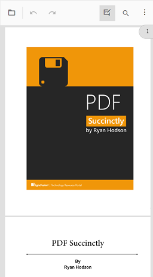

**Step 2:** The annotation toolbar appears below the main toolbar and displays tools optimized for touch interaction.

## Add sticky note annotations

**Step 1:** Select the Sticky Notes icon to activate the sticky note tool, then tap the desired location on the page to place a note.

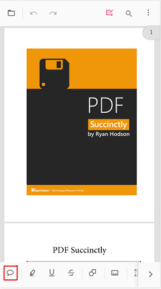

**Step 2:** A sticky note annotation is added at the selected location; opening the note allows viewing or editing its content.

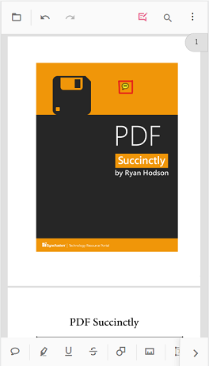

## Add text markup annotations

**Step 1:** Select a text markup icon, highlight the desired text, then confirm the selection to apply the markup.

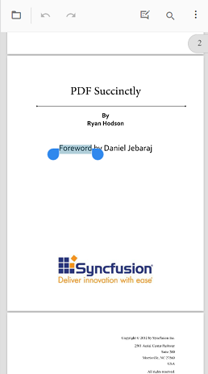

**Step 2:** The text markup annotation is applied to the highlighted text.

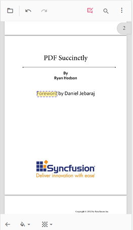

## Add shape and measurement annotations

**Step 1:** Select the Shape or Measure icon to open the corresponding toolbar.

**Step 2:** Choose a shape or measurement type and draw it on the page.

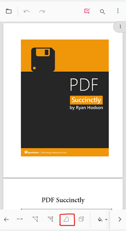

**Step 3:** The annotation is rendered on the PDF page.

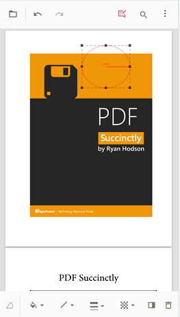

## Add stamp annotations

**Step 1:** Select the Stamp icon and choose a stamp type from the menu.

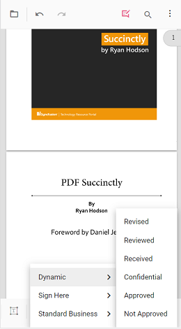

**Step 2:** Tap the page to place the chosen stamp annotation.

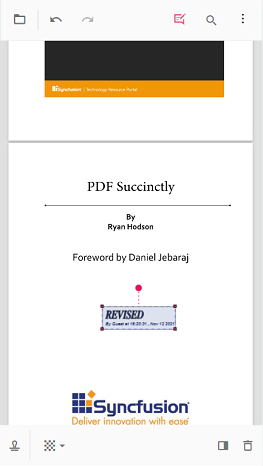

## Add signature annotations

**Step 1:** Select the Signature icon to open the signature canvas. Draw the signature, choose Create, then tap the viewer to place it.

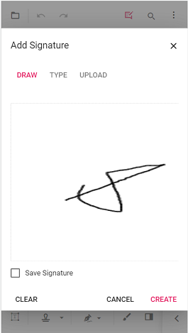

**Step 2:** The signature annotation is added to the page.

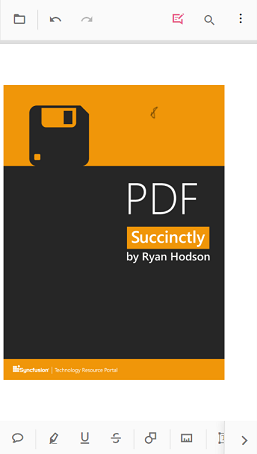

## Add ink annotations

**Step 1:** Select the Ink tool and draw directly on the page.

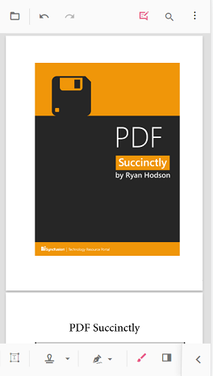

**Step 2:** The ink annotation is rendered on the page.

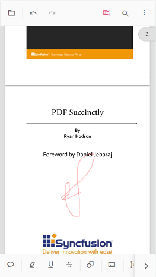

## Change annotation properties (before adding)

**Step 1:** Adjust annotation properties before placement as required.

**Step 2:** Open the property toolbar for the annotation icon, set the desired properties, and then place the annotation on the page.

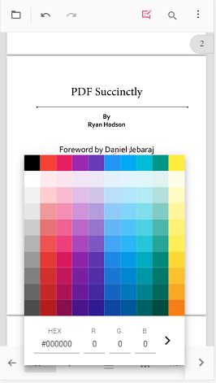

## Change annotation properties (after adding)

**Step 1:** Modify annotation properties after placement when necessary.

**Step 2:** Select the annotation to display the property toolbar, then update the properties as needed.

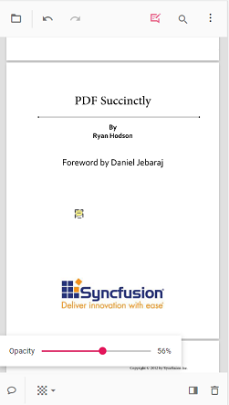

## Delete annotations

**Step 1:** Select the annotation to display the property toolbar, then choose the Delete icon to remove the annotation.

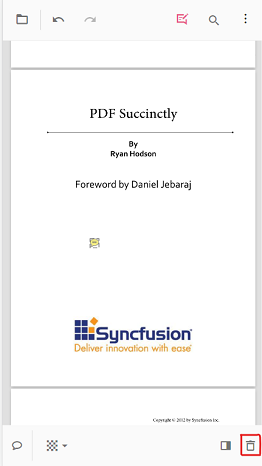

## Open the comment panel

**Step 1:** Open the comment panel from the property toolbar or the annotation toolbar.

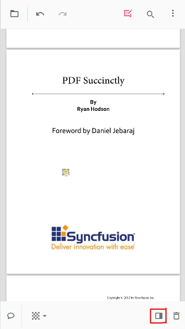

**Step 2:** The comment panel is displayed.

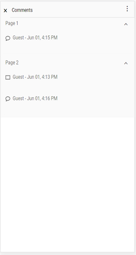

## Close the comment panel

**Step 1:** Use the Close button to dismiss the comment panel.

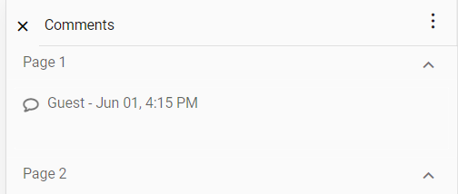

## See also

- [Annotation Overview](overview)
- [Annotation Types](annotation-types/area-annotation)
- [Annotation Toolbar](../toolbar-customization/annotation-toolbar)
- [Create and Modify Annotation](create-modify-annotation)
- [Customize Annotation](customize-annotation)
- [Remove Annotation](delete-annotation)
- [Handwritten Signature](signature-annotation)
- [Export and Import Annotation](export-import/export-annotation)
- [Annotation Permission](annotation-permission)
- [Annotation Events](annotation-event)
- [Annotation API](annotations-api)