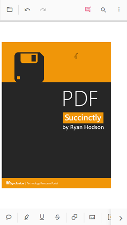

# Annotations in mobile view in React PDF Viewer component

## Open the annotation toolbar

**Step 1:** Tap Edit Annotation on the toolbar to open the annotation toolbar.

**Step 2:** The annotation toolbar appears below the main toolbar.

## Add sticky note annotations

**Step 1:** Tap the Sticky Notes icon, then tap the page where the note should be placed.

**Step 2:** Tap the page to add the sticky note annotation.

## Add text markup annotations

**Step 1:** Tap a text markup icon, select the text to mark, then tap the selection to apply the markup.

**Step 2:** The text markup appears on the selected text.

## Add shape and measurement annotations

**Step 1:** Tap the Shape or Measure icon to open the corresponding toolbar.

**Step 2:** Choose a shape or measurement type, then draw it on the page.

**Step 3:** The annotation is placed on the PDF page.

## Add stamp annotations

**Step 1:** Tap the Stamp icon and select a stamp type from the menu.

**Step 2:** Tap the page to place the stamp annotation.

## Add signature annotations

**Step 1:** Tap the Signature icon to open the signature canvas. Draw the signature, tap Create, then tap the viewer to place it.

**Step 2:** The signature is added to the page.

## Add ink annotations

**Step 1:** Tap the Ink tool and draw on the page.

**Step 2:** The ink annotation appears on the page.

## Change annotation properties (before adding)

**Step 1:** Change properties before placing the annotation by opening the property toolbar.

**Step 2:** Adjust properties, then place the annotation on the page.

## Change annotation properties (after adding)

**Step 1:** Change annotation properties after placing the annotation.

**Step 2:** Select the annotation to open the property toolbar, then adjust properties.

## Delete annotations

**Step 1:** Select the annotation to show the property toolbar, then tap the Delete icon to remove it.

## Open the comment panel

**Step 1:** Open the comment panel using the icon in the property toolbar or the annotation toolbar.

**Step 2:** The comment panel appears.

## Close the comment panel

**Step 1:** Tap the Close button to close the comment panel.

