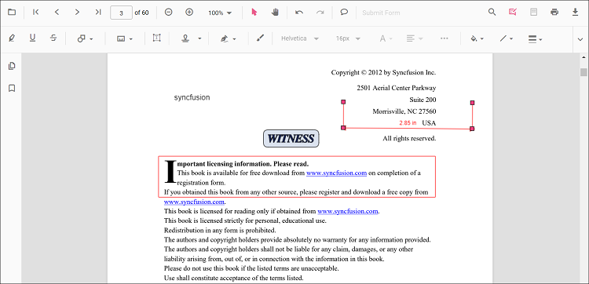
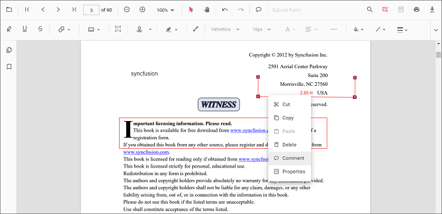
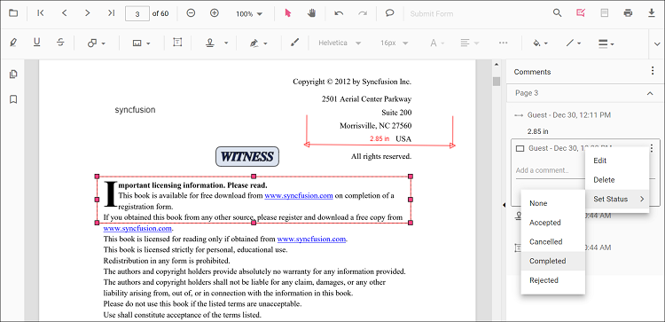
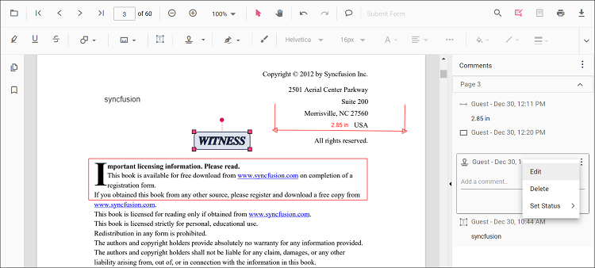
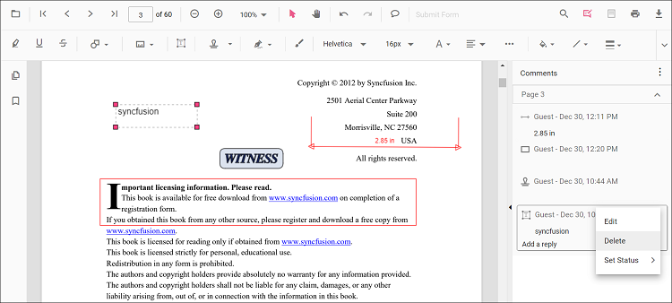

# Comments in React PDF Viewer

The PDF Viewer lets you add, edit, reply to, set status for, and delete comments on the following annotation types:

* Shape annotation  
* Stamp annotation  
* Sticky note annotation  
* Measurement annotation  
* Text markup annotation  
* Free text annotation  
* Ink annotation  

## Add a comment to an annotation (UI)

Use the **Comments panel** to manage annotation comments, replies, and status.

### Open the Comments panel
Open the panel in any of these ways:

1. **Annotation toolbar**  
   * Click **Edit Annotation** in the toolbar to show the secondary toolbar.  
   * Click **Comment Panel** to open the panel.  
2. **Context menu**  
   * Select an annotation and **right‑click** it.  
   * Choose **Comment** from the context menu.  
3. **Double‑click**  
   * Select the annotation and **double‑click** it to open the panel.  

If the panel is already open, selecting an annotation highlights its thread so you can view or add comments.

### Add comments and replies
- Select the annotation in the PDF.  
- The corresponding thread is highlighted in the Comments panel.  
- Add comments and any number of replies in the panel.  

### Set comment or reply status
- Select a comment in the panel.  
- Click **More options** on the comment or reply container.  
- Choose **Set Status**, then pick a status.  

### Edit comments and replies
You can edit comments in two ways:

1. **Context menu**  
   * Select the comment in the panel and click **More options**.  
   * Choose **Edit** to switch to an editable text box.  
2. **Mouse double‑click**  
   * Double‑click the comment or reply to edit its content.  

### Delete comments or replies
- Select the comment in the panel.  
- Click **More options** → **Delete**.  

> Deleting the **root** comment from the Comments panel also deletes the associated annotation.

---

## Add Comments to the annotation Programmatically

### Add comments and replies programmatically

Comments can be added to the PDF document programmatically using the `editAnnotation` property.

The following example Shows how to add comments and reply in response to a button click.




import * as React from 'react';
import * as ReactDOM from 'react-dom/client';
import {
  PdfViewerComponent,
  Inject,
  Toolbar,
  Magnification,
  Navigation,
  Annotation,
  LinkAnnotation,
  ThumbnailView,
  BookmarkView,
  TextSelection,
  TextSearch,
  FormFields,
  FormDesigner,
  PageOrganizer
} from '@syncfusion/ej2-react-pdfviewer';

function App() {
  const addComment = () => {
    const viewer = (document.getElementById('container')?.ej2_instances || [])[0];
    if (!viewer) return;
    const annot = viewer.annotationCollection?.[0];
    if (annot) {
      annot.commentType = 'add';
      annot.note = 'New Comment';
      viewer.annotation.editAnnotation(annot);
      console.log(viewer.annotationCollection?.[0]);
    }
  };

  const addReply = () => {
    const viewer = (document.getElementById('container')?.ej2_instances || [])[0];
    if (!viewer) return;
    const annot = viewer.annotationCollection?.[0];
    if (annot) {
      annot.commentType = 'add';
      annot.replyComment = ['Reply Comment'];
      viewer.annotation.editAnnotation(annot);
      console.log(viewer.annotationCollection?.[0]);
    }
  };

  return (
    

      

        <button id="addComment" onClick={addComment}>Add Comments</button>
        <button id="addReply" onClick={addReply}>Add Reply</button>
      

      <PdfViewerComponent
        id="container"
        documentPath="https://cdn.syncfusion.com/content/pdf/pdf-succinctly.pdf"
        resourceUrl="https://cdn.syncfusion.com/ej2/31.2.2/dist/ej2-pdfviewer-lib"
        style={{ height: '650px' }}
      >
        <Inject services={[
          Toolbar,
          Magnification,
          Navigation,
          Annotation,
          LinkAnnotation,
          ThumbnailView,
          BookmarkView,
          TextSelection,
          TextSearch,
          FormFields,
          FormDesigner,
          PageOrganizer
        ]} />
      </PdfViewerComponent>
    

  );
}

ReactDOM.createRoot(document.getElementById('sample')).render(<App />);




import * as React from 'react';
import * as ReactDOM from 'react-dom/client';
import {
  PdfViewerComponent,
  Inject,
  Toolbar,
  Magnification,
  Navigation,
  Annotation,
  LinkAnnotation,
  ThumbnailView,
  BookmarkView,
  TextSelection,
  TextSearch,
  FormFields,
  FormDesigner,
  PageOrganizer
} from '@syncfusion/ej2-react-pdfviewer';

function App() {
  const addComment = () => {
    const viewer = (document.getElementById('container')?.ej2_instances || [])[0];
    if (!viewer) return;
    const annot = viewer.annotationCollection?.[0];
    if (annot) {
      annot.commentType = 'add';
      annot.note = 'New Comment';
      viewer.annotation.editAnnotation(annot);
      console.log(viewer.annotationCollection?.[0]);
    }
  };

  const addReply = () => {
    const viewer = (document.getElementById('container')?.ej2_instances || [])[0];
    if (!viewer) return;
    const annot = viewer.annotationCollection?.[0];
    if (annot) {
      annot.commentType = 'add';
      annot.replyComment = ['Reply Comment'];
      viewer.annotation.editAnnotation(annot);
      console.log(viewer.annotationCollection?.[0]);
    }
  };

  return (
    

      

        <button id="addComment" onClick={addComment}>Add Comments</button>
        <button id="addReply" onClick={addReply}>Add Reply</button>
      

      <PdfViewerComponent
        id="container"
        documentPath="https://cdn.syncfusion.com/content/pdf/pdf-succinctly.pdf"
        // serviceUrl="YOUR_SERVICE_URL"
        style={{ height: '650px' }}
      >
        <Inject services={[
          Toolbar,
          Magnification,
          Navigation,
          Annotation,
          LinkAnnotation,
          ThumbnailView,
          BookmarkView,
          TextSelection,
          TextSearch,
          FormFields,
          FormDesigner,
          PageOrganizer
        ]} />
      </PdfViewerComponent>
    

  );
}

ReactDOM.createRoot(document.getElementById('sample')).render(<App />);




### Edit comments and replies programmatically

Comments can be edited in the PDF document programmatically using the `editAnnotation` property.

The following example Shows how to edit comments and reply in response to a button click.




import * as React from 'react';
import * as ReactDOM from 'react-dom/client';
import {
  PdfViewerComponent,
  Inject,
  Toolbar,
  Magnification,
  Navigation,
  Annotation,
  LinkAnnotation,
  ThumbnailView,
  BookmarkView,
  TextSelection,
  TextSearch,
  FormFields,
  FormDesigner,
  PageOrganizer
} from '@syncfusion/ej2-react-pdfviewer';

function App() {
  const editComment = () => {
    const viewer = (document.getElementById('container')?.ej2_instances || [])[0];
    if (!viewer) return;
    const annot = viewer.annotationCollection?.[0];
    if (annot) {
      annot.commentType = 'edit';
      annot.note = 'Edited Comment';
      viewer.annotation.editAnnotation(annot);
      console.log(viewer.annotationCollection?.[0]);
    }
  };

  const editReply = () => {
    const viewer = (document.getElementById('container')?.ej2_instances || [])[0];
    if (!viewer) return;
    const annot = viewer.annotationCollection?.[0];
    if (annot) {
      annot.commentType = 'edit';
      annot.replyComment = ['Edited Reply Comment'];
      viewer.annotation.editAnnotation(annot);
      console.log(viewer.annotationCollection?.[0]);
    }
  };

  return (
    

      

        <button id="editComment" onClick={editComment}>Edit Comments</button>
        <button id="editReply" onClick={editReply}>Edit Reply</button>
      

      <PdfViewerComponent
        id="container"
        documentPath="https://cdn.syncfusion.com/content/pdf/pdf-succinctly.pdf"
        resourceUrl="https://cdn.syncfusion.com/ej2/31.2.2/dist/ej2-pdfviewer-lib"
        style={{ height: '650px' }}
      >
        <Inject services={[
          Toolbar,
          Magnification,
          Navigation,
          Annotation,
          LinkAnnotation,
          ThumbnailView,
          BookmarkView,
          TextSelection,
          TextSearch,
          FormFields,
          FormDesigner,
          PageOrganizer
        ]} />
      </PdfViewerComponent>
    

  );
}

ReactDOM.createRoot(document.getElementById('sample')).render(<App />);




import * as React from 'react';
import * as ReactDOM from 'react-dom/client';
import {
  PdfViewerComponent,
  Inject,
  Toolbar,
  Magnification,
  Navigation,
  Annotation,
  LinkAnnotation,
  ThumbnailView,
  BookmarkView,
  TextSelection,
  TextSearch,
  FormFields,
  FormDesigner,
  PageOrganizer
} from '@syncfusion/ej2-react-pdfviewer';

function App() {
  const editComment = () => {
    const viewer = (document.getElementById('container')?.ej2_instances || [])[0];
    if (!viewer) return;
    const annot = viewer.annotationCollection?.[0];
    if (annot) {
      annot.commentType = 'edit';
      annot.note = 'Edited Comment';
      viewer.annotation.editAnnotation(annot);
      console.log(viewer.annotationCollection?.[0]);
    }
  };

  const editReply = () => {
    const viewer = (document.getElementById('container')?.ej2_instances || [])[0];
    if (!viewer) return;
    const annot = viewer.annotationCollection?.[0];
    if (annot) {
      annot.commentType = 'edit';
      annot.replyComment = ['Edited Reply Comment'];
      viewer.annotation.editAnnotation(annot);
      console.log(viewer.annotationCollection?.[0]);
    }
  };

  return (
    

      

        <button id="editComment" onClick={editComment}>Edit Comments</button>
        <button id="editReply" onClick={editReply}>Edit Reply</button>
      

      <PdfViewerComponent
        id="container"
        documentPath="https://cdn.syncfusion.com/content/pdf/pdf-succinctly.pdf"
        // serviceUrl="YOUR_SERVICE_URL"
        style={{ height: '650px' }}
      >
        <Inject services={[
          Toolbar,
          Magnification,
          Navigation,
          Annotation,
          LinkAnnotation,
          ThumbnailView,
          BookmarkView,
          TextSelection,
          TextSearch,
          FormFields,
          FormDesigner,
          PageOrganizer
        ]} />
      </PdfViewerComponent>
    

  );
}

ReactDOM.createRoot(document.getElementById('sample')).render(<App />);




### Read comments added by users

Comments added to the PDF document can be read using the annotation's `comments` property.

The following example logs comments in response to a button click.




import * as React from 'react';
import * as ReactDOM from 'react-dom/client';
import {
  PdfViewerComponent,
  Inject,
  Toolbar,
  Magnification,
  Navigation,
  Annotation,
  LinkAnnotation,
  ThumbnailView,
  BookmarkView,
  TextSelection,
  TextSearch,
  FormFields,
  FormDesigner,
  PageOrganizer
} from '@syncfusion/ej2-react-pdfviewer';

function App() {
  const checkComments = () => {
    const viewer = (document.getElementById('container')?.ej2_instances || [])[0];
    if (!viewer) return;

    const annotationCollections = viewer.annotationCollection || [];
    for (let x = 0; x < annotationCollections.length; x++) {
      console.log('annotation Id : ' + annotationCollections[x].annotationId);
      const comments = annotationCollections[x].comments || [];
      for (let y = 0; y < comments.length; y++) {
        const comment = comments[y];
        console.log('comment[' + y + '] : ' + comment.note);
      }
      const note = annotationCollections[x].note;
      console.log('note : ' + note);
    }
  };

  return (
    

      

        <button id="checkComments" onClick={checkComments}>Check the Comments</button>
      

      <PdfViewerComponent
        id="container"
        documentPath="https://cdn.syncfusion.com/content/pdf/pdf-succinctly.pdf"
        resourceUrl="https://cdn.syncfusion.com/ej2/31.2.2/dist/ej2-pdfviewer-lib"
        style={{ height: '650px' }}
      >
        <Inject services={[
          Toolbar,
          Magnification,
          Navigation,
          Annotation,
          LinkAnnotation,
          ThumbnailView,
          BookmarkView,
          TextSelection,
          TextSearch,
          FormFields,
          FormDesigner,
          PageOrganizer
        ]} />
      </PdfViewerComponent>
    

  );
}

ReactDOM.createRoot(document.getElementById('sample')).render(<App />);




---

## See also
- [Annotation Overview](../overview)  
- [Annotation Types](../annotation/annotation-types/area-annotation)  
- [Annotation Toolbar](../toolbar-customization/annotation-toolbar)  
- [Create and Modify Annotation](../annotation/create-modify-annotation)  
- [Customize Annotation](../annotation/customize-annotation)  
- [Remove Annotation](../annotation/delete-annotation)  
- [Handwritten Signature](../annotation/signature-annotation)  
- [Export and Import Annotation](../annotation/export-import/export-annotation)  
- [Annotation Permission](../annotationsannotation-permission)  
- [Annotation in Mobile View](../annotation/annotations-in-mobile-view)  
- [Annotation Events](../annotation/annotation-event)  
- [Annotation API](../annotation/annotations-api)
