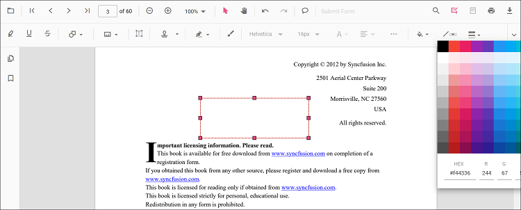
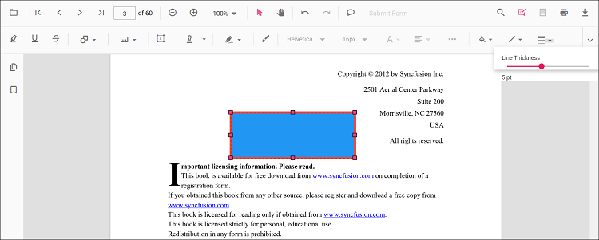
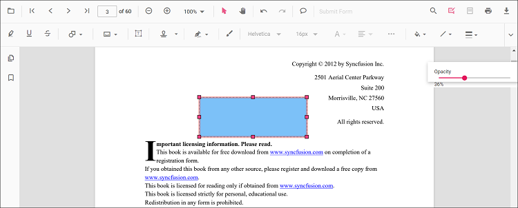

# Customize annotations

Annotation appearance and behavior (for example color, stroke color, thickness, and opacity) can be customized using the built‑in UI or programmatically. This page summarizes common customization patterns and shows how to set defaults per annotation type.

## Customize via UI

Use the annotation toolbar after selecting an annotation:
- Edit color: changes the annotation fill/text color

- Edit stroke color: changes border or line color for shapes and lines types.

- Edit thickness: adjusts border or line thickness

- Edit opacity: adjusts transparency

Type‑specific options (for example, Line properties) are available from the context menu (right‑click > Properties) where supported.

## Set default properties during initialization

Set defaults for specific annotation types when creating the `PdfViewer` instance. Configure properties such as author, subject, color, and opacity using annotation settings. The examples below reference settings used on the annotation type pages.

Text markup annotations:

- Highlight: Set default properties before creating the control using [`highlightSettings`](./annotation-types/highlight-annotation#set-properties-while-adding-individual-annotation)
- Strikethrough: Use [`strikethroughSettings`](./annotation-types/strikethrough-annotation#set-properties-while-adding-individual-annotation)
- Underline: Use [`underlineSettings`](./annotation-types/underline-annotation#set-properties-while-adding-individual-annotation)
- Squiggly: Use [`squigglySettings`](./annotation-types/Squiggly-annotation#set-properties-while-adding-individual-annotation)

Shape annotations:

- Line: Use [`lineSettings`](./annotation-types/line-annotation#set-properties-while-adding-individual-annotation)
- Arrow: Use [`arrowSettings`](./annotation-types/arrow-annotation#set-properties-while-adding-individual-annotation)
- Rectangle: Use [`rectangleSettings`](./annotation-types/rectangle-annotation#set-properties-while-adding-individual-annotation)
- Circle: Use [`circleSettings`](./annotation-types/circle-annotation#set-properties-while-adding-individual-annotation)
- Polygon: Use [`polygonSettings`](./annotation-types/polygon-annotation#set-properties-while-adding-individual-annotation)

Measurement annotations:

- Distance: Use [`distanceSettings`](./annotation-types/distance-annotation#set-default-properties-during-initialization)
- Perimeter: Use [`perimeterSettings`](./annotation-types/perimeter-annotation#set-default-properties-during-initialization)
- Area: Use [`areaSettings`](./annotation-types/area-annotation#set-default-properties-during-initialization)
- Radius: Use [`radiusSettings`](./annotation-types/radius-annotation#set-default-properties-during-initialization)
- Volume: Use [`volumeSettings`](./annotation-types/volume-annotation#set-default-properties-during-initialization)

Other Annotations:

- Redaction: Use [`redactionSettings`](./annotation-types/redaction-annotation#default-redaction-settings-during-initialization)
- Free text: Use [`freeTextSettings`](./annotation-types/free-text-annotation#set-default-properties-during-initialization)
- Ink (freehand): Use [`inkAnnotationSettings`](./annotation-types/ink-annotation#customize-ink-appearance)
- Stamp: Use [`stampSettings`](./annotation-types/stamp-annotation#set-properties-while-adding-individual-annotation)
- Sticky notes: Use [`stickyNotesSettings`](./annotation-types/sticky-notes#set-default-properties-during-initialization)

Set defaults for specific annotation types when creating the `PdfViewerComponent`. Below are examples using settings already used in the annotation type pages.




import * as React from 'react';
import * as ReactDOM from 'react-dom/client';
import {
  PdfViewerComponent, Inject,
  Toolbar, Annotation, TextSelection
} from '@syncfusion/ej2-react-pdfviewer';

function App() {
  return (
    <PdfViewerComponent
      id="container"
      documentPath="https://cdn.syncfusion.com/content/pdf/pdf-succinctly.pdf"
      resourceUrl="https://cdn.syncfusion.com/ej2/31.2.2/dist/ej2-pdfviewer-lib"
      style={{ height: '650px' }}

      // Text markup defaults
      highlightSettings={{ author: 'QA', subject: 'Review', color: '#ffff00', opacity: 0.6 }}
      strikethroughSettings={{ author: 'QA', subject: 'Remove', color: '#ff0000', opacity: 0.6 }}
      underlineSettings={{ author: 'Guest User', subject: 'Points to be remembered', color: '#00ffff', opacity: 0.9 }}
      squigglySettings={{ author: 'Guest User', subject: 'Corrections', color: '#00ff00', opacity: 0.9 }}

      // Shapes
      lineSettings={{ strokeColor: '#0066ff', thickness: 2, opacity: 0.8 }}
      arrowSettings={{ strokeColor: '#0066ff', thickness: 2, opacity: 0.8 }}
      rectangleSettings={{ fillColor: '#ffffff00', strokeColor: '#222222', thickness: 1, opacity: 1 }}
      circleSettings={{ fillColor: '#ffffff00', strokeColor: '#222222', thickness: 1, opacity: 1 }}
      polygonSettings={{ fillColor: '#ffffff00', strokeColor: '#222222', thickness: 1, opacity: 1 }}

      // Measurements
      distanceSettings={{ strokeColor: '#0066ff', thickness: 2, opacity: 0.8 }}
      perimeterSettings={{ strokeColor: '#0066ff', thickness: 2, opacity: 0.8 }}
      areaSettings={{ strokeColor: '#0066ff', thickness: 2, opacity: 0.8, fillColor: '#ffffff00' }}
      radiusSettings={{ strokeColor: '#0066ff', thickness: 2, opacity: 0.8, fillColor: '#ffffff00' }}
      volumeSettings={{ strokeColor: '#0066ff', thickness: 2, opacity: 0.8, fillColor: '#ffffff00' }}

      // Others
      freeTextSettings={{ borderColor: '#222222', thickness: 1, opacity: 1 }}
      inkAnnotationSettings={{ color: '#0000ff', thickness: 3, opacity: 0.8 }}
      stampSettings={{ opacity: 0.9 }}
      stickyNotesSettings={{ author: 'QA', subject: 'Review', color: '#ffcc00', opacity: 1 }}
    >
      <Inject services={[Toolbar, Annotation, TextSelection]} />
    </PdfViewerComponent>
  );
}

ReactDOM.createRoot(document.getElementById('sample')).render(<App />);




N> After changing defaults using UI tools (for example, Edit color or Edit opacity), the updated values apply to subsequent annotations within the same session.

## Customize programmatically at runtime

To update an existing annotation from code, modify its properties and call editAnnotation.

Example: bulk‑update matching annotations.




import * as React from 'react';
import * as ReactDOM from 'react-dom/client';
import { PdfViewerComponent, Inject, Toolbar, Annotation, TextSelection } from '@syncfusion/ej2-react-pdfviewer';

function getViewer() { return document.getElementById('container').ej2_instances[0]; }

function bulkUpdateAnnotations() {
  const viewer = getViewer();
  for (const ann of viewer.annotationCollection) {
    // Example criteria; customize as needed
    if (ann.author === 'Guest' || ann.subject === 'Rectangle') {
      ann.color = '#ff0000';
      ann.opacity = 0.8;
      // For shapes/lines you can also change strokeColor/thickness when applicable
      // ann.strokeColor = '#222222';
      // ann.thickness = 2;
      viewer.annotation.editAnnotation(ann);
    }
  }
}

function App() {
  return (
    <>
      <button onClick={bulkUpdateAnnotations}>Bulk Update Annotations</button>
      <PdfViewerComponent
        id="container"
        documentPath="https://cdn.syncfusion.com/content/pdf/pdf-succinctly.pdf"
        resourceUrl="https://cdn.syncfusion.com/ej2/31.2.2/dist/ej2-pdfviewer-lib"
        style={{ height: '650px' }}
      >
        <Inject services={[Toolbar, Annotation, TextSelection]} />
      </PdfViewerComponent>
    </>
  );
}

ReactDOM.createRoot(document.getElementById('sample')).render(<App />);




## Customize Annotation Settings

Defines the settings of the annotations. You can change annotation settings like author name, height, width etc., using the [`annotationSettings`](https://ej2.syncfusion.com/react/documentation/api/pdfviewer/index-default#annotationsettings) prop.




import * as React from 'react';
import * as ReactDOM from 'react-dom/client';
import {
  PdfViewerComponent, Inject,
  Toolbar, Annotation, TextSelection,
  AllowedInteraction
} from '@syncfusion/ej2-react-pdfviewer';

function App() {
  return (
    <PdfViewerComponent
      id="container"
      documentPath="https://cdn.syncfusion.com/content/pdf/pdf-succinctly.pdf"
      resourceUrl="https://cdn.syncfusion.com/ej2/31.2.2/dist/ej2-pdfviewer-lib"
      style={{ height: '650px' }}
      annotationSettings={{
        author: 'XYZ',
        minHeight: 10,
        minWidth: 10,
        maxWidth: 100,
        maxHeight: 100,
        isLock: false,
        skipPrint: false,
        skipDownload: false,
        allowedInteractions: [AllowedInteraction.Select, AllowedInteraction.Move]
      }}
    >
      <Inject services={[Toolbar, Annotation, TextSelection]} />
    </PdfViewerComponent>
  );
}

ReactDOM.createRoot(document.getElementById('sample')).render(<App />);



## Customize Annotation SelectorSettings

Defines the settings of annotation selector. You can customize the annotation selector using the [`annotationSelectorSettings`](https://ej2.syncfusion.com/react/documentation/api/pdfviewer/index-default#annotationselectorsettings) prop.




import * as React from 'react';
import * as ReactDOM from 'react-dom/client';
import {
  PdfViewerComponent, Inject,
  Toolbar, Annotation, TextSelection,
  AnnotationResizerLocation, CursorType
} from '@syncfusion/ej2-react-pdfviewer';

function App() {
  return (
    <PdfViewerComponent
      id="container"
      documentPath="https://cdn.syncfusion.com/content/pdf/pdf-succinctly.pdf"
      resourceUrl="https://cdn.syncfusion.com/ej2/31.2.2/dist/ej2-pdfviewer-lib"
      style={{ height: '650px' }}
      annotationSelectorSettings={{
        selectionBorderColor: 'blue',
        resizerBorderColor: 'red',
        resizerFillColor: '#4070ff',
        resizerSize: 8,
        selectionBorderThickness: 1,
        resizerShape: 'Circle',
        selectorLineDashArray: [5, 6],
        resizerLocation: AnnotationResizerLocation.Corners | AnnotationResizerLocation.Edges,
        resizerCursorType: CursorType.grab
      }}
    >
      <Inject services={[Toolbar, Annotation, TextSelection]} />
    </PdfViewerComponent>
  );
}

ReactDOM.createRoot(document.getElementById('sample')).render(<App />);




[View Sample on GitHub](https://github.com/SyncfusionExamples/react-pdf-viewer-examples)

## See also

- [Annotation Overview](../overview)
- [Annotation Types](../annotation/annotation-types/area-annotation)
- [Annotation Toolbar](../toolbar-customization/annotation-toolbar)
- [Create and Modify Annotation](../annotation/create-modify-annotation)
- [Remove Annotation](../annotation/delete-annotation)
- [Handwritten Signature](../annotation/signature-annotation)
- [Export and Import Annotation](../annotation/export-import/export-annotation)
- [Annotation Permission](../annotation/annotation-permission)
- [Annotation in Mobile View](../annotation/annotations-in-mobile-view)
- [Annotation Events](../annotation/annotation-event)
- [Annotation API](../annotation/annotations-api)