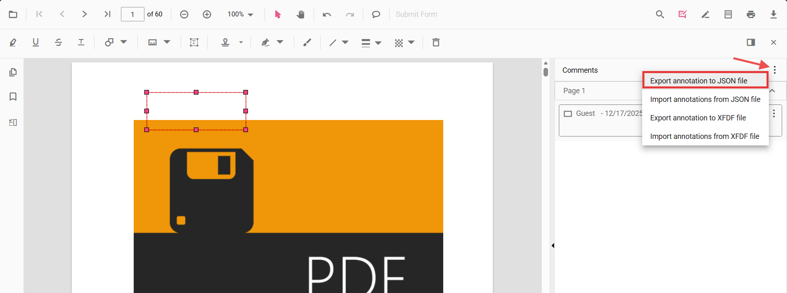

# Export annotations in React PDF Viewer

PDF Viewer provides support to export annotations. You can export annotations from the PDF Viewer in two ways:

- Using the built-in UI in the Comments panel (JSON or XFDF file)
- Programmatically (JSON, XFDF, or as an object for custom handling)

## Export using the UI (Comments panel)

The Comments panel provides export actions in its overflow menu:

- Export annotation to JSON file
- Export annotation to XFDF file

Follow the steps to export annotations:

1. Open the Comments panel in the PDF Viewer.
2. Click the overflow menu (three dots) at the top of the panel.
3. Choose Export annotation to JSON file or Export annotation to XFDF file.

This generates and downloads the selected format containing all annotations in the current document.

## Export programmatically

You can export annotations from code using [exportAnnotation](https://ej2.syncfusion.com/react/documentation/api/pdfviewer/index-default#exportannotation), [exportAnnotationsAsObject](https://ej2.syncfusion.com/react/documentation/api/pdfviewer/index-default#exportannotationsasobject) and [exportAnnotationsAsBase64String](https://ej2.syncfusion.com/react/documentation/api/pdfviewer/index-default#exportannotationsasbase64string) APIs.

Use the following example to initialize the viewer and export annotations as JSON, XFDF, or as an object.




import * as React from 'react';
import * as ReactDOM from 'react-dom/client';
import {
  PdfViewerComponent, Inject,
  Toolbar, Annotation, TextSelection,
  AnnotationDataFormat
} from '@syncfusion/ej2-react-pdfviewer';

function getViewer() { return document.getElementById('container').ej2_instances[0]; }

// Export annotations as JSON file
function exportAsJSON() {
  getViewer().exportAnnotation(AnnotationDataFormat.Json);
}

// Export annotations as XFDF file
function exportAsXFDF() {
  getViewer().exportAnnotation(AnnotationDataFormat.Xfdf);
}

// Export annotations as an object (for custom serialization / re-import)
function exportAsObject() {
  getViewer().exportAnnotationsAsObject().then((value) => {
    // Persist or transmit the object as needed (DB/API). Keep for future import.
    console.log('Exported annotation object:', value);
  });
}

// Export annotations as a Base64 string
function exportAsBase64() {
  getViewer().exportAnnotationsAsBase64String(AnnotationDataFormat.Json).then((value) => {
    console.log('Exported Base64:', value);
  });
}

function App() {
  return (
    <>
      

        <button onClick={exportAsJSON}>Export JSON</button>
        <button onClick={exportAsXFDF}>Export XFDF</button>
        <button onClick={exportAsObject}>Export as Object</button>
        <button onClick={exportAsBase64}>Export as Base64</button>
      

      <PdfViewerComponent
        id="container"
        documentPath="https://cdn.syncfusion.com/content/pdf/pdf-succinctly.pdf"
        resourceUrl="https://cdn.syncfusion.com/ej2/31.2.2/dist/ej2-pdfviewer-lib"
        style={{ height: '650px' }}
      >
        <Inject services={[Toolbar, Annotation, TextSelection]} />
      </PdfViewerComponent>
    </>
  );
}

ReactDOM.createRoot(document.getElementById('sample')).render(<App />);




## Common use cases

- Archive or share annotations as portable JSON/XFDF files
- Save annotations alongside a document in your storage layer
- Send annotations to a backend for collaboration or review workflows
- Export as object for custom serialization and re-import later

[View Sample on GitHub](https://github.com/SyncfusionExamples/typescript-pdf-viewer-examples/tree/master)

## See also

- [Annotation Overview](../../overview)
- [Annotation Types](../../annotation/annotation-types/area-annotation)
- [Annotation Toolbar](../../toolbar-customization/annotation-toolbar)
- [Create and Modify Annotation](../../annotation/create-modify-annotation)
- [Customize Annotation](../../annotation/customize-annotation)
- [Remove Annotation](../../annotation/delete-annotation)
- [Handwritten Signature](../../annotation/signature-annotation)
- [Import Annotation](../export-import/import-annotation)
- [Import Export Events](../export-import/export-import-events)
- [Annotation Permission](../../annotation/annotation-permission)
- [Annotation in Mobile View](../../annotation/annotations-in-mobile-view)
- [Annotation Events](../../annotation/annotation-event)
- [Annotation API](../../annotation/annotations-api)
