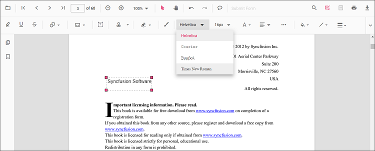
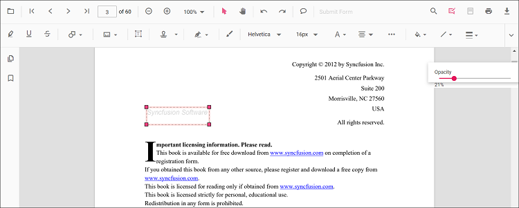

# Free text annotation in React PDF Viewer component

The PDF Viewer provides tools to add, edit, and remove free-text annotations.

## Add a free-text annotation

To add a free-text annotation:

* Click the **Edit Annotation** button in the PDF Viewer toolbar to reveal the annotation toolbar.
* Select the **Free Text Annotation** button to enter free*text annotation mode.
* Tap or click anywhere on the page to add text.

When the viewer is in pan mode, selecting the Free Text annotation switches the viewer to text-selection mode.

The example below shows switching to free-text annotation mode via a button click.





import * as ReactDOM from 'react-dom';
import * as React from 'react';
import { PdfViewerComponent, Toolbar, Magnification, Navigation, LinkAnnotation, BookmarkView, ThumbnailView,
         Print, TextSelection, TextSearch, Annotation, FormFields, FormDesigner, PageOrganizer, Inject } from '@syncfusion/ej2-react-pdfviewer';
let pdfviewer;

function App() {

  function freetextMode() {
    var viewer = document.getElementById('container').ej2_instances[0];
    viewer.annotation.setAnnotationMode('FreeText');
  }
  return (

    <button onClick={freetextMode}>FreeText</button>
    

      <PdfViewerComponent
        ref={(scope) => { pdfviewer = scope; }}
        id="container"
        documentPath="https://cdn.syncfusion.com/content/pdf/pdf-succinctly.pdf"
        resourceUrl="https://cdn.syncfusion.com/ej2/31.2.2/dist/ej2-pdfviewer-lib"
        style={{ 'height': '640px' }}>

              <Inject services={[ Toolbar, Annotation, Magnification, Navigation, LinkAnnotation, BookmarkView, ThumbnailView,
                                  Print, TextSelection, TextSearch, FormFields, FormDesigner, PageOrganizer]} />
      </PdfViewerComponent>
    

  
);
}
const root = ReactDOM.createRoot(document.getElementById('sample'));
root.render(<App />);






import * as ReactDOM from 'react-dom';
import * as React from 'react';
import { PdfViewerComponent, Toolbar, Magnification, Navigation, LinkAnnotation, BookmarkView, ThumbnailView,
         Print, TextSelection, TextSearch, Annotation, FormFields, FormDesigner, PageOrganizer, Inject } from '@syncfusion/ej2-react-pdfviewer';
let pdfviewer;

function App() {

  function freetextMode() {
    var viewer = document.getElementById('container').ej2_instances[0];
    viewer.annotation.setAnnotationMode('FreeText');
  }
  return (

    <button onClick={freetextMode}>FreeText</button>
    

      <PdfViewerComponent
        ref={(scope) => { pdfviewer = scope; }}
        id="container"
        documentPath="https://cdn.syncfusion.com/content/pdf/pdf-succinctly.pdf"
        serviceUrl="https://document.syncfusion.com/web-services/pdf-viewer/api/pdfviewer"
        style={{ 'height': '640px' }}>

              <Inject services={[ Toolbar, Annotation, Magnification, Navigation, LinkAnnotation, BookmarkView, ThumbnailView,
                                  Print, TextSelection, TextSearch, FormFields, FormDesigner, PageOrganizer]} />
      </PdfViewerComponent>
    

  
);
}
const root = ReactDOM.createRoot(document.getElementById('sample'));
root.render(<App />);





## Add a free-text annotation programmatically

You can add a free-text annotation programmatically using the [addAnnotation()](https://ej2.syncfusion.com/react/documentation/api/pdfviewer/annotation#annotation) method.

Example: add a free-text annotation using `addAnnotation()`.





import * as ReactDOM from 'react-dom';
import * as React from 'react';
import { PdfViewerComponent, Toolbar, Magnification, Navigation, LinkAnnotation, BookmarkView, ThumbnailView,
         Print, TextSelection, TextSearch, Annotation, FormFields, FormDesigner, PageOrganizer, Inject } from '@syncfusion/ej2-react-pdfviewer';
let pdfviewer;

function App() {

  function addAnnotation() {
    var viewer = document.getElementById('container').ej2_instances[0];
        viewer.annotation.addAnnotation("FreeText", {
      offset: { x: 100, y: 150 },
      fontSize: 16,
      fontFamily: "Helvetica",
      pageNumber: 1,
      width: 200,
      height: 40,
      isLock: false,
      textAlignment : 'Center',
      borderStyle : 'solid',
      borderWidth : 2,
      borderColor : 'red',
      fillColor : 'blue',
      fontColor: 'white',
      defaultText: "Syncfusion"
    });
  }
  return (

    <button onClick={addAnnotation}>Add Annotation programatically</button>
    

      <PdfViewerComponent
        ref={(scope) => { pdfviewer = scope; }}
        id="container"
        documentPath="https://cdn.syncfusion.com/content/pdf/pdf-succinctly.pdf"
        resourceUrl="https://cdn.syncfusion.com/ej2/31.2.2/dist/ej2-pdfviewer-lib"
        style={{ 'height': '640px' }}>

              <Inject services={[ Toolbar, Annotation, Magnification, Navigation, LinkAnnotation, BookmarkView, ThumbnailView,
                                  Print, TextSelection, TextSearch, FormFields, FormDesigner, PageOrganizer]} />
      </PdfViewerComponent>
    

  
);
}
const root = ReactDOM.createRoot(document.getElementById('sample'));
root.render(<App />);






import * as ReactDOM from 'react-dom';
import * as React from 'react';
import { PdfViewerComponent, Toolbar, Magnification, Navigation, LinkAnnotation, BookmarkView, ThumbnailView,
         Print, TextSelection, TextSearch, Annotation, FormFields, FormDesigner, PageOrganizer, Inject } from '@syncfusion/ej2-react-pdfviewer';
let pdfviewer;

function App() {

  function addAnnotation() {
    var viewer = document.getElementById('container').ej2_instances[0];
    viewer.annotation.addAnnotation("FreeText", {
      offset: { x: 100, y: 150 },
      fontSize: 16,
      fontFamily: "Helvetica",
      pageNumber: 1,
      width: 200,
      height: 40,
      isLock: false,
      textAlignment : 'Center',
      borderStyle : 'solid',
      borderWidth : 2,
      borderColor : 'red',
      fillColor : 'blue',
      fontColor: 'white',
      defaultText: "Syncfusion"
    });
  }
  return (

    <button onClick={addAnnotation}>Add Annotation programatically</button>
    

      <PdfViewerComponent
        ref={(scope) => { pdfviewer = scope; }}
        id="container"
        documentPath="https://cdn.syncfusion.com/content/pdf/pdf-succinctly.pdf"
        serviceUrl="https://document.syncfusion.com/web-services/pdf-viewer/api/pdfviewer"
        style={{ 'height': '640px' }}>

              <Inject services={[ Toolbar, Annotation, Magnification, Navigation, LinkAnnotation, BookmarkView, ThumbnailView,
                                  Print, TextSelection, TextSearch, FormFields, FormDesigner, PageOrganizer]} />
      </PdfViewerComponent>
    

  
);
}
const root = ReactDOM.createRoot(document.getElementById('sample'));
root.render(<App />);





## Change the content of an existing free-text annotation programmatically

To update the content of an existing free-text annotation, use the `editAnnotation()` method. Example below demonstrates editing an annotation's bounds and text.





import * as ReactDOM from 'react-dom';
import * as React from 'react';
import { PdfViewerComponent, Toolbar, Magnification, Navigation, LinkAnnotation, BookmarkView, ThumbnailView,
         Print, TextSelection, TextSearch, Annotation, FormFields, FormDesigner, PageOrganizer, Inject } from '@syncfusion/ej2-react-pdfviewer';
let pdfviewer;

function App() {

  function editAnnotation() {
    var viewer = document.getElementById('container').ej2_instances[0];
    for (let i = 0; i < viewer.annotationCollection.length; i++)
    {
      if (viewer.annotationCollection[i].subject === "Text Box") {
        var width = viewer.annotationCollection[i].bounds.width;
        var height = viewer.annotationCollection[i].bounds.height;
        viewer.annotationCollection[i].bounds = {x : 100, y: 100, width: width, height: height };
        viewer.annotationCollection[i].dynamicText = 'syncfusion';
        viewer.annotation.editAnnotation(viewer.annotationCollection[i]);
      }
    }
  }
  return (

    <button onClick={editAnnotation}>Edit Annotation programatically</button>
    

      <PdfViewerComponent
        ref={(scope) => { pdfviewer = scope; }}
        id="container"
        documentPath="https://cdn.syncfusion.com/content/pdf/pdf-succinctly.pdf"
        resourceUrl="https://cdn.syncfusion.com/ej2/31.2.2/dist/ej2-pdfviewer-lib"
        style={{ 'height': '640px' }}>

              <Inject services={[ Toolbar, Annotation, Magnification, Navigation, LinkAnnotation, BookmarkView, ThumbnailView,
                                  Print, TextSelection, TextSearch, FormFields, FormDesigner, PageOrganizer]} />
      </PdfViewerComponent>
    

  
);
}
const root = ReactDOM.createRoot(document.getElementById('sample'));
root.render(<App />);






import * as ReactDOM from 'react-dom';
import * as React from 'react';
import { PdfViewerComponent, Toolbar, Magnification, Navigation, LinkAnnotation, BookmarkView, ThumbnailView,
         Print, TextSelection, TextSearch, Annotation, FormFields, FormDesigner, PageOrganizer, Inject } from '@syncfusion/ej2-react-pdfviewer';
let pdfviewer;

function App() {

  function editAnnotation() {
    var viewer = document.getElementById('container').ej2_instances[0];
    for (let i = 0; i < viewer.annotationCollection.length; i++)
    {
      if (viewer.annotationCollection[i].subject === "Text Box") {
        var width = viewer.annotationCollection[i].bounds.width;
        var height = viewer.annotationCollection[i].bounds.height;
        viewer.annotationCollection[i].bounds = {x : 100, y: 100, width: width, height: height };
        viewer.annotationCollection[i].dynamicText = 'syncfusion';
        viewer.annotation.editAnnotation(viewer.annotationCollection[i]);
      }
    }
  }
  return (

    <button onClick={editAnnotation}>Edit Annotation programatically</button>
    

      <PdfViewerComponent
        ref={(scope) => { pdfviewer = scope; }}
        id="container"
        documentPath="https://cdn.syncfusion.com/content/pdf/pdf-succinctly.pdf"
        serviceUrl="https://document.syncfusion.com/web-services/pdf-viewer/api/pdfviewer"
        style={{ 'height': '640px' }}>

              <Inject services={[ Toolbar, Annotation, Magnification, Navigation, LinkAnnotation, BookmarkView, ThumbnailView,
                                  Print, TextSelection, TextSearch, FormFields, FormDesigner, PageOrganizer]} />
      </PdfViewerComponent>
    

  
);
}
const root = ReactDOM.createRoot(document.getElementById('sample'));
root.render(<App />);





N> The PDF Viewer does not edit original document text. You can add and modify free-text annotations only.

## Edit free-text annotation properties

Use the annotation toolbar to configure font family, size, style, font color, text alignment, fill color, stroke color, border thickness, and opacity.

### Font family

Choose a font from the Font Family tool.

### Font size

Select a size in the Font Size tool.

### Font color

Pick a color from the Font Color palette.

### Text alignment

Set alignment using the Text Align tool.

### Text styles

Toggle styles in the Font Style tool.

### Fill color

Set the annotation's fill color with the Edit Color tool.

### Stroke color

Set the stroke color with the Edit Stroke Color tool.

### Thickness

Adjust border thickness with the Edit Thickness slider.

### Opacity

Adjust opacity with the Edit Opacity slider.

## Set default properties during control initialization

Set default properties for free-text annotations using `freeTextSettings` when initializing the control. The selected defaults are applied when annotations are created. The example below sets default values.





import * as ReactDOM from 'react-dom';
import * as React from 'react';
import { PdfViewerComponent, Toolbar, Magnification, Navigation, LinkAnnotation, BookmarkView, ThumbnailView,
         Print, TextSelection, TextSearch, Annotation, FormFields, FormDesigner, PageOrganizer, Inject } from '@syncfusion/ej2-react-pdfviewer';
let pdfviewer;

function App() {
  return (

    

      <PdfViewerComponent
        ref={(scope) => { pdfviewer = scope; }}
        id="container"
        documentPath="https://cdn.syncfusion.com/content/pdf/pdf-succinctly.pdf"
        resourceUrl="https://cdn.syncfusion.com/ej2/31.2.2/dist/ej2-pdfviewer-lib"
		freeTextSettings={{fillColor: 'green', borderColor: 'blue', fontColor: 'yellow'}}
        style={{ 'height': '640px' }}>

              <Inject services={[ Toolbar, Annotation, Magnification, Navigation, LinkAnnotation, BookmarkView, ThumbnailView,
                                  Print, TextSelection, TextSearch, FormFields, FormDesigner, PageOrganizer]} />
      </PdfViewerComponent>
    

  
);
}
const root = ReactDOM.createRoot(document.getElementById('sample'));
root.render(<App />);






import * as ReactDOM from 'react-dom';
import * as React from 'react';
import { PdfViewerComponent, Toolbar, Magnification, Navigation, LinkAnnotation, BookmarkView, ThumbnailView,
         Print, TextSelection, TextSearch, Annotation, FormFields, FormDesigner, PageOrganizer, Inject } from '@syncfusion/ej2-react-pdfviewer';
let pdfviewer;

function App() {
  return (

    

      <PdfViewerComponent
        ref={(scope) => { pdfviewer = scope; }}
        id="container"
        documentPath="https://cdn.syncfusion.com/content/pdf/pdf-succinctly.pdf"
        serviceUrl="https://document.syncfusion.com/web-services/pdf-viewer/api/pdfviewer"
		freeTextSettings={{fillColor: 'green', borderColor: 'blue', fontColor: 'yellow'}}
        style={{ 'height': '640px' }}>

              <Inject services={[ Toolbar, Annotation, Magnification, Navigation, LinkAnnotation, BookmarkView, ThumbnailView,
                                  Print, TextSelection, TextSearch, FormFields, FormDesigner, PageOrganizer]} />
      </PdfViewerComponent>
    

  
);
}
const root = ReactDOM.createRoot(document.getElementById('sample'));
root.render(<App />);





You can also enable the autofit support for free text annotation by using the enableAutoFit boolean property in freeTextSettings as below. The width of the free text rectangle box will be increased based on the text added to it.





import * as ReactDOM from 'react-dom';
import * as React from 'react';
import { PdfViewerComponent, Toolbar, Magnification, Navigation, LinkAnnotation, BookmarkView, ThumbnailView,
         Print, TextSelection, TextSearch, Annotation, FormFields, FormDesigner, PageOrganizer, Inject } from '@syncfusion/ej2-react-pdfviewer';
let pdfviewer;

function App() {
  return (

    

      <PdfViewerComponent
        ref={(scope) => { pdfviewer = scope; }}
        id="container"
        documentPath="https://cdn.syncfusion.com/content/pdf/pdf-succinctly.pdf"
        resourceUrl="https://cdn.syncfusion.com/ej2/31.2.2/dist/ej2-pdfviewer-lib"
		freeTextSettings={{enableAutoFit: true}}
        style={{ 'height': '640px' }}>

              <Inject services={[ Toolbar, Annotation, Magnification, Navigation, LinkAnnotation, BookmarkView, ThumbnailView,
                                  Print, TextSelection, TextSearch, FormFields, FormDesigner, PageOrganizer]} />
      </PdfViewerComponent>
    

  
);
}
const root = ReactDOM.createRoot(document.getElementById('sample'));
root.render(<App />);






import * as ReactDOM from 'react-dom';
import * as React from 'react';
import { PdfViewerComponent, Toolbar, Magnification, Navigation, LinkAnnotation,
         BookmarkView, ThumbnailView, Print, TextSelection, TextSearch, Annotation,
         FormFields, FormDesigner, PageOrganizer, Inject } from '@syncfusion/ej2-react-pdfviewer';
let pdfviewer;

function App() {
  return (

    

      <PdfViewerComponent
        ref={(scope) => { pdfviewer = scope; }}
        id="container"
        documentPath="https://cdn.syncfusion.com/content/pdf/pdf-succinctly.pdf"
        serviceUrl="https://document.syncfusion.com/web-services/pdf-viewer/api/pdfviewer"
		freeTextSettings={{enableAutoFit: true}}
        style={{ 'height': '640px' }}>

              <Inject services={[ Toolbar, Annotation, Magnification, Navigation, LinkAnnotation, BookmarkView, ThumbnailView,
                                  Print, TextSelection, TextSearch, FormFields, FormDesigner, PageOrganizer]} />
      </PdfViewerComponent>
    

  
);
}
const root = ReactDOM.createRoot(document.getElementById('sample'));
root.render(<App />);



