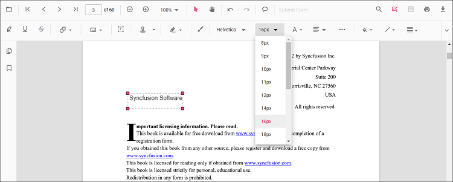
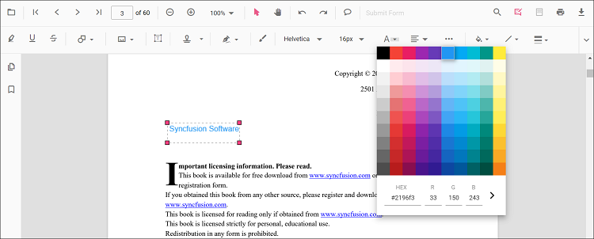
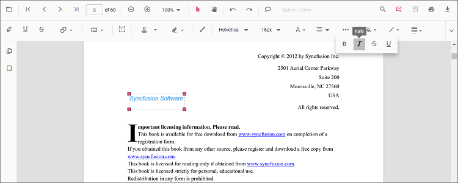

# Free text annotation in React PDF Viewer

The PDF Viewer control provides options to add, edit, and delete free text annotations.

## Add a free text annotation to the PDF document

The PDF Viewer control provides options to add, edit, and delete free text annotations.

* Click the **Edit Annotation** button in the PDF Viewer toolbar. The annotation toolbar appears below it.
* Select the **Free Text Annotation** button to enable free text annotation mode.
* Add text anywhere on the pages of the PDF document.

When in pan mode, selecting free text annotation switches the PDF Viewer to text select mode.

The following example switches to free text annotation mode using a button click.





import * as ReactDOM from 'react-dom';
import * as React from 'react';
import { PdfViewerComponent, Toolbar, Magnification, Navigation, LinkAnnotation, BookmarkView, ThumbnailView,
         Print, TextSelection, TextSearch, Annotation, FormFields, FormDesigner, PageOrganizer, Inject } from '@syncfusion/ej2-react-pdfviewer';
let pdfviewer;

function App() {

  function freetextMode() {
    var viewer = document.getElementById('container').ej2_instances[0];
    viewer.annotation.setAnnotationMode('FreeText');
  }
  return (

    <button onClick={freetextMode}>FreeText</button>
    

      <PdfViewerComponent
        ref={(scope) => { pdfviewer = scope; }}
        id="container"
        documentPath="https://cdn.syncfusion.com/content/pdf/pdf-succinctly.pdf"
        resourceUrl="https://cdn.syncfusion.com/ej2/31.2.2/dist/ej2-pdfviewer-lib"
        style={{ 'height': '640px' }}>

              <Inject services={[ Toolbar, Annotation, Magnification, Navigation, LinkAnnotation, BookmarkView, ThumbnailView,
                                  Print, TextSelection, TextSearch, FormFields, FormDesigner, PageOrganizer]} />
      </PdfViewerComponent>
    

  
);
}
const root = ReactDOM.createRoot(document.getElementById('sample'));
root.render(<App />);






import * as ReactDOM from 'react-dom';
import * as React from 'react';
import { PdfViewerComponent, Toolbar, Magnification, Navigation, LinkAnnotation, BookmarkView, ThumbnailView,
         Print, TextSelection, TextSearch, Annotation, FormFields, FormDesigner, PageOrganizer, Inject } from '@syncfusion/ej2-react-pdfviewer';
let pdfviewer;

function App() {

  function freetextMode() {
    var viewer = document.getElementById('container').ej2_instances[0];
    viewer.annotation.setAnnotationMode('FreeText');
  }
  return (

    <button onClick={freetextMode}>FreeText</button>
    

      <PdfViewerComponent
        ref={(scope) => { pdfviewer = scope; }}
        id="container"
        documentPath="https://cdn.syncfusion.com/content/pdf/pdf-succinctly.pdf"
        serviceUrl="https://document.syncfusion.com/web-services/pdf-viewer/api/pdfviewer"
        style={{ 'height': '640px' }}>

              <Inject services={[ Toolbar, Annotation, Magnification, Navigation, LinkAnnotation, BookmarkView, ThumbnailView,
                                  Print, TextSelection, TextSearch, FormFields, FormDesigner, PageOrganizer]} />
      </PdfViewerComponent>
    

  
);
}
const root = ReactDOM.createRoot(document.getElementById('sample'));
root.render(<App />);





## Add a Free Text annotation to the PDF document Programmatically

The PDF Viewer library allows adding a free text annotation programmatically using the [addAnnotation()](https://ej2.syncfusion.com/react/documentation/api/pdfviewer/annotation/#annotation) method.

Here is an example of adding a free text annotation programmatically using addAnnotation():





import * as ReactDOM from 'react-dom';
import * as React from 'react';
import { PdfViewerComponent, Toolbar, Magnification, Navigation, LinkAnnotation, BookmarkView, ThumbnailView,
         Print, TextSelection, TextSearch, Annotation, FormFields, FormDesigner, PageOrganizer, Inject } from '@syncfusion/ej2-react-pdfviewer';
let pdfviewer;

function App() {

  function addAnnotation() {
    var viewer = document.getElementById('container').ej2_instances[0];
        viewer.annotation.addAnnotation("FreeText", {
      offset: { x: 100, y: 150 },
      fontSize: 16,
      fontFamily: "Helvetica",
      pageNumber: 1,
      width: 200,
      height: 40,
      isLock: false,
      textAlignment : 'Center',
      borderStyle : 'solid',
      borderWidth : 2,
      borderColor : 'red',
      fillColor : 'blue',
      fontColor: 'white',
      defaultText: "Syncfusion"
    });
  }
  return (

    <button onClick={addAnnotation}>Add Annotation programatically</button>
    

      <PdfViewerComponent
        ref={(scope) => { pdfviewer = scope; }}
        id="container"
        documentPath="https://cdn.syncfusion.com/content/pdf/pdf-succinctly.pdf"
        resourceUrl="https://cdn.syncfusion.com/ej2/31.2.2/dist/ej2-pdfviewer-lib"
        style={{ 'height': '640px' }}>

              <Inject services={[ Toolbar, Annotation, Magnification, Navigation, LinkAnnotation, BookmarkView, ThumbnailView,
                                  Print, TextSelection, TextSearch, FormFields, FormDesigner, PageOrganizer]} />
      </PdfViewerComponent>
    

  
);
}
const root = ReactDOM.createRoot(document.getElementById('sample'));
root.render(<App />);






import * as ReactDOM from 'react-dom';
import * as React from 'react';
import { PdfViewerComponent, Toolbar, Magnification, Navigation, LinkAnnotation, BookmarkView, ThumbnailView,
         Print, TextSelection, TextSearch, Annotation, FormFields, FormDesigner, PageOrganizer, Inject } from '@syncfusion/ej2-react-pdfviewer';
let pdfviewer;

function App() {

  function addAnnotation() {
    var viewer = document.getElementById('container').ej2_instances[0];
    viewer.annotation.addAnnotation("FreeText", {
      offset: { x: 100, y: 150 },
      fontSize: 16,
      fontFamily: "Helvetica",
      pageNumber: 1,
      width: 200,
      height: 40,
      isLock: false,
      textAlignment : 'Center',
      borderStyle : 'solid',
      borderWidth : 2,
      borderColor : 'red',
      fillColor : 'blue',
      fontColor: 'white',
      defaultText: "Syncfusion"
    });
  }
  return (

    <button onClick={addAnnotation}>Add Annotation programatically</button>
    

      <PdfViewerComponent
        ref={(scope) => { pdfviewer = scope; }}
        id="container"
        documentPath="https://cdn.syncfusion.com/content/pdf/pdf-succinctly.pdf"
        serviceUrl="https://document.syncfusion.com/web-services/pdf-viewer/api/pdfviewer"
        style={{ 'height': '640px' }}>

              <Inject services={[ Toolbar, Annotation, Magnification, Navigation, LinkAnnotation, BookmarkView, ThumbnailView,
                                  Print, TextSelection, TextSearch, FormFields, FormDesigner, PageOrganizer]} />
      </PdfViewerComponent>
    

  
);
}
const root = ReactDOM.createRoot(document.getElementById('sample'));
root.render(<App />);





## Change the content of an existing free text annotation programmatically

To change the content of an existing free text annotation programmatically, use the editAnnotation() method.

Here is an example of changing the content of a free text annotation using editAnnotation():





import * as ReactDOM from 'react-dom';
import * as React from 'react';
import { PdfViewerComponent, Toolbar, Magnification, Navigation, LinkAnnotation, BookmarkView, ThumbnailView,
         Print, TextSelection, TextSearch, Annotation, FormFields, FormDesigner, PageOrganizer, Inject } from '@syncfusion/ej2-react-pdfviewer';
let pdfviewer;

function App() {

  function editAnnotation() {
    var viewer = document.getElementById('container').ej2_instances[0];
    for (let i = 0; i < viewer.annotationCollection.length; i++)
    {
      if (viewer.annotationCollection[i].subject === "Text Box") {
        var width = viewer.annotationCollection[i].bounds.width;
        var height = viewer.annotationCollection[i].bounds.height;
        viewer.annotationCollection[i].bounds = {x : 100, y: 100, width: width, height: height };
        viewer.annotationCollection[i].dynamicText = 'syncfusion';
        viewer.annotation.editAnnotation(viewer.annotationCollection[i]);
      }
    }
  }
  return (

    <button onClick={editAnnotation}>Edit Annotation programatically</button>
    

      <PdfViewerComponent
        ref={(scope) => { pdfviewer = scope; }}
        id="container"
        documentPath="https://cdn.syncfusion.com/content/pdf/pdf-succinctly.pdf"
        resourceUrl="https://cdn.syncfusion.com/ej2/31.2.2/dist/ej2-pdfviewer-lib"
        style={{ 'height': '640px' }}>

              <Inject services={[ Toolbar, Annotation, Magnification, Navigation, LinkAnnotation, BookmarkView, ThumbnailView,
                                  Print, TextSelection, TextSearch, FormFields, FormDesigner, PageOrganizer]} />
      </PdfViewerComponent>
    

  
);
}
const root = ReactDOM.createRoot(document.getElementById('sample'));
root.render(<App />);






import * as ReactDOM from 'react-dom';
import * as React from 'react';
import { PdfViewerComponent, Toolbar, Magnification, Navigation, LinkAnnotation, BookmarkView, ThumbnailView,
         Print, TextSelection, TextSearch, Annotation, FormFields, FormDesigner, PageOrganizer, Inject } from '@syncfusion/ej2-react-pdfviewer';
let pdfviewer;

function App() {

  function editAnnotation() {
    var viewer = document.getElementById('container').ej2_instances[0];
    for (let i = 0; i < viewer.annotationCollection.length; i++)
    {
      if (viewer.annotationCollection[i].subject === "Text Box") {
        var width = viewer.annotationCollection[i].bounds.width;
        var height = viewer.annotationCollection[i].bounds.height;
        viewer.annotationCollection[i].bounds = {x : 100, y: 100, width: width, height: height };
        viewer.annotationCollection[i].dynamicText = 'syncfusion';
        viewer.annotation.editAnnotation(viewer.annotationCollection[i]);
      }
    }
  }
  return (

    <button onClick={editAnnotation}>Edit Annotation programatically</button>
    

      <PdfViewerComponent
        ref={(scope) => { pdfviewer = scope; }}
        id="container"
        documentPath="https://cdn.syncfusion.com/content/pdf/pdf-succinctly.pdf"
        serviceUrl="https://document.syncfusion.com/web-services/pdf-viewer/api/pdfviewer"
        style={{ 'height': '640px' }}>

              <Inject services={[ Toolbar, Annotation, Magnification, Navigation, LinkAnnotation, BookmarkView, ThumbnailView,
                                  Print, TextSelection, TextSearch, FormFields, FormDesigner, PageOrganizer]} />
      </PdfViewerComponent>
    

  
);
}
const root = ReactDOM.createRoot(document.getElementById('sample'));
root.render(<App />);





N> The current version of the PDF Viewer does not edit existing document text. New free text annotations can be added and modified within the document.

## Edit the properties of free text annotations

Font family, font size, styles, font color, text alignment, fill color, stroke color, border thickness, and opacity can be edited using the Font Family, Font Size, Font Color, Text Align, Font Style, Edit Color, Edit Stroke Color, Edit Thickness, and Edit Opacity tools in the annotation toolbar.

### Edit font family

Edit the font family by selecting a font in the Font Family tool.

### Edit font size

Edit the font size by selecting a size in the Font Size tool.

### Edit font color

Edit the font color using the color palette in the Font Color tool.

### Edit the text alignment

Align text by selecting an option from the Text Align tool.

### Edit text styles

Edit text styles by selecting options in the Font Style tool.

### Edit fill color

Edit the fill color using the color palette in the Edit Color tool.

### Edit stroke color

Edit the stroke color using the color palette in the Edit Stroke Color tool.

### Edit thickness

Edit border thickness using the range slider in the Edit Thickness tool.

### Edit opacity

Edit opacity using the range slider in the Edit Opacity tool.

## Set default properties during control initialization

Default properties for free text annotations can be set before creating the control using FreeTextSettings.

After changing default values, the selected values are applied. The following example sets default free text annotation settings.





import * as ReactDOM from 'react-dom';
import * as React from 'react';
import { PdfViewerComponent, Toolbar, Magnification, Navigation, LinkAnnotation, BookmarkView, ThumbnailView,
         Print, TextSelection, TextSearch, Annotation, FormFields, FormDesigner, PageOrganizer, Inject } from '@syncfusion/ej2-react-pdfviewer';
let pdfviewer;

function App() {
  return (

    

      <PdfViewerComponent
        ref={(scope) => { pdfviewer = scope; }}
        id="container"
        documentPath="https://cdn.syncfusion.com/content/pdf/pdf-succinctly.pdf"
        resourceUrl="https://cdn.syncfusion.com/ej2/31.2.2/dist/ej2-pdfviewer-lib"
		freeTextSettings={{fillColor: 'green', borderColor: 'blue', fontColor: 'yellow'}}
        style={{ 'height': '640px' }}>

              <Inject services={[ Toolbar, Annotation, Magnification, Navigation, LinkAnnotation, BookmarkView, ThumbnailView,
                                  Print, TextSelection, TextSearch, FormFields, FormDesigner, PageOrganizer]} />
      </PdfViewerComponent>
    

  
);
}
const root = ReactDOM.createRoot(document.getElementById('sample'));
root.render(<App />);






import * as ReactDOM from 'react-dom';
import * as React from 'react';
import { PdfViewerComponent, Toolbar, Magnification, Navigation, LinkAnnotation, BookmarkView, ThumbnailView,
         Print, TextSelection, TextSearch, Annotation, FormFields, FormDesigner, PageOrganizer, Inject } from '@syncfusion/ej2-react-pdfviewer';
let pdfviewer;

function App() {
  return (

    

      <PdfViewerComponent
        ref={(scope) => { pdfviewer = scope; }}
        id="container"
        documentPath="https://cdn.syncfusion.com/content/pdf/pdf-succinctly.pdf"
        serviceUrl="https://document.syncfusion.com/web-services/pdf-viewer/api/pdfviewer"
		freeTextSettings={{fillColor: 'green', borderColor: 'blue', fontColor: 'yellow'}}
        style={{ 'height': '640px' }}>

              <Inject services={[ Toolbar, Annotation, Magnification, Navigation, LinkAnnotation, BookmarkView, ThumbnailView,
                                  Print, TextSelection, TextSearch, FormFields, FormDesigner, PageOrganizer]} />
      </PdfViewerComponent>
    

  
);
}
const root = ReactDOM.createRoot(document.getElementById('sample'));
root.render(<App />);





You can also enable the autofit support for free text annotation by using the enableAutoFit boolean property in freeTextSettings as below. The width of the free text rectangle box will be increased based on the text added to it.





import * as ReactDOM from 'react-dom';
import * as React from 'react';
import { PdfViewerComponent, Toolbar, Magnification, Navigation, LinkAnnotation, BookmarkView, ThumbnailView,
         Print, TextSelection, TextSearch, Annotation, FormFields, FormDesigner, PageOrganizer, Inject } from '@syncfusion/ej2-react-pdfviewer';
let pdfviewer;

function App() {
  return (

    

      <PdfViewerComponent
        ref={(scope) => { pdfviewer = scope; }}
        id="container"
        documentPath="https://cdn.syncfusion.com/content/pdf/pdf-succinctly.pdf"
        resourceUrl="https://cdn.syncfusion.com/ej2/31.2.2/dist/ej2-pdfviewer-lib"
		freeTextSettings={{enableAutoFit: true}}
        style={{ 'height': '640px' }}>

              <Inject services={[ Toolbar, Annotation, Magnification, Navigation, LinkAnnotation, BookmarkView, ThumbnailView,
                                  Print, TextSelection, TextSearch, FormFields, FormDesigner, PageOrganizer]} />
      </PdfViewerComponent>
    

  
);
}
const root = ReactDOM.createRoot(document.getElementById('sample'));
root.render(<App />);






import * as ReactDOM from 'react-dom';
import * as React from 'react';
import { PdfViewerComponent, Toolbar, Magnification, Navigation, LinkAnnotation,
         BookmarkView, ThumbnailView, Print, TextSelection, TextSearch, Annotation,
         FormFields, FormDesigner, PageOrganizer, Inject } from '@syncfusion/ej2-react-pdfviewer';
let pdfviewer;

function App() {
  return (

    

      <PdfViewerComponent
        ref={(scope) => { pdfviewer = scope; }}
        id="container"
        documentPath="https://cdn.syncfusion.com/content/pdf/pdf-succinctly.pdf"
        serviceUrl="https://document.syncfusion.com/web-services/pdf-viewer/api/pdfviewer"
		freeTextSettings={{enableAutoFit: true}}
        style={{ 'height': '640px' }}>

              <Inject services={[ Toolbar, Annotation, Magnification, Navigation, LinkAnnotation, BookmarkView, ThumbnailView,
                                  Print, TextSelection, TextSearch, FormFields, FormDesigner, PageOrganizer]} />
      </PdfViewerComponent>
    

  
);
}
const root = ReactDOM.createRoot(document.getElementById('sample'));
root.render(<App />);



