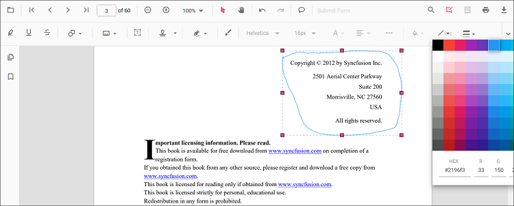

# Ink annotation in React PDF Viewer

The PDF Viewer control provides options to add, edit, and delete ink annotations.

## Add an ink annotation to the PDF document

Ink annotations can be added to the PDF document using the annotation toolbar.

* Use the **Edit Annotation** button in the PDF Viewer toolbar. The annotation toolbar appears below it.
* Select the **Draw Ink** button to enable ink annotation mode.
* Draw on any page of the PDF document to create an ink annotation.

  

The following example switches the viewer to ink annotation mode.





import * as ReactDOM from 'react-dom';
import * as React from 'react';
import { PdfViewerComponent, Toolbar, Magnification, Navigation, LinkAnnotation,
         BookmarkView, ThumbnailView, Print, TextSelection, TextSearch, Annotation,
         FormFields, FormDesigner, PageOrganizer, Inject } from '@syncfusion/ej2-react-pdfviewer';
let pdfviewer;

function App() {
  function inkMode() {
    var viewer = document.getElementById('container').ej2_instances[0];
    viewer.annotation.setAnnotationMode('Ink');
  }
  return (

    <button onClick={inkMode}>Draw Ink</button>
    

      <PdfViewerComponent
        ref={(scope) => { pdfviewer = scope; }}
        id="container"
        documentPath="https://cdn.syncfusion.com/content/pdf/pdf-succinctly.pdf"
        resourceUrl="https://cdn.syncfusion.com/ej2/31.2.2/dist/ej2-pdfviewer-lib"
        style={{ 'height': '640px' }}>

              <Inject services={[ Toolbar, Annotation, Magnification, Navigation, LinkAnnotation, BookmarkView, ThumbnailView,
                                  Print, TextSelection, TextSearch, FormFields, FormDesigner, PageOrganizer]} />
      </PdfViewerComponent>
    

  
);

}
const root = ReactDOM.createRoot(document.getElementById('sample'));
root.render(<App />);






import * as ReactDOM from 'react-dom';
import * as React from 'react';
import { PdfViewerComponent, Toolbar, Magnification, Navigation, LinkAnnotation,
         BookmarkView, ThumbnailView, Print, TextSelection, TextSearch, Annotation,
         FormFields, FormDesigner, PageOrganizer, Inject } from '@syncfusion/ej2-react-pdfviewer';
let pdfviewer;

function App() {
  function inkMode() {
    var viewer = document.getElementById('container').ej2_instances[0];
    viewer.annotation.setAnnotationMode('Ink');
  }
  return (

    <button onClick={inkMode}>Draw Ink</button>
    

      <PdfViewerComponent
        ref={(scope) => { pdfviewer = scope; }}
        id="container"
        documentPath="https://cdn.syncfusion.com/content/pdf/pdf-succinctly.pdf"
        serviceUrl="https://document.syncfusion.com/web-services/pdf-viewer/api/pdfviewer"
        style={{ 'height': '640px' }}>

              <Inject services={[ Toolbar, Annotation, Magnification, Navigation, LinkAnnotation, BookmarkView, ThumbnailView,
                                  Print, TextSelection, TextSearch, FormFields, FormDesigner, PageOrganizer]} />
      </PdfViewerComponent>
    

  
);

}
const root = ReactDOM.createRoot(document.getElementById('sample'));
root.render(<App />);





## Add an ink annotation programmatically to the PDF document

The PDF Viewer library allows adding an ink annotation programmatically using the [addAnnotation()](https://ej2.syncfusion.com/react/documentation/api/pdfviewer/annotation#annotation) method.

The following examples demonstrate how to add an ink annotation programmatically using `addAnnotation()`.





import * as ReactDOM from 'react-dom';
import * as React from 'react';
import './index.css';
import { PdfViewerComponent, Toolbar, Magnification, Navigation, LinkAnnotation, BookmarkView, ThumbnailView,
         Print, TextSelection, TextSearch, Annotation, FormFields, FormDesigner, PageOrganizer, Inject } from '@syncfusion/ej2-react-pdfviewer';
let pdfviewer;

function App() {

  function addAnnotation() {
    var viewer = document.getElementById('container').ej2_instances[0];
      viewer.annotation.addAnnotation("Ink", {
          offset: { x: 150, y: 100 },
          pageNumber: 1,
          width: 200,
          height: 60,
          path: '[{\"command\":\"M\",\"x\":244.83334350585938,\"y\":982.0000305175781},{\"command\":\"L\",\"x\":244.83334350585938,\"y\":982.0000305175781},{\"command\":\"L\",\"x\":250.83334350585938,\"y\":953.3333435058594},{\"command\":\"L\",\"x\":252.83334350585938,\"y\":946.0000305175781},{\"command\":\"L\",\"x\":254.16668701171875,\"y\":940.6667175292969},{\"command\":\"L\",\"x\":256.8333435058594,\"y\":931.3333435058594},{\"command\":\"L\",\"x\":257.5,\"y\":929.3333435058594},{\"command\":\"L\",\"x\":258.8333435058594,\"y\":926.6667175292969},{\"command\":\"L\",\"x\":259.5,\"y\":924.0000305175781},{\"command\":\"L\",\"x\":259.5,\"y\":922.6667175292969},{\"command\":\"L\",\"x\":258.8333435058594,\"y\":922.0000305175781},{\"command\":\"L\",\"x\":258.16668701171875,\"y\":922.0000305175781},{\"command\":\"L\",\"x\":256.8333435058594,\"y\":922.0000305175781},{\"command\":\"L\",\"x\":256.16668701171875,\"y\":922.6667175292969},{\"command\":\"L\",\"x\":254.83334350585938,\"y\":923.3333435058594},{\"command\":\"L\",\"x\":254.16668701171875,\"y\":923.3333435058594},{\"command\":\"L\",\"x\":253.5,\"y\":923.3333435058594},{\"command\":\"L\",\"x\":252.83334350585938,\"y\":925.3333435058594},{\"command\":\"L\",\"x\":252.83334350585938,\"y\":927.3333435058594},{\"command\":\"L\",\"x\":252.83334350585938,\"y\":936.0000305175781},{\"command\":\"L\",\"x\":253.5,\"y\":940.6667175292969},{\"command\":\"L\",\"x\":254.83334350585938,\"y\":944.6667175292969},{\"command\":\"L\",\"x\":260.16668701171875,\"y\":952.0000305175781},{\"command\":\"L\",\"x\":264.16668701171875,\"y\":954.0000305175781},{\"command\":\"L\",\"x\":274.16668701171875,\"y\":958.6667175292969},{\"command\":\"L\",\"x\":278.16668701171875,\"y\":960.0000305175781},{\"command\":\"L\",\"x\":281.5,\"y\":961.3333435058594},{\"command\":\"L\",\"x\":285.5,\"y\":964.6667175292969},{\"command\":\"L\",\"x\":286.8333740234375,\"y\":967.3333435058594},{\"command\":\"L\",\"x\":286.8333740234375,\"y\":970.0000305175781},{\"command\":\"L\",\"x\":282.8333740234375,\"y\":978.6667175292969},{\"command\":\"L\",\"x\":278.16668701171875,\"y\":983.3333435058594},{\"command\":\"L\",\"x\":266.16668701171875,\"y\":991.3333435058594},{\"command\":\"L\",\"x\":259.5,\"y\":993.3333435058594},{\"command\":\"L\",\"x\":252.16668701171875,\"y\":994.0000305175781},{\"command\":\"L\",\"x\":240.83334350585938,\"y\":991.3333435058594},{\"command\":\"L\",\"x\":236.16668701171875,\"y\":988.6667175292969},{\"command\":\"L\",\"x\":230.16668701171875,\"y\":982.6667175292969},{\"command\":\"L\",\"x\":228.83334350585938,\"y\":980.6667175292969},{\"command\":\"L\",\"x\":228.16668701171875,\"y\":978.6667175292969},{\"command\":\"L\",\"x\":228.83334350585938,\"y\":974.6667175292969},{\"command\":\"L\",\"x\":230.16668701171875,\"y\":973.3333435058594},{\"command\":\"L\",\"x\":236.16668701171875,\"y\":971.3333435058594},{\"command\":\"L\",\"x\":240.83334350585938,\"y\":971.3333435058594},{\"command\":\"L\",\"x\":246.16668701171875,\"y\":972.0000305175781},{\"command\":\"L\",\"x\":257.5,\"y\":974.6667175292969},{\"command\":\"L\",\"x\":262.8333435058594,\"y\":976.0000305175781},{\"command\":\"L\",\"x\":269.5,\"y\":977.3333435058594},{\"command\":\"L\",\"x\":276.16668701171875,\"y\":978.6667175292969},{\"command\":\"L\",\"x\":279.5,\"y\":978.0000305175781},{\"command\":\"L\",\"x\":285.5,\"y\":976.6667175292969},{\"command\":\"L\",\"x\":288.16668701171875,\"y\":974.6667175292969},{\"command\":\"L\",\"x\":292.8333740234375,\"y\":969.3333435058594},{\"command\":\"L\",\"x\":293.5,\"y\":966.6667175292969},{\"command\":\"L\",\"x\":294.16668701171875,\"y\":964.0000305175781},{\"command\":\"L\",\"x\":293.5,\"y\":960.0000305175781},{\"command\":\"L\",\"x\":293.5,\"y\":958.0000305175781},{\"command\":\"L\",\"x\":292.8333740234375,\"y\":956.6667175292969},{\"command\":\"L\",\"x\":291.5,\"y\":954.6667175292969},{\"command\":\"L\",\"x\":291.5,\"y\":954.0000305175781},{\"command\":\"L\",\"x\":291.5,\"y\":953.3333435058594},{\"command\":\"L\",\"x\":291.5,\"y\":954.0000305175781},{\"command\":\"L\",\"x\":292.16668701171875,\"y\":954.6667175292969},{\"command\":\"L\",\"x\":292.8333740234375,\"y\":956.0000305175781},{\"command\":\"L\",\"x\":294.16668701171875,\"y\":961.3333435058594},{\"command\":\"L\",\"x\":295.5,\"y\":964.6667175292969},{\"command\":\"L\",\"x\":297.5,\"y\":969.3333435058594},{\"command\":\"L\",\"x\":298.8333740234375,\"y\":970.6667175292969},{\"command\":\"L\",\"x\":301.5,\"y\":970.0000305175781},{\"command\":\"L\",\"x\":304.16668701171875,\"y\":968.6667175292969},{\"command\":\"L\",\"x\":305.5,\"y\":966.0000305175781},{\"command\":\"L\",\"x\":308.8333740234375,\"y\":960.0000305175781},{\"command\":\"L\",\"x\":310.16668701171875,\"y\":957.3333435058594},{\"command\":\"L\",\"x\":310.8333740234375,\"y\":956.0000305175781},{\"command\":\"L\",\"x\":310.8333740234375,\"y\":954.6667175292969},{\"command\":\"L\",\"x\":310.8333740234375,\"y\":954.0000305175781},{\"command\":\"L\",\"x\":311.5,\"y\":956.0000305175781},{\"command\":\"L\",\"x\":312.8333740234375,\"y\":959.3333435058594},{\"command\":\"L\",\"x\":316.16668701171875,\"y\":968.0000305175781},{\"command\":\"L\",\"x\":317.5,\"y\":972.6667175292969},{\"command\":\"L\",\"x\":318.16668701171875,\"y\":977.3333435058594},{\"command\":\"L\",\"x\":319.5,\"y\":983.3333435058594},{\"command\":\"L\",\"x\":319.5,\"y\":986.0000305175781},{\"command\":\"L\",\"x\":319.5,\"y\":988.0000305175781},{\"command\":\"L\",\"x\":318.8333740234375,\"y\":988.0000305175781},{\"command\":\"L\",\"x\":318.16668701171875,\"y\":988.6667175292969},{\"command\":\"L\",\"x\":316.16668701171875,\"y\":987.3333435058594},{\"command\":\"L\",\"x\":314.8333740234375,\"y\":985.3333435058594},{\"command\":\"L\",\"x\":314.16668701171875,\"y\":980.6667175292969},{\"command\":\"L\",\"x\":314.8333740234375,\"y\":974.6667175292969},{\"command\":\"L\",\"x\":316.16668701171875,\"y\":969.3333435058594},{\"command\":\"L\",\"x\":319.5,\"y\":960.6667175292969},{\"command\":\"L\",\"x\":320.16668701171875,\"y\":957.3333435058594},{\"command\":\"L\",\"x\":321.5,\"y\":955.3333435058594},{\"command\":\"L\",\"x\":322.16668701171875,\"y\":953.3333435058594},{\"command\":\"L\",\"x\":322.8333740234375,\"y\":952.6667175292969},{\"command\":\"L\",\"x\":324.16668701171875,\"y\":952.6667175292969},{\"command\":\"L\",\"x\":324.8333740234375,\"y\":953.3333435058594},{\"command\":\"L\",\"x\":326.8333740234375,\"y\":956.0000305175781},{\"command\":\"L\",\"x\":328.16668701171875,\"y\":958.0000305175781},{\"command\":\"L\",\"x\":328.8333740234375,\"y\":960.0000305175781},{\"command\":\"L\",\"x\":329.5,\"y\":962.0000305175781},{\"command\":\"L\",\"x\":330.16668701171875,\"y\":962.0000305175781},{\"command\":\"L\",\"x\":330.16668701171875,\"y\":962.6667175292969},{\"command\":\"L\",\"x\":330.16668701171875,\"y\":962.0000305175781},{\"command\":\"L\",\"x\":330.8333740234375,\"y\":960.0000305175781},{\"command\":\"L\",\"x\":331.5,\"y\":956.0000305175781},{\"command\":\"L\",\"x\":332.8333740234375,\"y\":952.0000305175781},{\"command\":\"L\",\"x\":333.5,\"y\":950.0000305175781},{\"command\":\"L\",\"x\":334.8333740234375,\"y\":948.6667175292969},{\"command\":\"L\",\"x\":335.5,\"y\":948.6667175292969},{\"command\":\"L\",\"x\":336.16668701171875,\"y\":948.6667175292969},{\"command\":\"L\",\"x\":337.5,\"y\":950.6667175292969},{\"command\":\"L\",\"x\":338.8333740234375,\"y\":952.0000305175781},{\"command\":\"L\",\"x\":340.8333740234375,\"y\":954.0000305175781},{\"command\":\"L\",\"x\":341.5,\"y\":954.0000305175781},{\"command\":\"L\",\"x\":342.8333740234375,\"y\":954.6667175292969},{\"command\":\"L\",\"x\":344.8333740234375,\"y\":954.0000305175781},{\"command\":\"L\",\"x\":346.8333740234375,\"y\":952.6667175292969},{\"command\":\"L\",\"x\":349.5,\"y\":949.3333435058594},{\"command\":\"L\",\"x\":350.8333740234375,\"y\":948.0000305175781},{\"command\":\"L\",\"x\":351.5,\"y\":946.6667175292969},{\"command\":\"L\",\"x\":352.8333740234375,\"y\":944.0000305175781},{\"command\":\"L\",\"x\":352.8333740234375,\"y\":943.3333435058594},{\"command\":\"L\",\"x\":354.16668701171875,\"y\":942.0000305175781},{\"command\":\"L\",\"x\":354.8333740234375,\"y\":942.0000305175781},{\"command\":\"L\",\"x\":354.8333740234375,\"y\":942.6667175292969},{\"command\":\"L\",\"x\":354.16668701171875,\"y\":943.3333435058594},{\"command\":\"L\",\"x\":354.16668701171875,\"y\":946.6667175292969},{\"command\":\"L\",\"x\":354.16668701171875,\"y\":950.0000305175781},{\"command\":\"L\",\"x\":355.5,\"y\":956.0000305175781},{\"command\":\"L\",\"x\":356.16668701171875,\"y\":957.3333435058594},{\"command\":\"L\",\"x\":358.16668701171875,\"y\":959.3333435058594},{\"command\":\"L\",\"x\":360.16668701171875,\"y\":958.0000305175781},{\"command\":\"L\",\"x\":364.16668701171875,\"y\":956.0000305175781},{\"command\":\"L\",\"x\":370.8333740234375,\"y\":948.6667175292969},{\"command\":\"L\",\"x\":373.5,\"y\":943.3333435058594},{\"command\":\"L\",\"x\":375.5,\"y\":937.3333435058594},{\"command\":\"L\",\"x\":376.16668701171875,\"y\":933.3333435058594},{\"command\":\"L\",\"x\":376.8333740234375,\"y\":931.3333435058594},{\"command\":\"L\",\"x\":376.8333740234375,\"y\":930.0000305175781},{\"command\":\"L\",\"x\":376.8333740234375,\"y\":929.3333435058594},{\"command\":\"L\",\"x\":376.16668701171875,\"y\":930.0000305175781},{\"command\":\"L\",\"x\":375.5,\"y\":932.0000305175781},{\"command\":\"L\",\"x\":375.5,\"y\":937.3333435058594},{\"command\":\"L\",\"x\":374.8333740234375,\"y\":953.3333435058594},{\"command\":\"L\",\"x\":374.8333740234375,\"y\":960.6667175292969},{\"command\":\"L\",\"x\":375.5,\"y\":966.0000305175781},{\"command\":\"L\",\"x\":377.5,\"y\":974.6667175292969},{\"command\":\"L\",\"x\":378.16668701171875,\"y\":977.3333435058594},{\"command\":\"L\",\"x\":380.8333740234375,\"y\":981.3333435058594},{\"command\":\"L\",\"x\":382.16668701171875,\"y\":982.6667175292969},{\"command\":\"L\",\"x\":383.5,\"y\":982.6667175292969},{\"command\":\"L\",\"x\":387.5,\"y\":982.6667175292969},{\"command\":\"L\",\"x\":389.5,\"y\":980.6667175292969},{\"command\":\"L\",\"x\":392.16668701171875,\"y\":976.6667175292969},{\"command\":\"L\",\"x\":392.8333740234375,\"y\":973.3333435058594},{\"command\":\"L\",\"x\":392.16668701171875,\"y\":970.0000305175781},{\"command\":\"L\",\"x\":388.8333740234375,\"y\":965.3333435058594},{\"command\":\"L\",\"x\":385.5,\"y\":964.0000305175781},{\"command\":\"L\",\"x\":382.8333740234375,\"y\":964.0000305175781},{\"command\":\"L\",\"x\":377.5,\"y\":964.0000305175781},{\"command\":\"L\",\"x\":375.5,\"y\":964.6667175292969},{\"command\":\"L\",\"x\":373.5,\"y\":965.3333435058594},{\"command\":\"L\",\"x\":374.8333740234375,\"y\":963.3333435058594},{\"command\":\"L\",\"x\":376.8333740234375,\"y\":961.3333435058594},{\"command\":\"L\",\"x\":382.16668701171875,\"y\":956.0000305175781},{\"command\":\"L\",\"x\":384.16668701171875,\"y\":953.3333435058594},{\"command\":\"L\",\"x\":387.5,\"y\":950.6667175292969},{\"command\":\"L\",\"x\":388.16668701171875,\"y\":952.0000305175781},{\"command\":\"L\",\"x\":388.16668701171875,\"y\":952.6667175292969},{\"command\":\"L\",\"x\":388.8333740234375,\"y\":954.0000305175781},{\"command\":\"L\",\"x\":388.8333740234375,\"y\":954.6667175292969},{\"command\":\"L\",\"x\":389.5,\"y\":959.3333435058594},{\"command\":\"L\",\"x\":389.5,\"y\":960.6667175292969},{\"command\":\"L\",\"x\":390.16668701171875,\"y\":961.3333435058594},{\"command\":\"L\",\"x\":390.8333740234375,\"y\":960.6667175292969},{\"command\":\"L\",\"x\":393.5,\"y\":958.0000305175781},{\"command\":\"L\",\"x\":396.8333740234375,\"y\":954.0000305175781},{\"command\":\"L\",\"x\":398.16668701171875,\"y\":952.0000305175781},{\"command\":\"L\",\"x\":400.16668701171875,\"y\":949.3333435058594},{\"command\":\"L\",\"x\":400.16668701171875,\"y\":948.6667175292969},{\"command\":\"L\",\"x\":400.8333740234375,\"y\":948.0000305175781},{\"command\":\"L\",\"x\":400.8333740234375,\"y\":947.3333435058594},{\"command\":\"L\",\"x\":401.5,\"y\":948.0000305175781},{\"command\":\"L\",\"x\":402.16668701171875,\"y\":949.3333435058594},{\"command\":\"L\",\"x\":403.5,\"y\":950.6667175292969},{\"command\":\"L\",\"x\":404.8333740234375,\"y\":953.3333435058594},{\"command\":\"L\",\"x\":406.16668701171875,\"y\":954.0000305175781},{\"command\":\"L\",\"x\":407.5,\"y\":954.0000305175781},{\"command\":\"L\",\"x\":410.16668701171875,\"y\":952.0000305175781},{\"command\":\"L\",\"x\":412.16668701171875,\"y\":949.3333435058594},{\"command\":\"L\",\"x\":414.16668701171875,\"y\":944.6667175292969},{\"command\":\"L\",\"x\":414.16668701171875,\"y\":942.0000305175781},{\"command\":\"L\",\"x\":414.16668701171875,\"y\":940.6667175292969},{\"command\":\"L\",\"x\":414.16668701171875,\"y\":938.6667175292969},{\"command\":\"L\",\"x\":414.16668701171875,\"y\":938.0000305175781},{\"command\":\"L\",\"x\":415.5,\"y\":939.3333435058594},{\"command\":\"L\",\"x\":418.8333740234375,\"y\":942.6667175292969},{\"command\":\"L\",\"x\":420.16668701171875,\"y\":945.3333435058594},{\"command\":\"L\",\"x\":421.5,\"y\":946.6667175292969},{\"command\":\"L\",\"x\":422.8333740234375,\"y\":950.0000305175781},{\"command\":\"L\",\"x\":423.5,\"y\":950.6667175292969},{\"command\":\"L\",\"x\":423.5,\"y\":953.3333435058594},{\"command\":\"L\",\"x\":422.8333740234375,\"y\":954.0000305175781},{\"command\":\"L\",\"x\":421.5,\"y\":955.3333435058594},{\"command\":\"L\",\"x\":421.5,\"y\":956.0000305175781},{\"command\":\"L\",\"x\":422.16668701171875,\"y\":954.6667175292969},{\"command\":\"L\",\"x\":422.8333740234375,\"y\":954.0000305175781},{\"command\":\"L\",\"x\":424.8333740234375,\"y\":950.6667175292969},{\"command\":\"L\",\"x\":425.5,\"y\":948.6667175292969},{\"command\":\"L\",\"x\":428.16668701171875,\"y\":945.3333435058594},{\"command\":\"L\",\"x\":428.8333740234375,\"y\":943.3333435058594},{\"command\":\"L\",\"x\":428.8333740234375,\"y\":942.6667175292969},{\"command\":\"L\",\"x\":428.8333740234375,\"y\":943.3333435058594},{\"command\":\"L\",\"x\":428.8333740234375,\"y\":945.3333435058594},{\"command\":\"L\",\"x\":428.8333740234375,\"y\":948.0000305175781},{\"command\":\"L\",\"x\":428.8333740234375,\"y\":950.0000305175781},{\"command\":\"L\",\"x\":429.5,\"y\":953.3333435058594},{\"command\":\"L\",\"x\":430.16668701171875,\"y\":953.3333435058594},{\"command\":\"L\",\"x\":432.8333740234375,\"y\":952.6667175292969},{\"command\":\"L\",\"x\":434.8333740234375,\"y\":950.6667175292969},{\"command\":\"L\",\"x\":437.5,\"y\":948.6667175292969},{\"command\":\"L\",\"x\":440.16668701171875,\"y\":944.6667175292969},{\"command\":\"L\",\"x\":441.5,\"y\":942.6667175292969},{\"command\":\"L\",\"x\":442.16668701171875,\"y\":942.0000305175781},{\"command\":\"L\",\"x\":442.8333740234375,\"y\":941.3333435058594},{\"command\":\"L\",\"x\":442.8333740234375,\"y\":942.0000305175781},{\"command\":\"L\",\"x\":442.8333740234375,\"y\":943.3333435058594},{\"command\":\"L\",\"x\":442.8333740234375,\"y\":944.6667175292969},{\"command\":\"L\",\"x\":442.8333740234375,\"y\":946.0000305175781},{\"command\":\"L\",\"x\":443.5,\"y\":949.3333435058594},{\"command\":\"L\",\"x\":444.16668701171875,\"y\":950.6667175292969},{\"command\":\"L\",\"x\":445.5,\"y\":950.6667175292969},{\"command\":\"L\",\"x\":447.5,\"y\":950.6667175292969},{\"command\":\"L\",\"x\":450.16668701171875,\"y\":948.6667175292969},{\"command\":\"L\",\"x\":452.16668701171875,\"y\":945.3333435058594},{\"command\":\"L\",\"x\":453.5,\"y\":942.6667175292969},{\"command\":\"L\",\"x\":452.8333740234375,\"y\":938.6667175292969},{\"command\":\"L\",\"x\":452.16668701171875,\"y\":937.3333435058594},{\"command\":\"L\",\"x\":450.8333740234375,\"y\":936.6667175292969},{\"command\":\"L\",\"x\":448.8333740234375,\"y\":936.0000305175781},{\"command\":\"L\",\"x\":447.5,\"y\":936.6667175292969},{\"command\":\"L\",\"x\":446.16668701171875,\"y\":937.3333435058594},{\"command\":\"L\",\"x\":445.5,\"y\":938.6667175292969},{\"command\":\"L\",\"x\":445.5,\"y\":939.3333435058594},{\"command\":\"L\",\"x\":446.16668701171875,\"y\":939.3333435058594},{\"command\":\"L\",\"x\":446.8333740234375,\"y\":939.3333435058594},{\"command\":\"L\",\"x\":452.16668701171875,\"y\":937.3333435058594},{\"command\":\"L\",\"x\":454.8333740234375,\"y\":936.6667175292969},{\"command\":\"L\",\"x\":456.8333740234375,\"y\":936.0000305175781},{\"command\":\"L\",\"x\":459.5,\"y\":936.6667175292969},{\"command\":\"L\",\"x\":460.8333740234375,\"y\":937.3333435058594},{\"command\":\"L\",\"x\":461.5,\"y\":938.6667175292969},{\"command\":\"L\",\"x\":462.16668701171875,\"y\":942.0000305175781},{\"command\":\"L\",\"x\":462.16668701171875,\"y\":942.6667175292969},{\"command\":\"L\",\"x\":462.16668701171875,\"y\":944.0000305175781},{\"command\":\"L\",\"x\":462.16668701171875,\"y\":943.3333435058594},{\"command\":\"L\",\"x\":462.16668701171875,\"y\":942.6667175292969},{\"command\":\"L\",\"x\":462.16668701171875,\"y\":941.3333435058594},{\"command\":\"L\",\"x\":462.8333740234375,\"y\":938.6667175292969},{\"command\":\"L\",\"x\":464.16668701171875,\"y\":935.3333435058594},{\"command\":\"L\",\"x\":465.5,\"y\":933.3333435058594},{\"command\":\"L\",\"x\":466.16668701171875,\"y\":932.6667175292969},{\"command\":\"L\",\"x\":467.5,\"y\":933.3333435058594},{\"command\":\"L\",\"x\":469.5,\"y\":935.3333435058594},{\"command\":\"L\",\"x\":470.16668701171875,\"y\":938.6667175292969},{\"command\":\"L\",\"x\":472.8333740234375,\"y\":943.3333435058594},{\"command\":\"L\",\"x\":472.8333740234375,\"y\":944.6667175292969},{\"command\":\"L\",\"x\":474.16668701171875,\"y\":944.6667175292969},{\"command\":\"L\",\"x\":475.5,\"y\":944.0000305175781},{\"command\":\"L\",\"x\":478.16668701171875,\"y\":941.3333435058594},{\"command\":\"L\",\"x\":481.5,\"y\":937.3333435058594},{\"command\":\"L\",\"x\":484.8333740234375,\"y\":934.0000305175781},{\"command\":\"L\",\"x\":488.8333740234375,\"y\":929.3333435058594},{\"command\":\"L\",\"x\":489.5,\"y\":928.0000305175781}]'
      });
  }
  return (

    <button onClick={addAnnotation}>Add Annotation programatically</button>
    

      <PdfViewerComponent
        ref={(scope) => { pdfviewer = scope; }}
        id="container"
        documentPath="https://cdn.syncfusion.com/content/pdf/pdf-succinctly.pdf"
        resourceUrl="https://cdn.syncfusion.com/ej2/31.2.2/dist/ej2-pdfviewer-lib"
        style={{ 'height': '640px' }}>

              <Inject services={[ Toolbar, Annotation, Magnification, Navigation, LinkAnnotation, BookmarkView, ThumbnailView,
                                  Print, TextSelection, TextSearch, FormFields, FormDesigner, PageOrganizer]} />
      </PdfViewerComponent>
    

  
);
}
const root = ReactDOM.createRoot(document.getElementById('sample'));
root.render(<App />);






import * as ReactDOM from 'react-dom';
import * as React from 'react';
import './index.css';
import { PdfViewerComponent, Toolbar, Magnification, Navigation, LinkAnnotation, BookmarkView, ThumbnailView,
         Print, TextSelection, TextSearch, Annotation, FormFields, FormDesigner, PageOrganizer, Inject } from '@syncfusion/ej2-react-pdfviewer';
let pdfviewer;

function App() {

  function addAnnotation() {
    var viewer = document.getElementById('container').ej2_instances[0];
      viewer.annotation.addAnnotation("Ink", {
          offset: { x: 150, y: 100 },
          pageNumber: 1,
          width: 200,
          height: 60,
          path: '[{\"command\":\"M\",\"x\":244.83334350585938,\"y\":982.0000305175781},{\"command\":\"L\",\"x\":244.83334350585938,\"y\":982.0000305175781},{\"command\":\"L\",\"x\":250.83334350585938,\"y\":953.3333435058594},{\"command\":\"L\",\"x\":252.83334350585938,\"y\":946.0000305175781},{\"command\":\"L\",\"x\":254.16668701171875,\"y\":940.6667175292969},{\"command\":\"L\",\"x\":256.8333435058594,\"y\":931.3333435058594},{\"command\":\"L\",\"x\":257.5,\"y\":929.3333435058594},{\"command\":\"L\",\"x\":258.8333435058594,\"y\":926.6667175292969},{\"command\":\"L\",\"x\":259.5,\"y\":924.0000305175781},{\"command\":\"L\",\"x\":259.5,\"y\":922.6667175292969},{\"command\":\"L\",\"x\":258.8333435058594,\"y\":922.0000305175781},{\"command\":\"L\",\"x\":258.16668701171875,\"y\":922.0000305175781},{\"command\":\"L\",\"x\":256.8333435058594,\"y\":922.0000305175781},{\"command\":\"L\",\"x\":256.16668701171875,\"y\":922.6667175292969},{\"command\":\"L\",\"x\":254.83334350585938,\"y\":923.3333435058594},{\"command\":\"L\",\"x\":254.16668701171875,\"y\":923.3333435058594},{\"command\":\"L\",\"x\":253.5,\"y\":923.3333435058594},{\"command\":\"L\",\"x\":252.83334350585938,\"y\":925.3333435058594},{\"command\":\"L\",\"x\":252.83334350585938,\"y\":927.3333435058594},{\"command\":\"L\",\"x\":252.83334350585938,\"y\":936.0000305175781},{\"command\":\"L\",\"x\":253.5,\"y\":940.6667175292969},{\"command\":\"L\",\"x\":254.83334350585938,\"y\":944.6667175292969},{\"command\":\"L\",\"x\":260.16668701171875,\"y\":952.0000305175781},{\"command\":\"L\",\"x\":264.16668701171875,\"y\":954.0000305175781},{\"command\":\"L\",\"x\":274.16668701171875,\"y\":958.6667175292969},{\"command\":\"L\",\"x\":278.16668701171875,\"y\":960.0000305175781},{\"command\":\"L\",\"x\":281.5,\"y\":961.3333435058594},{\"command\":\"L\",\"x\":285.5,\"y\":964.6667175292969},{\"command\":\"L\",\"x\":286.8333740234375,\"y\":967.3333435058594},{\"command\":\"L\",\"x\":286.8333740234375,\"y\":970.0000305175781},{\"command\":\"L\",\"x\":282.8333740234375,\"y\":978.6667175292969},{\"command\":\"L\",\"x\":278.16668701171875,\"y\":983.3333435058594},{\"command\":\"L\",\"x\":266.16668701171875,\"y\":991.3333435058594},{\"command\":\"L\",\"x\":259.5,\"y\":993.3333435058594},{\"command\":\"L\",\"x\":252.16668701171875,\"y\":994.0000305175781},{\"command\":\"L\",\"x\":240.83334350585938,\"y\":991.3333435058594},{\"command\":\"L\",\"x\":236.16668701171875,\"y\":988.6667175292969},{\"command\":\"L\",\"x\":230.16668701171875,\"y\":982.6667175292969},{\"command\":\"L\",\"x\":228.83334350585938,\"y\":980.6667175292969},{\"command\":\"L\",\"x\":228.16668701171875,\"y\":978.6667175292969},{\"command\":\"L\",\"x\":228.83334350585938,\"y\":974.6667175292969},{\"command\":\"L\",\"x\":230.16668701171875,\"y\":973.3333435058594},{\"command\":\"L\",\"x\":236.16668701171875,\"y\":971.3333435058594},{\"command\":\"L\",\"x\":240.83334350585938,\"y\":971.3333435058594},{\"command\":\"L\",\"x\":246.16668701171875,\"y\":972.0000305175781},{\"command\":\"L\",\"x\":257.5,\"y\":974.6667175292969},{\"command\":\"L\",\"x\":262.8333435058594,\"y\":976.0000305175781},{\"command\":\"L\",\"x\":269.5,\"y\":977.3333435058594},{\"command\":\"L\",\"x\":276.16668701171875,\"y\":978.6667175292969},{\"command\":\"L\",\"x\":279.5,\"y\":978.0000305175781},{\"command\":\"L\",\"x\":285.5,\"y\":976.6667175292969},{\"command\":\"L\",\"x\":288.16668701171875,\"y\":974.6667175292969},{\"command\":\"L\",\"x\":292.8333740234375,\"y\":969.3333435058594},{\"command\":\"L\",\"x\":293.5,\"y\":966.6667175292969},{\"command\":\"L\",\"x\":294.16668701171875,\"y\":964.0000305175781},{\"command\":\"L\",\"x\":293.5,\"y\":960.0000305175781},{\"command\":\"L\",\"x\":293.5,\"y\":958.0000305175781},{\"command\":\"L\",\"x\":292.8333740234375,\"y\":956.6667175292969},{\"command\":\"L\",\"x\":291.5,\"y\":954.6667175292969},{\"command\":\"L\",\"x\":291.5,\"y\":954.0000305175781},{\"command\":\"L\",\"x\":291.5,\"y\":953.3333435058594},{\"command\":\"L\",\"x\":291.5,\"y\":954.0000305175781},{\"command\":\"L\",\"x\":292.16668701171875,\"y\":954.6667175292969},{\"command\":\"L\",\"x\":292.8333740234375,\"y\":956.0000305175781},{\"command\":\"L\",\"x\":294.16668701171875,\"y\":961.3333435058594},{\"command\":\"L\",\"x\":295.5,\"y\":964.6667175292969},{\"command\":\"L\",\"x\":297.5,\"y\":969.3333435058594},{\"command\":\"L\",\"x\":298.8333740234375,\"y\":970.6667175292969},{\"command\":\"L\",\"x\":301.5,\"y\":970.0000305175781},{\"command\":\"L\",\"x\":304.16668701171875,\"y\":968.6667175292969},{\"command\":\"L\",\"x\":305.5,\"y\":966.0000305175781},{\"command\":\"L\",\"x\":308.8333740234375,\"y\":960.0000305175781},{\"command\":\"L\",\"x\":310.16668701171875,\"y\":957.3333435058594},{\"command\":\"L\",\"x\":310.8333740234375,\"y\":956.0000305175781},{\"command\":\"L\",\"x\":310.8333740234375,\"y\":954.6667175292969},{\"command\":\"L\",\"x\":310.8333740234375,\"y\":954.0000305175781},{\"command\":\"L\",\"x\":311.5,\"y\":956.0000305175781},{\"command\":\"L\",\"x\":312.8333740234375,\"y\":959.3333435058594},{\"command\":\"L\",\"x\":316.16668701171875,\"y\":968.0000305175781},{\"command\":\"L\",\"x\":317.5,\"y\":972.6667175292969},{\"command\":\"L\",\"x\":318.16668701171875,\"y\":977.3333435058594},{\"command\":\"L\",\"x\":319.5,\"y\":983.3333435058594},{\"command\":\"L\",\"x\":319.5,\"y\":986.0000305175781},{\"command\":\"L\",\"x\":319.5,\"y\":988.0000305175781},{\"command\":\"L\",\"x\":318.8333740234375,\"y\":988.0000305175781},{\"command\":\"L\",\"x\":318.16668701171875,\"y\":988.6667175292969},{\"command\":\"L\",\"x\":316.16668701171875,\"y\":987.3333435058594},{\"command\":\"L\",\"x\":314.8333740234375,\"y\":985.3333435058594},{\"command\":\"L\",\"x\":314.16668701171875,\"y\":980.6667175292969},{\"command\":\"L\",\"x\":314.8333740234375,\"y\":974.6667175292969},{\"command\":\"L\",\"x\":316.16668701171875,\"y\":969.3333435058594},{\"command\":\"L\",\"x\":319.5,\"y\":960.6667175292969},{\"command\":\"L\",\"x\":320.16668701171875,\"y\":957.3333435058594},{\"command\":\"L\",\"x\":321.5,\"y\":955.3333435058594},{\"command\":\"L\",\"x\":322.16668701171875,\"y\":953.3333435058594},{\"command\":\"L\",\"x\":322.8333740234375,\"y\":952.6667175292969},{\"command\":\"L\",\"x\":324.16668701171875,\"y\":952.6667175292969},{\"command\":\"L\",\"x\":324.8333740234375,\"y\":953.3333435058594},{\"command\":\"L\",\"x\":326.8333740234375,\"y\":956.0000305175781},{\"command\":\"L\",\"x\":328.16668701171875,\"y\":958.0000305175781},{\"command\":\"L\",\"x\":328.8333740234375,\"y\":960.0000305175781},{\"command\":\"L\",\"x\":329.5,\"y\":962.0000305175781},{\"command\":\"L\",\"x\":330.16668701171875,\"y\":962.0000305175781},{\"command\":\"L\",\"x\":330.16668701171875,\"y\":962.6667175292969},{\"command\":\"L\",\"x\":330.16668701171875,\"y\":962.0000305175781},{\"command\":\"L\",\"x\":330.8333740234375,\"y\":960.0000305175781},{\"command\":\"L\",\"x\":331.5,\"y\":956.0000305175781},{\"command\":\"L\",\"x\":332.8333740234375,\"y\":952.0000305175781},{\"command\":\"L\",\"x\":333.5,\"y\":950.0000305175781},{\"command\":\"L\",\"x\":334.8333740234375,\"y\":948.6667175292969},{\"command\":\"L\",\"x\":335.5,\"y\":948.6667175292969},{\"command\":\"L\",\"x\":336.16668701171875,\"y\":948.6667175292969},{\"command\":\"L\",\"x\":337.5,\"y\":950.6667175292969},{\"command\":\"L\",\"x\":338.8333740234375,\"y\":952.0000305175781},{\"command\":\"L\",\"x\":340.8333740234375,\"y\":954.0000305175781},{\"command\":\"L\",\"x\":341.5,\"y\":954.0000305175781},{\"command\":\"L\",\"x\":342.8333740234375,\"y\":954.6667175292969},{\"command\":\"L\",\"x\":344.8333740234375,\"y\":954.0000305175781},{\"command\":\"L\",\"x\":346.8333740234375,\"y\":952.6667175292969},{\"command\":\"L\",\"x\":349.5,\"y\":949.3333435058594},{\"command\":\"L\",\"x\":350.8333740234375,\"y\":948.0000305175781},{\"command\":\"L\",\"x\":351.5,\"y\":946.6667175292969},{\"command\":\"L\",\"x\":352.8333740234375,\"y\":944.0000305175781},{\"command\":\"L\",\"x\":352.8333740234375,\"y\":943.3333435058594},{\"command\":\"L\",\"x\":354.16668701171875,\"y\":942.0000305175781},{\"command\":\"L\",\"x\":354.8333740234375,\"y\":942.0000305175781},{\"command\":\"L\",\"x\":354.8333740234375,\"y\":942.6667175292969},{\"command\":\"L\",\"x\":354.16668701171875,\"y\":943.3333435058594},{\"command\":\"L\",\"x\":354.16668701171875,\"y\":946.6667175292969},{\"command\":\"L\",\"x\":354.16668701171875,\"y\":950.0000305175781},{\"command\":\"L\",\"x\":355.5,\"y\":956.0000305175781},{\"command\":\"L\",\"x\":356.16668701171875,\"y\":957.3333435058594},{\"command\":\"L\",\"x\":358.16668701171875,\"y\":959.3333435058594},{\"command\":\"L\",\"x\":360.16668701171875,\"y\":958.0000305175781},{\"command\":\"L\",\"x\":364.16668701171875,\"y\":956.0000305175781},{\"command\":\"L\",\"x\":370.8333740234375,\"y\":948.6667175292969},{\"command\":\"L\",\"x\":373.5,\"y\":943.3333435058594},{\"command\":\"L\",\"x\":375.5,\"y\":937.3333435058594},{\"command\":\"L\",\"x\":376.16668701171875,\"y\":933.3333435058594},{\"command\":\"L\",\"x\":376.8333740234375,\"y\":931.3333435058594},{\"command\":\"L\",\"x\":376.8333740234375,\"y\":930.0000305175781},{\"command\":\"L\",\"x\":376.8333740234375,\"y\":929.3333435058594},{\"command\":\"L\",\"x\":376.16668701171875,\"y\":930.0000305175781},{\"command\":\"L\",\"x\":375.5,\"y\":932.0000305175781},{\"command\":\"L\",\"x\":375.5,\"y\":937.3333435058594},{\"command\":\"L\",\"x\":374.8333740234375,\"y\":953.3333435058594},{\"command\":\"L\",\"x\":374.8333740234375,\"y\":960.6667175292969},{\"command\":\"L\",\"x\":375.5,\"y\":966.0000305175781},{\"command\":\"L\",\"x\":377.5,\"y\":974.6667175292969},{\"command\":\"L\",\"x\":378.16668701171875,\"y\":977.3333435058594},{\"command\":\"L\",\"x\":380.8333740234375,\"y\":981.3333435058594},{\"command\":\"L\",\"x\":382.16668701171875,\"y\":982.6667175292969},{\"command\":\"L\",\"x\":383.5,\"y\":982.6667175292969},{\"command\":\"L\",\"x\":387.5,\"y\":982.6667175292969},{\"command\":\"L\",\"x\":389.5,\"y\":980.6667175292969},{\"command\":\"L\",\"x\":392.16668701171875,\"y\":976.6667175292969},{\"command\":\"L\",\"x\":392.8333740234375,\"y\":973.3333435058594},{\"command\":\"L\",\"x\":392.16668701171875,\"y\":970.0000305175781},{\"command\":\"L\",\"x\":388.8333740234375,\"y\":965.3333435058594},{\"command\":\"L\",\"x\":385.5,\"y\":964.0000305175781},{\"command\":\"L\",\"x\":382.8333740234375,\"y\":964.0000305175781},{\"command\":\"L\",\"x\":377.5,\"y\":964.0000305175781},{\"command\":\"L\",\"x\":375.5,\"y\":964.6667175292969},{\"command\":\"L\",\"x\":373.5,\"y\":965.3333435058594},{\"command\":\"L\",\"x\":374.8333740234375,\"y\":963.3333435058594},{\"command\":\"L\",\"x\":376.8333740234375,\"y\":961.3333435058594},{\"command\":\"L\",\"x\":382.16668701171875,\"y\":956.0000305175781},{\"command\":\"L\",\"x\":384.16668701171875,\"y\":953.3333435058594},{\"command\":\"L\",\"x\":387.5,\"y\":950.6667175292969},{\"command\":\"L\",\"x\":388.16668701171875,\"y\":952.0000305175781},{\"command\":\"L\",\"x\":388.16668701171875,\"y\":952.6667175292969},{\"command\":\"L\",\"x\":388.8333740234375,\"y\":954.0000305175781},{\"command\":\"L\",\"x\":388.8333740234375,\"y\":954.6667175292969},{\"command\":\"L\",\"x\":389.5,\"y\":959.3333435058594},{\"command\":\"L\",\"x\":389.5,\"y\":960.6667175292969},{\"command\":\"L\",\"x\":390.16668701171875,\"y\":961.3333435058594},{\"command\":\"L\",\"x\":390.8333740234375,\"y\":960.6667175292969},{\"command\":\"L\",\"x\":393.5,\"y\":958.0000305175781},{\"command\":\"L\",\"x\":396.8333740234375,\"y\":954.0000305175781},{\"command\":\"L\",\"x\":398.16668701171875,\"y\":952.0000305175781},{\"command\":\"L\",\"x\":400.16668701171875,\"y\":949.3333435058594},{\"command\":\"L\",\"x\":400.16668701171875,\"y\":948.6667175292969},{\"command\":\"L\",\"x\":400.8333740234375,\"y\":948.0000305175781},{\"command\":\"L\",\"x\":400.8333740234375,\"y\":947.3333435058594},{\"command\":\"L\",\"x\":401.5,\"y\":948.0000305175781},{\"command\":\"L\",\"x\":402.16668701171875,\"y\":949.3333435058594},{\"command\":\"L\",\"x\":403.5,\"y\":950.6667175292969},{\"command\":\"L\",\"x\":404.8333740234375,\"y\":953.3333435058594},{\"command\":\"L\",\"x\":406.16668701171875,\"y\":954.0000305175781},{\"command\":\"L\",\"x\":407.5,\"y\":954.0000305175781},{\"command\":\"L\",\"x\":410.16668701171875,\"y\":952.0000305175781},{\"command\":\"L\",\"x\":412.16668701171875,\"y\":949.3333435058594},{\"command\":\"L\",\"x\":414.16668701171875,\"y\":944.6667175292969},{\"command\":\"L\",\"x\":414.16668701171875,\"y\":942.0000305175781},{\"command\":\"L\",\"x\":414.16668701171875,\"y\":940.6667175292969},{\"command\":\"L\",\"x\":414.16668701171875,\"y\":938.6667175292969},{\"command\":\"L\",\"x\":414.16668701171875,\"y\":938.0000305175781},{\"command\":\"L\",\"x\":415.5,\"y\":939.3333435058594},{\"command\":\"L\",\"x\":418.8333740234375,\"y\":942.6667175292969},{\"command\":\"L\",\"x\":420.16668701171875,\"y\":945.3333435058594},{\"command\":\"L\",\"x\":421.5,\"y\":946.6667175292969},{\"command\":\"L\",\"x\":422.8333740234375,\"y\":950.0000305175781},{\"command\":\"L\",\"x\":423.5,\"y\":950.6667175292969},{\"command\":\"L\",\"x\":423.5,\"y\":953.3333435058594},{\"command\":\"L\",\"x\":422.8333740234375,\"y\":954.0000305175781},{\"command\":\"L\",\"x\":421.5,\"y\":955.3333435058594},{\"command\":\"L\",\"x\":421.5,\"y\":956.0000305175781},{\"command\":\"L\",\"x\":422.16668701171875,\"y\":954.6667175292969},{\"command\":\"L\",\"x\":422.8333740234375,\"y\":954.0000305175781},{\"command\":\"L\",\"x\":424.8333740234375,\"y\":950.6667175292969},{\"command\":\"L\",\"x\":425.5,\"y\":948.6667175292969},{\"command\":\"L\",\"x\":428.16668701171875,\"y\":945.3333435058594},{\"command\":\"L\",\"x\":428.8333740234375,\"y\":943.3333435058594},{\"command\":\"L\",\"x\":428.8333740234375,\"y\":942.6667175292969},{\"command\":\"L\",\"x\":428.8333740234375,\"y\":943.3333435058594},{\"command\":\"L\",\"x\":428.8333740234375,\"y\":945.3333435058594},{\"command\":\"L\",\"x\":428.8333740234375,\"y\":948.0000305175781},{\"command\":\"L\",\"x\":428.8333740234375,\"y\":950.0000305175781},{\"command\":\"L\",\"x\":429.5,\"y\":953.3333435058594},{\"command\":\"L\",\"x\":430.16668701171875,\"y\":953.3333435058594},{\"command\":\"L\",\"x\":432.8333740234375,\"y\":952.6667175292969},{\"command\":\"L\",\"x\":434.8333740234375,\"y\":950.6667175292969},{\"command\":\"L\",\"x\":437.5,\"y\":948.6667175292969},{\"command\":\"L\",\"x\":440.16668701171875,\"y\":944.6667175292969},{\"command\":\"L\",\"x\":441.5,\"y\":942.6667175292969},{\"command\":\"L\",\"x\":442.16668701171875,\"y\":942.0000305175781},{\"command\":\"L\",\"x\":442.8333740234375,\"y\":941.3333435058594},{\"command\":\"L\",\"x\":442.8333740234375,\"y\":942.0000305175781},{\"command\":\"L\",\"x\":442.8333740234375,\"y\":943.3333435058594},{\"command\":\"L\",\"x\":442.8333740234375,\"y\":944.6667175292969},{\"command\":\"L\",\"x\":442.8333740234375,\"y\":946.0000305175781},{\"command\":\"L\",\"x\":443.5,\"y\":949.3333435058594},{\"command\":\"L\",\"x\":444.16668701171875,\"y\":950.6667175292969},{\"command\":\"L\",\"x\":445.5,\"y\":950.6667175292969},{\"command\":\"L\",\"x\":447.5,\"y\":950.6667175292969},{\"command\":\"L\",\"x\":450.16668701171875,\"y\":948.6667175292969},{\"command\":\"L\",\"x\":452.16668701171875,\"y\":945.3333435058594},{\"command\":\"L\",\"x\":453.5,\"y\":942.6667175292969},{\"command\":\"L\",\"x\":452.8333740234375,\"y\":938.6667175292969},{\"command\":\"L\",\"x\":452.16668701171875,\"y\":937.3333435058594},{\"command\":\"L\",\"x\":450.8333740234375,\"y\":936.6667175292969},{\"command\":\"L\",\"x\":448.8333740234375,\"y\":936.0000305175781},{\"command\":\"L\",\"x\":447.5,\"y\":936.6667175292969},{\"command\":\"L\",\"x\":446.16668701171875,\"y\":937.3333435058594},{\"command\":\"L\",\"x\":445.5,\"y\":938.6667175292969},{\"command\":\"L\",\"x\":445.5,\"y\":939.3333435058594},{\"command\":\"L\",\"x\":446.16668701171875,\"y\":939.3333435058594},{\"command\":\"L\",\"x\":446.8333740234375,\"y\":939.3333435058594},{\"command\":\"L\",\"x\":452.16668701171875,\"y\":937.3333435058594},{\"command\":\"L\",\"x\":454.8333740234375,\"y\":936.6667175292969},{\"command\":\"L\",\"x\":456.8333740234375,\"y\":936.0000305175781},{\"command\":\"L\",\"x\":459.5,\"y\":936.6667175292969},{\"command\":\"L\",\"x\":460.8333740234375,\"y\":937.3333435058594},{\"command\":\"L\",\"x\":461.5,\"y\":938.6667175292969},{\"command\":\"L\",\"x\":462.16668701171875,\"y\":942.0000305175781},{\"command\":\"L\",\"x\":462.16668701171875,\"y\":942.6667175292969},{\"command\":\"L\",\"x\":462.16668701171875,\"y\":944.0000305175781},{\"command\":\"L\",\"x\":462.16668701171875,\"y\":943.3333435058594},{\"command\":\"L\",\"x\":462.16668701171875,\"y\":942.6667175292969},{\"command\":\"L\",\"x\":462.16668701171875,\"y\":941.3333435058594},{\"command\":\"L\",\"x\":462.8333740234375,\"y\":938.6667175292969},{\"command\":\"L\",\"x\":464.16668701171875,\"y\":935.3333435058594},{\"command\":\"L\",\"x\":465.5,\"y\":933.3333435058594},{\"command\":\"L\",\"x\":466.16668701171875,\"y\":932.6667175292969},{\"command\":\"L\",\"x\":467.5,\"y\":933.3333435058594},{\"command\":\"L\",\"x\":469.5,\"y\":935.3333435058594},{\"command\":\"L\",\"x\":470.16668701171875,\"y\":938.6667175292969},{\"command\":\"L\",\"x\":472.8333740234375,\"y\":943.3333435058594},{\"command\":\"L\",\"x\":472.8333740234375,\"y\":944.6667175292969},{\"command\":\"L\",\"x\":474.16668701171875,\"y\":944.6667175292969},{\"command\":\"L\",\"x\":475.5,\"y\":944.0000305175781},{\"command\":\"L\",\"x\":478.16668701171875,\"y\":941.3333435058594},{\"command\":\"L\",\"x\":481.5,\"y\":937.3333435058594},{\"command\":\"L\",\"x\":484.8333740234375,\"y\":934.0000305175781},{\"command\":\"L\",\"x\":488.8333740234375,\"y\":929.3333435058594},{\"command\":\"L\",\"x\":489.5,\"y\":928.0000305175781}]'
      });
  }
  return (

    <button onClick={addAnnotation}>Add Annotation programatically</button>
    

      <PdfViewerComponent
        ref={(scope) => { pdfviewer = scope; }}
        id="container"
        documentPath="https://cdn.syncfusion.com/content/pdf/pdf-succinctly.pdf"
        serviceUrl="https://document.syncfusion.com/web-services/pdf-viewer/api/pdfviewer"
        style={{ 'height': '640px' }}>

              <Inject services={[ Toolbar, Annotation, Magnification, Navigation, LinkAnnotation, BookmarkView, ThumbnailView,
                                  Print, TextSelection, TextSearch, FormFields, FormDesigner, PageOrganizer]} />
      </PdfViewerComponent>
    

  
);
}
const root = ReactDOM.createRoot(document.getElementById('sample'));
root.render(<App />);





## Edit an existing ink annotation programmatically

Use the `editAnnotation()` method to modify an existing ink annotation programmatically.

The following example demonstrates `editAnnotation()`.





import * as ReactDOM from 'react-dom';
import * as React from 'react';
import './index.css';
import { PdfViewerComponent, Toolbar, Magnification, Navigation, LinkAnnotation, BookmarkView, ThumbnailView,
         Print, TextSelection, TextSearch, Annotation, FormFields, FormDesigner, PageOrganizer, Inject } from '@syncfusion/ej2-react-pdfviewer';
let pdfviewer;

function App() {

  function editAnnotation() {
    var viewer = document.getElementById('container').ej2_instances[0];
    for (let i = 0; i < viewer.annotationCollection.length; i++)
    {
        if (viewer.annotationCollection[i].shapeAnnotationType === "Ink") {
          var width = viewer.annotationCollection[i].bounds.width;
          var height = viewer.annotationCollection[i].bounds.height;
          viewer.annotationCollection[i].bounds = {x : 100, y: 100, width: width, height: height };
          viewer.annotationCollection[i].strokeColor = "#0000FF";
          viewer.annotationCollection[i].thickness = 2 ;
          viewer.annotationCollection[i].annotationSelectorSettings.resizerShape = "Circle"
          viewer.annotation.editAnnotation(viewer.annotationCollection[i]);
        }
    }
  }
  return (

    <button onClick={editAnnotation}>Edit Annotation programatically</button>
    

      <PdfViewerComponent
        ref={(scope) => { pdfviewer = scope; }}
        id="container"
        documentPath="https://cdn.syncfusion.com/content/pdf/pdf-succinctly.pdf"
        resourceUrl="https://cdn.syncfusion.com/ej2/31.2.2/dist/ej2-pdfviewer-lib"
        style={{ 'height': '640px' }}>

              <Inject services={[ Toolbar, Annotation, Magnification, Navigation, LinkAnnotation, BookmarkView, ThumbnailView,
                                  Print, TextSelection, TextSearch, FormFields, FormDesigner, PageOrganizer]} />
      </PdfViewerComponent>
    

  
);
}
const root = ReactDOM.createRoot(document.getElementById('sample'));
root.render(<App />);






import * as ReactDOM from 'react-dom';
import * as React from 'react';
import './index.css';
import { PdfViewerComponent, Toolbar, Magnification, Navigation, LinkAnnotation, BookmarkView, ThumbnailView,
         Print, TextSelection, TextSearch, Annotation, FormFields, FormDesigner, PageOrganizer, Inject } from '@syncfusion/ej2-react-pdfviewer';
let pdfviewer;

function App() {

  function editAnnotation() {
    var viewer = document.getElementById('container').ej2_instances[0];
    for (let i = 0; i < viewer.annotationCollection.length; i++)
    {
        if (viewer.annotationCollection[i].shapeAnnotationType === "Ink") {
          var width = viewer.annotationCollection[i].bounds.width;
          var height = viewer.annotationCollection[i].bounds.height;
          viewer.annotationCollection[i].bounds = {x : 100, y: 100, width: width, height: height };
          viewer.annotationCollection[i].strokeColor = "#0000FF";
          viewer.annotationCollection[i].thickness = 2 ;
          viewer.annotationCollection[i].annotationSelectorSettings.resizerShape = "Circle"
          viewer.annotation.editAnnotation(viewer.annotationCollection[i]);
        }
    }
  }
  return (

    <button onClick={editAnnotation}>Edit Annotation programatically</button>
    

      <PdfViewerComponent
        ref={(scope) => { pdfviewer = scope; }}
        id="container"
        documentPath="https://cdn.syncfusion.com/content/pdf/pdf-succinctly.pdf"
        serviceUrl="https://document.syncfusion.com/web-services/pdf-viewer/api/pdfviewer"
        style={{ 'height': '640px' }}>

              <Inject services={[ Toolbar, Annotation, Magnification, Navigation, LinkAnnotation, BookmarkView, ThumbnailView,
                                  Print, TextSelection, TextSearch, FormFields, FormDesigner, PageOrganizer]} />
      </PdfViewerComponent>
    

  
);
}
const root = ReactDOM.createRoot(document.getElementById('sample'));
root.render(<App />);





## Edit the properties of ink annotations

Stroke color, thickness, and opacity can be edited using the Edit Stroke Color, Edit Thickness, and Edit Opacity tools in the annotation toolbar.

### Edit stroke color

Change the stroke color using the color palette in the Edit Stroke Color tool.

### Edit thickness

Change the stroke thickness using the range slider in the Edit Thickness tool.

### Edit opacity

Change the opacity using the range slider in the Edit Opacity tool.

## Set default properties during the control initialization

Default properties for ink annotations can be set before creating the control by using the `inkAnnotationSettings` property on `PdfViewerComponent` (example below).

Supported settings include `author`, `strokeColor`, `thickness`, and `opacity`. Set these values on initialization so the viewer uses them when creating new ink annotations.





import * as ReactDOM from 'react-dom';
import * as React from 'react';
import { PdfViewerComponent, Toolbar, Magnification, Navigation, LinkAnnotation,
         BookmarkView, ThumbnailView, Print, TextSelection, TextSearch, Annotation,
         FormFields, FormDesigner, PageOrganizer, Inject } from '@syncfusion/ej2-react-pdfviewer';
let pdfviewer;

function App() {
  return (

    

      <PdfViewerComponent ref={(scope) => { pdfviewer = scope; }}
        id="container"
        documentPath="https://cdn.syncfusion.com/content/pdf/pdf-succinctly.pdf"
        resourceUrl="https://cdn.syncfusion.com/ej2/31.2.2/dist/ej2-pdfviewer-lib"
        inkAnnotationSettings={{author: 'Syncfusion', strokeColor: 'green', thickness: 3, opacity: 0.6}}
        style={{ 'height': '640px' }}>
              <Inject services={[ Toolbar, Annotation, Magnification, Navigation, LinkAnnotation, BookmarkView, ThumbnailView,
                                  Print, TextSelection, TextSearch, FormFields, FormDesigner, PageOrganizer]} />
      </PdfViewerComponent>
    

  
);
}
const root = ReactDOM.createRoot(document.getElementById('sample'));
root.render(<App />);






import * as ReactDOM from 'react-dom';
import * as React from 'react';
import { PdfViewerComponent, Toolbar, Magnification, Navigation, LinkAnnotation,
         BookmarkView, ThumbnailView, Print, TextSelection, TextSearch, Annotation,
         FormFields, FormDesigner, PageOrganizer, Inject } from '@syncfusion/ej2-react-pdfviewer';
let pdfviewer;

function App() {
  return (

    

      <PdfViewerComponent ref={(scope) => { pdfviewer = scope; }}
        id="container"
        documentPath="https://cdn.syncfusion.com/content/pdf/pdf-succinctly.pdf"
        serviceUrl="https://document.syncfusion.com/web-services/pdf-viewer/api/pdfviewer"
        inkAnnotationSettings={{author: 'Syncfusion', strokeColor: 'green', thickness: 3, opacity: 0.6}}
        style={{ 'height': '640px' }}>

              <Inject services={[ Toolbar, Annotation, Magnification, Navigation, LinkAnnotation, BookmarkView, ThumbnailView,
                                  Print, TextSelection, TextSearch, FormFields, FormDesigner, PageOrganizer]} />
      </PdfViewerComponent>
    

  
);
}
const root = ReactDOM.createRoot(document.getElementById('sample'));
root.render(<App />);



