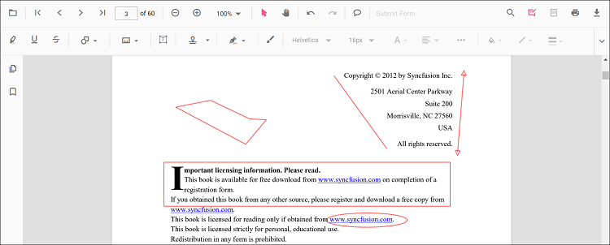
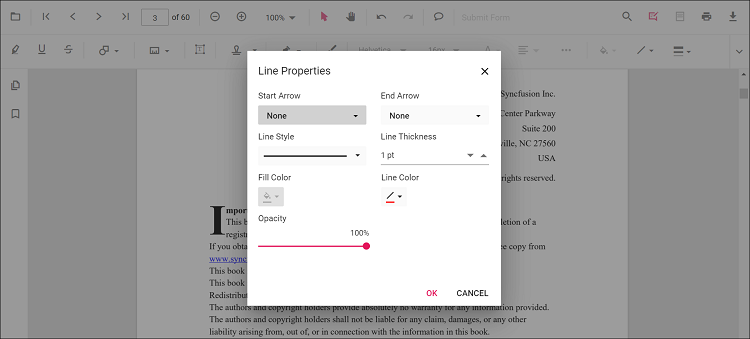

# Shape annotation in React PDF Viewer

The PDF Viewer control provides options to add, edit, and delete shape annotations. The supported shape annotation types are:

* Line
* Arrow
* Rectangle
* Circle
* Polygon



## Adding a shape annotation to the PDF document

Shape annotations can be added to the PDF document using the annotation toolbar.

* Click the **Edit Annotation** button in the PDF Viewer toolbar. A toolbar appears below it.
* Click the **Shape Annotation** drop-down button. The pop-up lists available shape annotation types.
* Select a shape type to enable its annotation mode.
* Draw the shape on the pages of the PDF document.

N> When in pan mode and a shape annotation tool is selected, the PDF Viewer switches to text select mode automatically to ensure a smooth interaction experience.


Refer to the following code sample to switch to the circle annotation mode.





import * as ReactDOM from 'react-dom';
import * as React from 'react';
import { PdfViewerComponent, Toolbar, Magnification, Navigation, LinkAnnotation,
         BookmarkView, ThumbnailView, Print, TextSelection, TextSearch, Annotation,
         FormFields, FormDesigner, PageOrganizer, Inject } from '@syncfusion/ej2-react-pdfviewer';
let pdfviewer;

function App() {
  function circleMode() {
    var viewer = document.getElementById('container').ej2_instances[0];
    viewer.annotation.setAnnotationMode('Circle');
  }
  return (<div>
    <button onClick={circleMode}>Circle</button>
    <div className='control-section'>
      <PdfViewerComponent ref={(scope) => { pdfviewer = scope; }}
        id="container"
        documentPath="https://cdn.syncfusion.com/content/pdf/pdf-succinctly.pdf"
        resourceUrl="https://cdn.syncfusion.com/ej2/31.2.2/dist/ej2-pdfviewer-lib"
        style={{ 'height': '640px' }}>

              <Inject services={[ Toolbar, Annotation, Magnification, Navigation, LinkAnnotation, BookmarkView, ThumbnailView,
                                  Print, TextSelection, TextSearch, FormFields, FormDesigner, PageOrganizer]} />
      </PdfViewerComponent>
    </div>
  </div>);
}
const root = ReactDOM.createRoot(document.getElementById('sample'));
root.render(<App />);






import * as ReactDOM from 'react-dom';
import * as React from 'react';
import { PdfViewerComponent, Toolbar, Magnification, Navigation, LinkAnnotation,
         BookmarkView, ThumbnailView, Print, TextSelection, TextSearch, Annotation,
         FormFields, FormDesigner, PageOrganizer, Inject } from '@syncfusion/ej2-react-pdfviewer';
let pdfviewer;

function App() {
  function circleMode() {
    var viewer = document.getElementById('container').ej2_instances[0];
    viewer.annotation.setAnnotationMode('Circle');
  }
  return (<div>
    <button onClick={circleMode}>Circle</button>
    <div className='control-section'>
      <PdfViewerComponent ref={(scope) => { pdfviewer = scope; }}
        id="container"
        documentPath="https://cdn.syncfusion.com/content/pdf/pdf-succinctly.pdf"
        serviceUrl="https://document.syncfusion.com/web-services/pdf-viewer/api/pdfviewer"
        style={{ 'height': '640px' }}>

              <Inject services={[ Toolbar, Annotation, Magnification, Navigation, LinkAnnotation, BookmarkView, ThumbnailView,
                                  Print, TextSelection, TextSearch, FormFields, FormDesigner, PageOrganizer]} />
      </PdfViewerComponent>
    </div>
  </div>);
}
const root = ReactDOM.createRoot(document.getElementById('sample'));
root.render(<App />);





## Add a shape annotation to the PDF document programmatically

The PDF Viewer library allows adding a shape annotation programmatically using the [addAnnotation()](https://ej2.syncfusion.com/react/documentation/api/pdfviewer/annotation/#annotation) method.

Here is an example showing how to add shape annotations programmatically using addAnnotation():





import * as ReactDOM from 'react-dom';
import * as React from 'react';
import './index.css';
import { PdfViewerComponent, Toolbar, Magnification, Navigation, LinkAnnotation, BookmarkView, ThumbnailView,
         Print, TextSelection, TextSearch, Annotation, FormFields, FormDesigner, PageOrganizer, Inject } from '@syncfusion/ej2-react-pdfviewer';
let pdfviewer;

function App() {

  function addLineAnnotation() {
    var viewer = document.getElementById('container').ej2_instances[0];
    viewer.annotation.addAnnotation("Line", {
      offset: { x: 200, y: 230 },
      pageNumber: 1,
      vertexPoints: [{ x: 200, y: 230 }, { x: 350, y: 230 }]
    });
  }
  function addArrowAnnotation() {
    var viewer = document.getElementById('container').ej2_instances[0];
    viewer.annotation.addAnnotation("Arrow", {
      offset: { x: 200, y: 370 },
      pageNumber: 1,
      vertexPoints: [{ x: 200, y: 370 }, { x: 350, y: 370 }]
    });
  }
  function addRectangleAnnotation() {
    var viewer = document.getElementById('container').ej2_instances[0];
    viewer.annotation.addAnnotation("Rectangle", {
      offset: { x: 200, y: 500 },
      pageNumber: 1,
      vertexPoints: [{ x: 200, y: 500 }, { x: 288, y: 499 }, { x: 289, y: 553 }, { x: 200, y: 500 }]
    });
  }
  function addCircleAnnotation() {
    var viewer = document.getElementById('container').ej2_instances[0];
    viewer.annotation.addAnnotation("Circle", {
      offset: { x: 200, y: 630 },
      pageNumber: 1,
      width: 90,
      height: 90
    });
  }
  function addPolygonAnnotation() {
    var viewer = document.getElementById('container').ej2_instances[0];
    viewer.annotation.addAnnotation("Polygon", {
      offset: { x: 200, y: 800 },
      pageNumber: 1,
      vertexPoints: [{ x: 200, y: 800 }, { x: 242, y: 771 }, { x: 289, y: 799 }, { x: 278, y: 842 }, { x: 211, y: 842 }, { x: 200, y: 800 }]
    });
  }
  return (<div>
    <button onClick={addLineAnnotation}>add Line Annotation programatically</button>
    <button onClick={addArrowAnnotation}>add Arrow Annotation programatically</button>
    <button onClick={addRectangleAnnotation}>add Rectangle Annotation programatically</button>
    <button onClick={addCircleAnnotation}>add Circle Annotation programatically</button>
    <button onClick={addPolygonAnnotation}>add Polygon Annotation programatically</button>
    <div className='control-section'>
      <PdfViewerComponent
        ref={(scope) => { pdfviewer = scope; }}
        id="container"
        documentPath="https://cdn.syncfusion.com/content/pdf/pdf-succinctly.pdf"
        resourceUrl="https://cdn.syncfusion.com/ej2/31.2.2/dist/ej2-pdfviewer-lib"
        style={{ 'height': '640px' }}>

              <Inject services={[ Toolbar, Annotation, Magnification, Navigation, LinkAnnotation, BookmarkView, ThumbnailView,
                                  Print, TextSelection, TextSearch, FormFields, FormDesigner, PageOrganizer]} />
      </PdfViewerComponent>
    </div>
  </div>);
}
const root = ReactDOM.createRoot(document.getElementById('sample'));
root.render(<App />);






import * as ReactDOM from 'react-dom';
import * as React from 'react';
import './index.css';
import { PdfViewerComponent, Toolbar, Magnification, Navigation, LinkAnnotation, BookmarkView, ThumbnailView,
         Print, TextSelection, TextSearch, Annotation, FormFields, FormDesigner, PageOrganizer, Inject } from '@syncfusion/ej2-react-pdfviewer';
let pdfviewer;

function App() {

  function addLineAnnotation() {
    var viewer = document.getElementById('container').ej2_instances[0];
    viewer.annotation.addAnnotation("Line", {
      offset: { x: 200, y: 230 },
      pageNumber: 1,
      vertexPoints: [{ x: 200, y: 230 }, { x: 350, y: 230 }]
    });
  }
  function addArrowAnnotation() {
    var viewer = document.getElementById('container').ej2_instances[0];
    viewer.annotation.addAnnotation("Arrow", {
      offset: { x: 200, y: 370 },
      pageNumber: 1,
      vertexPoints: [{ x: 200, y: 370 }, { x: 350, y: 370 }]
    });
  }
  function addRectangleAnnotation() {
    var viewer = document.getElementById('container').ej2_instances[0];
    viewer.annotation.addAnnotation("Rectangle", {
      offset: { x: 200, y: 500 },
      pageNumber: 1,
      vertexPoints: [{ x: 200, y: 500 }, { x: 288, y: 499 }, { x: 289, y: 553 }, { x: 200, y: 500 }]
    });
  }
  function addCircleAnnotation() {
    var viewer = document.getElementById('container').ej2_instances[0];
    viewer.annotation.addAnnotation("Circle", {
      offset: { x: 200, y: 630 },
      pageNumber: 1,
      width: 90,
      height: 90
    });
  }
  function addPolygonAnnotation() {
    var viewer = document.getElementById('container').ej2_instances[0];
    viewer.annotation.addAnnotation("Polygon", {
      offset: { x: 200, y: 800 },
      pageNumber: 1,
      vertexPoints: [{ x: 200, y: 800 }, { x: 242, y: 771 }, { x: 289, y: 799 }, { x: 278, y: 842 }, { x: 211, y: 842 }, { x: 200, y: 800 }]
    });
  }
  return (<div>
    <button onClick={addLineAnnotation}>add Line Annotation programatically</button>
    <button onClick={addArrowAnnotation}>add Arrow Annotation programatically</button>
    <button onClick={addRectangleAnnotation}>add Rectangle Annotation programatically</button>
    <button onClick={addCircleAnnotation}>add Circle Annotation programatically</button>
    <button onClick={addPolygonAnnotation}>add Polygon Annotation programatically</button>
    <div className='control-section'>
      <PdfViewerComponent
        ref={(scope) => { pdfviewer = scope; }}
        id="container"
        documentPath="https://cdn.syncfusion.com/content/pdf/pdf-succinctly.pdf"
        serviceUrl="https://document.syncfusion.com/web-services/pdf-viewer/api/pdfviewer"
        style={{ 'height': '640px' }}>

              <Inject services={[ Toolbar, Annotation, Magnification, Navigation, LinkAnnotation, BookmarkView, ThumbnailView,
                                  Print, TextSelection, TextSearch, FormFields, FormDesigner, PageOrganizer]} />
      </PdfViewerComponent>
    </div>
  </div>);
}
const root = ReactDOM.createRoot(document.getElementById('sample'));
root.render(<App />);




## Edit an existing shape annotation programmatically

To modify an existing shape annotation programmatically, use the editAnnotation() method.

Here is an example of using editAnnotation():





import * as ReactDOM from 'react-dom';
import * as React from 'react';
import './index.css';
import { PdfViewerComponent, Toolbar, Magnification, Navigation, LinkAnnotation, BookmarkView, ThumbnailView,
         Print, TextSelection, TextSearch, Annotation, FormFields, FormDesigner, PageOrganizer, Inject } from '@syncfusion/ej2-react-pdfviewer';
let pdfviewer;

function App() {

  function editLineAnnotation() {
    var viewer = document.getElementById('container').ej2_instances[0];
    for (let i = 0; i < viewer.annotationCollection.length; i++) {
      if (viewer.annotationCollection[i].subject === "Line") {
        viewer.annotationCollection[i].strokeColor = "#0000FF";
        viewer.annotationCollection[i].thickness = 2 ;
        viewer.annotationCollection[i].annotationSelectorSettings.resizerShape = "Circle"
        viewer.annotation.editAnnotation(viewer.annotationCollection[i]);
      }
    }
  }
  function editArrowAnnotation() {
    var viewer = document.getElementById('container').ej2_instances[0];
    for (let i = 0; i < viewer.annotationCollection.length; i++) {
      if (viewer.annotationCollection[i].subject === "Arrow") {
        viewer.annotationCollection[i].strokeColor = "#0000FF";
        viewer.annotationCollection[i].thickness = 2 ;
        viewer.annotationCollection[i].fillColor = "#FFFF00";
        viewer.annotationCollection[i].annotationSelectorSettings.resizerShape = "Circle"
        viewer.annotation.editAnnotation(viewer.annotationCollection[i]);
      }
    }
  }
  function editRectangleAnnotation() {
    var viewer = document.getElementById('container').ej2_instances[0];
    for (let i = 0; i < viewer.annotationCollection.length; i++) {
      if (viewer.annotationCollection[i].subject === "Rectangle") {
        viewer.annotationCollection[i].strokeColor = "#0000FF";
        viewer.annotationCollection[i].thickness = 2 ;
        viewer.annotationCollection[i].fillColor = "#FFFF00";
        viewer.annotationCollection[i].annotationSelectorSettings.resizerShape = "Circle"
        viewer.annotation.editAnnotation(viewer.annotationCollection[i]);
      }
    }
  }
  function editCircleAnnotation() {
    var viewer = document.getElementById('container').ej2_instances[0];
    for (let i = 0; i < viewer.annotationCollection.length; i++) {
      if (viewer.annotationCollection[i].subject === "Circle") {
        viewer.annotationCollection[i].strokeColor = "#0000FF";
        viewer.annotationCollection[i].thickness = 2 ;
        viewer.annotationCollection[i].fillColor = "#FFFF00";
        viewer.annotationCollection[i].annotationSelectorSettings.resizerShape = "Circle"
        viewer.annotation.editAnnotation(viewer.annotationCollection[i]);
      }
    }
  }
  function editPolygonAnnotation() {
    var viewer = document.getElementById('container').ej2_instances[0];
    for (let i = 0; i < viewer.annotationCollection.length; i++) {
      if (viewer.annotationCollection[i].subject === "Polygon") {
        viewer.annotationCollection[i].strokeColor = "#0000FF";
        viewer.annotationCollection[i].thickness = 2 ;
        viewer.annotationCollection[i].fillColor = "#FFFF00";
        viewer.annotationCollection[i].annotationSelectorSettings.resizerShape = "Circle"
        viewer.annotation.editAnnotation(viewer.annotationCollection[i]);
      }
    }
  }
  return (<div>
    <button onClick={editLineAnnotation}>edit Line Annotation programatically</button>
    <button onClick={editArrowAnnotation}>edit Arrow Annotation programatically</button>
    <button onClick={editRectangleAnnotation}>edit Rectangle Annotation programatically</button>
    <button onClick={editCircleAnnotation}>edit Circle Annotation programatically</button>
    <button onClick={editPolygonAnnotation}>edit Polygon Annotation programatically</button>
    <div className='control-section'>
      <PdfViewerComponent
        ref={(scope) => { pdfviewer = scope; }}
        id="container"
        documentPath="https://cdn.syncfusion.com/content/pdf/pdf-succinctly.pdf"
        resourceUrl="https://cdn.syncfusion.com/ej2/31.2.2/dist/ej2-pdfviewer-lib"
        style={{ 'height': '640px' }}>

              <Inject services={[ Toolbar, Annotation, Magnification, Navigation, LinkAnnotation, BookmarkView, ThumbnailView,
                                  Print, TextSelection, TextSearch, FormFields, FormDesigner, PageOrganizer]} />
      </PdfViewerComponent>
    </div>
  </div>);
}
const root = ReactDOM.createRoot(document.getElementById('sample'));
root.render(<App />);






import * as ReactDOM from 'react-dom';
import * as React from 'react';
import './index.css';
import { PdfViewerComponent, Toolbar, Magnification, Navigation, LinkAnnotation, BookmarkView, ThumbnailView,
         Print, TextSelection, TextSearch, Annotation, FormFields, FormDesigner, PageOrganizer, Inject } from '@syncfusion/ej2-react-pdfviewer';
let pdfviewer;

function App() {

  function editLineAnnotation() {
    var viewer = document.getElementById('container').ej2_instances[0];
    for (let i = 0; i < viewer.annotationCollection.length; i++) {
      if (viewer.annotationCollection[i].subject === "Line") {
        viewer.annotationCollection[i].strokeColor = "#0000FF";
        viewer.annotationCollection[i].thickness = 2 ;
        viewer.annotationCollection[i].annotationSelectorSettings.resizerShape = "Circle"
        viewer.annotation.editAnnotation(viewer.annotationCollection[i]);
      }
    }
  }
  function editArrowAnnotation() {
    var viewer = document.getElementById('container').ej2_instances[0];
    for (let i = 0; i < viewer.annotationCollection.length; i++) {
      if (viewer.annotationCollection[i].subject === "Arrow") {
        viewer.annotationCollection[i].strokeColor = "#0000FF";
        viewer.annotationCollection[i].thickness = 2 ;
        viewer.annotationCollection[i].fillColor = "#FFFF00";
        viewer.annotationCollection[i].annotationSelectorSettings.resizerShape = "Circle"
        viewer.annotation.editAnnotation(viewer.annotationCollection[i]);
      }
    }
  }
  function editRectangleAnnotation() {
    var viewer = document.getElementById('container').ej2_instances[0];
    for (let i = 0; i < viewer.annotationCollection.length; i++) {
      if (viewer.annotationCollection[i].subject === "Rectangle") {
        viewer.annotationCollection[i].strokeColor = "#0000FF";
        viewer.annotationCollection[i].thickness = 2 ;
        viewer.annotationCollection[i].fillColor = "#FFFF00";
        viewer.annotationCollection[i].annotationSelectorSettings.resizerShape = "Circle"
        viewer.annotation.editAnnotation(viewer.annotationCollection[i]);
      }
    }
  }
  function editCircleAnnotation() {
    var viewer = document.getElementById('container').ej2_instances[0];
    for (let i = 0; i < viewer.annotationCollection.length; i++) {
      if (viewer.annotationCollection[i].subject === "Circle") {
        viewer.annotationCollection[i].strokeColor = "#0000FF";
        viewer.annotationCollection[i].thickness = 2 ;
        viewer.annotationCollection[i].fillColor = "#FFFF00";
        viewer.annotationCollection[i].annotationSelectorSettings.resizerShape = "Circle"
        viewer.annotation.editAnnotation(viewer.annotationCollection[i]);
      }
    }
  }
  function editPolygonAnnotation() {
    var viewer = document.getElementById('container').ej2_instances[0];
    for (let i = 0; i < viewer.annotationCollection.length; i++) {
      if (viewer.annotationCollection[i].subject === "Polygon") {
        viewer.annotationCollection[i].strokeColor = "#0000FF";
        viewer.annotationCollection[i].thickness = 2 ;
        viewer.annotationCollection[i].fillColor = "#FFFF00";
        viewer.annotationCollection[i].annotationSelectorSettings.resizerShape = "Circle"
        viewer.annotation.editAnnotation(viewer.annotationCollection[i]);
      }
    }
  }
  return (<div>
    <button onClick={editLineAnnotation}>edit Line Annotation programatically</button>
    <button onClick={editArrowAnnotation}>edit Arrow Annotation programatically</button>
    <button onClick={editRectangleAnnotation}>edit Rectangle Annotation programatically</button>
    <button onClick={editCircleAnnotation}>edit Circle Annotation programatically</button>
    <button onClick={editPolygonAnnotation}>edit Polygon Annotation programatically</button>
    <div className='control-section'>
      <PdfViewerComponent
        ref={(scope) => { pdfviewer = scope; }}
        id="container"
        documentPath="https://cdn.syncfusion.com/content/pdf/pdf-succinctly.pdf"
        serviceUrl="https://document.syncfusion.com/web-services/pdf-viewer/api/pdfviewer"
        style={{ 'height': '640px' }}>

              <Inject services={[ Toolbar, Annotation, Magnification, Navigation, LinkAnnotation, BookmarkView, ThumbnailView,
                                  Print, TextSelection, TextSearch, FormFields, FormDesigner, PageOrganizer]} />
      </PdfViewerComponent>
    </div>
  </div>);
}
const root = ReactDOM.createRoot(document.getElementById('sample'));
root.render(<App />);





## Editing the properties of the shape annotation

The fill color, stroke color, thickness, and opacity of shape annotations can be edited using the Edit Color, Edit Stroke Color, Edit Thickness, and Edit Opacity tools in the annotation toolbar.

### Editing fill color

The fill color of the annotation can be edited using the color palette provided in the Edit Color tool.


### Editing stroke color

The stroke color of the annotation can be edited using the color palette provided in the Edit Stroke Color tool.


### Editing thickness

The thickness of the border of the annotation can be edited using the range slider provided in the Edit Thickness tool.


### Editing opacity

The opacity of the annotation can be edited using the range slider provided in the Edit Opacity tool.


### Editing the line properties

Line and arrow annotations have additional options in the Line Properties window. Open it by right-clicking a line or arrow annotation and selecting Properties from the context menu.

Refer to the following code sample to set the default annotation settings.



### Edit annotation programmatically

We can edit the annotations programmatically using the **editAnnotation()** method.

Here is an example of how you can use this method to modify an annotation:
```
<button onclick="editAnnotation()()">Edit Annotation</button>

<script>

//Edit Annotation
function editAnnotation(){
var pdfviewer = document.getElementById('container').ej2_instances[0];
  pdfviewer.annotationModule.selectAnnotation(pdfviewer.annotationCollection[0].annotationId);
  pdfviewer.annotationCollection[0].opacity ="0.5";
  pdfviewer.annotation.editAnnotation(pdfviewer.annotationCollection[0]);
}
</script>
```
### Delete annotation programmatically

We can delete a specific annotation using the **deleteAnnotationById()** method. This method is used to delete a specific annotation using its id.

Here is an example of how you can use this method to delete an annotation:

```
<button onclick="deleteAnnotationbyId()">Delete Annotation by ID</button>

<script>
  //Delete Annotation by id.
  function deleteAnnotationbyId() {
    var viewer = document.getElementById('container').ej2_instances[0];
    viewer.annotationModule.deleteAnnotationById(viewer.annotationCollection[0].annotationId);
  }
</script>
```

## Set default properties during the control initialization

Default properties for shape annotations can be set before creating the control using LineSettings, ArrowSettings, RectangleSettings, CircleSettings, and PolygonSettings.





import * as ReactDOM from 'react-dom';
import * as React from 'react';
import { PdfViewerComponent, Toolbar, Magnification, Navigation, LinkAnnotation,
         BookmarkView, ThumbnailView, Print, TextSelection, TextSearch, Annotation,
         FormFields, FormDesigner, PageOrganizer, Inject } from '@syncfusion/ej2-react-pdfviewer';
let pdfviewer;

function App() {
  return (<div>
    <div className='control-section'>
      <PdfViewerComponent  ref={(scope) => { pdfviewer = scope; }}
        id="container"
        documentPath="https://cdn.syncfusion.com/content/pdf/pdf-succinctly.pdf"
        resourceUrl="https://cdn.syncfusion.com/ej2/31.2.2/dist/ej2-pdfviewer-lib"
        lineSettings={{fillColor: 'blue', opacity: 0.6, strokeColor: 'green'}}
        arrowSettings={{fillColor: 'green', opacity: 0.6, strokeColor: 'blue'}}
        rectangleSettings={{fillColor: 'yellow', opacity: 0.6, strokeColor: 'orange'}}
        circleSettings={{fillColor: 'orange', opacity: 0.6, strokeColor: 'pink'}}
        polygonSettings={{fillColor: 'pink', opacity: 0.6, strokeColor: 'yellow'}}
        style={{ 'height': '640px' }}>

              <Inject services={[ Toolbar, Annotation, Magnification, Navigation, LinkAnnotation, BookmarkView, ThumbnailView,
                                  Print, TextSelection, TextSearch, FormFields, FormDesigner, PageOrganizer]} />
      </PdfViewerComponent>
    </div>
  </div>);
}
const root = ReactDOM.createRoot(document.getElementById('sample'));
root.render(<App />);






import * as ReactDOM from 'react-dom';
import * as React from 'react';
import { PdfViewerComponent, Toolbar, Magnification, Navigation, LinkAnnotation,
         BookmarkView, ThumbnailView, Print, TextSelection, TextSearch, Annotation,
         FormFields, FormDesigner, PageOrganizer, Inject } from '@syncfusion/ej2-react-pdfviewer';
let pdfviewer;

function App() {
  return (<div>
    <div className='control-section'>
      <PdfViewerComponent  ref={(scope) => { pdfviewer = scope; }}
        id="container"
        documentPath="https://cdn.syncfusion.com/content/pdf/pdf-succinctly.pdf"
        serviceUrl="https://document.syncfusion.com/web-services/pdf-viewer/api/pdfviewer"
        lineSettings={{fillColor: 'blue', opacity: 0.6, strokeColor: 'green'}}
        arrowSettings={{fillColor: 'green', opacity: 0.6, strokeColor: 'blue'}}
        rectangleSettings={{fillColor: 'yellow', opacity: 0.6, strokeColor: 'orange'}}
        circleSettings={{fillColor: 'orange', opacity: 0.6, strokeColor: 'pink'}}
        polygonSettings={{fillColor: 'pink', opacity: 0.6, strokeColor: 'yellow'}}
        style={{ 'height': '640px' }}>

              <Inject services={[ Toolbar, Annotation, Magnification, Navigation, LinkAnnotation, BookmarkView, ThumbnailView,
                                  Print, TextSelection, TextSearch, FormFields, FormDesigner, PageOrganizer]} />
      </PdfViewerComponent>
    </div>
  </div>);
}
const root = ReactDOM.createRoot(document.getElementById('sample'));
root.render(<App />);




N> In the Arrow and Line annotation settings, the Fill Color option should only be available when an Arrowhead Style is applied on either end (Start or End). Lines without arrowheads do not support fill rendering, so keep the Fill Color option disabled when both arrowhead styles are set to None.