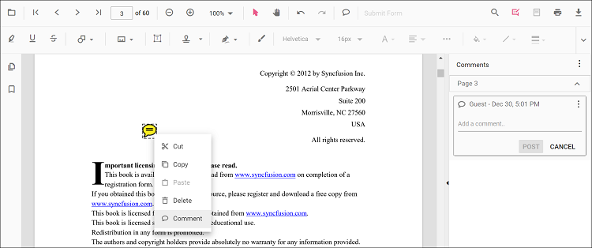
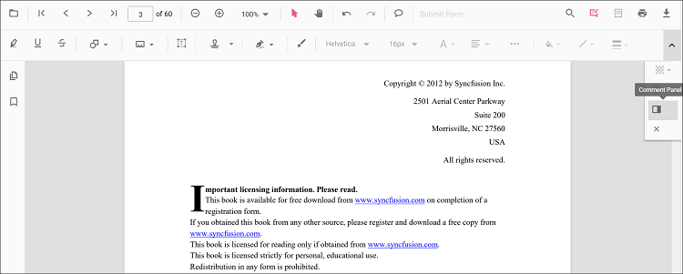
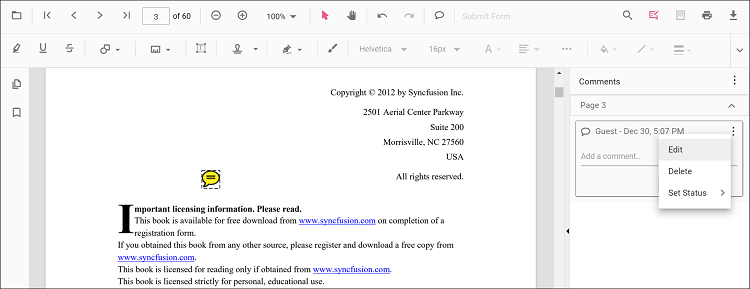

# Sticky notes annotation in React PDF Viewer

The PDF Viewer control provides options to add, edit, and delete sticky note annotations in the PDF document.

## Add a sticky note annotation to the PDF document

Annotation comments can be added using the comment panel.

* Select a sticky note annotation in the PDF document and right-click it.
* Select Comment from the context menu.
* Add comments, replies, and status using the comment panel.

  

  Annotation comments can be added to the PDF document using the comment panel.

* Select a Sticky note annotation in the PDF document and right-click it.
* Select the Comment option in the context menu that appears.
* Now, you can add Comments, Reply, and Status using the Comment Panel.
* Now, you can add Comments, Reply, and Status using the Comment Panel.

## Add a sticky note annotation to the PDF document programmatically

With the PDF Viewer library, you can add a sticky note annotation to the PDF Viewer control programmatically using the [**addAnnotation()**](https://ej2.syncfusion.com/react/documentation/api/pdfviewer/annotation/#annotation) method.

Here is an example showing how to add a sticky note annotation programmatically using addAnnotation():





import * as ReactDOM from 'react-dom';
import * as React from 'react';
import './index.css';
import { PdfViewerComponent, Toolbar, Magnification, Navigation, LinkAnnotation, BookmarkView, ThumbnailView,
         Print, TextSelection, TextSearch, Annotation, FormFields, FormDesigner, PageOrganizer, Inject } from '@syncfusion/ej2-react-pdfviewer';
let pdfviewer;

function App() {

  function addAnnotation() {
    var viewer = document.getElementById('container').ej2_instances[0];
    viewer.annotation.addAnnotation("StickyNotes", {
      offset: { x: 100, y: 200 },
      pageNumber: 1,
      isLock: false
    });
  }
  return (

    <button onClick={addAnnotation}>Add Annotation programatically</button>
    

      <PdfViewerComponent
        ref={(scope) => { pdfviewer = scope; }}
        id="container"
        documentPath="https://cdn.syncfusion.com/content/pdf/pdf-succinctly.pdf"
        resourceUrl="https://cdn.syncfusion.com/ej2/31.2.2/dist/ej2-pdfviewer-lib"
        style={{ 'height': '640px' }}>

              <Inject services={[ Toolbar, Annotation, Magnification, Navigation, LinkAnnotation, BookmarkView, ThumbnailView,
                                  Print, TextSelection, TextSearch, FormFields, FormDesigner, PageOrganizer]} />
      </PdfViewerComponent>
    

  
);
}
const root = ReactDOM.createRoot(document.getElementById('sample'));
root.render(<App />);






import * as ReactDOM from 'react-dom';
import * as React from 'react';
import './index.css';
import { PdfViewerComponent, Toolbar, Magnification, Navigation, LinkAnnotation, BookmarkView, ThumbnailView,
         Print, TextSelection, TextSearch, Annotation, FormFields, FormDesigner, PageOrganizer, Inject } from '@syncfusion/ej2-react-pdfviewer';
let pdfviewer;

function App() {

  function addAnnotation() {
    var viewer = document.getElementById('container').ej2_instances[0];
    viewer.annotation.addAnnotation("StickyNotes", {
      offset: { x: 100, y: 200 },
      pageNumber: 1,
      isLock: false
    });
  }
  return (

    <button onClick={addAnnotation}>Add Annotation programatically</button>
    

      <PdfViewerComponent
        ref={(scope) => { pdfviewer = scope; }}
        id="container"
        documentPath="https://cdn.syncfusion.com/content/pdf/pdf-succinctly.pdf"
        serviceUrl="https://document.syncfusion.com/web-services/pdf-viewer/api/pdfviewer"
        style={{ 'height': '640px' }}>

              <Inject services={[ Toolbar, Annotation, Magnification, Navigation, LinkAnnotation, BookmarkView, ThumbnailView,
                                  Print, TextSelection, TextSearch, FormFields, FormDesigner, PageOrganizer]} />
      </PdfViewerComponent>
    

  
);
}
const root = ReactDOM.createRoot(document.getElementById('sample'));
root.render(<App />);





## Edit an existing sticky note annotation programmatically

To modify an existing sticky note annotation programmatically, use the editAnnotation() method.

Here is an example of using editAnnotation():





import * as ReactDOM from 'react-dom';
import * as React from 'react';
import './index.css';
import { PdfViewerComponent, Toolbar, Magnification, Navigation, LinkAnnotation, BookmarkView, ThumbnailView,
         Print, TextSelection, TextSearch, Annotation, FormFields, FormDesigner, PageOrganizer, Inject } from '@syncfusion/ej2-react-pdfviewer';
let pdfviewer;

function App() {

  function editAnnotation() {
    var viewer = document.getElementById('container').ej2_instances[0];
    for (let i = 0; i < viewer.annotationCollection.length; i++)
    {
      if (viewer.annotationCollection[i].shapeAnnotationType === "sticky") {
        var width = viewer.annotationCollection[i].bounds.width;
        var height = viewer.annotationCollection[i].bounds.height;
        viewer.annotationCollection[i].bounds = {x : 100, y: 100, width: width, height: height };
        viewer.annotation.editAnnotation(viewer.annotationCollection[i]);
      }
    }
  }
  return (

    <button onClick={editAnnotation}>Edit Annotation programatically</button>
    

      <PdfViewerComponent
        ref={(scope) => { pdfviewer = scope; }}
        id="container"
        documentPath="https://cdn.syncfusion.com/content/pdf/pdf-succinctly.pdf"
        resourceUrl="https://cdn.syncfusion.com/ej2/31.2.2/dist/ej2-pdfviewer-lib"
        style={{ 'height': '640px' }}>

              <Inject services={[ Toolbar, Annotation, Magnification, Navigation, LinkAnnotation, BookmarkView, ThumbnailView,
                                  Print, TextSelection, TextSearch, FormFields, FormDesigner, PageOrganizer]} />
      </PdfViewerComponent>
    

  
);
}
const root = ReactDOM.createRoot(document.getElementById('sample'));
root.render(<App />);






import * as ReactDOM from 'react-dom';
import * as React from 'react';
import './index.css';
import { PdfViewerComponent, Toolbar, Magnification, Navigation, LinkAnnotation, BookmarkView, ThumbnailView,
         Print, TextSelection, TextSearch, Annotation, FormFields, FormDesigner, PageOrganizer, Inject } from '@syncfusion/ej2-react-pdfviewer';
let pdfviewer;

function App() {

  function editAnnotation() {
    var viewer = document.getElementById('container').ej2_instances[0];
    for (let i = 0; i < viewer.annotationCollection.length; i++)
    {
      if (viewer.annotationCollection[i].shapeAnnotationType === "sticky") {
        var width = viewer.annotationCollection[i].bounds.width;
        var height = viewer.annotationCollection[i].bounds.height;
        viewer.annotationCollection[i].bounds = {x : 100, y: 100, width: width, height: height };
        viewer.annotation.editAnnotation(viewer.annotationCollection[i]);
      }
    }
  }
  return (

    <button onClick={editAnnotation}>Edit Annotation programatically</button>
    

      <PdfViewerComponent
        ref={(scope) => { pdfviewer = scope; }}
        id="container"
        documentPath="https://cdn.syncfusion.com/content/pdf/pdf-succinctly.pdf"
        serviceUrl="https://document.syncfusion.com/web-services/pdf-viewer/api/pdfviewer"
        style={{ 'height': '640px' }}>

              <Inject services={[ Toolbar, Annotation, Magnification, Navigation, LinkAnnotation, BookmarkView, ThumbnailView,
                                  Print, TextSelection, TextSearch, FormFields, FormDesigner, PageOrganizer]} />
      </PdfViewerComponent>
    

  
);
}
const root = ReactDOM.createRoot(document.getElementById('sample'));
root.render(<App />);





## Edit the properties of sticky note annotations

### Editing opacity

Edit opacity using the range slider in the Edit Opacity tool.

### Editing comments

Comment text, replies, and status can be edited using the comment panel.

* Open the comment panel using the Comment Panel button in the annotation toolbar.

  

Modify or delete comments or replies, and change status using the menu options in the comment panel.

  

## Set default properties during control initialization

Default properties for sticky note annotations can be set before creating the control using StickyNotesSettings.

After changing default opacity using the Edit Opacity tool, the selected value is applied. The following example sets default sticky note annotation settings.





import * as ReactDOM from 'react-dom';
import * as React from 'react';
import { PdfViewerComponent, Toolbar, Magnification, Navigation, LinkAnnotation,
         BookmarkView, ThumbnailView, Print, TextSelection, TextSearch, Annotation,
         FormFields, FormDesigner, PageOrganizer, Inject } from '@syncfusion/ej2-react-pdfviewer';
let pdfviewer;

function App() {
  return (

    

      <PdfViewerComponent ref={(scope) => { pdfviewer = scope; }}
        id="container"
        documentPath="https://cdn.syncfusion.com/content/pdf/pdf-succinctly.pdf"
        resourceUrl="https://cdn.syncfusion.com/ej2/31.2.2/dist/ej2-pdfviewer-lib"
        stickyNotesSettings={{author: 'Syncfusion'}}
        style={{ 'height': '640px' }}>

              <Inject services={[ Toolbar, Annotation, Magnification, Navigation, LinkAnnotation, BookmarkView, ThumbnailView,
                                  Print, TextSelection, TextSearch, FormFields, FormDesigner, PageOrganizer]} />
      </PdfViewerComponent>
    

  
);
}
const root = ReactDOM.createRoot(document.getElementById('sample'));
root.render(<App />);






import * as ReactDOM from 'react-dom';
import * as React from 'react';
import { PdfViewerComponent, Toolbar, Magnification, Navigation, LinkAnnotation,
         BookmarkView, ThumbnailView, Print, TextSelection, TextSearch, Annotation,
         FormFields, FormDesigner, PageOrganizer, Inject } from '@syncfusion/ej2-react-pdfviewer';
let pdfviewer;

function App() {
  return (

    

      <PdfViewerComponent ref={(scope) => { pdfviewer = scope; }}
        id="container"
        documentPath="https://cdn.syncfusion.com/content/pdf/pdf-succinctly.pdf"
        serviceUrl="https://document.syncfusion.com/web-services/pdf-viewer/api/pdfviewer"
        stickyNotesSettings={{author: 'Syncfusion'}}
        style={{ 'height': '640px' }}>

              <Inject services={[ Toolbar, Annotation, Magnification, Navigation, LinkAnnotation, BookmarkView, ThumbnailView,
                                  Print, TextSelection, TextSearch, FormFields, FormDesigner, PageOrganizer]} />
      </PdfViewerComponent>
    

  
);
}
const root = ReactDOM.createRoot(document.getElementById('sample'));
root.render(<App />);





## Disable sticky note annotations

The PDF Viewer control provides an option to disable sticky note annotations. The following example disables the feature.





import * as ReactDOM from 'react-dom';
import * as React from 'react';
import { PdfViewerComponent, Toolbar, Magnification, Navigation, LinkAnnotation,
         BookmarkView, ThumbnailView, Print, TextSelection, TextSearch, Annotation,
         FormFields, FormDesigner, PageOrganizer, Inject } from '@syncfusion/ej2-react-pdfviewer';
let pdfviewer;

function App() {
  return (

    

      <PdfViewerComponent ref={(scope) => { pdfviewer = scope; }}
        id="container"
        documentPath="https://cdn.syncfusion.com/content/pdf/pdf-succinctly.pdf"
        resourceUrl="https://cdn.syncfusion.com/ej2/31.2.2/dist/ej2-pdfviewer-lib"
        enableStickyNotesAnnotation={false}
        style={{ 'height': '640px' }}>

              <Inject services={[ Toolbar, Annotation, Magnification, Navigation, LinkAnnotation, BookmarkView, ThumbnailView,
                                  Print, TextSelection, TextSearch, FormFields, FormDesigner, PageOrganizer]} />
      </PdfViewerComponent>
    

  
);
}
const root = ReactDOM.createRoot(document.getElementById('sample'));
root.render(<App />);






import * as ReactDOM from 'react-dom';
import * as React from 'react';
import { PdfViewerComponent, Toolbar, Magnification, Navigation, LinkAnnotation,
         BookmarkView, ThumbnailView, Print, TextSelection, TextSearch, Annotation,
         FormFields, FormDesigner, PageOrganizer, Inject } from '@syncfusion/ej2-react-pdfviewer';
let pdfviewer;

function App() {
  return (

    

      <PdfViewerComponent ref={(scope) => { pdfviewer = scope; }}
        id="container"
        documentPath="https://cdn.syncfusion.com/content/pdf/pdf-succinctly.pdf"
        serviceUrl="https://document.syncfusion.com/web-services/pdf-viewer/api/pdfviewer"
        enableStickyNotesAnnotation={false}
        style={{ 'height': '640px' }}>

              <Inject services={[ Toolbar, Annotation, Magnification, Navigation, LinkAnnotation, BookmarkView, ThumbnailView,
                                  Print, TextSelection, TextSearch, FormFields, FormDesigner, PageOrganizer]} />
      </PdfViewerComponent>
    

  
);
}
const root = ReactDOM.createRoot(document.getElementById('sample'));
root.render(<App />);



