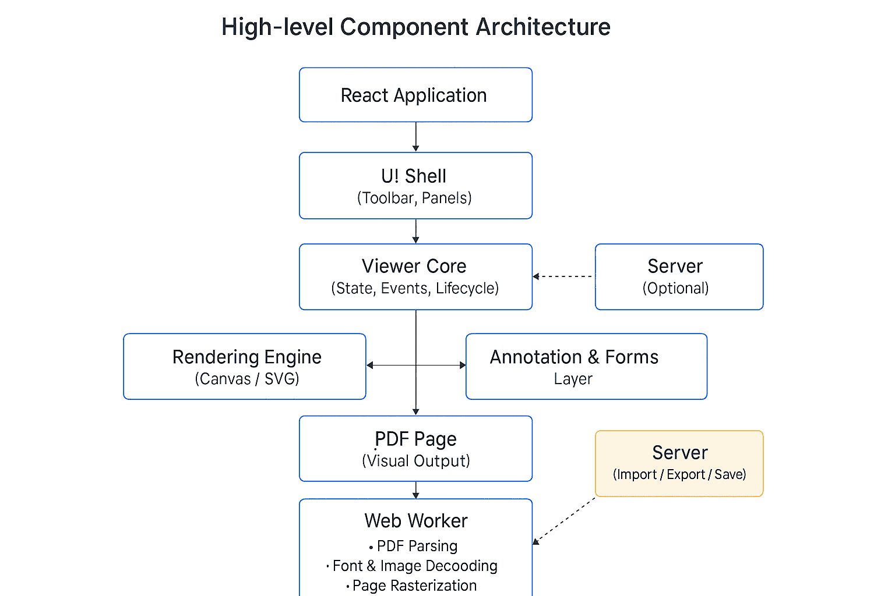
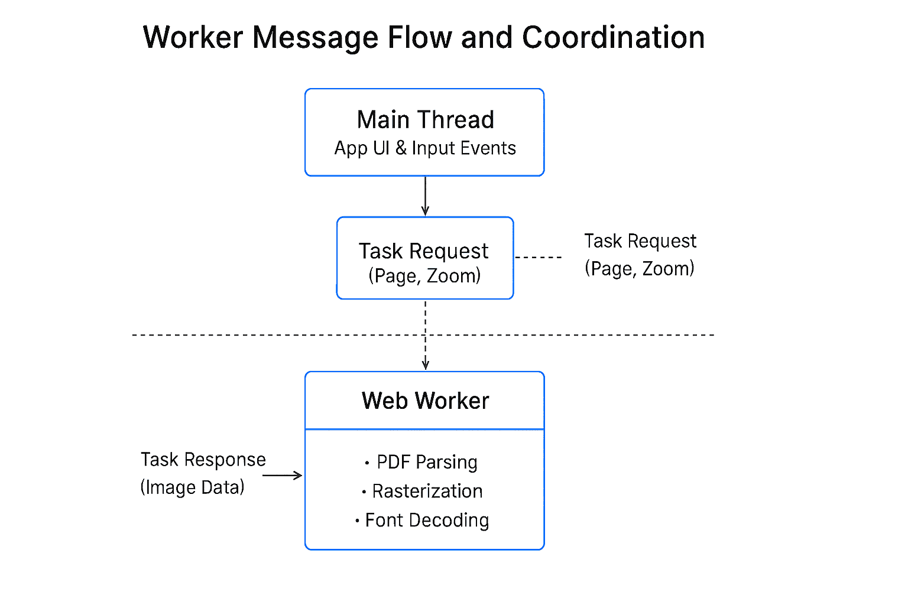

# Architecture of Syncfusion React PDF Viewer

This guide provides a deep dive into the technical design and internal workings of the Syncfusion React PDF Viewer, including its high-level component architecture, rendering pipeline, data flow across the client and server boundaries, and performance optimization strategies. Understanding these concepts will help you make informed decisions about customization, feature integration, and troubleshooting.

## Overview

The Syncfusion React PDF Viewer operates on a **hybrid client-server architecture** designed for scalability, performance, and rich interactivity:

- **Client-side layer**: A responsive React component that handles user interaction, rendering, annotations, and form filling directly in the browser using the PDFium-based rendering engine. The client provides a smooth, zero-latency user experience for common operations like navigation, zooming, and markup.
- **Server-side layer**: Optional back-end services (via `serviceUrl`) that enable advanced features such as document preprocessing, OCR, form field recognition, digital signatures, secure document streaming, and import/export operations using the Syncfusion PDF Library.

This architecture allows you to use the viewer in a **client-only mode** (perfect for lightweight applications) or with **full server integration** (for enterprise scenarios requiring advanced document processing, security, and compliance).

This page explains the internal architecture of the viewer, focusing on how major modules collaborate, how documents are parsed and rendered using PDFium, and how data flows across threads and network boundaries. This content is intended for developers and integrators who want to understand the viewer's internal design to make informed decisions about customization, performance tuning, and advanced integrations.

**Key Technology Stack:**
- **PDFium**: Google's open-source PDF rendering and manipulation engine used for fast, reliable PDF parsing and rasterization on the client.
- **Syncfusion PDF Library**: Server-side library for advanced document processing, preprocessing, and export operations.

## High-level components

The React PDF Viewer is built as a set of modular components, each responsible for a specific responsibility in the viewing pipeline. The following diagram illustrates how these components interact:



- **UI Shell** – Provides the container layout, dialogs, panels, and responsive structure. Manages the overall layout and ensures the viewer adapts responsively across different screen sizes and devices.

- **Viewer Core** – Coordinates viewer state, document life-cycle, and event routing. Acts as the central orchestrator that manages document loading, page navigation, state synchronization, and event propagation across all modules.

- **Rendering Engine** – Powered by PDFium, converts parsed PDF page data into visual output using canvas and SVG layers. Handles rasterization, text extraction, and visual rendering of PDF content with high fidelity.

- **Worker(s)** – Perform CPU‑intensive tasks such as document parsing, font processing, and page rasterization outside the main thread. This off-thread processing ensures a responsive UI during heavy operations.

- **Toolbar** – Exposes user actions such as navigation, zooming, annotation tools, printing, and download. 

See [Toolbar Integration](../toolbar-customization/overview) for customization options and available tools.

- **Thumbnail and Bookmark panels** – Enable page navigation and structural browsing. Allow users to quickly jump between pages and view document structure hierarchically. 

See [Thumbnail Page](../navigation#thumbnail-navigation) and [Bookmark Page](../navigation#bookmark-navigation) for page navigation.

- **Annotation and Forms modules** – Manage interactive PDF elements and forms. Interactive elements are indexed and maintained separately for efficient manipulation and serialization.

See [Annotations](../annotation/overview) and [Working with Form Fields](../forms/overview) for detailed usage and API reference.

- **Injected Services** – Enable optional features such as text search, magnification, printing, and form filling. These services are plugged into the viewer architecture based on your licensing and configuration.

See [Text Search](../text-search), [Magnification](../magnification), [Printing](../print/overview) to explore more features.

## Document parsing & internal data model

When a PDF document is loaded, the PDFium rendering engine parses it into a structured internal data model that represents pages, content streams, fonts, images, annotations, form fields, and metadata. This model acts as the foundation for all rendering and interaction workflows in the viewer.

**Key aspects of the data model:**

- **Page representation**: Each page is decomposed into individual drawing commands, text blocks, images, and vector graphics.
- **Font and resource management**: Fonts are extracted and processed; embedded and external fonts are handled gracefully.
- **Annotation and form field tracking**: Interactive elements are indexed and maintained separately for efficient manipulation and serialization.
- **Resource caching**: Parsed page resources are cached to minimize repeated processing during page navigation and zoom operations, improving responsiveness.

For very large or complex documents, memory usage can increase significantly. In such cases, consider implementing **partial loading strategies** or streaming approaches via the server back-end. See [Performance Optimization](../getting-started-overview) for best practices.

## Worker model / Off-main-thread processing

The viewer uses **Web Workers** to offload resource‑intensive operations such as document parsing, font processing, and page rasterization from the main UI thread. This architecture ensures smooth user interaction, responsive scrolling, and prevents UI blocking during heavy computations.

**How the worker model operates:**

1. The main thread (React component) receives user actions and coordinates document loading.
2. Work items (e.g., "parse page 5", "rasterize at 150% zoom") are serialized and sent to worker threads via `postMessage()`.
3. Workers execute PDFium rendering commands and message back rendering results (image data, text layers).
4. The main thread receives results and updates the DOM with new rendered content.

When workers are unavailable or disabled, the viewer gracefully falls back to main‑thread execution with reduced performance. This fallback is useful for debugging or in restricted environments.



## Network & serviceUrl interactions

The React PDF Viewer supports both **standalone client-side** and **client-server hybrid** architectures:

### Client-only mode (no server)
- Use the [`documentPath`](https://ej2.syncfusion.com/react/documentation/api/pdfviewer/index-default#documentpath) property to load PDF files directly from your web server or CDN.
- All rendering, annotations, and form filling happen entirely on the client using PDFium.
- No network latency for viewing operations; ideal for lightweight, offline-friendly applications.

### Client-server mode (with serviceUrl)
- The [`serviceUrl`](https://ej2.syncfusion.com/react/documentation/api/pdfviewer/index-default#serviceurl) property enables server‑backed features such as advanced document processing, OCR, streaming, and import/export operations using the Syncfusion PDF Library.
- Documents may be streamed incrementally (useful for large files) or fetched fully before rendering, depending on your configuration.
- Server-side preprocessing can optimize documents before delivering them to clients.

**Authentication and security:**

Authentication headers can be injected for secured endpoints or cloud storage integrations:

```js
ajaxRequestSettings: {
  headers: {
    Authorization: 'Bearer <access-token>'
  }
}
```
See How to add [custom headers in AjaxRequestSettings](https://help.syncfusion.com/document-processing/pdf/pdf-viewer/react/how-to/add-header-value)

**Common integration challenges:**
- CORS restrictions when loading PDFs from different origins
- Invalid or unreachable `serviceUrl` endpoints
- Expired authentication tokens during long viewing sessions
- Network timeouts on slow connections

See [Server Integration](../getting-started-with-server-backed) for detailed configuration guidance and [Troubleshooting](../troubleshooting/troubleshooting) for common issues.

## Annotation & forms architecture

Annotations and form fields are core interactive elements of the PDF viewing experience. The viewer maintains a sophisticated layer-based rendering model to manage these elements efficiently.

**Annotation rendering and management:**

Annotations (highlights, underlines, strikethrough, freehand drawings, shapes, stamps, ink, and text markup) are rendered as dedicated interactive layers that sit above the base PDF content. This layering approach ensures:

- **Non-destructive markup**: Annotations overlay the original PDF without modifying the underlying document.
- **Efficient rendering**: Only annotation layers update when user marks up the document; PDF content remains static.
- **Event propagation**: User interactions with annotations generate events that flow through the Viewer Core.
- **Persistence and serialization**: Annotation data can be exported to XFDF, JSON, or other formats for storage and reimporting across sessions.

See [Annotations in React PDF Viewer](../annotation/overview) for comprehensive annotation types, styling, and API usage.

**Form field handling:**

Form fields (text inputs, checkboxes, radio buttons, dropdowns, signature fields) are parsed from the PDF and maintained in memory with:

- **Visual representation**: Each field is rendered with its defined appearance (fonts, colors, borders).
- **Behavioral properties**: Validation rules, calculations, and interdependencies are tracked.
- **Event binding**: User input to form fields triggers validation, calculation, and change events.
- **State management**: Field values are synchronized across the document model and UI.

Advanced form features include:

- **Digital signatures**: Sign form fields with certificates; signature validation and time-stamping via server integration.
- **Form validation**: Custom validation rules and required field enforcement.
- **Form submission**: Export form data as FDF, XFDF, or JSON formats.
- **Form locking**: Prevent field editing after submission for read-only workflows.

See [Working with Form Fields](../forms/overview) and [Digital Signatures](../digital-signature/add-digital-signature-react) for detailed examples and API documentation.

**Data serialization workflows:**

The viewer supports multiple serialization formats for annotation and form data:

- **XFDF (XML Forms Data Format)**: Industry-standard format for portable annotation and form data.
- **JSON**: Lightweight, programmatic format for custom integrations.
- **FDF (Forms Data Format)**: Legacy format supported for backward compatibility.

This enables workflows where annotation and form data can be:
- Exported from the viewer and processed server-side (e.g., archiving, printing with annotations, compliance reporting).
- Imported from external sources and merged into new PDFs.
- Synchronized across multiple viewers or applications.

See Export and Import Annotation for [Annotation](../annotation/export-import/export-annotation) and [Forms](../forms/import-export-form-fields/export-form-fields)

## Accessibility & event flow

The React PDF Viewer is designed with accessibility as a first-class concern, ensuring that all users—including those with visual, motor, and cognitive disabilities—can interact with PDF documents effectively.

**Accessibility features:**

- **Semantic markup and ARIA roles**: The viewer uses proper HTML semantics (`<nav>`, `<button>`, `<article>`) and ARIA attributes (`aria-label`, `aria-live`, `role`) to communicate structure and purpose to assistive technologies.
- **Keyboard navigation**: All viewer functions are accessible via keyboard. Users can navigate pages, activate tools, fill forms, and create annotations without a mouse.
- **Screen reader support**: Document structure, page information, form labels, and annotation content are announced clearly to screen readers.
- **Focus management**: Focus is programmatically managed to guide users through interactive workflows (e.g., form filling).
- **Color contrast**: UI elements meet WCAG 2.1 AA color contrast standards.
- **Text extraction**: PDF text is properly extracted and made available for copying, searching, and screen reader consumption.

**Event flow architecture:**

Events generated by user interactions flow through a well-defined event system:

1. **Input events**: Mouse clicks, touch gestures, keyboard input, and resize events are captured.
2. **Viewer Core processing**: Events are dispatched to the appropriate module (Toolbar, Annotation, Forms, etc.).
3. **Module handling**: Each module processes the event according to its logic (e.g., Forms module validates input).
4. **Event propagation**: Modules emit higher-level events (e.g., `onAnnotationAdd`, `onFormFieldChanged`) that applications can listen to.

This design ensures that custom event handlers integrate seamlessly with the viewer's architecture.

See [Keyboard Shortcuts](../keyboard-accessibility) and [Accessibility Guidelines](../accessibility) for best practices when embedding the viewer in accessible applications.

## Theming & styling

The React PDF Viewer applies themes (Material 3, Material Design, etc.) and CSS styling through a cascading layer system. Understanding the recommended import order and safe style override patterns is essential to maintain consistent theming and prevent unintended side effects.

**Recommended theme import order:**

Import theme stylesheets **before** component-specific styles to ensure correct cascade priority and avoid style conflicts:

```js
// ✓ Correct order
import '@syncfusion/ej2-base/styles/material.css';           // Theme
import '@syncfusion/ej2-pdfviewer/styles/pdfviewer.css';    // Component styles
```

**Available themes:**

- **Material Design**: Follows Material Design 2 guidelines with clean, familiar components.
- **Material Design 3**: Modern Material Design 3 with updated colors, typography, and motion.
- **Light and Dark modes**: Automatic or manual switching between light and dark color schemes.
- **Bootstrap**: Bootstrap 5 theme compatibility.
- **Custom themes**: Define your own color palettes and typography by overriding CSS variables.

**Safe style overriding:**

Custom styling can be safely applied using exposed CSS custom properties (variables) without modifying component internals or affecting viewer layout and interaction behavior. This approach isolates custom styles and makes them resilient to component updates:

```css
/* Override theme variables safely */
:root {
  --pdfviewer-primary-color: #1976d2;
  --pdfviewer-text-color: #333333;
  --pdfviewer-border-radius: 4px;
}
```

**Best practices:**

1. Always import theme before component styles to establish correct CSS cascade.
2. Use CSS custom properties (variables) to customize colors, spacing, and typography.
3. Avoid inline style modifications to component DOM elements; use CSS classes instead.
4. Test theme changes across all viewer features (Toolbar, panels, dialogs, annotations).

For comprehensive theme customization options, CSS variable reference, and available themes, see [Theming Guide](../theming-and-styling) and [CSS Class Reference](../theming-and-styling#supported-themes).

## Related architecture and integration topics

- [Getting Started with React PDF Viewer](../getting-started) – Quick setup and your first PDF viewer.
- [Loading PDF Documents](../open-pdf-files) – Detailed guide on document sources, streaming, and error handling.
- [Toolbar Integration and Customization](../toolbar-customization/overview) – Customize toolbar buttons and actions.
- [Annotations in React PDF Viewer](../annotation/overview) – Complete reference for annotation types, styling, and API.
- [Working with Form Fields](../forms/overview) – Form field rendering, validation, and submission workflows.
- [Digital Signatures](../digital-signature/add-digital-signature-react) – Signing PDFs and validating signatures.
- [Accessibility Guidelines](../accessibility) – Keyboard shortcuts, screen reader support, and best practices.
- [Server Integration](../getting-started-with-server-backed) – Using `serviceUrl` for advanced preprocessing and export operations.
- [Troubleshooting Common Issues](../troubleshooting/troubleshooting) – CORS, authentication, rendering, and worker problems.
- [Syncfusion PDF Library Documentation]() – Server-side PDF processing and manipulation reference.