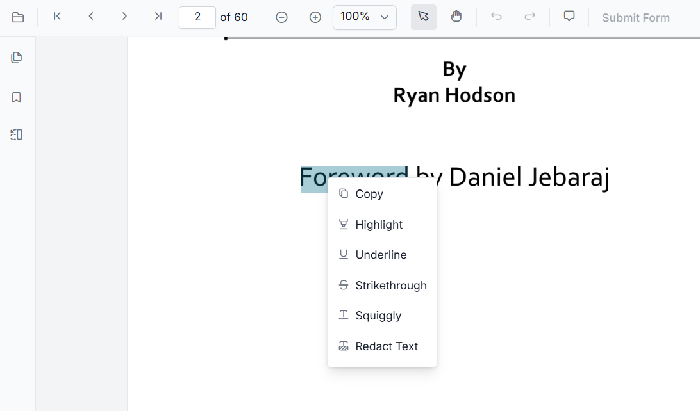
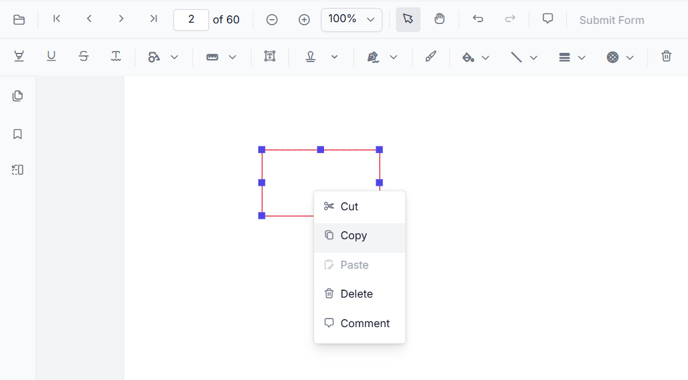
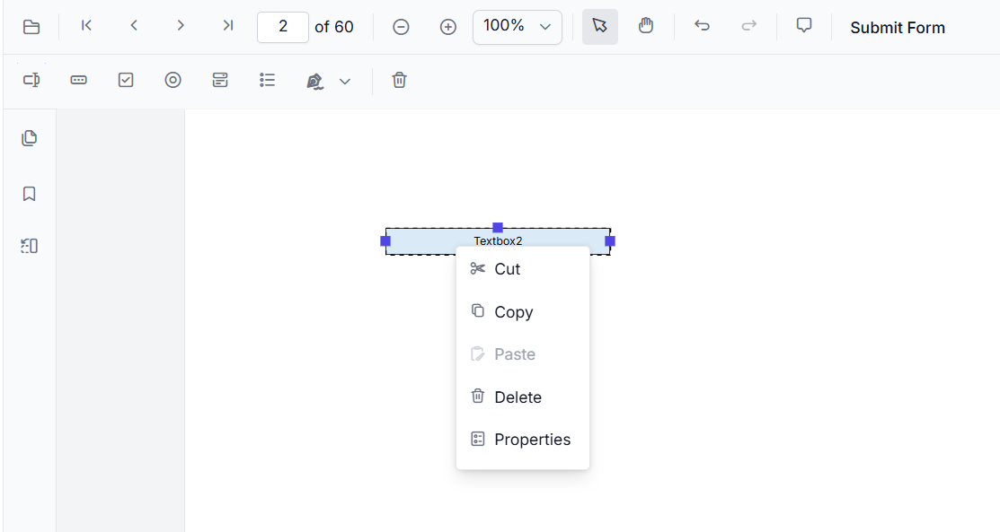
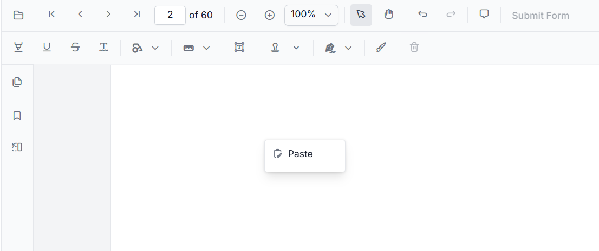

# Built-in Context Menu in React PDF Viewer

The React PDF Viewer includes a context-sensitive menu that updates dynamically based on the element being right-clicked within the document. This page lists the default menu items available for different document elements.

The context menu is enabled by default. To disable it, set the [`contextMenuOption`](https://ej2.syncfusion.com/react/documentation/api/pdfviewer#contextmenuoption) property to `None`.

## Context Menu Scenarios

Menu items vary depending on the target element:

* **Text**: Displays options to annotate and copy selected text.

  

* **Annotations**: Provides options to copy, cut, paste, or remove annotations, and add comments.

  

* **Form Fields**: Shows standard form field interactions, such as modifying properties. The context menu for form fields appears only when the viewer is in **Form Designer mode**. To enable it, add `FormDesigner` to the `Inject services` array and set the [`enableFormDesigner`](https://ej2.syncfusion.com/react/documentation/api/pdfviewer#enableformdesigner) property to `true`.

  

* **Empty Space**: Displays the option to paste a previously copied annotation or form field.

  

## Default Item Reference

### Text Menu Items

The following table describes the default items available when right-clicking selected text:

| Item | Description |
| :--- | :--- |
| **Copy** | Copies selected text to the clipboard. |
| **Highlight** | Highlights selected text using the default highlight color. |
| **Underline** | Applies an underline to the selected text. |
| **Strikethrough** | Applies a strikethrough to the selected text. |
| **Squiggly** | Applies a squiggly underline to the selected text. |
| **Redact Text** | Redacts the selected text. |

### Annotation Menu Items

Default items when right-clicking an annotation:

| Item | Description |
| :--- | :--- |
| **Copy** | Copies the selected annotation for pasting within the same page. |
| **Cut** | Removes the selected annotation and copies it to the clipboard. |
| **Paste** | Pastes a previously copied or cut annotation. |
| **Delete** | Permanently removes the selected annotation. |
| **Comments** | Opens the comment panel for the annotation. |

### Form Field Menu Items

These items appear when the viewer is in Form Designer mode and a form field is selected:

| Item | Description |
| :--- | :--- |
| **Copy** | Copies the selected form field for duplication. |
| **Cut** | Removes the selected form field for relocation. |
| **Paste** | Pastes a copied or cut form field. |
| **Delete** | Removes the selected form field from the document. |
| **Properties** | Launches the properties dialog for the specific form field. |

N> The availability of the context menu is a client-side feature and is independent of server configurations.