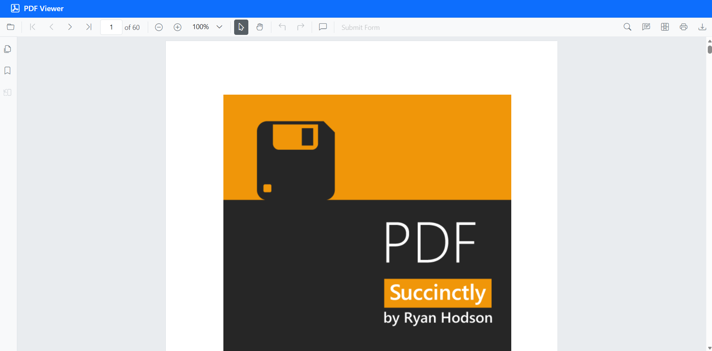

# Create a React PDF Viewer with Agentic UI Builder

This article explains how to build a Syncfusion® React PDF Viewer by entering natural-language instructions into the [**Syncfusion® React Agentic UI Builder**](https://www.syncfusion.com/explore/mcp-servers/) (which runs on Syncfusion's MCP Server). Describe your requirements, and the tool will generate a complete PDF Viewer implementation.

### Prerequisites

- Ensure the **React Agentic UI Builder** extension is installed in your IDE. See the official [Getting Started](https://ej2.syncfusion.com/react/documentation/mcp-server/agentic-ui-builder/getting-started) and [installation guide](https://ej2.syncfusion.com/react/documentation/mcp-server/installation).
- Have an existing React project ready (JavaScript or TypeScript, any supported version) before using the Agentic UI Builder.

### Usage

After installation, open your React project in your IDE, launch the AI assistant, and run the ```#sf_react_ui_builder``` command describing the UI you want. For example:

**Example:**

```
#sf_react_ui_builder Create standalone React PDF Viewer using the Bootstrap 5 theme with the default modules. Install the required packages, import the theme CSS in the correct order, and initialize the PDF Viewer.
```

The UI Builder generates complete implementations including layout, components, and styling. A preview of the generated output appears below:



### Individual Tools

You can invoke specific tools by name for focused assistance; besides the main UI Builder, there are tools for layout, styling, and components. See the [individual tools documentation](https://ej2.syncfusion.com/react/documentation/mcp-server/agentic-ui-builder/getting-started#individual-tools) for details.

### Tips & Best Practices

 - Turn on **Agent mode** in your IDE to enable smooth, multi-step operations with confirmation prompts.
 - Use **Claude Sonnet 4.5 or newer** models for best results; higher-capability models typically produce more accurate, higher-quality code.
 - If a step times out or becomes unresponsive, cancel it and retry.
 - Review the generated code and commands before applying them in a production environment.

### See Also

- For examples of prompt patterns and customization options for layouts, components, and styles, refer to the [prompt Library](https://ej2.syncfusion.com/react/documentation/mcp-server/agentic-ui-builder/prompt-library).