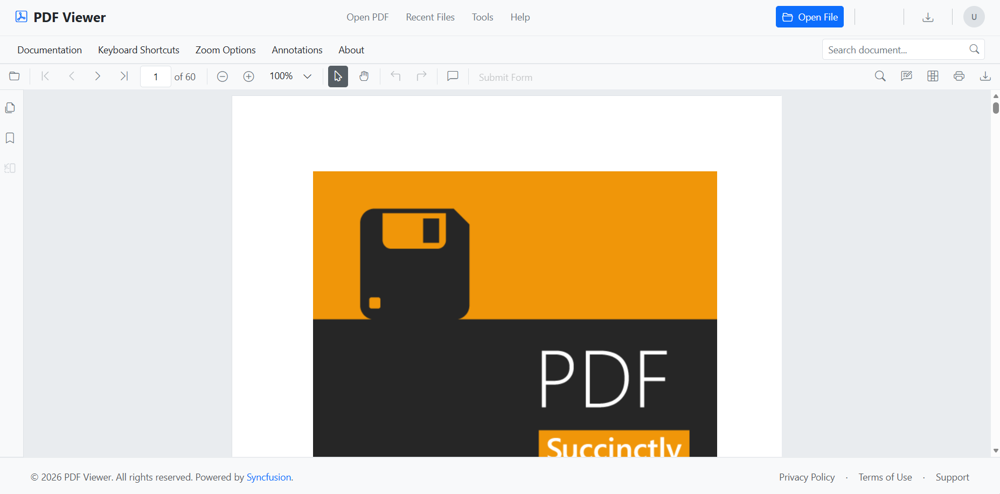
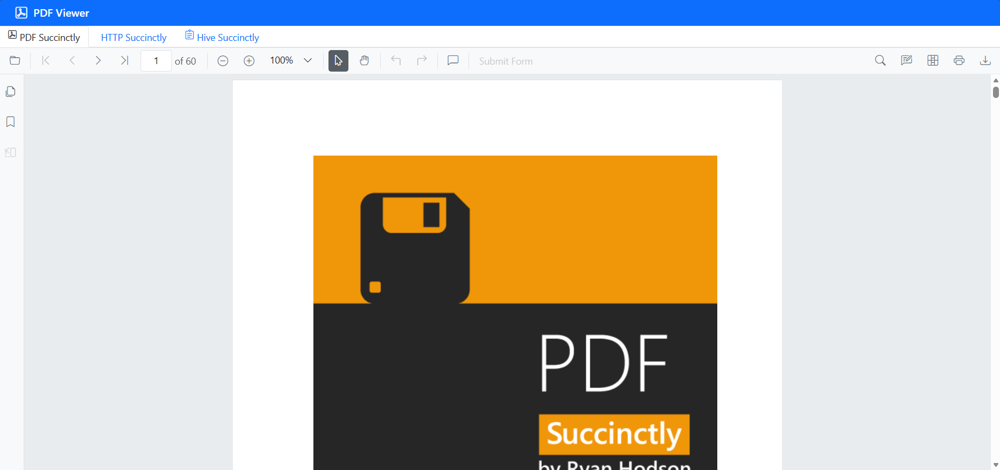
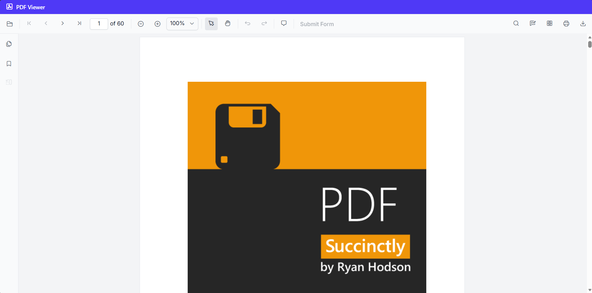

# Create a React PDF Viewer with Agentic UI Builder

This guide shows you how to create a Syncfusion React PDF Viewer simply by typing what you want using natural language commands — with the [**Syncfusion® React Agentic UI Builder**](https://www.syncfusion.com/explore/mcp-servers/) (powered by Syncfusion's MCP Server). Just describe it, and the tool builds the complete implementation of the PDF Viewer for you.

## Prerequisites

- Ensure the **React Agentic UI Builder** extension is installed in your IDE. See the official [installation guide](https://ej2.syncfusion.com/react/documentation/mcp-server/installation).
- Have an existing React project ready (JavaScript or TypeScript, any supported version) before using the Agentic UI Builder.

## Usage

After installation, open your React project in your IDE, launch the AI assistant, and run the ```#sf_react_ui_builder``` command describing the UI you want. For example:

**Example:**

```
#sf_react_ui_builder Create standalone React PDF Viewer using the Bootstrap 5 theme with the default modules. Install the required packages, import the theme CSS in the correct order, and initialize the PDF Viewer.
```

The UI Builder delivers full implementations, covering layout, components, and styling. The following illustration shows the generated output:


## Individual Tools

You can directly call individual tools using their specific tool names when you need focused assistance. This is helpful when you want targeted support from a particular tool.

### Layout Tool (`#sf_react_layout`)

This tool provides a collection of pre-built, responsive UI layout templates and blocks commonly used across different page sections and design patterns.

**When to use:** For creating page structures, responsive layouts, or using ready-made UI patterns.

**Example:**

```
#sf_react_layout Add a navigation bar and footer for PDF Viewer
```



### Component Tool (`#sf_react_component`)

This tool offers quick reference details for Syncfusion React components, including their properties, events, and methods, along with basic usage examples.

**When to use:** When you need essential API information or structure details to correctly implement a specific component.

**Example:**

```
#sf_react_component Integrate a tab component in the existing PDF Viewer setup
```



### Style Tool (`#sf_react_style`)

This tool provides options for configuring themes, setting up styling, and integrating icons for Syncfusion React components. It supports multiple themes such as Tailwind 3 CSS, Bootstrap 5.3, Material 3, and Fluent 2, along with light and dark color modes and consistent icon usage.

**When to use:** When applying themes, customizing colors, modifying component appearance, or adding icons to the UI.

**Example:**

```
#sf_react_style Change the theme to tailwind 3 for the PDF Viewer setup
```



### Tips & Best Practices

- Enable **Agent mode** in your IDE for smooth, multi-step execution with confirmation prompts.
- Use higher-capability models (**Claude Sonnet 4.5 or newer, GPT-5**) as they typically produce more accurate and higher-quality code.
- If a step times out or becomes unresponsive, cancel it and retry the current step.
- Always review the generated code and commands before accepting or applying them in production.

### See also

- To explore customization options for layouts, components, styles, and more examples of effective prompts, refer to the [prompt Library](https://ej2.syncfusion.com/react/documentation/mcp-server/agentic-ui-builder/prompt-library).