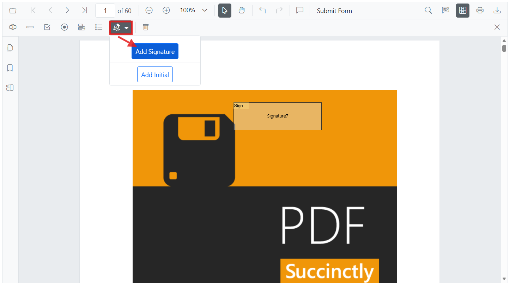
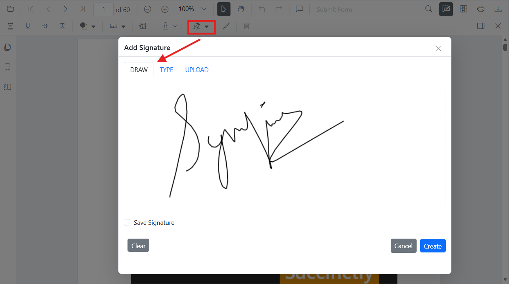
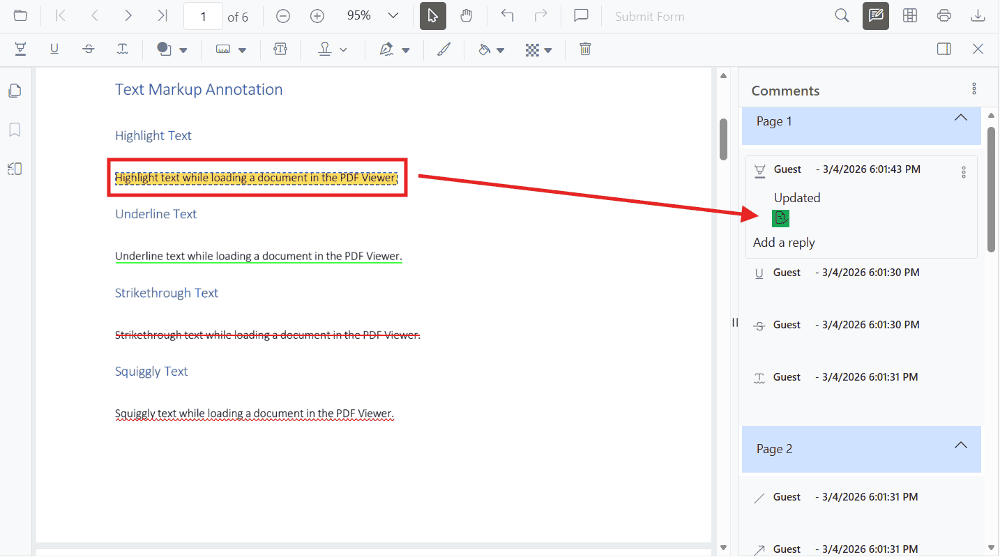

# Digital Signature Workflows

This guide shows how to design signature fields, collect handwritten/typed e‑signatures in the browser, and apply **digital certificate (PKI) signatures** to PDF forms using the Syncfusion React PDF Viewer and the JavaScript PDF Library. Digital signatures provide **authenticity** and **tamper detection**, making them suitable for legally binding scenarios.

## Overview

A **digital signature** is a cryptographic proof attached to a PDF that verifies the signer’s identity and flags any post‑sign changes. It differs from a simple electronic signature (handwritten image/typed name) by providing **tamper‑evidence** and compliance with standards like CMS/PKCS#7. The Syncfusion **JavaScript PDF Library** exposes APIs to create and validate digital signatures programmatically, while the **React PDF Viewer** lets you design signature fields and capture handwritten/typed signatures in the browser.

## Quick Start

Follow these steps to add a **visible digital signature** to an existing PDF and finalize it.

1. **Render the React PDF Viewer with form services**




import * as ReactDOM from 'react-dom/client';
import * as React from 'react';
import {
  PdfViewerComponent, Inject, Toolbar, Magnification, Navigation,
  LinkAnnotation, BookmarkView, ThumbnailView, Print, TextSelection, TextSearch,
  Annotation, FormFields, FormDesigner
} from '@syncfusion/ej2-react-pdfviewer';

function App() {
  return (
    <div className='control-section'>
      <PdfViewerComponent
        id="container"
        documentPath="https://cdn.syncfusion.com/content/pdf/form-filling-document.pdf"
        resourceUrl="https://cdn.syncfusion.com/ej2/31.2.2/dist/ej2-pdfviewer-lib"
        style={{ height: '640px' }}>
        <Inject services={[Toolbar, Magnification, Navigation, Annotation, LinkAnnotation, BookmarkView, ThumbnailView, Print, TextSelection, TextSearch, FormFields, FormDesigner]} />
      </PdfViewerComponent>
    </div>
  );
}

ReactDOM.createRoot(document.getElementById('sample')!).render(<App />);




The Viewer requires **FormFields** and **FormDesigner** services for form interaction and design, and `resourceUrl` for proper asset loading in modern setups. 

2. **Place a signature field (UI or API)**
   - **UI:** Open **Form Designer** → choose **Signature Field** → click to place → configure properties like required, tooltip, and thickness. 
   
   - **API:** Use `addFormField('SignatureField', options)` to create a signature field programmatically. 




const viewerRef = React.useRef<PdfViewerComponent>(null);

const onDocumentLoad = () => {
  viewerRef.current?.formDesignerModule.addFormField('SignatureField', {
    name: 'ApproverSignature',
    pageNumber: 1,
    bounds: { X: 72, Y: 640, Width: 220, Height: 48 },
    isRequired: true,
    tooltip: 'Sign here'
  });
};




3. **Apply a PKI digital signature (JavaScript PDF Library)**

The library provides `PdfSignatureField` and `PdfSignature.create(...)` for PKI signing with algorithms such as **SHA‑256**. 

```ts
import {
  PdfDocument, PdfSignatureField, PdfSignature,
  CryptographicStandard, DigestAlgorithm
} from '@syncfusion/ej2-pdf';

// Load existing PDF bytes (base64/ArrayBuffer)
const document = new PdfDocument(data);
const page = document.getPage(0);

// Create a visible signature field if needed
const field = new PdfSignatureField(page, 'ApproverSignature', {
  x: 72, y: 640, width: 220, height: 48
});

// Create a CMS signature using a PFX (certificate + private key)
const signature = PdfSignature.create(
  { cryptographicStandard: CryptographicStandard.cms, digestAlgorithm: DigestAlgorithm.sha256 },
  certData,
  password
);

field.setSignature(signature);
document.form.add(field);

const signedBytes = await document.save('signed.pdf');
document.destroy();
```

4. **Finalize by flattening**
Set `PdfDocument.flatten = true` to make annotations and form fields permanent. (The Viewer UI itself does not flatten; use the PDF Library in your pipeline.) 

```ts
import { PdfDocument } from '@syncfusion/ej2-pdf';

const doc = new PdfDocument(signedBytes);
doc.flatten = true; // flattens annotations and form fields
const finalBytes = await doc.save('final.pdf');
doc.destroy();
```

N> For sequential or multi‑user flows and digital signature appearances, see these live demos: [eSigning PDF Form](https://document.syncfusion.com/demos/pdf-viewer/react/#/bootstrap5/pdfviewer/esigning-pdf-forms), [Invisible Signature](https://document.syncfusion.com/demos/pdf-viewer/react/#/bootstrap5/pdfviewer/invisible-digital-signature) and [Visible Signature](https://document.syncfusion.com/demos/pdf-viewer/react/#/bootstrap5/pdfviewer/visible-digital-signature) in the React Sample Browser.

## How‑to guides

### Add a signature field (UI)
Use the Form Designer toolbar to place a **Signature Field** where signing is required. Configure indicator text, required state, and tooltip in the properties pane. 

 

### Add a signature field (API)

Adds a signature field programmatically at the given bounds. 




viewerRef.current?.formDesignerModule.addFormField('SignatureField', {
  name: 'CustomerSign',
  pageNumber: 1,
  bounds: { X: 56, Y: 700, Width: 200, Height: 44 },
  isRequired: true
});




### Capture handwritten/typed signature in the browser

When users click a signature field at runtime, the Viewer’s dialog lets them **draw**, **type**, or **upload** a handwritten signature image—no plugin required—making it ideal for quick approvals.

  

N> For a ready‑to‑try flow that routes two users to sign their own fields and then finalize, open [eSigning PDF Form](https://document.syncfusion.com/demos/pdf-viewer/react/#/bootstrap5/pdfviewer/esigning-pdf-forms) in the sample browser.

### Apply a PKI digital signature

Use the **JavaScript PDF Library** to apply a cryptographic signature on a field, with or without a visible appearance. See the **Digital Signature** documentation for additional options (external signing callbacks, digest algorithms, etc.). 

N> To preview visual differences, check the [Invisible Signature](https://document.syncfusion.com/demos/pdf-viewer/react/#/bootstrap5/pdfviewer/invisible-digital-signature) and [Visible Signature](https://document.syncfusion.com/demos/pdf-viewer/react/#/bootstrap5/pdfviewer/visible-digital-signature) in our Sample Browser. Digital Signature samples in the React sample browser.

### Finalize a signed document (flatten/lock)

After collecting all signatures and passing validations, **flatten** the PDF (and optionally restrict permissions) to prevent further edits. Use `PdfDocument.flatten` when saving the file. 

## Signature Workflow Best Practices (Explanation)

Designing a well‑structured signature workflow ensures clarity, security, and efficiency when working with PDF documents. Signature workflows typically involve multiple participants—reviewers and approvers each interacting with the document at different stages.

### Why structured signature workflows matter

A clear signature workflow prevents improper edits, guarantees document authenticity, and reduces bottlenecks during review cycles. When multiple stakeholders sign or comment on a document, maintaining order is crucial for compliance, traceability, and preventing accidental overwrites.

### Choosing the appropriate signature type

Different business scenarios require different signature types. Consider the purpose, regulatory requirements, and level of trust demanded by the workflow.

- **Handwritten/typed (electronic) signature** – Best for informal approvals, acknowledgments, and internal flows. (Captured via the Viewer’s signature dialog.)

  

- **Digital certificate signature (PKI)** – Required for legally binding contracts and tamper detection with a verifiable signer identity. (Created with the JavaScript PDF Library.) 

N> You can explore and try out live demos for [Invisible Signature](https://document.syncfusion.com/demos/pdf-viewer/react/#/bootstrap5/pdfviewer/invisible-digital-signature) and [Visible Signature](https://document.syncfusion.com/demos/pdf-viewer/react/#/bootstrap5/pdfviewer/visible-digital-signature) in our Sample Browser.

### Pre‑signing validation checklist

To prevent rework, validate the PDF before enabling signatures:
- Confirm all **required form fields** are completed (names, dates, totals). (See [Form Validation](../forms/form-validation).)
- Re‑validate key values (financial totals, tax calculations, contract amounts).
- Lock or restrict editing during review to prevent unauthorized changes.
- Use [annotations](../annotation/overview) and [comments](../annotation/comments) for clarifications before signing.

### Role‑based authorization flow

- **Reviewer** – Reviews the document and adds [comments/markups](../annotation/comments). Avoid placing signatures until issues are resolved.  
  
- **Approver** – Ensures feedback is addressed and signs when finalized.  
  
- **Final Approver** – Verifies requirements, then [flattens](../document-handling/preprocess-pdf#flatten-form-fields--annotations) or [Lock Signature](https://help.syncfusion.com/document-processing/pdf/pdf-library/javascript/digitalsignature#lock-signature) to make signatures permanent and may restrict further edits.

N> **Implementation tip:** Use the PDF Library’s `flatten` when saving to make annotations and form fields permanent after the last signature. 

### Multi‑signer patterns and iterative approvals
- Route the document through a defined **sequence of signers**.  
- Use [comments and replies](../annotation/comments#add-comments-and-replies) for feedback without altering document content.  
- For external participants, share only annotation data (XFDF/JSON) when appropriate instead of the full PDF.  
- After all signatures, **flatten** to lock the file. 

N> Refer to [eSigning PDF Forms](https://document.syncfusion.com/demos/pdf-viewer/react/#/bootstrap5/pdfviewer/esigning-pdf-forms) sample that shows two signers filling only their designated fields and finalizing the document.

### Security, deployment, and audit considerations

- **Restrict access:** Enforce authentication and role‑based permissions.  
- **Secure endpoints:** Protect PDF endpoints with token‑based access and authorization checks.  
- **Audit and traceability:** Log signature placements, edits, and finalization events for compliance and audits.  
- **Data protection:** Avoid storing sensitive PDFs on client devices; prefer secure server storage and transmission.  
- **Finalize:** After collecting all signatures, flatten or lock to prevent edits. 

## See also
- [Create and Modify Annotation](../annotation/create-modify-annotation)
- [Customize Annotation](../annotation/customize-annotation)
- [Digital Signature - JavaScript PDF Library](https://help.syncfusion.com/document-processing/pdf/pdf-library/javascript/digitalsignature)
- [Handwritten Signature](../annotation/signature-annotation)
- [Form Fields API](../form-fields-api)
- [Add Digital Signature](./add-digital-signature-react)
- [Customize Signature Appearance](./customize-signature-appearance)
- [Signature workflows](./signature-workflow)