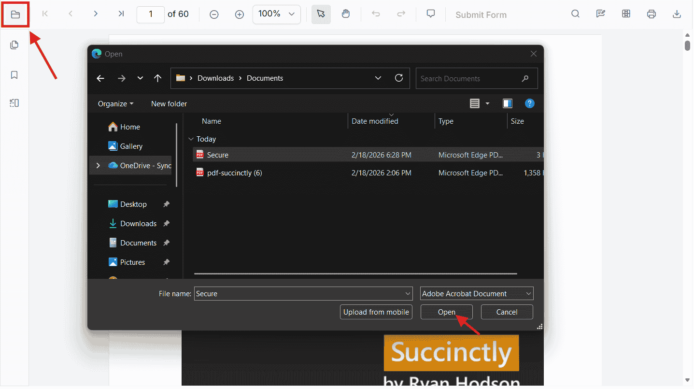
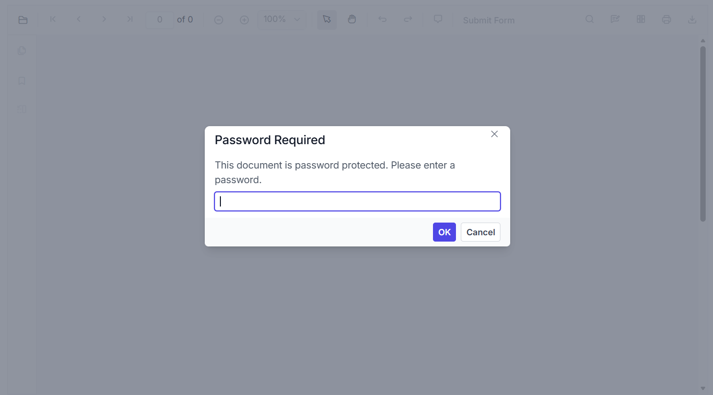

# Load a Password-Protected PDF

This article explains how to open password-protected PDF files in the Syncfusion React PDF Viewer. The viewer supports both user‑interactive loading (Open File dialog) and programmatic loading using APIs.

## 1. Opening a Password-Protected PDF Using the **Open File** Dialog

When the user selects a password-protected PDF using the built‑in **Open File** option:

- The viewer detects that the document is encrypted



- A **password input popup** is automatically displayed



- The user enters the password

- The document is decrypted and loaded

No additional configuration or code is required.

This approach works for all password-protected PDFs opened locally by the user.

## 2. Opening a Password-Protected PDF Programmatically

If you load a password-protected PDF from a URL or through custom logic, the viewer provides two behaviors depending on how the file is loaded.

### 2.1 Load the Document Using `viewer.load(url, password)`

You can directly pass the password in the [`load`](https://ej2.syncfusion.com/react/documentation/api/pdfviewer/index-default#load) method:

```js
viewer.load(
  'https://your-api/password-protected.pdf',
  'Password'
);
```

- If the password is correct → the PDF loads immediately
- If the password is incorrect → the viewer displays the incorrect password popup
- If no password is provided → the password popup is shown automatically

This is useful when the password is known beforehand.

### 2.2 Loading a Password-Protected Document's URL Using `documentPath`

If the [`documentPath`](https://ej2.syncfusion.com/react/documentation/api/pdfviewer/index-default#documentpath) points to a password-protected PDF:




    <PdfViewerComponent
        id="container"
        //Load URL for Password Protected Document 
        documentPath="https://cdn.syncfusion.com/content/pdf/pdf-succinctly.pdf"
        resourceUrl="https://cdn.syncfusion.com/ej2/31.2.2/dist/ej2-pdfviewer-lib"
        style={{ height: '640px' }}
    >




The viewer will:

- Detect encryption
- Show the **password popup automatically**
- Allow the user to enter the correct password
- Then load the PDF


N> No password should be passed inside `documentPath`.