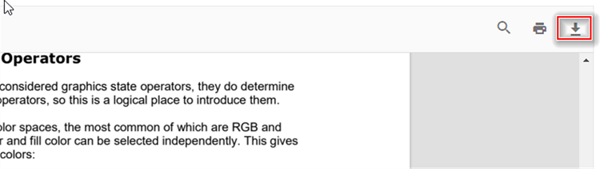

# Download edited PDF in React PDF Viewer

The React PDF Viewer allows users to download the currently loaded PDF, including any annotations, form‑field edits, ink drawings, comments, or page reorganizations. Downloading produces a local PDF file containing all applied changes. This guide shows ways to download a PDF displayed in the PDF Viewer: using the built-in toolbar, and programmatically after editing.

## Download the PDF Using the Toolbar

The viewer's toolbar can include a download button when the [`Toolbar`](https://ej2.syncfusion.com/react/documentation/api/pdfviewer/toolbar) service is injected. When enabled, users can click the toolbar download icon to save the currently loaded PDF.

**Notes:**

- Ensure [`Toolbar`](https://ej2.syncfusion.com/react/documentation/api/pdfviewer/toolbar) is included in the `Inject` services for [`PdfViewerComponent`](https://ej2.syncfusion.com/react/documentation/api/pdfviewer) and `DownloadOption` is included in [`toolbarItems`](https://ej2.syncfusion.com/react/documentation/api/pdfviewer/toolbarsettingsmodel#toolbaritems).
- See the [toolbar items documentation](./toolbar-customization/primary-toolbar#3-show-or-hide-primary-toolbar-items) for customizing or hiding the default download icon.

## Download an Edited PDF Programmatically

You can invoke the viewer's [`download()`](https://ej2.syncfusion.com/react/documentation/api/pdfviewer#download) method to trigger a download programmatically. The examples below show a standalone setup and a server-backed setup to trigger download action.





import * as ReactDOM from 'react-dom';
import * as React from 'react';
import './index.css';
import { PdfViewerComponent, Toolbar, Magnification, Navigation, LinkAnnotation, BookmarkView,
         ThumbnailView, Print, TextSelection, Annotation, TextSearch, Inject } from '@syncfusion/ej2-react-pdfviewer';
let pdfviewer;

function App() {
  function downloadClicked() {
    var viewer = document.getElementById('container').ej2_instances[0];
    viewer.download();
  }
  return (

    

     {/* Render the PDF Viewer */}
     <button onClick={downloadClicked}>Download</button>
      <PdfViewerComponent
        ref={(scope) => { pdfviewer = scope; }}
        id="container"
        documentPath="https://cdn.syncfusion.com/content/pdf/pdf-succinctly.pdf"
        resourceUrl="https://cdn.syncfusion.com/ej2/31.2.2/dist/ej2-pdfviewer-lib"
                style={{ 'height': '640px' }}>
              <Inject services={[ Toolbar, Magnification, Navigation, LinkAnnotation, Annotation,
                                  BookmarkView, ThumbnailView, Print, TextSelection, TextSearch]} />
      </PdfViewerComponent>
    

  

  );
}
const root = ReactDOM.createRoot(document.getElementById('sample'));
root.render(<App />);






import * as ReactDOM from 'react-dom';
import * as React from 'react';
import './index.css';
import { PdfViewerComponent, Toolbar, Magnification, Navigation, LinkAnnotation, BookmarkView,
         ThumbnailView, Print, TextSelection, Annotation, TextSearch, Inject } from '@syncfusion/ej2-react-pdfviewer';
let pdfviewer;

function App() {
  function downloadClicked() {
    var viewer = document.getElementById('container').ej2_instances[0];
    viewer.download();
  }
  return (

    

     {/* Render the PDF Viewer */}
     <button onClick={downloadClicked}>Download</button>
      <PdfViewerComponent
        ref={(scope) => { pdfviewer = scope; }}
        id="container"
        documentPath="https://cdn.syncfusion.com/content/pdf/pdf-succinctly.pdf"
        serviceUrl="https://document.syncfusion.com/web-services/pdf-viewer/api/pdfviewer"
        style={{ 'height': '640px' }}>
              <Inject services={[ Toolbar, Magnification, Navigation, LinkAnnotation, Annotation,
                                  BookmarkView, ThumbnailView, Print, TextSelection, TextSearch]} />
      </PdfViewerComponent>
    

  

  );
}
const root = ReactDOM.createRoot(document.getElementById('sample'));
root.render(<App />);





## Download a PDF with Flattened Annotations

You can intercept the viewer's [`downloadStart`](https://ej2.syncfusion.com/react/documentation/api/pdfviewer#downloadstart) event, cancel the default download, obtain the document as a `Blob` via [`saveAsBlob()`](https://ej2.syncfusion.com/react/documentation/api/pdfviewer#saveasblob), and flatten annotations before saving the resulting PDF.




import {
    PdfViewerComponent, Toolbar, Magnification, Navigation, Annotation, LinkAnnotation,
    ThumbnailView, BookmarkView, TextSelection, TextSearch, FormFields, FormDesigner,
    PageOrganizer, Inject, Print, DownloadStartEventArgs
} from '@syncfusion/ej2-react-pdfviewer';
import { PdfDocument } from '@syncfusion/ej2-pdf';
import { RefObject, useRef } from 'react';

export default function App() {
    const viewerRef: RefObject<PdfViewerComponent> = useRef(null);

    const blobToBase64 = async (blob: Blob): Promise<string> => {
        return new Promise((resolve, reject) => {
            const reader = new FileReader();
            reader.onerror = () => reject(reader.error);
            reader.onload = () => {
                const dataUrl: string = reader.result as string;
                const data: string = dataUrl.split(',')[1];
                resolve(data);
            };
            reader.readAsDataURL(blob);
        });
    }

    const flattenPDF = (data: string) => {
        let document: PdfDocument = new PdfDocument(data);
        document.flatten = true
        document.save(`${viewerRef.current.fileName}.pdf`);
        document.destroy();
    }

    const handleFlattening = async () => {
        const blob: Blob = await viewerRef.current.saveAsBlob();
        const data: string = await blobToBase64(blob);
        flattenPDF(data);
    }

    const onDownloadStart = async (args: DownloadStartEventArgs) => {
        args.cancel = true;
        handleFlattening();
    };

    return (
        

            <PdfViewerComponent
                id="pdf-viewer"
                ref={viewerRef}
                documentPath="https://cdn.syncfusion.com/content/pdf/form-filling-document.pdf"
                resourceUrl="https://cdn.syncfusion.com/ej2/32.2.5/dist/ej2-pdfviewer-lib"
                downloadStart={onDownloadStart}
            >
                <Inject services={[Toolbar, Magnification, Navigation, Annotation, LinkAnnotation, ThumbnailView,
                    BookmarkView, TextSelection, TextSearch, FormFields, FormDesigner, PageOrganizer, Print]} />
            </PdfViewerComponent>
        

    );
}




## See also

- [Toolbar items](./toolbar)
- [Feature Modules](./feature-module)