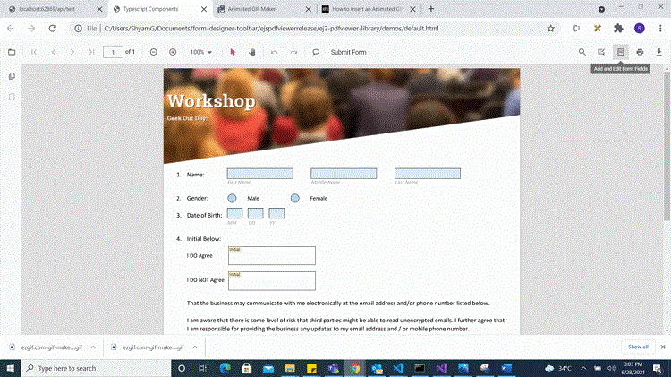

# Create form fields in React PDF Viewer

The PDF Viewer component supports interactive form field design, including drawing, dragging, and resizing fields directly on the page. Click the Form Field icon on the toolbar to add a field and place it on the document. You can also create and manage form fields programmatically using the API.

The PDF Viewer supports the following form field types:

- [Textbox](#add-textbox)
- [Password](#add-password)
- [CheckBox](#add-checkbox)
- [RadioButton](#add-radiobutton)
- [ListBox](#add-listbox)
- [DropDown](#add-dropdown)
- [Signature field](#signature-field)
- [Initial field](#add-initial-field)

## Add the form field dynamically

Click the Form Field icon on the toolbar, then click on the PDF to draw a form field. See the following GIF for reference.

## Drag the form field

Drag the selected form field to reposition it within the PDF document. See the following GIF for reference.

## Resize the form field

Resize the selected form field using the resize handles on the field boundary. See the following GIF for reference.

## Textbox

### Add Textbox

- Open the Form Designer toolbar.
- Select Textbox, then click/tap on the page to place it.
- Resize/move as needed and set properties in the property panel.

### Add Textbox Programmatically

To add a Textbox programmatically in React, use a ref to access the viewer instance and add the field in the documentLoad event.



import * as ReactDOM from 'react-dom/client';
import React, { useRef } from 'react';
import './index.css';
import { PdfViewerComponent, Toolbar, Magnification, Navigation, LinkAnnotation, BookmarkView, ThumbnailView, Print, TextSelection, Annotation, TextSearch, FormFields, FormDesigner, Inject } from '@syncfusion/ej2-react-pdfviewer';

export function App() {
  const viewerRef = useRef(null);

  const onDocumentLoad = () => {
    viewerRef.current?.formDesignerModule.addFormField('Textbox', {
      name: 'First Name',
      bounds: { X: 146, Y: 229, Width: 150, Height: 24 }
    });
  };

  return (
    

      <PdfViewerComponent
        ref={viewerRef}
        id="container"
        documentPath="https://cdn.syncfusion.com/content/pdf/form-filling-document.pdf"
        resourceUrl="https://cdn.syncfusion.com/ej2/31.2.2/dist/ej2-pdfviewer-lib"
        style={{ height: '680px' }}
        documentLoad={onDocumentLoad}
      >
        <Inject services={[Toolbar, Magnification, Navigation, Annotation, LinkAnnotation, BookmarkView, ThumbnailView, Print, TextSelection, TextSearch, FormFields, FormDesigner]} />
      </PdfViewerComponent>
    

  );
}

const root = ReactDOM.createRoot(document.getElementById('sample'));
root.render(<App />);



## Password

### Add Password

- Open the Form Designer toolbar.
- Select Password, then place it on the page.
- Configure tooltip, required, max length, etc.

### Add Password Programmatically

To add a Password field programmatically in React, add it in the documentLoad event.



import * as ReactDOM from 'react-dom/client';
import React, { useRef } from 'react';
import './index.css';
import { PdfViewerComponent, Toolbar, Magnification, Navigation, LinkAnnotation, BookmarkView, ThumbnailView, Print, TextSelection, Annotation, TextSearch, FormFields, FormDesigner, Inject } from '@syncfusion/ej2-react-pdfviewer';

export function App() {
  const viewerRef = useRef(null);

  const onDocumentLoad = () => {
    viewerRef.current?.formDesignerModule.addFormField('Password', {
      name: 'Account Password',
      bounds: { X: 148, Y: 270, Width: 180, Height: 24 }
    });
  };

  return (
    

      <PdfViewerComponent
        ref={viewerRef}
        id="container"
        documentPath="https://cdn.syncfusion.com/content/pdf/form-filling-document.pdf"
        resourceUrl="https://cdn.syncfusion.com/ej2/31.2.2/dist/ej2-pdfviewer-lib"
        style={{ height: '680px' }}
        documentLoad={onDocumentLoad}
      >
        <Inject services={[Toolbar, Magnification, Navigation, Annotation, LinkAnnotation, BookmarkView, ThumbnailView, Print, TextSelection, TextSearch, FormFields, FormDesigner]} />
      </PdfViewerComponent>
    

  );
}

const root = ReactDOM.createRoot(document.getElementById('sample'));
root.render(<App />);



## CheckBox

### Add CheckBox

- Choose CheckBox in the Form Designer toolbar.
- Click on the page to place, duplicate for multiple options if needed.
- Use property panel to set IsChecked, tooltip, and appearance.

### Add CheckBox Programmatically

To add a CheckBox programmatically in React, add it in the documentLoad event.



import * as ReactDOM from 'react-dom/client';
import React, { useRef } from 'react';
import './index.css';
import { PdfViewerComponent, Toolbar, Magnification, Navigation, LinkAnnotation, BookmarkView, ThumbnailView, Print, TextSelection, Annotation, TextSearch, FormFields, FormDesigner, Inject } from '@syncfusion/ej2-react-pdfviewer';

export function App() {
  const viewerRef = useRef(null);

  const onDocumentLoad = () => {
    viewerRef.current?.formDesignerModule.addFormField('CheckBox', {
      name: 'Subscribe',
      isChecked: false,
      bounds: { X: 56, Y: 664, Width: 20, Height: 20 }
    });
  };

  return (
    

      <PdfViewerComponent
        ref={viewerRef}
        id="container"
        documentPath="https://cdn.syncfusion.com/content/pdf/form-filling-document.pdf"
        resourceUrl="https://cdn.syncfusion.com/ej2/31.2.2/dist/ej2-pdfviewer-lib"
        style={{ height: '680px' }}
        documentLoad={onDocumentLoad}
      >
        <Inject services={[Toolbar, Magnification, Navigation, Annotation, LinkAnnotation, BookmarkView, ThumbnailView, Print, TextSelection, TextSearch, FormFields, FormDesigner]} />
      </PdfViewerComponent>
    

  );
}

const root = ReactDOM.createRoot(document.getElementById('sample'));
root.render(<App />);



## RadioButton

### Add RadioButton

- Select RadioButton in the Form Designer toolbar.
- Place buttons sharing the same Name to create a group (e.g., Gender).
- Use property panel to set selection, colors, and tooltip.

### Add RadioButton Programmatically

To add radio buttons programmatically in React, add them in the documentLoad event using the same name to create a group.



import * as ReactDOM from 'react-dom/client';
import React, { useRef } from 'react';
import './index.css';
import { PdfViewerComponent, Toolbar, Magnification, Navigation, LinkAnnotation, BookmarkView, ThumbnailView, Print, TextSelection, Annotation, TextSearch, FormFields, FormDesigner, Inject } from '@syncfusion/ej2-react-pdfviewer';

export function App() {
  const viewerRef = useRef(null);

  const onDocumentLoad = () => {
    // Group by name: 'Gender'
    viewerRef.current?.formDesignerModule.addFormField('RadioButton', {
      name: 'Gender',
      isSelected: false,
      bounds: { X: 148, Y: 289, Width: 18, Height: 18 }
    });

    viewerRef.current?.formDesignerModule.addFormField('RadioButton', {
      name: 'Gender',
      isSelected: false,
      bounds: { X: 292, Y: 289, Width: 18, Height: 18 }
    });
  };

  return (
    

      <PdfViewerComponent
        ref={viewerRef}
        id="container"
        documentPath="https://cdn.syncfusion.com/content/pdf/form-filling-document.pdf"
        resourceUrl="https://cdn.syncfusion.com/ej2/31.2.2/dist/ej2-pdfviewer-lib"
        style={{ height: '680px' }}
        documentLoad={onDocumentLoad}
      >
        <Inject services={[Toolbar, Magnification, Navigation, Annotation, LinkAnnotation, BookmarkView, ThumbnailView, Print, TextSelection, TextSearch, FormFields, FormDesigner]} />
      </PdfViewerComponent>
    

  );
}

const root = ReactDOM.createRoot(document.getElementById('sample'));
root.render(<App />);



## ListBox

### Add ListBox

- Choose ListBox in the Form Designer toolbar.
- Place the field and add items in the property panel.
- Configure font, size, and selection behavior.

### Add ListBox Programmatically

To add a ListBox programmatically in React, include an options array and add the field in documentLoad.



import * as ReactDOM from 'react-dom/client';
import React, { useRef } from 'react';
import './index.css';
import { PdfViewerComponent, Toolbar, Magnification, Navigation, LinkAnnotation, BookmarkView, ThumbnailView, Print, TextSelection, Annotation, TextSearch, FormFields, FormDesigner, Inject } from '@syncfusion/ej2-react-pdfviewer';

export function App() {
  const viewerRef = useRef(null);

  const onDocumentLoad = () => {
    const options = [
      { itemName: 'Item 1', itemValue: 'item1' },
      { itemName: 'Item 2', itemValue: 'item2' },
      { itemName: 'Item 3', itemValue: 'item3' }
    ];

    viewerRef.current?.formDesignerModule.addFormField('ListBox', {
      name: 'States',
      options,
      bounds: { X: 380, Y: 320, Width: 150, Height: 60 }
    });
  };

  return (
    

      <PdfViewerComponent
        ref={viewerRef}
        id="container"
        documentPath="https://cdn.syncfusion.com/content/pdf/form-filling-document.pdf"
        resourceUrl="https://cdn.syncfusion.com/ej2/31.2.2/dist/ej2-pdfviewer-lib"
        style={{ height: '680px' }}
        documentLoad={onDocumentLoad}
      >
        <Inject services={[Toolbar, Magnification, Navigation, Annotation, LinkAnnotation, BookmarkView, ThumbnailView, Print, TextSelection, TextSearch, FormFields, FormDesigner]} />
      </PdfViewerComponent>
    

  );
}

const root = ReactDOM.createRoot(document.getElementById('sample'));
root.render(<App />);



## DropDown

### Add DropDown

- Select DropDown in the Form Designer toolbar.
- Place the field, then add items via the property panel.
- Adjust appearance and default value.

### Add DropDown Programmatically

To add a DropDown programmatically in React, include an options array and add the field in documentLoad.



import * as ReactDOM from 'react-dom/client';
import React, { useRef } from 'react';
import './index.css';
import { PdfViewerComponent, Toolbar, Magnification, Navigation, LinkAnnotation, BookmarkView, ThumbnailView, Print, TextSelection, Annotation, TextSearch, FormFields, FormDesigner, Inject } from '@syncfusion/ej2-react-pdfviewer';

export function App() {
  const viewerRef = useRef(null);

  const onDocumentLoad = () => {
    const options = [
      { itemName: 'Item 1', itemValue: 'item1' },
      { itemName: 'Item 2', itemValue: 'item2' },
      { itemName: 'Item 3', itemValue: 'item3' }
    ];

    viewerRef.current?.formDesignerModule.addFormField('DropDown', {
      name: 'Country',
      options,
      bounds: { X: 560, Y: 320, Width: 150, Height: 24 }
    });
  };

  return (
    

      <PdfViewerComponent
        ref={viewerRef}
        id="container"
        documentPath="https://cdn.syncfusion.com/content/pdf/form-filling-document.pdf"
        resourceUrl="https://cdn.syncfusion.com/ej2/31.2.2/dist/ej2-pdfviewer-lib"
        style={{ height: '680px' }}
        documentLoad={onDocumentLoad}
      >
        <Inject services={[Toolbar, Magnification, Navigation, Annotation, LinkAnnotation, BookmarkView, ThumbnailView, Print, TextSelection, TextSearch, FormFields, FormDesigner]} />
      </PdfViewerComponent>
    

  );
}

const root = ReactDOM.createRoot(document.getElementById('sample'));
root.render(<App />);



## Signature field

### Add Signature field

- Select Signature field in the Form Designer toolbar.
- Place the field where the signer should sign.
- Configure indicator text, thickness, tooltip, and required state.

### Add Signature field Programmatically

To add a Signature field programmatically in React, add it in the documentLoad event.



import * as ReactDOM from 'react-dom/client';
import React, { useRef } from 'react';
import './index.css';
import { PdfViewerComponent, Toolbar, Magnification, Navigation, LinkAnnotation, BookmarkView, ThumbnailView, Print, TextSelection, Annotation, TextSearch, FormFields, FormDesigner, Inject } from '@syncfusion/ej2-react-pdfviewer';

export function App() {
  const viewerRef = useRef(null);

  const onDocumentLoad = () => {
    viewerRef.current?.formDesignerModule.addFormField('SignatureField', {
      name: 'Sign',
      bounds: { X: 57, Y: 923, Width: 200, Height: 43 }
    });
  };

  return (
    

      <PdfViewerComponent
        ref={viewerRef}
        id="container"
        documentPath="https://cdn.syncfusion.com/content/pdf/form-filling-document.pdf"
        resourceUrl="https://cdn.syncfusion.com/ej2/31.2.2/dist/ej2-pdfviewer-lib"
        style={{ height: '680px' }}
        documentLoad={onDocumentLoad}
      >
        <Inject services={[Toolbar, Magnification, Navigation, Annotation, LinkAnnotation, BookmarkView, ThumbnailView, Print, TextSelection, TextSearch, FormFields, FormDesigner]} />
      </PdfViewerComponent>
    

  );
}

const root = ReactDOM.createRoot(document.getElementById('sample'));
root.render(<App />);



## Initial field

### Add Initial field

- Select Initial field in the Form Designer toolbar.
- Place the field where initials are required.
- Configure indicator text, tooltip, and required state.

### Add Initial field Programmatically

To add an Initial field programmatically in React, add it in the documentLoad event.



import * as ReactDOM from 'react-dom/client';
import React, { useRef } from 'react';
import './index.css';
import { PdfViewerComponent, Toolbar, Magnification, Navigation, LinkAnnotation, BookmarkView, ThumbnailView, Print, TextSelection, Annotation, TextSearch, FormFields, FormDesigner, Inject } from '@syncfusion/ej2-react-pdfviewer';

export function App() {
  const viewerRef = useRef(null);

  const onDocumentLoad = () => {
    viewerRef.current?.formDesignerModule.addFormField('InitialField', {
      name: 'Initial',
      bounds: { X: 148, Y: 466, Width: 200, Height: 43 }
    });
  };

  return (
    

      <PdfViewerComponent
        ref={viewerRef}
        id="container"
        documentPath="https://cdn.syncfusion.com/content/pdf/form-filling-document.pdf"
        resourceUrl="https://cdn.syncfusion.com/ej2/31.2.2/dist/ej2-pdfviewer-lib"
        style={{ height: '680px' }}
        documentLoad={onDocumentLoad}
      >
        <Inject services={[Toolbar, Magnification, Navigation, Annotation, LinkAnnotation, BookmarkView, ThumbnailView, Print, TextSelection, TextSearch, FormFields, FormDesigner]} />
      </PdfViewerComponent>
    

  );
}

const root = ReactDOM.createRoot(document.getElementById('sample'));
root.render(<App />);



## setFormFieldMode programmatically

The `setFormFieldMode` method enables adding a form field dynamically by specifying the field type. For example, the following adds a Password field when a button is clicked.



import * as ReactDOM from 'react-dom/client';
import React, { useRef } from 'react';
import './index.css';
import { PdfViewerComponent, Toolbar, Magnification, Navigation, LinkAnnotation, BookmarkView, ThumbnailView, Print, TextSelection, Annotation, TextSearch, FormFields, FormDesigner, Inject } from '@syncfusion/ej2-react-pdfviewer';

export function App() {
  const viewerRef = useRef(null);

  const addPasswordFieldMode = () => {
    viewerRef.current?.formDesignerModule.setFormFieldMode('Password');
    // You can pass other fields like 'Textbox', 'CheckBox', etc.
  };

  return (
    

      <button onClick={addPasswordFieldMode}>Add Password Field</button>
      <PdfViewerComponent
        ref={viewerRef}
        id="container"
        documentPath="https://cdn.syncfusion.com/content/pdf/pdf-succinctly.pdf"
        resourceUrl="https://cdn.syncfusion.com/ej2/31.2.2/dist/ej2-pdfviewer-lib"
        style={{ height: '680px' }}
      >
        <Inject services={[Toolbar, Magnification, Navigation, Annotation, LinkAnnotation, BookmarkView, ThumbnailView, Print, TextSelection, TextSearch, FormFields, FormDesigner]} />
      </PdfViewerComponent>
    

  );
}

const root = ReactDOM.createRoot(document.getElementById('sample'));
root.render(<App />);



[View Sample on GitHub](https://github.com/SyncfusionExamples/react-pdf-viewer-examples)

## See Also

- [Form Designer overview](../overview)
- [Form Designer Toolbar](../../toolbar-customization/form-designer-toolbar)
- [Edit form fields](./edit-formfields)
- [Style form fields](./style-formfields)
- [Remove form fields](./remove-formfields)
- [Group form fields](../group-formfields)
- [Form validation](../form-validation)
- [Form Fields API](../formfields-api)