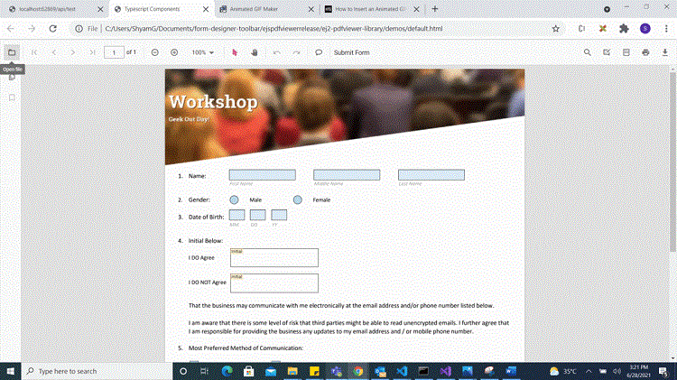
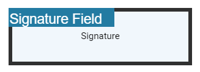
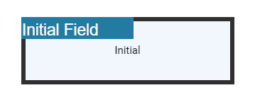

# Create programmatically in React Pdf viewer control

The PDF Viewer component provides options to add, edit, and delete form fields. The supported form field types are:

- Textbox
- Password
- CheckBox
- RadioButton
- ListBox
- DropDown
- Signature field
- Initial field

## Add a form field to PDF document programmatically

Use the addFormField method to add form fields programmatically. Pass the form field type and the corresponding property object as parameters. The following example demonstrates adding multiple fields on document load.




import * as ReactDOM from 'react-dom';
import * as React from 'react';
import { PdfViewerComponent, Toolbar, Magnification, Navigation, LinkAnnotation, BookmarkView, ThumbnailView,
         Print, TextSelection, Annotation, TextSearch, Inject, FormDesigner, FormFields} from '@syncfusion/ej2-react-pdfviewer';

function App() {
  function documentLoaded(){
    var viewer = document.getElementById('container').ej2_instances[0];
    viewer.formDesignerModule.addFormField("Textbox", { name: "First Name", bounds: { X: 146, Y: 229, Width: 150, Height: 24 }});
    viewer.formDesignerModule.addFormField("Textbox", { name: "Middle Name", bounds: { X: 338, Y: 229, Width: 150, Height: 24 }});
    viewer.formDesignerModule.addFormField('Textbox', {name: 'Last Name',bounds: { X: 530, Y: 229, Width: 150, Height: 24 },});
    viewer.formDesignerModule.addFormField('RadioButton', {bounds: { X: 148, Y: 289, Width: 18, Height: 18 },name: 'Gender',isSelected: false,});
    viewer.formDesignerModule.addFormField('RadioButton', {bounds: { X: 292, Y: 289, Width: 18, Height: 18 },name: 'Gender',isSelected: false,});
    viewer.formDesignerModule.addFormField('Textbox', {name: 'DOB Month',bounds: { X: 146, Y: 320, Width: 35, Height: 24 },});
    viewer.formDesignerModule.addFormField('Textbox', {name: 'DOB Date',bounds: { X: 193, Y: 320, Width: 35, Height: 24 },});
    viewer.formDesignerModule.addFormField('Textbox', {name: 'DOB Year',bounds: { X: 242, Y: 320, Width: 35, Height: 24 },});
    viewer.formDesignerModule.addFormField('InitialField', {name: 'Agree',bounds: { X: 148, Y: 408, Width: 200, Height: 43 },});
    viewer.formDesignerModule.addFormField('InitialField', {name: 'Do Not Agree',bounds: { X: 148, Y: 466, Width: 200, Height: 43 },});
    viewer.formDesignerModule.addFormField('CheckBox', {name: 'Text Message',bounds: { X: 56, Y: 664, Width: 20, Height: 20 },isChecked: false,});
    viewer.formDesignerModule.addFormField('CheckBox', {name: 'Email',bounds: { X: 242, Y: 664, Width: 20, Height: 20 },isChecked: false,});
    viewer.formDesignerModule.addFormField('CheckBox', {name: 'Appointment Reminder',bounds: { X: 56, Y: 740, Width: 20, Height: 20 },isChecked: false,});
    viewer.formDesignerModule.addFormField('CheckBox', {name: 'Request for Customerservice',bounds: { X: 56, Y: 778, Width: 20, Height: 20 },isChecked: false,});
    viewer.formDesignerModule.addFormField('CheckBox', {name: 'Information Billing',bounds: { X: 290, Y: 740, Width: 20, Height: 20 },isChecked: false,});
    viewer.formDesignerModule.addFormField('Textbox', {name: 'My Email',bounds: { X: 146, Y: 850, Width: 200, Height: 24 },});
    viewer.formDesignerModule.addFormField('Textbox', {name: 'My Phone',bounds: { X: 482, Y: 850, Width: 200, Height: 24 },});
    viewer.formDesignerModule.addFormField('SignatureField', {name: 'Sign',bounds: { X: 57, Y: 923, Width: 200, Height: 43 },});
    viewer.formDesignerModule.addFormField('Textbox', {name: 'DOS Month',bounds: { X: 386, Y: 923, Width: 35, Height: 24 },});
    viewer.formDesignerModule.addFormField('Textbox', {name: 'DOS Date',bounds: { X: 434, Y: 923, Width: 35, Height: 24 },});
    viewer.formDesignerModule.addFormField('Textbox', {name: 'DOS Year',bounds: { X: 482, Y: 923, Width: 35, Height: 24 },});
  }
  return (<div>
    <div className='control-section'>
      {/* Render the PDF Viewer */}
      <PdfViewerComponent
        id="container"
        documentPath="https://cdn.syncfusion.com/content/pdf/form-designer.pdf"
        resourceUrl="https://cdn.syncfusion.com/ej2/24.1.41/dist/ej2-pdfviewer-lib"
        documentLoad={documentLoaded}
        style={{ 'height': '640px' }}>

              <Inject services={[ Toolbar, Magnification, Navigation, Annotation, LinkAnnotation, BookmarkView, ThumbnailView,
                                  Print, TextSelection, TextSearch, FormDesigner, FormFields ]} />
      </PdfViewerComponent>
    </div>
  </div>);
}
const root = ReactDOM.createRoot(document.getElementById('sample'));
root.render(<App />);




import * as ReactDOM from 'react-dom';
import * as React from 'react';
import  { PdfViewerComponent, Toolbar, Magnification, Navigation, LinkAnnotation, BookmarkView, ThumbnailView,
         Print, TextSelection, Annotation, TextSearch, Inject, FormDesigner, FormFields} from '@syncfusion/ej2-react-pdfviewer';

export function App() {
  function documentLoaded(){
    var viewer = document.getElementById('container').ej2_instances[0];
    viewer.formDesignerModule.addFormField("Textbox", { name: "Textbox", bounds: { X: 146, Y: 229, Width: 150, Height: 24 } });
    viewer.formDesignerModule.addFormField("Textbox", { name: "First Name", bounds: { X: 146, Y: 229, Width: 150, Height: 24 }});
    viewer.formDesignerModule.addFormField("Textbox", { name: "Middle Name", bounds: { X: 338, Y: 229, Width: 150, Height: 24 }});
    viewer.formDesignerModule.addFormField('Textbox', {name: 'Last Name',bounds: { X: 530, Y: 229, Width: 150, Height: 24 },});
    viewer.formDesignerModule.addFormField('RadioButton', {bounds: { X: 148, Y: 289, Width: 18, Height: 18 },name: 'Gender',isSelected: false,});
    viewer.formDesignerModule.addFormField('RadioButton', {bounds: { X: 292, Y: 289, Width: 18, Height: 18 },name: 'Gender',isSelected: false,});
    viewer.formDesignerModule.addFormField('Textbox', {name: 'DOB Month',bounds: { X: 146, Y: 320, Width: 35, Height: 24 },});
    viewer.formDesignerModule.addFormField('Textbox', {name: 'DOB Date',bounds: { X: 193, Y: 320, Width: 35, Height: 24 },});
    viewer.formDesignerModule.addFormField('Textbox', {name: 'DOB Year',bounds: { X: 242, Y: 320, Width: 35, Height: 24 },});
    viewer.formDesignerModule.addFormField('InitialField', {name: 'Agree',bounds: { X: 148, Y: 408, Width: 200, Height: 43 },});
    viewer.formDesignerModule.addFormField('InitialField', {name: 'Do Not Agree',bounds: { X: 148, Y: 466, Width: 200, Height: 43 },});
    viewer.formDesignerModule.addFormField('CheckBox', {name: 'Text Message',bounds: { X: 56, Y: 664, Width: 20, Height: 20 },isChecked: false,});
    viewer.formDesignerModule.addFormField('CheckBox', {name: 'Email',bounds: { X: 242, Y: 664, Width: 20, Height: 20 },isChecked: false,});
    viewer.formDesignerModule.addFormField('CheckBox', {name: 'Appointment Reminder',bounds: { X: 56, Y: 740, Width: 20, Height: 20 },isChecked: false,});
    viewer.formDesignerModule.addFormField('CheckBox', {name: 'Request for Customerservice',bounds: { X: 56, Y: 778, Width: 20, Height: 20 },isChecked: false,});
    viewer.formDesignerModule.addFormField('CheckBox', {name: 'Information Billing',bounds: { X: 290, Y: 740, Width: 20, Height: 20 },isChecked: false,});
    viewer.formDesignerModule.addFormField('Textbox', {name: 'My Email',bounds: { X: 146, Y: 850, Width: 200, Height: 24 },});
    viewer.formDesignerModule.addFormField('Textbox', {name: 'My Phone',bounds: { X: 482, Y: 850, Width: 200, Height: 24 },});
    viewer.formDesignerModule.addFormField('SignatureField', {name: 'Sign',bounds: { X: 57, Y: 923, Width: 200, Height: 43 },});
    viewer.formDesignerModule.addFormField('Textbox', {name: 'DOS Month',bounds: { X: 386, Y: 923, Width: 35, Height: 24 },});
    viewer.formDesignerModule.addFormField('Textbox', {name: 'DOS Date',bounds: { X: 434, Y: 923, Width: 35, Height: 24 },});
    viewer.formDesignerModule.addFormField('Textbox', {name: 'DOS Year',bounds: { X: 482, Y: 923, Width: 35, Height: 24 },});
  }
  return (<div>
    <div className='control-section'>
      {/* Render the PDF Viewer */}
      <PdfViewerComponent
        id="container"
        documentPath="https://cdn.syncfusion.com/content/pdf/form-designer.pdf"
        resourceUrl="https://cdn.syncfusion.com/ej2/24.1.41/dist/ej2-pdfviewer-lib"
        documentLoad={documentLoaded}
        style={{ 'height': '640px' }}>

              <Inject services={[ Toolbar, Magnification, Navigation, Annotation, LinkAnnotation, BookmarkView, ThumbnailView,
                                  Print, TextSelection, TextSearch, FormDesigner, FormFields ]} />
      </PdfViewerComponent>
    </div>
  </div>);
}
const root = ReactDOM.createRoot(document.getElementById('sample'));
root.render(<App />);




N> To configure the server-backed PDF Viewer, add the following `serviceUrl` in the `index.ts` file:
`pdfviewer.serviceUrl = 'https://document.syncfusion.com/web-services/pdf-viewer/api/pdfviewer/';`



## Edit/Update form field programmatically

Use the updateFormField method to modify a form field programmatically. Retrieve the target field from the formFieldCollections property (by object or ID) and pass it as the first parameter. Provide the properties to update as the second parameter. The following example updates the background color of a Textbox field.




import * as ReactDOM from 'react-dom';
import * as React from 'react';
import  { PdfViewerComponent, Toolbar, Magnification, Navigation, LinkAnnotation, BookmarkView,ThumbnailView,
         Print, TextSelection, Annotation, TextSearch, FormDesigner, FormFields, Inject } from '@syncfusion/ej2-react-pdfviewer';

export function App() {
  function documentLoaded() {
    var viewer = document.getElementById('container').ej2_instances[0];
    viewer.formDesignerModule.addFormField("Textbox", { name: "First Name", bounds: { X: 146, Y: 229, Width: 150, Height: 24 }});
    viewer.formDesignerModule.addFormField("Textbox", { name: "Middle Name", bounds: { X: 338, Y: 229, Width: 150, Height: 24 }});
    viewer.formDesignerModule.addFormField('Textbox', {name: 'Last Name',bounds: { X: 530, Y: 229, Width: 150, Height: 24 },});
    viewer.formDesignerModule.addFormField('RadioButton', {bounds: { X: 148, Y: 289, Width: 18, Height: 18 },name: 'Gender',isSelected: false,});
    viewer.formDesignerModule.addFormField('RadioButton', {bounds: { X: 292, Y: 289, Width: 18, Height: 18 },name: 'Gender',isSelected: false,});
    viewer.formDesignerModule.addFormField('Textbox', {name: 'DOB Month',bounds: { X: 146, Y: 320, Width: 35, Height: 24 },});
    viewer.formDesignerModule.addFormField('Textbox', {name: 'DOB Date',bounds: { X: 193, Y: 320, Width: 35, Height: 24 },});
    viewer.formDesignerModule.addFormField('Textbox', {name: 'DOB Year',bounds: { X: 242, Y: 320, Width: 35, Height: 24 },});
    viewer.formDesignerModule.addFormField('InitialField', {name: 'Agree',bounds: { X: 148, Y: 408, Width: 200, Height: 43 },});
    viewer.formDesignerModule.addFormField('InitialField', {name: 'Do Not Agree',bounds: { X: 148, Y: 466, Width: 200, Height: 43 },});
    viewer.formDesignerModule.addFormField('CheckBox', {name: 'Text Message',bounds: { X: 56, Y: 664, Width: 20, Height: 20 },isChecked: false,});
    viewer.formDesignerModule.addFormField('CheckBox', {name: 'Email',bounds: { X: 242, Y: 664, Width: 20, Height: 20 },isChecked: false,});
    viewer.formDesignerModule.addFormField('CheckBox', {name: 'Appointment Reminder',bounds: { X: 56, Y: 740, Width: 20, Height: 20 },isChecked: false,});
    viewer.formDesignerModule.addFormField('CheckBox', {name: 'Request for Customerservice',bounds: { X: 56, Y: 778, Width: 20, Height: 20 },isChecked: false,});
    viewer.formDesignerModule.addFormField('CheckBox', {name: 'Information Billing',bounds: { X: 290, Y: 740, Width: 20, Height: 20 },isChecked: false,});
    viewer.formDesignerModule.addFormField('Textbox', {name: 'My Email',bounds: { X: 146, Y: 850, Width: 200, Height: 24 },});
    viewer.formDesignerModule.addFormField('Textbox', {name: 'My Phone',bounds: { X: 482, Y: 850, Width: 200, Height: 24 },});
    viewer.formDesignerModule.addFormField('SignatureField', {name: 'Sign',bounds: { X: 57, Y: 923, Width: 200, Height: 43 },});
    viewer.formDesignerModule.addFormField('Textbox', {name: 'DOS Month',bounds: { X: 386, Y: 923, Width: 35, Height: 24 },});
    viewer.formDesignerModule.addFormField('Textbox', {name: 'DOS Date',bounds: { X: 434, Y: 923, Width: 35, Height: 24 },});
    viewer.formDesignerModule.addFormField('Textbox', {name: 'DOS Year',bounds: { X: 482, Y: 923, Width: 35, Height: 24 },});
    viewer.formDesignerModule.updateFormField(viewer.formFieldCollections[0], { backgroundColor: 'red' });
  }
  return (<div>
    <div className='control-section'>
      {/* Render the PDF Viewer */}
      <PdfViewerComponent
        id="container"
        documentPath="https://cdn.syncfusion.com/content/pdf/form-designer.pdf"
        resourceUrl="https://cdn.syncfusion.com/ej2/24.1.41/dist/ej2-pdfviewer-lib"
        documentLoad={documentLoaded}
        style={{ 'height': '640px' }}>

              <Inject services={[ Toolbar, Magnification, Navigation, Annotation, LinkAnnotation, BookmarkView, ThumbnailView,
                                  Print, TextSelection, TextSearch, FormDesigner, FormFields]} />
      </PdfViewerComponent>
    </div>
  </div>);
}
const root = ReactDOM.createRoot(document.getElementById('sample'));
root.render(<App />);




import * as ReactDOM from 'react-dom';
import * as React from 'react';
import  { PdfViewerComponent, Toolbar, Magnification, Navigation, LinkAnnotation, BookmarkView,ThumbnailView,
         Print, TextSelection, Annotation, TextSearch, FormDesigner, FormFields, Inject } from '@syncfusion/ej2-react-pdfviewer';

export function App() {
  function documentLoaded() {
    var viewer = document.getElementById('container').ej2_instances[0];
    viewer.formDesignerModule.addFormField("Textbox", { name: "First Name", bounds: { X: 146, Y: 229, Width: 150, Height: 24 }});
    viewer.formDesignerModule.addFormField("Textbox", { name: "Middle Name", bounds: { X: 338, Y: 229, Width: 150, Height: 24 }});
    viewer.formDesignerModule.addFormField('Textbox', {name: 'Last Name',bounds: { X: 530, Y: 229, Width: 150, Height: 24 },});
    viewer.formDesignerModule.addFormField('RadioButton', {bounds: { X: 148, Y: 289, Width: 18, Height: 18 },name: 'Gender',isSelected: false,});
    viewer.formDesignerModule.addFormField('RadioButton', {bounds: { X: 292, Y: 289, Width: 18, Height: 18 },name: 'Gender',isSelected: false,});
    viewer.formDesignerModule.addFormField('Textbox', {name: 'DOB Month',bounds: { X: 146, Y: 320, Width: 35, Height: 24 },});
    viewer.formDesignerModule.addFormField('Textbox', {name: 'DOB Date',bounds: { X: 193, Y: 320, Width: 35, Height: 24 },});
    viewer.formDesignerModule.addFormField('Textbox', {name: 'DOB Year',bounds: { X: 242, Y: 320, Width: 35, Height: 24 },});
    viewer.formDesignerModule.addFormField('InitialField', {name: 'Agree',bounds: { X: 148, Y: 408, Width: 200, Height: 43 },});
    viewer.formDesignerModule.addFormField('InitialField', {name: 'Do Not Agree',bounds: { X: 148, Y: 466, Width: 200, Height: 43 },});
    viewer.formDesignerModule.addFormField('CheckBox', {name: 'Text Message',bounds: { X: 56, Y: 664, Width: 20, Height: 20 },isChecked: false,});
    viewer.formDesignerModule.addFormField('CheckBox', {name: 'Email',bounds: { X: 242, Y: 664, Width: 20, Height: 20 },isChecked: false,});
    viewer.formDesignerModule.addFormField('CheckBox', {name: 'Appointment Reminder',bounds: { X: 56, Y: 740, Width: 20, Height: 20 },isChecked: false,});
    viewer.formDesignerModule.addFormField('CheckBox', {name: 'Request for Customerservice',bounds: { X: 56, Y: 778, Width: 20, Height: 20 },isChecked: false,});
    viewer.formDesignerModule.addFormField('CheckBox', {name: 'Information Billing',bounds: { X: 290, Y: 740, Width: 20, Height: 20 },isChecked: false,});
    viewer.formDesignerModule.addFormField('Textbox', {name: 'My Email',bounds: { X: 146, Y: 850, Width: 200, Height: 24 },});
    viewer.formDesignerModule.addFormField('Textbox', {name: 'My Phone',bounds: { X: 482, Y: 850, Width: 200, Height: 24 },});
    viewer.formDesignerModule.addFormField('SignatureField', {name: 'Sign',bounds: { X: 57, Y: 923, Width: 200, Height: 43 },});
    viewer.formDesignerModule.addFormField('Textbox', {name: 'DOS Month',bounds: { X: 386, Y: 923, Width: 35, Height: 24 },});
    viewer.formDesignerModule.addFormField('Textbox', {name: 'DOS Date',bounds: { X: 434, Y: 923, Width: 35, Height: 24 },});
    viewer.formDesignerModule.addFormField('Textbox', {name: 'DOS Year',bounds: { X: 482, Y: 923, Width: 35, Height: 24 },});
    viewer.formDesignerModule.updateFormField(viewer.formFieldCollections[0], { backgroundColor: 'red' });
  }
  return (<div>
    <div className='control-section'>
      {/* Render the PDF Viewer */}
      <PdfViewerComponent
        id="container"
        documentPath="https://cdn.syncfusion.com/content/pdf/form-designer.pdf"
        resourceUrl="https://cdn.syncfusion.com/ej2/24.1.41/dist/ej2-pdfviewer-lib"
        documentLoad={documentLoaded}
        style={{ 'height': '640px' }}>

              <Inject services={[ Toolbar, Magnification, Navigation, Annotation, LinkAnnotation, BookmarkView, ThumbnailView,
                                  Print, TextSelection, TextSearch, FormDesigner, FormFields]} />
      </PdfViewerComponent>
    </div>
  </div>);
}
const root = ReactDOM.createRoot(document.getElementById('sample'));
root.render(<App />);




N> To configure the server-backed PDF Viewer, add the following `serviceUrl` in the `index.ts` file:
`pdfviewer.serviceUrl = 'https://document.syncfusion.com/web-services/pdf-viewer/api/pdfviewer/';`



## Delete form field programmatically

Use the deleteFormField method to remove a form field programmatically. Retrieve the target field from the formFieldCollections property (by object or ID) and pass it to deleteFormField. The following example deletes the first form field.




import * as ReactDOM from 'react-dom';
import * as React from 'react';
import  { PdfViewerComponent, Toolbar, Magnification, Navigation, LinkAnnotation, BookmarkView,ThumbnailView,
         Print, TextSelection, Annotation, TextSearch, FormDesigner, FormFields, Inject } from '@syncfusion/ej2-react-pdfviewer';

export function App() {
  function documentLoaded(){
    var viewer = document.getElementById('container').ej2_instances[0];
    viewer.formDesignerModule.addFormField("Textbox", { name: "First Name", bounds: { X: 146, Y: 229, Width: 150, Height: 24 }});
    viewer.formDesignerModule.addFormField("Textbox", { name: "Middle Name", bounds: { X: 338, Y: 229, Width: 150, Height: 24 }});
    viewer.formDesignerModule.addFormField('Textbox', {name: 'Last Name',bounds: { X: 530, Y: 229, Width: 150, Height: 24 },});
    viewer.formDesignerModule.addFormField('RadioButton', {bounds: { X: 148, Y: 289, Width: 18, Height: 18 },name: 'Gender',isSelected: false,});
    viewer.formDesignerModule.addFormField('RadioButton', {bounds: { X: 292, Y: 289, Width: 18, Height: 18 },name: 'Gender',isSelected: false,});
    viewer.formDesignerModule.addFormField('Textbox', {name: 'DOB Month',bounds: { X: 146, Y: 320, Width: 35, Height: 24 },});
    viewer.formDesignerModule.addFormField('Textbox', {name: 'DOB Date',bounds: { X: 193, Y: 320, Width: 35, Height: 24 },});
    viewer.formDesignerModule.addFormField('Textbox', {name: 'DOB Year',bounds: { X: 242, Y: 320, Width: 35, Height: 24 },});
    viewer.formDesignerModule.addFormField('InitialField', {name: 'Agree',bounds: { X: 148, Y: 408, Width: 200, Height: 43 },});
    viewer.formDesignerModule.addFormField('InitialField', {name: 'Do Not Agree',bounds: { X: 148, Y: 466, Width: 200, Height: 43 },});
    viewer.formDesignerModule.addFormField('CheckBox', {name: 'Text Message',bounds: { X: 56, Y: 664, Width: 20, Height: 20 },isChecked: false,});
    viewer.formDesignerModule.addFormField('CheckBox', {name: 'Email',bounds: { X: 242, Y: 664, Width: 20, Height: 20 },isChecked: false,});
    viewer.formDesignerModule.addFormField('CheckBox', {name: 'Appointment Reminder',bounds: { X: 56, Y: 740, Width: 20, Height: 20 },isChecked: false,});
    viewer.formDesignerModule.addFormField('CheckBox', {name: 'Request for Customerservice',bounds: { X: 56, Y: 778, Width: 20, Height: 20 },isChecked: false,});
    viewer.formDesignerModule.addFormField('CheckBox', {name: 'Information Billing',bounds: { X: 290, Y: 740, Width: 20, Height: 20 },isChecked: false,});
    viewer.formDesignerModule.addFormField('Textbox', {name: 'My Email',bounds: { X: 146, Y: 850, Width: 200, Height: 24 },});
    viewer.formDesignerModule.addFormField('Textbox', {name: 'My Phone',bounds: { X: 482, Y: 850, Width: 200, Height: 24 },});
    viewer.formDesignerModule.addFormField('SignatureField', {name: 'Sign',bounds: { X: 57, Y: 923, Width: 200, Height: 43 },});
    viewer.formDesignerModule.addFormField('Textbox', {name: 'DOS Month',bounds: { X: 386, Y: 923, Width: 35, Height: 24 },});
    viewer.formDesignerModule.addFormField('Textbox', {name: 'DOS Date',bounds: { X: 434, Y: 923, Width: 35, Height: 24 },});
    viewer.formDesignerModule.addFormField('Textbox', {name: 'DOS Year',bounds: { X: 482, Y: 923, Width: 35, Height: 24 },});
    viewer.formDesignerModule.deleteFormField(viewer.formFieldCollections[0]);
  }
  return (<div>
    <div className='control-section'>
    {/* Render the PDF Viewer */}
      <PdfViewerComponent
        id="container"
        documentPath="https://cdn.syncfusion.com/content/pdf/form-designer.pdf"
        resourceUrl="https://cdn.syncfusion.com/ej2/24.1.41/dist/ej2-pdfviewer-lib"
        documentLoad={documentLoaded}
        style={{ 'height': '640px' }}>

              <Inject services={[ Toolbar, Magnification, Navigation, Annotation, LinkAnnotation, BookmarkView,
                                  ThumbnailView, Print, TextSelection, TextSearch, FormDesigner, FormFields]} />
      </PdfViewerComponent>
    </div>
  </div>);
}
const root = ReactDOM.createRoot(document.getElementById('sample'));
root.render(<App />);




import * as ReactDOM from 'react-dom';
import * as React from 'react';
import  { PdfViewerComponent, Toolbar, Magnification, Navigation, LinkAnnotation, BookmarkView,ThumbnailView,
         Print, TextSelection, Annotation, TextSearch, FormDesigner, FormFields, Inject } from '@syncfusion/ej2-react-pdfviewer';

export function App() {
  function documentLoaded(){
    var viewer = document.getElementById('container').ej2_instances[0];
    viewer.formDesignerModule.addFormField("Textbox", { name: "First Name", bounds: { X: 146, Y: 229, Width: 150, Height: 24 }});
    viewer.formDesignerModule.addFormField("Textbox", { name: "Middle Name", bounds: { X: 338, Y: 229, Width: 150, Height: 24 }});
    viewer.formDesignerModule.addFormField('Textbox', {name: 'Last Name',bounds: { X: 530, Y: 229, Width: 150, Height: 24 },});
    viewer.formDesignerModule.addFormField('RadioButton', {bounds: { X: 148, Y: 289, Width: 18, Height: 18 },name: 'Gender',isSelected: false,});
    viewer.formDesignerModule.addFormField('RadioButton', {bounds: { X: 292, Y: 289, Width: 18, Height: 18 },name: 'Gender',isSelected: false,});
    viewer.formDesignerModule.addFormField('Textbox', {name: 'DOB Month',bounds: { X: 146, Y: 320, Width: 35, Height: 24 },});
    viewer.formDesignerModule.addFormField('Textbox', {name: 'DOB Date',bounds: { X: 193, Y: 320, Width: 35, Height: 24 },});
    viewer.formDesignerModule.addFormField('Textbox', {name: 'DOB Year',bounds: { X: 242, Y: 320, Width: 35, Height: 24 },});
    viewer.formDesignerModule.addFormField('InitialField', {name: 'Agree',bounds: { X: 148, Y: 408, Width: 200, Height: 43 },});
    viewer.formDesignerModule.addFormField('InitialField', {name: 'Do Not Agree',bounds: { X: 148, Y: 466, Width: 200, Height: 43 },});
    viewer.formDesignerModule.addFormField('CheckBox', {name: 'Text Message',bounds: { X: 56, Y: 664, Width: 20, Height: 20 },isChecked: false,});
    viewer.formDesignerModule.addFormField('CheckBox', {name: 'Email',bounds: { X: 242, Y: 664, Width: 20, Height: 20 },isChecked: false,});
    viewer.formDesignerModule.addFormField('CheckBox', {name: 'Appointment Reminder',bounds: { X: 56, Y: 740, Width: 20, Height: 20 },isChecked: false,});
    viewer.formDesignerModule.addFormField('CheckBox', {name: 'Request for Customerservice',bounds: { X: 56, Y: 778, Width: 20, Height: 20 },isChecked: false,});
    viewer.formDesignerModule.addFormField('CheckBox', {name: 'Information Billing',bounds: { X: 290, Y: 740, Width: 20, Height: 20 },isChecked: false,});
    viewer.formDesignerModule.addFormField('Textbox', {name: 'My Email',bounds: { X: 146, Y: 850, Width: 200, Height: 24 },});
    viewer.formDesignerModule.addFormField('Textbox', {name: 'My Phone',bounds: { X: 482, Y: 850, Width: 200, Height: 24 },});
    viewer.formDesignerModule.addFormField('SignatureField', {name: 'Sign',bounds: { X: 57, Y: 923, Width: 200, Height: 43 },});
    viewer.formDesignerModule.addFormField('Textbox', {name: 'DOS Month',bounds: { X: 386, Y: 923, Width: 35, Height: 24 },});
    viewer.formDesignerModule.addFormField('Textbox', {name: 'DOS Date',bounds: { X: 434, Y: 923, Width: 35, Height: 24 },});
    viewer.formDesignerModule.addFormField('Textbox', {name: 'DOS Year',bounds: { X: 482, Y: 923, Width: 35, Height: 24 },});
    viewer.formDesignerModule.deleteFormField(viewer.formFieldCollections[0]);
  }
  return (<div>
    <div className='control-section'>
    {/* Render the PDF Viewer */}
      <PdfViewerComponent
        id="container"
        documentPath="https://cdn.syncfusion.com/content/pdf/form-designer.pdf"
        resourceUrl="https://cdn.syncfusion.com/ej2/24.1.41/dist/ej2-pdfviewer-lib"
        documentLoad={documentLoaded}
        style={{ 'height': '640px' }}>

              <Inject services={[ Toolbar, Magnification, Navigation, Annotation, LinkAnnotation, BookmarkView,
                                  ThumbnailView, Print, TextSelection, TextSearch, FormDesigner, FormFields]} />
      </PdfViewerComponent>
    </div>
  </div>);
}
const root = ReactDOM.createRoot(document.getElementById('sample'));
root.render(<App />);




N> To configure the server-backed PDF Viewer, add the following `serviceUrl` in the `index.ts` file:
`pdfviewer.serviceUrl = 'https://document.syncfusion.com/web-services/pdf-viewer/api/pdfviewer/';`



## setFormFieldMode programmatically

The setFormFieldMode method enables adding a form field dynamically by specifying the field type. For example, the following adds a Password field when a button is clicked.





import * as ReactDOM from 'react-dom';
import * as React from 'react';
import { PdfViewerComponent, Toolbar, Magnification, Navigation, LinkAnnotation, BookmarkView, ThumbnailView,
         Print, TextSelection, Annotation, TextSearch, FormFields, FormDesigner, Inject } from '@syncfusion/ej2-react-pdfviewer';

function App() {
  function addPasswordField() {
    var viewer = document.getElementById('container').ej2_instances[0];
    viewer.formDesignerModule.setFormFieldMode("Password");
  }
  return (<div>
    <div className='control-section'>
      {/* Render the PDF Viewer */}
      <button onClick={addPasswordField}>Add Password Field</button>
      <PdfViewerComponent
        id="container"
        documentPath="https://cdn.syncfusion.com/content/pdf/pdf-succinctly.pdf"
        resourceUrl="https://cdn.syncfusion.com/ej2/24.1.41/dist/ej2-pdfviewer-lib"
        style={{ 'height': '640px' }}>

              <Inject services={[ Toolbar, Magnification, Navigation, LinkAnnotation, Annotation, BookmarkView,
                                  ThumbnailView, Print, TextSelection, TextSearch, FormDesigner, FormFields]} />
      </PdfViewerComponent>
    </div>
  </div>);
}
const root = ReactDOM.createRoot(document.getElementById('sample'));
root.render(<App />);






import * as ReactDOM from 'react-dom';
import * as React from 'react';
import { PdfViewerComponent, Toolbar, Magnification, Navigation, LinkAnnotation, BookmarkView, ThumbnailView,
         Print, TextSelection, Annotation, TextSearch, FormFields, FormDesigner, Inject } from '@syncfusion/ej2-react-pdfviewer';

function App() {
  function addPasswordField() {
    var viewer = document.getElementById('container').ej2_instances[0];
    viewer.formDesignerModule.setFormFieldMode("Password");
  }
  return (<div>
    <div className='control-section'>
      {/* Render the PDF Viewer */}
      <button onClick={addPasswordField}>Add Password Field</button>
      <PdfViewerComponent
        id="container"
        documentPath="https://cdn.syncfusion.com/content/pdf/pdf-succinctly.pdf"
        serviceUrl="https://document.syncfusion.com/web-services/pdf-viewer/api/pdfviewer"
        style={{ 'height': '640px' }}>

              <Inject services={[ Toolbar, Magnification, Navigation, LinkAnnotation, Annotation, BookmarkView,
                                  ThumbnailView, Print, TextSelection, TextSearch, FormDesigner, FormFields]} />
      </PdfViewerComponent>
    </div>
  </div>);
}
const root = ReactDOM.createRoot(document.getElementById('sample'));
root.render(<App />);





## Saving the form fields

Selecting the Download icon on the toolbar saves the form fields in the exported PDF without modifying the original document. See the following GIF for reference.


You can invoke the download action using the following code snippet.





import * as ReactDOM from 'react-dom';
import * as React from 'react';
import { PdfViewerComponent, Toolbar, Magnification, Navigation, LinkAnnotation, BookmarkView,ThumbnailView,
         Print, TextSelection, Annotation, TextSearch, Inject } from '@syncfusion/ej2-react-pdfviewer';
let pdfviewer;

function App() {
  function downloadClicked() {
    var viewer = document.getElementById('container').ej2_instances[0];
    viewer.download();
  }
  return (<div>
    <div className='control-section'>
      {/* Render the PDF Viewer */}
      <button onClick={downloadClicked}>Download</button>
      <PdfViewerComponent ref={(scope) => { pdfviewer = scope; }}
        id="container"
        documentPath="https://cdn.syncfusion.com/content/pdf/pdf-succinctly.pdf"
        resourceUrl="https://cdn.syncfusion.com/ej2/24.1.41/dist/ej2-pdfviewer-lib"
        style={{ 'height': '640px' }}>

              <Inject services={[ Toolbar, Magnification, Navigation, LinkAnnotation, Annotation, BookmarkView,
                                  ThumbnailView, Print, TextSelection, TextSearch]} />
      </PdfViewerComponent>
    </div>
  </div>);
}
const root = ReactDOM.createRoot(document.getElementById('sample'));
root.render(<App />);






import * as ReactDOM from 'react-dom';
import * as React from 'react';
import { PdfViewerComponent, Toolbar, Magnification, Navigation, LinkAnnotation, BookmarkView,ThumbnailView,
         Print, TextSelection, Annotation, TextSearch, Inject } from '@syncfusion/ej2-react-pdfviewer';
let pdfviewer;

function App() {
  function downloadClicked() {
    var viewer = document.getElementById('container').ej2_instances[0];
    viewer.download();
  }
  return (<div>
    <div className='control-section'>
      {/* Render the PDF Viewer */}
      <button onClick={downloadClicked}>Download</button>
      <PdfViewerComponent ref={(scope) => { pdfviewer = scope; }}
        id="container"
         documentPath="https://cdn.syncfusion.com/content/pdf/pdf-succinctly.pdf"
        serviceUrl="https://document.syncfusion.com/web-services/pdf-viewer/api/pdfviewer"
        style={{ 'height': '640px' }}>

              <Inject services={[ Toolbar, Magnification, Navigation, LinkAnnotation, Annotation, BookmarkView,
                                  ThumbnailView, Print, TextSelection, TextSearch]} />
      </PdfViewerComponent>
    </div>
  </div>);
}
const root = ReactDOM.createRoot(document.getElementById('sample'));
root.render(<App />);





## Printing the form fields

Selecting the Print icon on the toolbar prints the PDF with the added form fields. This action does not modify the original document. See the following GIF for reference.


You can invoke the print action using the following code snippet:





import * as ReactDOM from 'react-dom';
import * as React from 'react';
import { PdfViewerComponent, Toolbar, Magnification, Navigation, LinkAnnotation, BookmarkView,ThumbnailView,
         Print, TextSelection, TextSearch, Annotation, Inject } from '@syncfusion/ej2-react-pdfviewer';
let pdfviewer;

function App() {
  return (<div>
    <div className='control-section'>
      {/* Render the PDF Viewer */}
      <PdfViewerComponent ref={(scope) => { pdfviewer = scope; }}
        id="container"
         documentPath="https://cdn.syncfusion.com/content/pdf/pdf-succinctly.pdf"
         resourceUrl="https://cdn.syncfusion.com/ej2/24.1.41/dist/ej2-pdfviewer-lib"
        enablePrint={true}
        style={{ 'height': '640px' }}>

              <Inject services={[ Toolbar, Annotation, Magnification, Navigation, LinkAnnotation, BookmarkView,
                                  ThumbnailView, Print, TextSelection, TextSearch ]} />
      </PdfViewerComponent>
    </div>
  </div>);
}
const root = ReactDOM.createRoot(document.getElementById('sample'));
root.render(<App />);






import * as ReactDOM from 'react-dom';
import * as React from 'react';
import { PdfViewerComponent, Toolbar, Magnification, Navigation, LinkAnnotation, BookmarkView,ThumbnailView,
         Print, TextSelection, TextSearch, Annotation, Inject } from '@syncfusion/ej2-react-pdfviewer';
let pdfviewer;

function App() {
  return (<div>
    <div className='control-section'>
      {/* Render the PDF Viewer */}
      <PdfViewerComponent ref={(scope) => { pdfviewer = scope; }}
        id="container"
         documentPath="https://cdn.syncfusion.com/content/pdf/pdf-succinctly.pdf"
        enablePrint={true}
        serviceUrl="https://document.syncfusion.com/web-services/pdf-viewer/api/pdfviewer"
        style={{ 'height': '640px' }}>

              <Inject services={[ Toolbar, Annotation, Magnification, Navigation, LinkAnnotation, BookmarkView,
                                  ThumbnailView, Print, TextSelection, TextSearch ]} />
      </PdfViewerComponent>
    </div>
  </div>);
}
const root = ReactDOM.createRoot(document.getElementById('sample'));
root.render(<App />);





## Open the existing PDF document

Open a PDF that already contains form fields by clicking the Open icon on the toolbar. See the following GIF for reference.



## Validate form fields

Form fields are validated when enableFormFieldsValidation is set to true and the validateFormFields event is handled. The event triggers during download or print if required fields are not filled. The non-filled fields are available in the nonFillableFields property of the event arguments.

Add the following code to validate form fields:





import * as ReactDOM from 'react-dom';
import * as React from 'react';
import { PdfViewerComponent, Toolbar, Magnification, Navigation, LinkAnnotation, BookmarkView,ThumbnailView,
         Print, TextSelection, Annotation, TextSearch, Inject, FormDesigner, FormFields } from '@syncfusion/ej2-react-pdfviewer';
let pdfviewer;

function App() {
  function documentLoaded () {
    var viewer = document.getElementById('container').ej2_instances[0];
    viewer.formDesignerModule.addFormField("Textbox", { name: "Textbox", bounds: { X: 146, Y: 229, Width: 150, Height: 24 }});
  }
  function validateFormFields(args){
    var viewer = document.getElementById('container').ej2_instances[0];
    viewer.nonfilledFormFields = args.nonFillableFields
  }
  return (<div>
    <div className='control-section'>
      {/* Render the PDF Viewer */}
      <PdfViewerComponent ref={(scope) => { pdfviewer = scope; }}
        id="container"
        documentPath="https://cdn.syncfusion.com/content/pdf/form-designer.pdf"
        resourceUrl="https://cdn.syncfusion.com/ej2/24.1.41/dist/ej2-pdfviewer-lib"
        documentLoad={documentLoaded}
        enableFormFieldsValidation={true}
        ValidateFormFields= {validateFormFields}
        style={{ 'height': '640px' }}>

            <Inject services={[ Toolbar, Magnification, Navigation, Annotation, LinkAnnotation, BookmarkView,
                                ThumbnailView, Print, TextSelection, TextSearch, FormDesigner, FormFields ]} />
      </PdfViewerComponent>
    </div>
  </div>);
}
const root = ReactDOM.createRoot(document.getElementById('sample'));
root.render(<App />);






import * as ReactDOM from 'react-dom';
import * as React from 'react';
import { PdfViewerComponent, Toolbar, Magnification, Navigation, LinkAnnotation, BookmarkView,ThumbnailView,
         Print, TextSelection, Annotation, TextSearch, Inject, FormDesigner, FormFields } from '@syncfusion/ej2-react-pdfviewer';
let pdfviewer;

function App() {
  function documentLoaded () {
    var viewer = document.getElementById('container').ej2_instances[0];
    viewer.formDesignerModule.addFormField("Textbox", { name: "Textbox", bounds: { X: 146, Y: 229, Width: 150, Height: 24 }});
  }
  function validateFormFields(args){
    var viewer = document.getElementById('container').ej2_instances[0];
    viewer.nonfilledFormFields = args.nonFillableFields
  }
  return (<div>
    <div className='control-section'>
      {/* Render the PDF Viewer */}
      <PdfViewerComponent ref={(scope) => { pdfviewer = scope; }}
        id="container"
        documentPath="https://cdn.syncfusion.com/content/pdf/form-designer.pdf"
        serviceUrl="https://document.syncfusion.com/web-services/pdf-viewer/api/pdfviewer"
        documentLoad={documentLoaded}
        enableFormFieldsValidation={true}
        ValidateFormFields= {validateFormFields}
        style={{ 'height': '640px' }}>

            <Inject services={[ Toolbar, Magnification, Navigation, Annotation, LinkAnnotation, BookmarkView,
                                ThumbnailView, Print, TextSelection, TextSearch, FormDesigner, FormFields ]} />
      </PdfViewerComponent>
    </div>
  </div>);
}
const root = ReactDOM.createRoot(document.getElementById('sample'));
root.render(<App />);





## Export and import form fields

The PDF Viewer component supports exporting and importing form field data using the importFormFields, exportFormFields, and exportFormFieldsAsObject methods in the following formats:

- FDF
- XFDF
- JSON

### Export and import as FDF

Using the `exportFormFields` method, the form field data can be exported in the specified data format. This method accepts two parameters:

* The first one must be the destination path for the exported data. If path is not specified, it will ask for the location while exporting.
* The second parameter should be the format type of the form data.

The following example exports and imports form field data as FDF.

```

<button onclick="OnExportFdf()">Export FDF</button>
<button onclick="OnImportFdf()">Import FDF</button>

```

```ts
// Event triggers on the Export FDF button click.
function OnExportFdf() {
  var viewer = document.getElementById('container').ej2_instances[0];
  // Data must be the desired path for the exported document.
  viewer.exportFormFields('Data', FormFieldDataFormat.Fdf);
}

// Event triggers on the Import FDF button click.
function OnImportFdf() {
  var viewer = document.getElementById('container').ej2_instances[0];
  // The file for importing the form fields should be placed in the desired location and the path should be provided correctly
  viewer.importFormFields('File', FormFieldDataFormat.Fdf);
}
```

### Export and import as XFDF

The following example exports and imports form field data as XFDF.

```

<button onclick="OnExportXfdf()">Export XFDF</button>
<button onclick="OnImportXfdf()">Import XFDF</button>

```

```ts
// Event triggers on the Export XFDF button click.
function OnExportXfdf(){
  var viewer = document.getElementById('container').ej2_instances[0];
  // Data must be the desired path for the exported document.
  viewer.exportFormFields('Data', FormFieldDataFormat.Xfdf);
}

// Event triggers on the Import XFDF button click.
function OnImportXfdf(){
  var viewer = document.getElementById('container').ej2_instances[0];
  // The file for importing the form fields should be placed in the desired location and the path should be provided correctly
  viewer.importFormFields('File', FormFieldDataFormat.Xfdf);
}
```

### Export and import as JSON

The following example exports and imports form field data as JSON.

```

<button onclick="OnExportJson()">Export JSON</button>
<button onclick="OnImportJson()">Import JSON</button>

```

```ts
// Event triggers on the Export JSON button click.
function OnExportJson(){
  var viewer = document.getElementById('container').ej2_instances[0];
  // Data must be the desired path for the exported document.
  viewer.exportFormFields('Data', FormFieldDataFormat.Json);
}

// Event triggers on the Import JSON button click.
function OnImportJson(){
  var viewer = document.getElementById('container').ej2_instances[0];
  // The file for importing the form fields should be placed in the desired location and the path should be provided correctly
  viewer.importFormFields('File', FormFieldDataFormat.Json);
}
```

### Export and import as Object

The PDF Viewer component supports exporting the form field data as an object and importing that data back into the current PDF document.

The following code shows how to export the form field data as an object and import the form field data from that object into the current PDF document via a button click.

```

<button onclick="exportDataAsObject()">Export Object</button>
<button onclick="importData()">Import Data</button>

```

```ts
var exportedData;

// Event triggers on the Export Object button click.
function exportDataAsObject(){
  var viewer = document.getElementById('container').ej2_instances[0];
  // Export the form fields data to an FDF object.
  exportedData = viewer.exportFormFieldsAsObject(FormFieldDataFormat.Fdf);
  //// Export the form fields data to an XFDF object.
  //exportedData = viewer.exportFormFieldsAsObject(FormFieldDataFormat.Xfdf);
  //// Export the form fields data to an JSON object.
  //exportedData = viewer.exportFormFieldsAsObject(FormFieldDataFormat.Json);
}

// Event triggers on Import Data button click.
function importData(){
  var viewer = document.getElementById('container').ej2_instances[0];
  // Import the form fields data from the FDF object into the current PDF document.
  viewer.importFormFields(exportedData, FormFieldDataFormat.Fdf);
  //// Import the form fields data from the XFDF object into the current PDF document.
  //viewer.importFormFields(exportedData, FormFieldDataFormat.Xfdf);
  //// Import the form fields data from the JSON object into the current PDF document.
  //viewer.importFormFields(exportedData, FormFieldDataFormat.Json);
}
```
## Form field properties

Form field properties allow customization and interaction with fields embedded in PDF documents. The following sections outline the supported field types and their configurable settings.

- Textbox
- Password
- CheckBox
- RadioButton
- ListBox
- DropDown
- Signature field
- Initial field

### Signature and initial fields settings

Use the updateFormField method to modify form fields programmatically.

The following code example explains how to update the signature field properties on a button click.

```html
 <button onClick={updateProperties}>Update Properties</button>
```

```ts
// Event triggers on the Update Properties button click.
function updateProperties(){
  var viewer = document.getElementById('container').ej2_instances[0];
  var formField = viewer.retrieveFormFields();
  viewer.formDesignerModule.updateFormField(formField[0], {
    name: 'Initial',
    isReadOnly: true,
    visibility: 'visible',
    isRequired: false,
    isPrint: true,
    tooltip: 'Initial',
    thickness: 4
  });
}
```

The following code shows how to configure default properties for a signature field added from the Form Designer toolbar.





import * as ReactDOM from 'react-dom';
import * as React from 'react';
import './index.css';
import { PdfViewerComponent, Toolbar, Magnification, Navigation, LinkAnnotation, BookmarkView,
         ThumbnailView, Print, TextSelection, Annotation, TextSearch, FormFields, FormDesigner, DisplayMode, Inject} from '@syncfusion/ej2-react-pdfviewer';

function App() {
    function documentLoad(){
        var viewer = document.getElementById('container').ej2_instances[0];
        {/* Defines the signature field settings */}
        viewer.signatureFieldSettings =
        {
          // Set the name of the form field element.
          name: 'Signature',
          // Specify whether the signature field is in read-only or read-write mode.
          isReadOnly: false,
          // Set the visibility of the form field.
          visibility: 'visible',
          // Specify whether the field is mandatory or not.
          isRequired: false,
          // Specify whether to print the signature field.
          isPrint: true,
          // Set the text to be displayed as a tooltip.
          tooltip: 'Signature',
          // Set the thickness of the signature field. To hide the borders, set the value to 0 (zero).
          thickness: 4,
          // Specify the properties of the signature Dialog Settings in the signature field.
          signatureDialogSettings: {
            displayMode: DisplayMode.Draw | DisplayMode.Upload | DisplayMode.Text,
            hideSaveSignature: false,
          },
          // Specify the properties of the signature indicator in the signature field.
          signatureIndicatorSettings: {
            opacity: 1,
            backgroundColor: '#daeaf7ff',
            height: 50,
            fontSize: 15,
            text: 'Signature Field',
            color: 'white'
          }
        };
    }
return (<div>
    <div className='control-section'>
        <PdfViewerComponent
            id="container"
            documentPath="https://cdn.syncfusion.com/content/pdf/pdf-succinctly.pdf"
            resourceUrl="https://cdn.syncfusion.com/ej2/24.1.41/dist/ej2-pdfviewer-lib"
            style={{ 'height': '640px' }}
            documentLoad={documentLoad}>
               {/* Inject the required services */}
               <Inject services={[ Toolbar, Magnification, Navigation, Annotation, LinkAnnotation, BookmarkView,
                                   ThumbnailView, Print, TextSelection, TextSearch, FormFields, FormDesigner]} />
        </PdfViewerComponent>
    </div>
</div>);
}
const root = ReactDOM.createRoot(document.getElementById('sample'));
root.render(<App />);






import * as ReactDOM from 'react-dom';
import * as React from 'react';
import './index.css';
import { PdfViewerComponent, Toolbar, Magnification, Navigation, LinkAnnotation, BookmarkView,
         ThumbnailView, Print, TextSelection, Annotation, TextSearch, FormFields, FormDesigner, DisplayMode, Inject} from '@syncfusion/ej2-react-pdfviewer';

function App() {
    function documentLoad(){
        var viewer = document.getElementById('container').ej2_instances[0];
        {/* Defines the signature field settings */}
        viewer.signatureFieldSettings =
        {
          // Set the name of the form field element.
          name: 'Signature',
          // Specify whether the signature field is in read-only or read-write mode.
          isReadOnly: false,
          // Set the visibility of the form field.
          visibility: 'visible',
          // Specify whether the field is mandatory or not.
          isRequired: false,
          // Specify whether to print the signature field.
          isPrint: true,
          // Set the text to be displayed as a tooltip.
          tooltip: 'Signature',
          // Set the thickness of the signature field. To hide the borders, set the value to 0 (zero).
          thickness: 4,
          // Specify the properties of the signature Dialog Settings in the signature field.
          signatureDialogSettings: {
            displayMode: DisplayMode.Draw | DisplayMode.Upload | DisplayMode.Text,
            hideSaveSignature: false,
          },
          // Specify the properties of the signature indicator in the signature field.
          signatureIndicatorSettings: {
            opacity: 1,
            backgroundColor: '#daeaf7ff',
            height: 50,
            fontSize: 15,
            text: 'Signature Field',
            color: 'white'
          }
        };
    }
return (<div>
    <div className='control-section'>
        <PdfViewerComponent
            id="container"
            documentPath="https://cdn.syncfusion.com/content/pdf/pdf-succinctly.pdf"
            serviceUrl="https://document.syncfusion.com/web-services/pdf-viewer/api/pdfviewer"
            style={{ 'height': '640px' }}
            documentLoad={documentLoad}>
               {/* Inject the required services */}
               <Inject services={[ Toolbar, Magnification, Navigation, Annotation, LinkAnnotation, BookmarkView,
                                   ThumbnailView, Print, TextSelection, TextSearch, FormFields, FormDesigner]} />
        </PdfViewerComponent>
    </div>
</div>);
}
const root = ReactDOM.createRoot(document.getElementById('sample'));
root.render(<App />);








The following code shows how to configure default properties for an initial field added from the Form Designer toolbar.





import * as ReactDOM from 'react-dom';
import * as React from 'react';
import './index.css';
import { PdfViewerComponent, Toolbar, Magnification, Navigation, LinkAnnotation, BookmarkView,ThumbnailView,
         Print, TextSelection, Annotation, TextSearch, FormFields, FormDesigner,DisplayMode, Inject} from '@syncfusion/ej2-react-pdfviewer';

function App() {
    function documentLoad(){
      var viewer = document.getElementById('container').ej2_instances[0];
      {/* Defines the initial field settings */}
      viewer.initialFieldSettings = {
        name: 'Initial',
        isReadOnly: false,
        visibility: 'visible',
        isRequired: false,
        isPrint: true,
        tooltip: 'Initial',
        thickness: 4,
        // Specify the properties of the initial indicator in the initial field.
        initialIndicatorSettings: {
          opacity: 1,
          backgroundColor: '#daeaf7ff',
          height: 50,
          fontSize: 15,
          text: 'Initial Field',
          color: 'white'
          },
          // Specify the properties of the initial Dialog Settings in the intial field.
          initialDialogSettings: {
            displayMode: DisplayMode.Draw | DisplayMode.Upload | DisplayMode.Text, hideSaveSignature: false
          }
      };
    }
return (<div>
    <div className='control-section'>
      <PdfViewerComponent
          id="container"
          documentPath="https://cdn.syncfusion.com/content/pdf/pdf-succinctly.pdf"
          resourceUrl="https://cdn.syncfusion.com/ej2/24.1.41/dist/ej2-pdfviewer-lib"
          style={{ 'height': '640px' }}
          documentLoad={documentLoad}>
              {/* Inject the required services */}
              <Inject services={[ Toolbar, Magnification, Navigation, Annotation, LinkAnnotation, BookmarkView,
                                  ThumbnailView, Print, TextSelection, TextSearch, FormFields, FormDesigner]} />
      </PdfViewerComponent>
    </div>
</div>);
}
const root = ReactDOM.createRoot(document.getElementById('sample'));
root.render(<App />);






import * as ReactDOM from 'react-dom';
import * as React from 'react';
import './index.css';
import { PdfViewerComponent, Toolbar, Magnification, Navigation, LinkAnnotation, BookmarkView,ThumbnailView,
         Print, TextSelection, Annotation, TextSearch, FormFields, FormDesigner,DisplayMode, Inject} from '@syncfusion/ej2-react-pdfviewer';

function App() {
    function documentLoad(){
      var viewer = document.getElementById('container').ej2_instances[0];
      {/* Defines the initial field settings */}
      viewer.initialFieldSettings = {
        name: 'Initial',
        isReadOnly: false,
        visibility: 'visible',
        isRequired: false,
        isPrint: true,
        tooltip: 'Initial',
        thickness: 4,
        // Specify the properties of the initial indicator in the initial field.
        initialIndicatorSettings: {
          opacity: 1,
          backgroundColor: '#daeaf7ff',
          height: 50,
          fontSize: 15,
          text: 'Initial Field',
          color: 'white'
          },
          // Specify the properties of the initial Dialog Settings in the intial field.
          initialDialogSettings: {
            displayMode: DisplayMode.Draw | DisplayMode.Upload | DisplayMode.Text, hideSaveSignature: false
          }
      };
    }
return (<div>
    <div className='control-section'>
      <PdfViewerComponent
          id="container"
          documentPath="https://cdn.syncfusion.com/content/pdf/pdf-succinctly.pdf"
          serviceUrl="https://document.syncfusion.com/web-services/pdf-viewer/api/pdfviewer"
          style={{ 'height': '640px' }}
          documentLoad={documentLoad}>
              {/* Inject the required services */}
              <Inject services={[ Toolbar, Magnification, Navigation, Annotation, LinkAnnotation, BookmarkView,
                                  ThumbnailView, Print, TextSelection, TextSearch, FormFields, FormDesigner]} />
      </PdfViewerComponent>
    </div>
</div>);
}
const root = ReactDOM.createRoot(document.getElementById('sample'));
root.render(<App />);








### Textbox field settings

Using the `updateFormField` method, the form fields can be updated programmatically.

The following example updates Textbox field properties on a button click.

```html
 <button onClick={updateProperties}>Update Properties</button>
```

```ts
  // Event triggers on the Update Properties button click.
  function updateProperties() {
    var viewer = document.getElementById('container').ej2_instances[0];
    var formField = viewer.retrieveFormFields();
    viewer.formDesignerModule.updateFormField(formField[0], {
      name: 'Textbox',
      isReadOnly: true,
      visibility: 'visible',
      isRequired: false,
      isPrint: true,
      tooltip: 'Textbox',
      thickness: 4,
      value:'Textbox',
      fontFamily: 'Courier',
      fontSize: 10,
      fontStyle: 'None',
      color: 'black',
      borderColor: 'black',
      backgroundColor: '#daeaf7ff',
      alignment: 'Left',
      maxLength: 0,
      isMultiline: false,
      bounds: { X: 146, Y: 229, Width: 150, Height: 24 }
    });
  }
```

The following code shows how to configure default properties for a Textbox field added from the Form Designer toolbar.





import * as ReactDOM from 'react-dom';
import * as React from 'react';
import './index.css';
import { PdfViewerComponent, Toolbar, Magnification, Navigation, LinkAnnotation, BookmarkView,ThumbnailView,
         Print, TextSelection, Annotation, TextSearch, FormFields, FormDesigner, Inject} from '@syncfusion/ej2-react-pdfviewer';

function App() {
  function documentLoad(){
    var viewer = document.getElementById('container').ej2_instances[0];
    {/* Defines the Textbox field settings */}
    viewer.textFieldSettings = {
      // Set the name of the form field element.
      name: 'Textbox',
      // Specify whether the Textbox field is in read-only or read-write mode.
      isReadOnly: false,
      // Set the visibility of the form field.
      visibility: 'visible',
      // Specify whether the field is mandatory or not.
      isRequired: false,
      // Specify whether to print the Textbox field.
      isPrint: true,
      // Set the text to be displayed as a tooltip.
      tooltip: 'Textbox',
      // Set the thickness of the Textbox field. To hide the borders, set the value to 0 (zero).
      thickness: 4,
      // Set the value of the form field element.
      value:'Textbox',
      // Set the font family of the textbox field.
      fontFamily: 'Courier',
      // Set the font size of the textbox field.
      fontSize: 10,
      // Specify the font style
     fontStyle: 'None',
     // Set the font color of the textbox field.
     color: 'black',
     // Set the border color of the textbox field.
     borderColor: 'black',
     // Set the background color of the textbox field.
     backgroundColor: '#daeaf7ff',
     // Set the alignment of the text.
     alignment: 'Left',
     // Set the maximum character length.
     maxLength: 0,
     // Allows multiline input in the text field. FALSE, by default.
     isMultiline: false
    };
  }

return (<div>
    <div className='control-section'>
        <PdfViewerComponent
            id="container"
            documentPath="https://cdn.syncfusion.com/content/pdf/pdf-succinctly.pdf"
            resourceUrl="https://cdn.syncfusion.com/ej2/24.1.41/dist/ej2-pdfviewer-lib"
            style={{ 'height': '640px' }}
            documentLoad={documentLoad}>
               {/* Inject the required services */}
               <Inject services={[ Toolbar, Magnification, Navigation, Annotation, LinkAnnotation, BookmarkView,
                                   ThumbnailView, Print, TextSelection, TextSearch, FormFields, FormDesigner]} />
        </PdfViewerComponent>
    </div>
</div>);
}
const root = ReactDOM.createRoot(document.getElementById('sample'));
root.render(<App />);






import * as ReactDOM from 'react-dom';
import * as React from 'react';
import './index.css';
import { PdfViewerComponent, Toolbar, Magnification, Navigation, LinkAnnotation, BookmarkView,ThumbnailView,
         Print, TextSelection, Annotation, TextSearch, FormFields, FormDesigner, Inject} from '@syncfusion/ej2-react-pdfviewer';

function App() {
  function documentLoad(){
    var viewer = document.getElementById('container').ej2_instances[0];
    {/* Defines the Textbox field settings */}
    viewer.textFieldSettings = {
      // Set the name of the form field element.
      name: 'Textbox',
      // Specify whether the Textbox field is in read-only or read-write mode.
      isReadOnly: false,
      // Set the visibility of the form field.
      visibility: 'visible',
      // Specify whether the field is mandatory or not.
      isRequired: false,
      // Specify whether to print the Textbox field.
      isPrint: true,
      // Set the text to be displayed as a tooltip.
      tooltip: 'Textbox',
      // Set the thickness of the Textbox field. To hide the borders, set the value to 0 (zero).
      thickness: 4,
      // Set the value of the form field element.
      value:'Textbox',
      // Set the font family of the textbox field.
      fontFamily: 'Courier',
      // Set the font size of the textbox field.
      fontSize: 10,
      // Specify the font style
     fontStyle: 'None',
     // Set the font color of the textbox field.
     color: 'black',
     // Set the border color of the textbox field.
     borderColor: 'black',
     // Set the background color of the textbox field.
     backgroundColor: '#daeaf7ff',
     // Set the alignment of the text.
     alignment: 'Left',
     // Set the maximum character length.
     maxLength: 0,
     // Allows multiline input in the text field. FALSE, by default.
     isMultiline: false
    };
  }
return (<div>
    <div className='control-section'>
        <PdfViewerComponent
            id="container"
            documentPath="https://cdn.syncfusion.com/content/pdf/pdf-succinctly.pdf"
            serviceUrl="https://document.syncfusion.com/web-services/pdf-viewer/api/pdfviewer"
            style={{ 'height': '640px' }}
            documentLoad={documentLoad}>
               {/* Inject the required services */}
               <Inject services={[ Toolbar, Magnification, Navigation, Annotation, LinkAnnotation, BookmarkView,
                                   ThumbnailView, Print, TextSelection, TextSearch, FormFields, FormDesigner]} />
        </PdfViewerComponent>
    </div>
</div>);
}
const root = ReactDOM.createRoot(document.getElementById('sample'));
root.render(<App />);






### Password field settings

Using the `updateFormField` method, the form fields can be updated programmatically.

The following example updates Password field properties on a button click.

```html
<button onClick={updateProperties}>Update Properties</button>
```

```typescript
  // Event triggers on the Update Properties button click.
  function updateProperties() {
    var viewer = document.getElementById('container').ej2_instances[0];
    var formField = viewer.retrieveFormFields();
    viewer.formDesignerModule.updateFormField(formField[0], {
      name: 'Password',
      isReadOnly: true,
      visibility: 'visible',
      isRequired: false,
      isPrint: true,
      tooltip: 'Password',
      thickness: 4,
      value:'Password',
      fontFamily: 'Courier',
      fontSize: 10,
      fontStyle: 'None',
      color: 'black',
      borderColor: 'black',
      backgroundColor: '#daeaf7ff',
      alignment: 'Left',
      maxLength: 0,
      bounds: { X: 148, Y: 229, Width: 150, Height: 24 }
    });
  }
```

The following code shows how to configure default properties for a Password field added from the Form Designer toolbar.





import * as ReactDOM from 'react-dom';
import * as React from 'react';
import './index.css';
import { PdfViewerComponent, Toolbar, Magnification, Navigation, LinkAnnotation, BookmarkView,ThumbnailView,
         Print, TextSelection, Annotation, TextSearch, FormFields, FormDesigner, Inject} from '@syncfusion/ej2-react-pdfviewer';

function App() {
  function documentLoad(){
    var viewer = document.getElementById('container').ej2_instances[0];
    {/* Defines the password field settings */}
    viewer.passwordFieldSettings = {
      // Set the name of the form field element.
      name: 'Password',
      // Specify whether the Password field is in read-only or read-write mode.
      isReadOnly: false,
      // Set the visibility of the form field.
      visibility: 'visible',
      // Specify whether the field is mandatory or not.
      isRequired: false,
      // Specify whether to print the Password field.
      isPrint: true,
      // Set the text to be displayed as a tooltip.
      tooltip: 'Password',
      // Set the thickness of the Password field. To hide the borders, set the value to 0 (zero).
      thickness: 4,
      // Set the value of the form field element.
      value:'Password',
      // Set the font family of the Password field.
      fontFamily: 'Courier',
      // Set the font size of the Password field.
      fontSize: 10,
      // Specify the font style
      fontStyle: 'None',
      // Set the font color of the Password field.
      color: 'black',
      // Set the border color of the Password field.
      borderColor: 'black',
      // Set the background color of the Password field.
      backgroundColor: '#daeaf7ff',
      // Set the alignment of the text.
      alignment: 'Left',
      // Set the maximum character length.
      maxLength: 0,
    }
  };

return (<div>
    <div className='control-section'>
        <PdfViewerComponent
            id="container"
            documentPath="https://cdn.syncfusion.com/content/pdf/pdf-succinctly.pdf"
            resourceUrl="https://cdn.syncfusion.com/ej2/24.1.41/dist/ej2-pdfviewer-lib"
            style={{ 'height': '640px' }}
            documentLoad={documentLoad}>
               {/* Inject the required services */}
               <Inject services={[ Toolbar, Magnification, Navigation, Annotation, LinkAnnotation, BookmarkView,
                                   ThumbnailView, Print, TextSelection, TextSearch, FormFields, FormDesigner]} />
        </PdfViewerComponent>
    </div>
</div>);
}
const root = ReactDOM.createRoot(document.getElementById('sample'));
root.render(<App />);






import * as ReactDOM from 'react-dom';
import * as React from 'react';
import './index.css';
import { PdfViewerComponent, Toolbar, Magnification, Navigation, LinkAnnotation, BookmarkView,ThumbnailView,
         Print, TextSelection, Annotation, TextSearch, FormFields, FormDesigner, Inject} from '@syncfusion/ej2-react-pdfviewer';

function App() {
  function documentLoad(){
    var viewer = document.getElementById('container').ej2_instances[0];
    {/* Defines the password field settings */}
    viewer.passwordFieldSettings = {
      // Set the name of the form field element.
      name: 'Password',
      // Specify whether the Password field is in read-only or read-write mode.
      isReadOnly: false,
      // Set the visibility of the form field.
      visibility: 'visible',
      // Specify whether the field is mandatory or not.
      isRequired: false,
      // Specify whether to print the Password field.
      isPrint: true,
      // Set the text to be displayed as a tooltip.
      tooltip: 'Password',
      // Set the thickness of the Password field. To hide the borders, set the value to 0 (zero).
      thickness: 4,
      // Set the value of the form field element.
      value:'Password',
      // Set the font family of the Password field.
      fontFamily: 'Courier',
      // Set the font size of the Password field.
      fontSize: 10,
      // Specify the font style
      fontStyle: 'None',
      // Set the font color of the Password field.
      color: 'black',
      // Set the border color of the Password field.
      borderColor: 'black',
      // Set the background color of the Password field.
      backgroundColor: '#daeaf7ff',
      // Set the alignment of the text.
      alignment: 'Left',
      // Set the maximum character length.
      maxLength: 0,
    }
  };

return (<div>
    <div className='control-section'>
        <PdfViewerComponent
            id="container"
            documentPath="https://cdn.syncfusion.com/content/pdf/pdf-succinctly.pdf"
            serviceUrl="https://document.syncfusion.com/web-services/pdf-viewer/api/pdfviewer"
            style={{ 'height': '640px' }}
            documentLoad={documentLoad}>
               {/* Inject the required services */}
               <Inject services={[ Toolbar, Magnification, Navigation, Annotation, LinkAnnotation, BookmarkView,
                                   ThumbnailView, Print, TextSelection, TextSearch, FormFields, FormDesigner]} />
        </PdfViewerComponent>
    </div>
</div>);
}
const root = ReactDOM.createRoot(document.getElementById('sample'));
root.render(<App />);






### CheckBox field settings

Using the `updateFormField` method, the form fields can be updated programmatically.

The following example updates CheckBox field properties on a button click.

```html
 <button onClick={updateProperties}>Update Properties</button>
```

```typescript
  // Event triggers on the Update Properties button click.
  function updateProperties() {
    var viewer = document.getElementById('container').ej2_instances[0];
    var formField = viewer.retrieveFormFields();
    viewer.formDesignerModule.updateFormField(formField[0], {
      name: 'CheckBox',
      isReadOnly: true,
      visibility: 'visible',
      isRequired: false,
      isPrint: true,
      tooltip: 'CheckBox',
      thickness: 4,
      isChecked: true,
      backgroundColor: '#daeaf7ff',
      borderColor: 'black',
      value:'CheckBox'
    });
  }
```

The following code shows how to configure default properties for a CheckBox field added from the Form Designer toolbar.





import * as ReactDOM from 'react-dom';
import * as React from 'react';
import './index.css';
import { PdfViewerComponent, Toolbar, Magnification, Navigation, LinkAnnotation, BookmarkView,ThumbnailView,
         Print, TextSelection, Annotation, TextSearch, FormFields, FormDesigner, Inject} from '@syncfusion/ej2-react-pdfviewer';

function App() {
  function documentLoad(){
    var viewer = document.getElementById('container').ej2_instances[0];
    // Properties to customize the RadioButton field settings
    viewer.checkBoxFieldSettings = {
      // Set the name of the form field element.
      name: 'CheckBox',
      // Specify whether the CheckBox field is in read-only or read-write mode.
      isReadOnly: false,
      // Set the visibility of the form field.
      visibility: 'visible',
      // Specify whether the field is mandatory or not.
      isRequired: false,
      // Specify whether to print the CheckBox field.
      isPrint: true,
      // Set the text to be displayed as a tooltip.
      tooltip: 'CheckBox',
      // Set the thickness of the CheckBox field. To hide the borders, set the value to 0 (zero).
      thickness: 4,
      // Specifies whether the check box is in checked state or not.
      isChecked: true,
      // Set the background color of the check box in hexadecimal string format.
      backgroundColor: '#daeaf7ff',
      // Set the border color of the check box field.
      borderColor: 'black',
      // Set the value of the form field element.
      value:'CheckBox'
    };
  }

return (<div>
    <div className='control-section'>
        <PdfViewerComponent
            id="container"
            documentPath="https://cdn.syncfusion.com/content/pdf/pdf-succinctly.pdf"
            resourceUrl="https://cdn.syncfusion.com/ej2/24.1.41/dist/ej2-pdfviewer-lib"
            style={{ 'height': '640px' }}
            documentLoad={documentLoad}
            >
               {/* Inject the required services */}
               <Inject services={[ Toolbar, Magnification, Navigation, Annotation, LinkAnnotation, BookmarkView,
                                   ThumbnailView, Print, TextSelection, TextSearch, FormFields, FormDesigner]} />
        </PdfViewerComponent>
    </div>
</div>);
}

const root = ReactDOM.createRoot(document.getElementById('sample'));
root.render(<App />);






import * as ReactDOM from 'react-dom';
import * as React from 'react';
import './index.css';
import { PdfViewerComponent, Toolbar, Magnification, Navigation, LinkAnnotation, BookmarkView,ThumbnailView,
         Print, TextSelection, Annotation, TextSearch, FormFields, FormDesigner, Inject} from '@syncfusion/ej2-react-pdfviewer';

function App() {
  function documentLoad(){
    var viewer = document.getElementById('container').ej2_instances[0];
    // Properties to customize the RadioButton field settings
    viewer.checkBoxFieldSettings = {
      // Set the name of the form field element.
      name: 'CheckBox',
      // Specify whether the CheckBox field is in read-only or read-write mode.
      isReadOnly: false,
      // Set the visibility of the form field.
      visibility: 'visible',
      // Specify whether the field is mandatory or not.
      isRequired: false,
      // Specify whether to print the CheckBox field.
      isPrint: true,
      // Set the text to be displayed as a tooltip.
      tooltip: 'CheckBox',
      // Set the thickness of the CheckBox field. To hide the borders, set the value to 0 (zero).
      thickness: 4,
      // Specifies whether the check box is in checked state or not.
      isChecked: true,
      // Set the background color of the check box in hexadecimal string format.
      backgroundColor: '#daeaf7ff',
      // Set the border color of the check box field.
      borderColor: 'black',
      // Set the value of the form field element.
      value:'CheckBox'
    };
  }

return (<div>
    <div className='control-section'>
        <PdfViewerComponent
            id="container"
            documentPath="https://cdn.syncfusion.com/content/pdf/pdf-succinctly.pdf"
            serviceUrl="https://document.syncfusion.com/web-services/pdf-viewer/api/pdfviewer"
            style={{ 'height': '640px' }}
            documentLoad={documentLoad}
            >
               {/* Inject the required services */}
               <Inject services={[ Toolbar, Magnification, Navigation, Annotation, LinkAnnotation, BookmarkView,
                                   ThumbnailView, Print, TextSelection, TextSearch, FormFields, FormDesigner]} />
        </PdfViewerComponent>
    </div>
</div>);
}

const root = ReactDOM.createRoot(document.getElementById('sample'));
root.render(<App />);






### RadioButton field settings

Using the `updateFormField` method, the form fields can be updated programmatically.

The following example updates RadioButton field properties on a button click.

```html
 <button onClick={updateProperties}>Update Properties</button>
```

```typescript
  // Event triggers on the Update Properties button click.
  function updateProperties() {
    var viewer = document.getElementById('container').ej2_instances[0];
    var formField = viewer.retrieveFormFields();
    viewer.formDesignerModule.updateFormField(formField[0], {
        name: 'RadioButton',
        isReadOnly: true,
        visibility: 'visible',
        isRequired: false,
        isPrint: true,
        tooltip: 'RadioButton',
        thickness: 4,
        isSelected: true,
        backgroundColor: '#daeaf7ff',
        borderColor: 'black',
        value:'RadioButton'
    });
  }
```

The following code shows how to configure default properties for a RadioButton field added from the Form Designer toolbar.





import * as ReactDOM from 'react-dom';
import * as React from 'react';
import './index.css';
import { PdfViewerComponent, Toolbar, Magnification, Navigation, LinkAnnotation, BookmarkView,ThumbnailView,
         Print, TextSelection, Annotation, TextSearch, FormFields, FormDesigner, Inject} from '@syncfusion/ej2-react-pdfviewer';

function App() {

    function documentLoad(){
        var viewer = document.getElementById('container').ej2_instances[0];
        // Properties to customize the RadioButton field settings
        viewer.radioButtonFieldSettings = {
        // Set the name of the form field element.
        name: 'RadioButton',
        // Specify whether the RadioButton field is in read-only or read-write mode.
        isReadOnly: false,
        // Set the visibility of the form field.
        visibility: 'visible',
        // Specify whether the field is mandatory or not.
        isRequired: false,
        // Specify whether to print the RadioButton field.
        isPrint: true,
        // Set the text to be displayed as a tooltip.
        tooltip: 'RadioButton',
        // Set the thickness of the RadioButton field. To hide the borders, set the value to 0 (zero).
        thickness: 4,
        // Specifies whether the radio button is in checked state or not.
        isSelected: true,
        // Set the background color of the radio button in hexadecimal string format.
        backgroundColor: '#daeaf7ff',
        // Set the border color of the radio button field.
        borderColor: 'black',
        // Set the value of the form field element.
        value:'RadioButton'

        };
    }

return (<div>
    <div className='control-section'>
        <PdfViewerComponent
            id="container"
            documentPath="https://cdn.syncfusion.com/content/pdf/pdf-succinctly.pdf"
            resourceUrl="https://cdn.syncfusion.com/ej2/24.1.41/dist/ej2-pdfviewer-lib"
            style={{ 'height': '640px' }}
            documentLoad={documentLoad}
            >
               {/* Inject the required services */}
               <Inject services={[ Toolbar, Magnification, Navigation, Annotation, LinkAnnotation, BookmarkView,
                                   ThumbnailView, Print, TextSelection, TextSearch, FormFields, FormDesigner]} />
        </PdfViewerComponent>
    </div>
</div>);
}

const root = ReactDOM.createRoot(document.getElementById('sample'));
root.render(<App />);






import * as ReactDOM from 'react-dom';
import * as React from 'react';
import './index.css';
import { PdfViewerComponent, Toolbar, Magnification, Navigation, LinkAnnotation, BookmarkView,ThumbnailView,
         Print, TextSelection, Annotation, TextSearch, FormFields, FormDesigner, Inject} from '@syncfusion/ej2-react-pdfviewer';

function App() {

    function documentLoad(){
        var viewer = document.getElementById('container').ej2_instances[0];
        // Properties to customize the RadioButton field settings
        viewer.radioButtonFieldSettings = {
        // Set the name of the form field element.
        name: 'RadioButton',
        // Specify whether the RadioButton field is in read-only or read-write mode.
        isReadOnly: false,
        // Set the visibility of the form field.
        visibility: 'visible',
        // Specify whether the field is mandatory or not.
        isRequired: false,
        // Specify whether to print the RadioButton field.
        isPrint: true,
        // Set the text to be displayed as a tooltip.
        tooltip: 'RadioButton',
        // Set the thickness of the RadioButton field. To hide the borders, set the value to 0 (zero).
        thickness: 4,
        // Specifies whether the radio button is in checked state or not.
        isSelected: true,
        // Set the background color of the radio button in hexadecimal string format.
        backgroundColor: '#daeaf7ff',
        // Set the border color of the radio button field.
        borderColor: 'black',
        // Set the value of the form field element.
        value:'RadioButton'

        };
    }

return (<div>
    <div className='control-section'>
        <PdfViewerComponent
            id="container"
            documentPath="https://cdn.syncfusion.com/content/pdf/pdf-succinctly.pdf"
            serviceUrl="https://document.syncfusion.com/web-services/pdf-viewer/api/pdfviewer"
            style={{ 'height': '640px' }}
            documentLoad={documentLoad}
            >
               {/* Inject the required services */}
               <Inject services={[ Toolbar, Magnification, Navigation, Annotation, LinkAnnotation, BookmarkView,
                                   ThumbnailView, Print, TextSelection, TextSearch, FormFields, FormDesigner]} />
        </PdfViewerComponent>
    </div>
</div>);
}

const root = ReactDOM.createRoot(document.getElementById('sample'));
root.render(<App />);






### ListBox field settings

Using the `updateFormField` method, the form fields can be updated programmatically.

The following example updates ListBox field properties on a button click.

```html
 <button onClick={updateProperties}>Update Properties</button>
```

```ts

  // Event triggers on the Update Properties button click.
  var customOptions  = [{itemName:'item1',itemValue:'item1'}, {itemName:'item2',itemValue:'item2'}, {itemName:'item3',itemValue:'item3'}]
  function updateProperties() {
    var viewer = document.getElementById('container').ej2_instances[0];
    var formField = viewer.retrieveFormFields();
    viewer.formDesignerModule.updateFormField(formField[0], {
      name: 'ListBox',
      isReadOnly: true,
      visibility: 'visible',
      isRequired: false,
      isPrint: true,
      tooltip: 'ListBox',
      thickness: 4,
      fontFamily: 'Courier',
      fontSize: 10,
      fontStyle: 'None',
      color: 'black',
      borderColor: 'black',
      backgroundColor: '#daeaf7ff',
      alignment: 'Left',
      options: customOptions,
    });
  }

```

The following code shows how to configure default properties for a ListBox field added from the Form Designer toolbar.





import * as ReactDOM from 'react-dom';
import * as React from 'react';
import './index.css';
import { PdfViewerComponent, Toolbar, Magnification, Navigation, LinkAnnotation, BookmarkView,ThumbnailView,
         Print, TextSelection, Annotation, TextSearch, FormFields, FormDesigner, Inject} from '@syncfusion/ej2-react-pdfviewer';

function App() {
    function documentLoad(){
        var viewer = document.getElementById('container').ej2_instances[0];
        var customOptions = [{itemName:'item1',itemValue:'item1'}, {itemName:'item2',itemValue:'item2'}, {itemName:'item3',itemValue:'item3'}]
        // Properties to customize the RadioButton field settings
        viewer.listBoxFieldSettings = {
           // Set the name of the form field element.
           name: 'ListBox',
           // Specify whether the ListBox field is in read-only or read-write mode.
           isReadOnly: false,
           // Set the visibility of the form field.
           visibility: 'visible',
           // Specify whether the field is mandatory or not.
           isRequired: false,
           // Specify whether to print the ListBox field.
           isPrint: true,
           // Set the text to be displayed as a tooltip.
           tooltip: 'ListBox',
           // Set the thickness of the ListBox field. To hide the borders, set the value to 0 (zero).
           thickness: 4,
           // Set the value of the form field element.
           value:'ListBox',
           // Set the font family of the ListBox field.
           fontFamily: 'Courier',
           // Set the font size of the ListBox field.
           fontSize: 10,
           // Specify the font style
           fontStyle: 'None',
           // Set the  font color of the ListBox field.
           color: 'black',
           // Set the border color of the ListBox field.
           borderColor: 'black',
           // Set the background color of the ListBox field.
           backgroundColor: '#daeaf7ff',
           // Set the alignment of the text.
           alignment: 'Left',
           // Set the listbox items.
           options: customOptions
         };
    }
return (<div>
    <div className='control-section'>
        <PdfViewerComponent
            id="container"
            documentPath="https://cdn.syncfusion.com/content/pdf/pdf-succinctly.pdf"
            resourceUrl="https://cdn.syncfusion.com/ej2/24.1.41/dist/ej2-pdfviewer-lib"
            style={{ 'height': '640px' }}
            documentLoad={documentLoad}
            >
               {/* Inject the required services */}
               <Inject services={[ Toolbar, Magnification, Navigation, Annotation, LinkAnnotation, BookmarkView,
                                   ThumbnailView, Print, TextSelection, TextSearch, FormFields, FormDesigner]} />
        </PdfViewerComponent>
    </div>
</div>);
}
const root = ReactDOM.createRoot(document.getElementById('sample'));
root.render(<App />);






import * as ReactDOM from 'react-dom';
import * as React from 'react';
import './index.css';
import { PdfViewerComponent, Toolbar, Magnification, Navigation, LinkAnnotation, BookmarkView,ThumbnailView,
         Print, TextSelection, Annotation, TextSearch, FormFields, FormDesigner, Inject} from '@syncfusion/ej2-react-pdfviewer';

function App() {
    function documentLoad(){
        var viewer = document.getElementById('container').ej2_instances[0];
        var customOptions = [{itemName:'item1',itemValue:'item1'}, {itemName:'item2',itemValue:'item2'}, {itemName:'item3',itemValue:'item3'}]
        // Properties to customize the RadioButton field settings
        viewer.listBoxFieldSettings = {
           // Set the name of the form field element.
           name: 'ListBox',
           // Specify whether the ListBox field is in read-only or read-write mode.
           isReadOnly: false,
           // Set the visibility of the form field.
           visibility: 'visible',
           // Specify whether the field is mandatory or not.
           isRequired: false,
           // Specify whether to print the ListBox field.
           isPrint: true,
           // Set the text to be displayed as a tooltip.
           tooltip: 'ListBox',
           // Set the thickness of the ListBox field. To hide the borders, set the value to 0 (zero).
           thickness: 4,
           // Set the value of the form field element.
           value:'ListBox',
           // Set the font family of the ListBox field.
           fontFamily: 'Courier',
           // Set the font size of the ListBox field.
           fontSize: 10,
           // Specify the font style
           fontStyle: 'None',
           // Set the  font color of the ListBox field.
           color: 'black',
           // Set the border color of the ListBox field.
           borderColor: 'black',
           // Set the background color of the ListBox field.
           backgroundColor: '#daeaf7ff',
           // Set the alignment of the text.
           alignment: 'Left',
           // Set the listbox items.
           options: customOptions
         };
    }
return (<div>
    <div className='control-section'>
        <PdfViewerComponent
            id="container"
            documentPath="https://cdn.syncfusion.com/content/pdf/pdf-succinctly.pdf"
            serviceUrl="https://document.syncfusion.com/web-services/pdf-viewer/api/pdfviewer"
            style={{ 'height': '640px' }}
            documentLoad={documentLoad}
            >
               {/* Inject the required services */}
               <Inject services={[ Toolbar, Magnification, Navigation, Annotation, LinkAnnotation, BookmarkView,
                                   ThumbnailView, Print, TextSelection, TextSearch, FormFields, FormDesigner]} />
        </PdfViewerComponent>
    </div>
</div>);
}
const root = ReactDOM.createRoot(document.getElementById('sample'));
root.render(<App />);






### DropDown field settings

Using the `updateFormField` method, the form fields can be updated programmatically.

The following example updates DropDown field properties on a button click.

```typescript

  // Event triggers on the Update Properties button click.
  var customOptions  = [{itemName:'item1',itemValue:'item1'}, {itemName:'item2',itemValue:'item2'}, {itemName:'item3',itemValue:'item3'}]
  function updateProperties() {
    var viewer = document.getElementById('container').ej2_instances[0];
    var formField = viewer.retrieveFormFields();
    viewer.formDesignerModule.updateFormField(formField[0], {
        name: 'DropDown',
        isReadOnly: true,
        visibility: 'visible',
        isRequired: false,
        isPrint: true,
        tooltip: 'DropDown',
        thickness: 4,
        fontFamily: 'Courier',
        fontSize: 10,
        fontStyle: 'None',
        color: 'black',
        borderColor: 'black',
        backgroundColor: '#daeaf7ff',
        alignment: 'Left',
        options: customOptions,
    });
  }

```

The following code shows how to configure default properties for a DropDown field added from the Form Designer toolbar.





import * as ReactDOM from 'react-dom';
import * as React from 'react';
import './index.css';
import { PdfViewerComponent, Toolbar, Magnification, Navigation, LinkAnnotation, BookmarkView,ThumbnailView,
         Print, TextSelection, Annotation, TextSearch, FormFields, FormDesigner, Inject} from '@syncfusion/ej2-react-pdfviewer';

function App() {
  var customOptions = [{itemName:'item1',itemValue:'item1'}, {itemName:'item2',itemValue:'item2'}, {itemName:'item3',itemValue:'item3'}]
  function documentLoad() {
    var viewer = document.getElementById('container').ej2_instances[0];
    viewer.DropdownFieldSettings = {
      // Set the name of the form field element.
      name: 'DropDown',
      // Specify whether the DropDown field is in read-only or read-write mode.
      isReadOnly: false,
      // Set the visibility of the form field.
      visibility: 'visible',
      // Specify whether the field is mandatory or not.
      isRequired: false,
      // Specify whether to print the DropDown field.
      isPrint: true,
      // Set the text to be displayed as a tooltip.
      tooltip: 'DropDown',
      // Set the thickness of the DropDown field. To hide the borders, set the value to 0 (zero).
      thickness: 4,
      // Set the value of the form field element.
      value:'DropDown',
      // Set the font family of the DropDown field.
      fontFamily: 'Courier',
      // Set the font size of the DropDown field.
      fontSize: 10,
      // Specify the font style
      fontStyle: 'None',
      // Set the  font color of the DropDown field.
      color: 'black',
      // Set the border color of the DropDown field.
      borderColor: 'black',
      // Set the background color of the DropDown field.
      backgroundColor: '#daeaf7ff',
      // Set the alignment of the text.
      alignment: 'Left',
      // Set the DropDown items.
      options: customOptions
    }
  }

return (<div>
    <div className='control-section'>
        <PdfViewerComponent
            id="container"
            documentPath="https://cdn.syncfusion.com/content/pdf/pdf-succinctly.pdf"
            resourceUrl="https://cdn.syncfusion.com/ej2/24.1.41/dist/ej2-pdfviewer-lib"
            style={{ 'height': '640px' }}
            documentLoad={documentLoad}
            >
               {/* Inject the required services */}
               <Inject services={[ Toolbar, Magnification, Navigation, Annotation, LinkAnnotation, BookmarkView,
                                   ThumbnailView, Print, TextSelection, TextSearch, FormFields, FormDesigner]} />
        </PdfViewerComponent>
    </div>
</div>);
}

const root = ReactDOM.createRoot(document.getElementById('sample'));
root.render(<App />);






import * as ReactDOM from 'react-dom';
import * as React from 'react';
import './index.css';
import { PdfViewerComponent, Toolbar, Magnification, Navigation, LinkAnnotation, BookmarkView,ThumbnailView,
         Print, TextSelection, Annotation, TextSearch, FormFields, FormDesigner, Inject} from '@syncfusion/ej2-react-pdfviewer';

function App() {
  var customOptions = [{itemName:'item1',itemValue:'item1'}, {itemName:'item2',itemValue:'item2'}, {itemName:'item3',itemValue:'item3'}]
  function documentLoad() {
    var viewer = document.getElementById('container').ej2_instances[0];
    viewer.DropdownFieldSettings = {
      // Set the name of the form field element.
      name: 'DropDown',
      // Specify whether the DropDown field is in read-only or read-write mode.
      isReadOnly: false,
      // Set the visibility of the form field.
      visibility: 'visible',
      // Specify whether the field is mandatory or not.
      isRequired: false,
      // Specify whether to print the DropDown field.
      isPrint: true,
      // Set the text to be displayed as a tooltip.
      tooltip: 'DropDown',
      // Set the thickness of the DropDown field. To hide the borders, set the value to 0 (zero).
      thickness: 4,
      // Set the value of the form field element.
      value:'DropDown',
      // Set the font family of the DropDown field.
      fontFamily: 'Courier',
      // Set the font size of the DropDown field.
      fontSize: 10,
      // Specify the font style
      fontStyle: 'None',
      // Set the  font color of the DropDown field.
      color: 'black',
      // Set the border color of the DropDown field.
      borderColor: 'black',
      // Set the background color of the DropDown field.
      backgroundColor: '#daeaf7ff',
      // Set the alignment of the text.
      alignment: 'Left',
      // Set the DropDown items.
      options: customOptions
    }
  }

return (<div>
    <div className='control-section'>
        <PdfViewerComponent
            id="container"
            documentPath="https://cdn.syncfusion.com/content/pdf/pdf-succinctly.pdf"
            serviceUrl="https://document.syncfusion.com/web-services/pdf-viewer/api/pdfviewer"
            style={{ 'height': '640px' }}
            documentLoad={documentLoad}
            >
               {/* Inject the required services */}
               <Inject services={[ Toolbar, Magnification, Navigation, Annotation, LinkAnnotation, BookmarkView,
                                   ThumbnailView, Print, TextSelection, TextSearch, FormFields, FormDesigner]} />
        </PdfViewerComponent>
    </div>
</div>);
}

const root = ReactDOM.createRoot(document.getElementById('sample'));
root.render(<App />);






