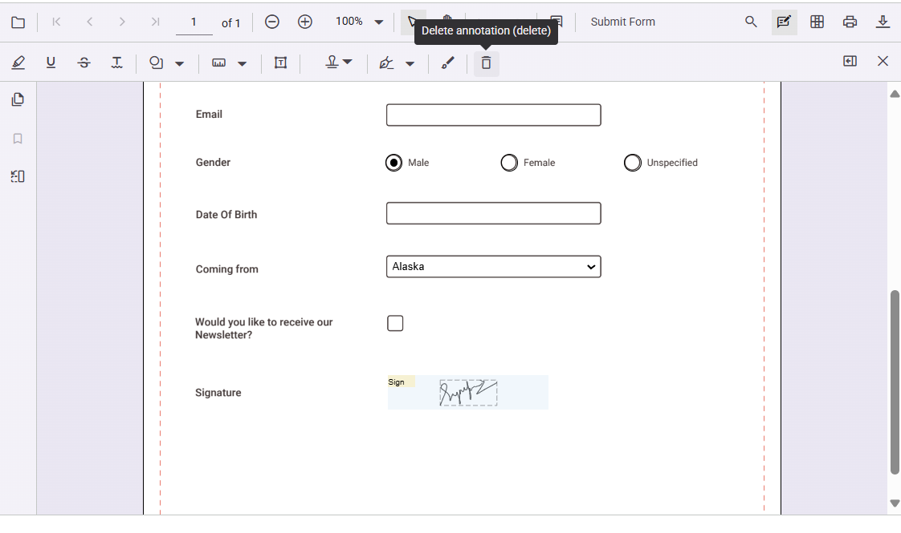

# Form filling in React PDF Viewer Component

The PDF Viewer component displays existing form fields in a PDF document and enables filling and downloading filled data.

The form fields displayed in the Pdf Viewer are:

* Textbox
* Password
* CheckBox
* RadioButton
* ListBox
* DropDown
* SignatureField
* InitialField

## Disabling form fields

The PDF Viewer control provides an option to disable interaction with form fields. Use the following configuration to disable form fields in the viewer.





import * as ReactDOM from 'react-dom/client';
import * as React from 'react';
import './index.css';
import { PdfViewerComponent, Toolbar, Magnification, Navigation, LinkAnnotation, BookmarkView,
         ThumbnailView, Print, TextSelection, TextSearch, Annotation, Inject } from '@syncfusion/ej2-react-pdfviewer';

function App() {

  return (

    

    {/* Render the PDF Viewer */}
      <PdfViewerComponent
        id="container"
        documentPath="https://cdn.syncfusion.com/content/pdf/pdf-succinctly.pdf"
        resourceUrl="https://cdn.syncfusion.com/ej2/31.1.17/dist/ej2-pdfviewer-lib"
        enableFormDesigner = {false}
        style={{ 'height': '640px' }}>

              <Inject services={[ Toolbar, Annotation, Magnification, Navigation, LinkAnnotation,
                                  BookmarkView, ThumbnailView, Print, TextSelection, TextSearch ]} />
      </PdfViewerComponent>
    

  
);

}
const root = ReactDOM.createRoot(document.getElementById('sample'));
root.render(<App />);





## How to draw handwritten signature in the signature field

Add a handwritten signature to a Signature field by following these steps:

* Click the signature field in the PDF document to open the signature panel.

* Draw the signature in the signature panel.

* Click the **CREATE** button. The drawn signature is added to the signature field.

## Delete the signature inside the signature field

Delete a signature placed in a signature field by using the Delete option in the annotation toolbar.

## Export and import form fields

The PDF Viewer control provides the support to export and import the form field data in the following formats using the `importFormFields`, `exportFormFields`, and `exportFormFieldsAsObject` methods.

* FDF
* XFDF
* JSON

For detailed information about exporting and importing form fields, please refer to the [Form Fields documentation](https://help.syncfusion.com/document-processing/pdf/pdf-viewer/react/form-designer/create-programmatically#export-and-import-form-fields).

## See also

* [Handwritten Signature in React PDF Viewer Component](./annotations/signature-annotation)
* [Form Designer](./form-designer/form-field-events)