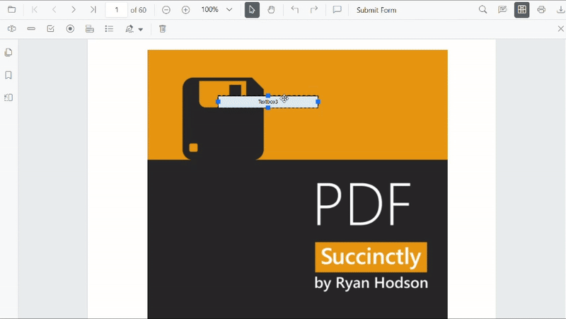

# PDF form field flags in React PDF Viewer

The **Syncfusion React PDF Viewer** allows you to control how users interact with form fields and how those fields behave during validation and printing by applying **form field flags**. These flags define whether a form field can be modified, whether it is mandatory, and whether it appears in printed output.

This topic explains:
- [Supported form field flags](#supported-pdf-form-field-flags)
- [How each constraint affects field behavior](#key-actions)
- [How to apply flags during field creation](#apply-pdf-form-field-flags-using-the-ui)
- [How to update flags on existing fields](#update-flags-on-existing-fields-programmatically)
- [How flags work with validation and printing](#control-print-behavior)

## Supported PDF Form Field Flags

The following flags are supported in the PDF Viewer:

- [isReadOnly](#make-fields-read-only)  
  Prevents users from modifying the form field in the UI while still allowing updates through APIs.

- [isRequired](#mark-fields-as-required)  
  Marks the form field as mandatory and includes it in form field validation.

- [isPrint](#control-print-behavior)  
  Controls whether the form field appears when the document is printed.

## Key Actions

### Make Fields Read Only
Use the **isReadOnly** property to prevent users from modifying a form field through the UI. This is useful for displaying pre-filled or calculated values that should not be changed by the user.



import * as ReactDOM from 'react-dom/client';
import * as React from 'react';
import './index.css';

import {
  PdfViewerComponent,
  Toolbar,
  Magnification,
  Navigation,
  LinkAnnotation,
  ThumbnailView,
  BookmarkView,
  TextSelection,
  Annotation,
  FormDesigner,
  FormFields,
  Inject,
} from '@syncfusion/ej2-react-pdfviewer';

function App() {
  const viewerRef = React.useRef(null);

  // If you want to make all new Textbox fields read-only by default, uncomment below:
  // React.useEffect(() => {
  //   const viewer = viewerRef.current;
  //   if (viewer) {
  //     viewer.textFieldSettings = { isReadOnly: true };
  //   }
  // }, []);

  const handleDocumentLoad = () => {
    const viewer = viewerRef.current;
    if (!viewer) return;

    // Read-only Textbox
    viewer.formDesignerModule.addFormField('Textbox', {
      name: 'EmployeeId',
      bounds: { X: 146, Y: 229, Width: 150, Height: 24 },
      isReadOnly: true,
      value: 'EMP-0001',
    });

    // Read-only Signature field
    viewer.formDesignerModule.addFormField('SignatureField', {
      name: 'ApplicantSign',
      bounds: { X: 57, Y: 923, Width: 200, Height: 43 },
      isReadOnly: true,
      tooltip: 'Sign to accept the terms',
    });
  };

  return (
    

      <PdfViewerComponent
        ref={viewerRef}
        id="PdfViewer"
        documentPath="https://cdn.syncfusion.com/content/pdf/form-designer.pdf"
        resourceUrl="https://cdn.syncfusion.com/ej2/31.1.23/dist/ej2-pdfviewer-lib"
        documentLoad={handleDocumentLoad}
        style={{ height: '680px', width: '100%' }}
      >
        <Inject
          services={[
            Toolbar,
            Magnification,
            Navigation,
            LinkAnnotation,
            ThumbnailView,
            BookmarkView,
            TextSelection,
            Annotation,
            FormDesigner,
            FormFields,
          ]}
        />
      </PdfViewerComponent>
    

  );
}

const root = ReactDOM.createRoot(document.getElementById('sample'));
root.render(<App />);



### Mark Fields as Required
Use the **isRequired** property to mark form fields as mandatory. To enforce this constraint, enable form field validation and validate fields before allowing actions such as printing or downloading.

- Enable validation using [enableFormFieldsValidation](https://ej2.syncfusion.com/react/documentation/api/pdfviewer/index-default#enableformfieldsvalidation)
- [Validate fields](./form-validation) using [validateFormFields()](https://ej2.syncfusion.com/react/documentation/api/pdfviewer/index-default#validateformfields)

If required fields are empty, validation can prevent further actions.



import * as ReactDOM from 'react-dom/client';
import * as React from 'react';
import './index.css';

import {
  PdfViewerComponent,
  Toolbar,
  Magnification,
  Navigation,
  LinkAnnotation,
  BookmarkView,
  ThumbnailView,
  TextSelection,
  TextSearch,
  Print,
  Annotation,
  FormDesigner,
  FormFields,
  Inject
} from '@syncfusion/ej2-react-pdfviewer';

function App() {
  const viewerRef = React.useRef(null);

  // 1) Apply default settings for new Textbox fields (isRequired: true)
  React.useEffect(() => {
    const viewer = viewerRef.current;
    if (viewer) {
      // Same as: pdfviewer.textFieldSettings = { isRequired: true };
      viewer.textFieldSettings = { isRequired: true };
    }
  }, []);

  // 2) Validation wiring (fires when built-in validation/submit triggers)
  const handleValidateFormFields = (args) => {
    // Matches your TS: check args.formField (array of missing required fields)
    if (args && args.formField && args.formField.length > 0) {
      alert('Please fill all required fields. Missing: ' + args.formField[0].name);
      // If you need to block submit, you can also set:
      // args.isFormSubmitCancelled = true;
    }
  };

  // 3) Add a Textbox once the document is loaded
  const handleDocumentLoad = () => {
    const viewer = viewerRef.current;
    if (!viewer) return;

    viewer.formDesignerModule.addFormField('Textbox', {
      name: 'Email',
      bounds: { X: 146, Y: 260, Width: 220, Height: 24 },
      isRequired: true,
      tooltip: 'Email is required'
    });
  };

  return (
    

      <PdfViewerComponent
        ref={viewerRef}
        id="pdfViewer"
        documentPath="https://cdn.syncfusion.com/content/pdf/form-designer.pdf"
        resourceUrl="https://cdn.syncfusion.com/ej2/31.1.23/dist/ej2-pdfviewer-lib"
        // Enable built-in validation flow
        enableFormFieldsValidation={true}
        // Hook events (same as assigning handlers in TS)
        validateFormFields={handleValidateFormFields}
        documentLoad={handleDocumentLoad}
        style={{ height: '680px', width: '100%' }}
      >
        <Inject
          services={[
            Toolbar,
            Magnification,
            Navigation,
            LinkAnnotation,
            BookmarkView,
            ThumbnailView,
            TextSelection,
            TextSearch,
            Print,
            Annotation,
            FormDesigner,
            FormFields
          ]}
        />
      </PdfViewerComponent>
    

  );
}

const root = ReactDOM.createRoot(document.getElementById('sample'));
root.render(<App />);



### Control Print Behavior
Use the **isPrint** property to control whether a form field appears in the printed output of the PDF document.



import * as ReactDOM from 'react-dom/client';
import * as React from 'react';
import './index.css';

import {
  PdfViewerComponent,
  Toolbar,
  Magnification,
  Navigation,
  LinkAnnotation,
  BookmarkView,
  ThumbnailView,
  TextSelection,
  TextSearch,
  Print,
  Annotation,
  FormDesigner,
  FormFields,
  Inject,
} from '@syncfusion/ej2-react-pdfviewer';

function App() {
  const viewerRef = React.useRef(null);

  // 1) Default for new signature fields (isPrint: false)
  React.useEffect(() => {
    const viewer = viewerRef.current;
    if (viewer) {
      // Equivalent to: pdfviewer.signatureFieldSettings = { isPrint: false };
      viewer.signatureFieldSettings = { isPrint: false };
    }
  }, []);

  // 2) Creation + 3) Update after document load
  const handleDocumentLoad = () => {
    const viewer = viewerRef.current;
    if (!viewer) return;

    // Add a signature field with isPrint: false
    viewer.formDesignerModule.addFormField('SignatureField', {
      name: 'ApplicantSign',
      bounds: { X: 57, Y: 923, Width: 200, Height: 43 },
      isPrint: false,
    });

    // Update existing field (toggle to print = true)
    // NOTE: After adding, the field will be in the collection.
    // Depending on timing, a small timeout ensures the collection is refreshed.
    setTimeout(() => {
      const fields =
        (viewer.formFieldCollections &&
          Array.from(viewer.formFieldCollections)) ||
        (viewer.retrieveFormFields ? viewer.retrieveFormFields() : []) ||
        [];

      const sign = fields.find((f) => f && f.name === 'ApplicantSign');
      if (sign) {
        viewer.formDesignerModule.updateFormField(sign, { isPrint: true });
      }
    }, 0);
  };

  return (
    

      <PdfViewerComponent
        ref={viewerRef}
        id="pdfViewer"
        documentPath="https://cdn.syncfusion.com/content/pdf/form-designer.pdf"
        resourceUrl="https://cdn.syncfusion.com/ej2/31.1.23/dist/ej2-pdfviewer-lib"
        documentLoad={handleDocumentLoad}
        style={{ height: '680px', width: '100%' }}
      >
        <Inject
          services={[
            Toolbar,
            Magnification,
            Navigation,
            LinkAnnotation,
            BookmarkView,
            ThumbnailView,
            TextSelection,
            TextSearch,
            Print,
            Annotation,
            FormDesigner,
            FormFields,
          ]}
        />
      </PdfViewerComponent>
    

  );
}

const root = ReactDOM.createRoot(document.getElementById('sample'));
root.render(<App />);



N> Printing can be triggered programmatically using `pdfviewer.print()`. Form fields with `isPrint: false` are excluded from printed output.

## Apply PDF Form Field Flags Using the UI

**Steps**
1. Enable **Form Designer** mode in the PDF Viewer.  
2. Select an existing form field on the PDF page.  
3. Right-click the field, open the context menu, and select Properties.  
4. Configure the required constraint options.  
5. Click OK to apply changes and close the properties popover.  

Changes are reflected immediately in the viewer.

## Apply PDF Form Field Flags Programmatically

You can apply or modify form field flags in the following ways.

### Apply flags when creating fields
Pass the flags properties in the settings object when creating form fields using **addFormField()**.



import * as ReactDOM from 'react-dom/client';
import * as React from 'react';
import './index.css';

import {
  PdfViewerComponent,
  Toolbar,
  Magnification,
  Navigation,
  Annotation,
  LinkAnnotation,
  ThumbnailView,
  BookmarkView,
  TextSelection,
  FormDesigner,
  FormFields,
  Inject
} from '@syncfusion/ej2-react-pdfviewer';

function App() {
  const viewerRef = React.useRef(null);

  const handleDocumentLoad = () => {
    const viewer = viewerRef.current;
    if (!viewer) return;

    // Read-only Textbox that is printed but not required
    viewer.formDesignerModule.addFormField('Textbox', {
      name: 'EmployeeId',
      bounds: { X: 146, Y: 229, Width: 150, Height: 24 },
      isReadOnly: true,
      isRequired: false,
      isPrint: true,
      value: 'EMP-0001'
    });

    // Required Signature field that is not included in print
    viewer.formDesignerModule.addFormField('SignatureField', {
      name: 'ApplicantSign',
      bounds: { X: 57, Y: 923, Width: 200, Height: 43 },
      isReadOnly: false,
      isRequired: true,
      isPrint: false,
      tooltip: 'Sign to accept the terms'
    });
  };

  return (
    

      <PdfViewerComponent
        ref={viewerRef}
        id="PdfViewer"
        documentPath="https://cdn.syncfusion.com/content/pdf/form-designer.pdf"
        resourceUrl="https://cdn.syncfusion.com/ej2/31.1.23/dist/ej2-pdfviewer-lib"
        documentLoad={handleDocumentLoad}
        style={{ height: '680px', width: '100%' }}
      >
        <Inject
          services={[
            Toolbar,
            Magnification,
            Navigation,
            Annotation,
            LinkAnnotation,
            ThumbnailView,
            BookmarkView,
            TextSelection,
            FormDesigner,
            FormFields
          ]}
        />
      </PdfViewerComponent>
    

  );
}

const root = ReactDOM.createRoot(document.getElementById('sample'));
root.render(<App />);



### Update flags on existing fields programmatically
Use the [updateFormField()](https://ej2.syncfusion.com/react/documentation/api/pdfviewer/index-default#updateformfields) method to modify constraint values on existing form fields.



import * as ReactDOM from 'react-dom/client';
import * as React from 'react';
import './index.css';

import {
  PdfViewerComponent,
  Toolbar,
  Magnification,
  Navigation,
  LinkAnnotation,
  ThumbnailView,
  BookmarkView,
  TextSelection,
  Annotation,
  FormDesigner,
  FormFields,
  Inject
} from '@syncfusion/ej2-react-pdfviewer';

function App() {
  const viewerRef = React.useRef(null);

  const handleDocumentLoad = () => {
    const viewer = viewerRef.current;
    if (!viewer) return;

    // 1) Add a sample textbox
    viewer.formDesignerModule.addFormField('Textbox', {
      name: 'Email',
      bounds: { X: 146, Y: 260, Width: 220, Height: 24 }
    });

    // 2) Retrieve it and update constraint flags
    // A small delay ensures the field is available in collections
    setTimeout(() => {
      const fields =
        (viewer.formFieldCollections && Array.from(viewer.formFieldCollections)) ||
        (viewer.retrieveFormFields ? viewer.retrieveFormFields() : []) ||
        [];

      const field = fields.find((f) => f.name === 'Email');
      if (field) {
        viewer.formDesignerModule.updateFormField(field, {
          isReadOnly: false,
          isRequired: true,
          isPrint: true,
          tooltip: 'Enter a valid email'
        });
      }
    }, 0);
  };

  return (
    

      <PdfViewerComponent
        ref={viewerRef}
        id="PdfViewer"
        documentPath="https://cdn.syncfusion.com/content/pdf/form-designer.pdf"
        resourceUrl="https://cdn.syncfusion.com/ej2/31.1.23/dist/ej2-pdfviewer-lib"
        documentLoad={handleDocumentLoad}
        style={{ height: '680px', width: '100%' }}
      >
        <Inject
          services={[
            Toolbar,
            Magnification,
            Navigation,
            LinkAnnotation,
            ThumbnailView,
            BookmarkView,
            TextSelection,
            Annotation,
            FormDesigner,
            FormFields
          ]}
        />
      </PdfViewerComponent>
    

  );
}

const root = ReactDOM.createRoot(document.getElementById('sample'));
root.render(<App />);



### Set default flags for new PDF form fields
You can configure default flag values so that form fields added using the [Form Designer toolbar](../toolbar-customization/form-designer-toolbar) automatically inherit them. This helps ensure consistent behavior for all newly created fields.



import * as ReactDOM from 'react-dom/client';
import * as React from 'react';
import './index.css';

import {
  PdfViewerComponent,
  Toolbar,
  Magnification,
  Navigation,
  Annotation,
  LinkAnnotation,
  ThumbnailView,
  BookmarkView,
  TextSelection,
  FormDesigner,
  FormFields,
  Inject
} from '@syncfusion/ej2-react-pdfviewer';

function App() {
  const viewerRef = React.useRef(null);

  // Apply default settings for new fields after the component mounts
  React.useEffect(() => {
    const viewer = viewerRef.current;
    if (!viewer) return;

    // Textbox fields will be editable, required, and included in print by default
    viewer.textFieldSettings = {
      isReadOnly: false,
      isRequired: true,
      isPrint: true,
      tooltip: 'Required field'
    };

    // Signature fields will be optional and hidden when printing
    viewer.signatureFieldSettings = {
      isReadOnly: false,
      isRequired: false,
      isPrint: false,
      tooltip: 'Sign if applicable'
    };
  }, []);

  return (
    

      <PdfViewerComponent
        ref={viewerRef}
        id="PdfViewer"
        documentPath="https://cdn.syncfusion.com/content/pdf/form-designer.pdf"
        resourceUrl="https://cdn.syncfusion.com/ej2/31.1.23/dist/ej2-pdfviewer-lib"
        style={{ height: '680px', width: '100%' }}
      >
        <Inject
          services={[
            Toolbar,
            Magnification,
            Navigation,
            Annotation,
            LinkAnnotation,
            ThumbnailView,
            BookmarkView,
            TextSelection,
            FormDesigner,
            FormFields
          ]}
        />
      </PdfViewerComponent>
    

  );
}

const root = ReactDOM.createRoot(document.getElementById('sample'));
root.render(<App />);



## See Also

- [Form Designer overview](./overview)  
- [Form Designer Toolbar](../toolbar-customization/form-designer-toolbar)  
- [Create form fields](./manage-form-fields/create-form-fields)  
- [Modify form fields](./manage-form-fields/modify-form-fields)  
- [Group form fields](./group-form-fields)  
- [Add custom data to PDF form fields](./custom-data)  
- [Form Validation](./form-validation)  
- [Form fields API](./form-fields-api)
