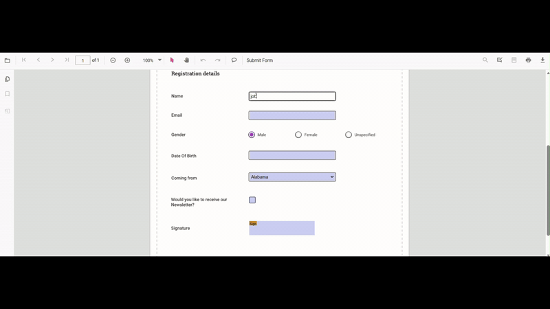

# Fill PDF form fields in React PDF Viewer

This guide shows how to update, import, and validate PDF form fields in the React PDF Viewer so you can pre-fill forms or accept user input.

**Outcome** Programmatically set field values, allow UI-driven filling, import form data, and validate fields on submit.

## Steps to fill forms

### 1. Fill form fields programmatically

Update form field values programmatically with [`updateFormFieldsValue`](https://ej2.syncfusion.com/react/documentation/api/pdfviewer#updateformfieldsvalue).

Use the example below as a complete, runnable example for a small React app. It retrieves form fields and updates a named field or the first available field.




import { RefObject, useRef } from 'react';
import {
    PdfViewerComponent, Toolbar, Magnification, Navigation, LinkAnnotation, BookmarkView,
    ThumbnailView, Print, TextSelection, TextSearch, Annotation, FormFields, Inject,
    FormDesigner, PageOrganizer
} from '@syncfusion/ej2-react-pdfviewer';

export default function App() {
    const viewerRef: RefObject<PdfViewerComponent> = useRef(null);

    const handleFillForm = () => {
        const viewer = viewerRef.current;
        if (!viewer) return;

        // Retrieve form fields from the viewer
        const fields =
            (viewer.retrieveFormFields && viewer.retrieveFormFields()) ||
            viewer.formFieldCollections ||
            [];
        // Find by name or fallback to the first field
        const field = fields.find((f) => f && f.name === 'name') || fields[0];

        if (field) {
            field.value = 'John Doe';
            field.tooltip = 'First';
            // Push changes to viewer
            viewer.updateFormFieldsValue(field);
        } else {
            console.warn('No form fields available to update.');
        }
    };

    return (
        

            

                <button id="updateBtn" onClick={handleFillForm}>
                    Fill Form Fields
                </button>
            

            

                <PdfViewerComponent
                    ref={viewerRef}
                    id="container"
                    // Use a PDF that contains form fields
                    documentPath="https://cdn.syncfusion.com/content/pdf/form-filling-document.pdf"
                    resourceUrl="https://cdn.syncfusion.com/ej2/31.2.2/dist/ej2-pdfviewer-lib"
                    style={{ height: '680px', width: '100%' }}
                >
                    <Inject
                        services={[
                            Toolbar, Magnification, Navigation, Annotation, LinkAnnotation, BookmarkView, ThumbnailView, Print, TextSelection, TextSearch, FormFields, FormDesigner, PageOrganizer ]}
                    />
                </PdfViewerComponent>
            

        

    );
}




**Expected result:** Clicking the *Fill Form Fields* button sets the first or named field's value to *John Doe* in the viewer.

### 2. Fill form fields via UI

Users can click form controls and enter/select values. Supported field types include textboxes, checkboxes, radio buttons, dropdowns, list boxes, and signature fields. Edits are retained during the viewing session.



### 3. Fill form fields through imported data

Use [`importFormFields`](https://ej2.syncfusion.com/react/documentation/api/pdfviewer#importformfields) to map external data into PDF fields by name. The example below shows how to trigger import from a button handler.




import { RefObject, useRef } from 'react';
import {
    PdfViewerComponent, Toolbar, Magnification, Navigation, LinkAnnotation, BookmarkView,
    ThumbnailView, Print, TextSelection, TextSearch, Annotation, FormFields, Inject,
    FormDesigner, PageOrganizer, FormFieldDataFormat
} from '@syncfusion/ej2-react-pdfviewer';

export default function App() {
    const viewerRef: RefObject<PdfViewerComponent> = useRef(null);

    const handleImportJson = () => {
        const viewer = viewerRef.current;
        if (!viewer) return;
        // NOTE:
        // The first parameter can be:
        //  - a file path/url (in server mode),
        //  - or a base64 encoded File/Blob stream from an <input type="file"> in real apps.
        // Replace 'File' with your actual file or path as per your integration.
        viewer.importFormFields('File', FormFieldDataFormat.Json);
    };

    return (
        

            

                <button id="importJson" onClick={handleImportJson}>
                    Import JSON
                </button>
            

            

                <PdfViewerComponent
                    ref={viewerRef}
                    id="container"
                    // Use a PDF that contains form fields
                    documentPath="https://cdn.syncfusion.com/content/pdf/form-filling-document.pdf"
                    resourceUrl="https://cdn.syncfusion.com/ej2/31.2.2/dist/ej2-pdfviewer-lib"
                    style={{ height: '680px', width: '100%' }}
                >
                    <Inject
                        services={[
                            Toolbar, Magnification, Navigation, Annotation, LinkAnnotation, BookmarkView, ThumbnailView, Print, TextSelection, TextSearch, FormFields, FormDesigner, PageOrganizer]}
                    />
                </PdfViewerComponent>
            

        

    );
}




For more details, see [Import Form Data](./import-export-form-fields/import-form-fields).

### 4. Validate form fields on submit

Enable [`enableFormFieldsValidation`](https://ej2.syncfusion.com/react/documentation/api/pdfviewer#enableformfieldsvalidation) and handle [`validateFormFields`](https://ej2.syncfusion.com/react/documentation/api/pdfviewer#validateformfields) to check required fields and cancel submission when necessary. Example below shows adding required fields via [`formDesignerModule`](https://ej2.syncfusion.com/react/documentation/api/pdfviewer/formdesigner) and validating them.




import { RefObject, useRef } from 'react';
import {
    PdfViewerComponent, Toolbar, Magnification, Navigation, LinkAnnotation,
    ThumbnailView, BookmarkView, TextSelection, Annotation, FormDesigner, FormFields,
    Inject, TextFieldSettings
} from '@syncfusion/ej2-react-pdfviewer';

export default function App() {
    const viewerRef: RefObject<PdfViewerComponent> = useRef(null);

    // Runs after the document is loaded into the viewer
    const handleDocumentLoad = () => {
        const viewer = viewerRef.current;
        if (!viewer) return;

        // Add a required Email field
        viewer.formDesignerModule.addFormField('Textbox', {
            name: 'Email',
            bounds: { X: 146, Y: 260, Width: 220, Height: 24 },
            isRequired: true,
            tooltip: 'Email is required',
        } as TextFieldSettings);

        // Add a required Phone field
        viewer.formDesignerModule.addFormField('Textbox', {
            name: 'Phone',
            bounds: { X: 146, Y: 300, Width: 220, Height: 24 },
            isRequired: true,
            tooltip: 'Phone number is required',
        } as TextFieldSettings);
    };

    // Validates only the added fields on form submit/validate trigger
    const handleValidateFormFields = () => {
        const viewer = viewerRef.current;
        if (!viewer) return;

        const fields = viewer.retrieveFormFields ? viewer.retrieveFormFields() : [];

        fields.forEach((field) => {
            if ((field.name === 'Email' || field.name === 'Phone') && !field.value) {
                alert(field.name + ' field cannot be empty.');
            }
        });
    };

    return (
        

            <PdfViewerComponent
                ref={viewerRef}
                id="pdfViewer"
                documentPath="https://cdn.syncfusion.com/content/pdf/pdf-succinctly.pdf"
                resourceUrl="https://cdn.syncfusion.com/ej2/31.1.23/dist/ej2-pdfviewer-lib"
                // Enable built-in validation flow
                enableFormFieldsValidation={true}
                // Hook events
                documentLoad={handleDocumentLoad}
                validateFormFields={handleValidateFormFields}
                style={{ height: '680px', width: '100%' }}
            >
                <Inject
                    services={[
                        Toolbar, Magnification, Navigation, LinkAnnotation, ThumbnailView, BookmarkView,
                        TextSelection, Annotation, FormDesigner, FormFields
                    ]}
                />
            </PdfViewerComponent>
        

    );
}




## Troubleshooting

- If fields are not editable, confirm `FormFields` module is injected into PDF Viewer.
- If examples fail to load, verify your [`resourceUrl`](https://helpej2.syncfusion.com/react/documentation/api/pdfviewer#resourceurl) matches the installed PDF Viewer version.
- For import issues, ensure JSON keys match the PDF field `name` values.

## See also

- [Form Designer overview](./overview)
- [Form Designer Toolbar](../toolbar-customization/form-designer-toolbar)
- [Create](./manage-form-fields/create-form-fields), [edit](./manage-form-fields/modify-form-fields), [style](./manage-form-fields/customize-form-fields) and [remove](./manage-form-fields/remove-form-fields) form fields
- [Edit form fields](./manage-form-fields/edit-form-fields)
- [Group form fields](./group-form-fields)
- [Add custom data to form fields](./custom-data)
- [Form Constrain](./form-constrain)
- [Form validation](./form-validation)
- [Form fields API](./form-fields-api)