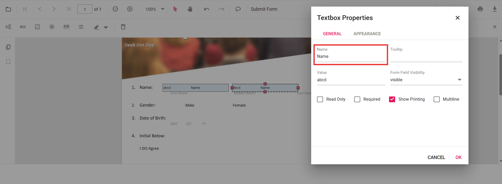
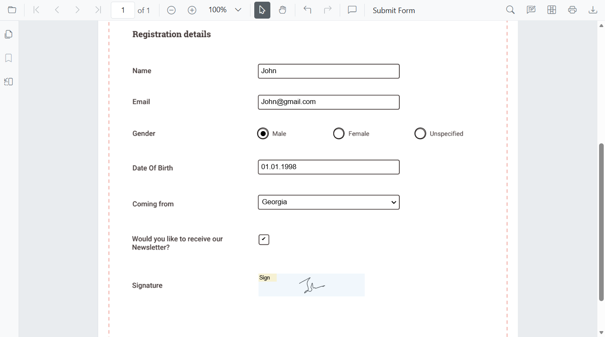
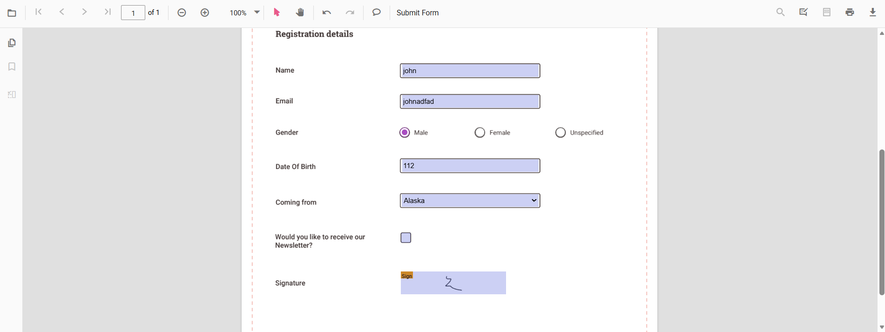

# PDF Form Handling Best Practices in React PDF Viewer

This guide provides a comprehensive overview of recommended practices for creating, organizing, validating, and automating PDF forms in the Syncfusion React PDF Viewer.

It explains how to structure field names, ensure consistency, apply validation rules, group related fields, and streamline workflows through pre-filling and data import/export. By following these guidelines, you can build clean, reliable, and efficient form experiences that are easier to maintain and work seamlessly across different use cases.

## 1. Use Clear and Unique Field Names

Field names are critical for automation, data mapping, and debugging. Always:

- Use descriptive, unique names for each field (e.g., `FirstName`, `InvoiceNumber`).
- Avoid generic names like `Textbox1` or `Field2`.
- Ensure names are consistent across import/export workflows.

You can refer to [Create Form Fields](../forms/manage-form-fields/create-form-fields) in React PDF Viewer to know more about creating formfields.

## 2. Maintain Consistent Field Types

Changing a field’s type (e.g., from textbox to dropdown) can break data mapping and validation. Best practices:

- Do not change a field’s type after creation.
- Fields with the same name must always have the same type.
- Use the correct field type for the intended data (e.g., checkbox for boolean, textbox for free text).

You can refer to [Group Form Fields](../forms/group-form-fields) in React PDF Viewer to know more about grouping formfields.

## 3. Validate Data Before Submission

Validation ensures data quality and prevents errors downstream. Always:

- Mark required fields and check for empty values.
- Validate formats (email, phone, numbers, etc.).
- Use custom validation logic for business rules.
- Prevent submission or export if validation fails.

You can refer to [Form Validation](../forms/form-validation) in React PDF Viewer to know more about formfields Validation.

## 4. Pre-Fill Known Values

Pre-filling fields improves user experience and reduces errors. For example:

- Populate user profile data (name, email, address) automatically.
- Use default values for common fields.

You can refer to [Form Filling](../forms/form-filling) in React PDF Viewer to know more about form filling.

## 5. Automate with Import/Export

Automate workflows by importing/exporting form data. Recommendations:

- Use **JSON** for web apps and REST APIs.
- Use **XFDF/FDF** for Adobe workflows.
- Use **XML** for legacy systems.
- Ensure field names match exactly for successful mapping.

You can refer to [Export/Import Form fields](../forms/import-export-form-fields/export-form-fields) in React PDF Viewer to know more about Export and Import form fields.

## 6. Group Related Fields for Complex Forms

Group fields logically for better structure and easier validation. Examples:

- Address sections (Street, City, State, ZIP)
- Invoice line items
- Repeated form subsections

Benefits:

- Structured exported data
- Easier validation
- Improved user experience

You can refer to [Group Form Fields](../forms/group-form-fields) in React PDF Viewer to know more about grouping formfields.

## 7. Keep Form Design Clean and Accessible

Good design improves usability and accessibility. Tips:

- Maintain consistent spacing and alignment (use grid layouts).
- Use uniform field widths and clear labels.
- Avoid clutter—don’t crowd too many fields in one area.
- Use section headers to guide users.

You can refer to [Group Form Fields](../forms/group-form-fields) in React PDF Viewer to know more about grouping formfields.

## See Also

- [Filling PDF Forms](../forms/form-filling)
- [Create Form Fields](../forms/manage-form-fields/create-form-fields)
- [Modify Form Fields](../forms/manage-form-fields/modify-form-fields)
- [Style Form Fields](../forms/manage-form-fields/customize-form-fields)
- [Remove Form Fields](../forms/manage-form-fields/remove-form-fields)
- [Group Form Fields](../forms/group-form-fields)
- [Form Validation](../forms/form-validation)
- [Import and Export Form Fields](../forms/import-export-form-fields/export-form-fields)
