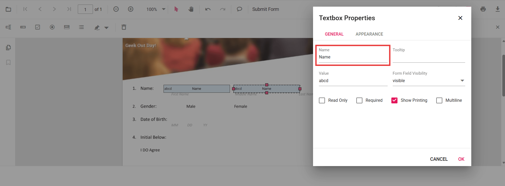
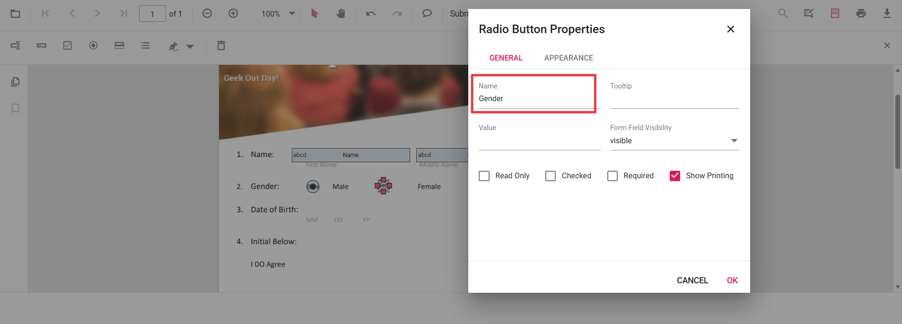

# Group form fields in React PDF Viewer

The **Syncfusion React PDF Viewer** allows grouping multiple form fields into a single logical field by assigning the same `Name` to them. Grouped form fields share their values and states automatically based on the field type. Use the Form Designer UI for manual grouping or the Form Designer APIs for programmatic grouping to keep related fields synchronized across the document.
- [How form field grouping works](#how-grouping-works)
- [Field behavior based on type](#field-behavior-by-type)
- [How to group form fields using the UI](#group-using-the-form-designer-ui)
- [How to group form fields programmatically](#group-pdf-form-fields-programmatically)
- [Related references and samples](#example-scenarios)

## How grouping works

In a PDF form, multiple widgets can represent the same logical form field. When widgets share the same `Name`, they are treated as a group and remain synchronized.

## Field behavior by type

- **Textbox and Password** — Text entered in one widget appears in all widgets with the same name.  
- **CheckBox** — Checking one widget sets the checked state for all checkboxes with the same name.  
- **RadioButton** — Widgets with the same name form a radio group; only one option can be selected.  
- **ListBox and DropDown** — The selected value is shared across widgets with the same name.  
- **Signature and Initial fields** — Applied signature/initial is mirrored across grouped widgets.

N> form field grouping is controlled by the `Name` property. The position of each widget is determined by its bounds; grouping is independent of location.

## Group using the Form Designer UI

**Steps**
1. Enable the [Form Designer toolbar](../toolbar-customization/form-designer-toolbar).
2. Add the form fields you want to group.
3. Select a form field, open **Properties**, and set the **Name** value.
4. Assign the same **Name** to all PDF Form Field that belong to the group.
5. Apply the changes and verify that updates in one widget reflect in the others.

## Group PDF Form Fields Programmatically

You can also group form fields during creation by assigning the same **Name** through code.

### Example Scenarios
- Two textboxes named **EmployeeId** share the same value.
- A radio button group named **Gender** allows single selection.
- Two checkboxes named **Subscribe** share the checked state.



import * as ReactDOM from 'react-dom/client';
import React, { useRef, useCallback } from 'react';
import './index.css';
import { PdfViewerComponent, Toolbar, Magnification, Navigation, LinkAnnotation, BookmarkView, ThumbnailView, Print, TextSelection, Annotation, TextSearch, FormFields, FormDesigner, Inject } from '@syncfusion/ej2-react-pdfviewer';

export function App() {
  const viewerRef = useRef(null);

  const onDocumentLoaded = useCallback(() => {
    const viewer = viewerRef.current;
    if (!viewer || !viewer.formDesignerModule) return;

    // Textbox group: same name => mirrored value
    viewer.formDesignerModule.addFormField('Textbox', {
      name: 'EmployeeId',
      bounds: { X: 146, Y: 229, Width: 150, Height: 24 }
    });

    viewer.formDesignerModule.addFormField('Textbox', {
      name: 'EmployeeId', // same name groups the two widgets
      bounds: { X: 338, Y: 229, Width: 150, Height: 24 }
    });

    // Radio button group: same name => exclusive selection across the group
    viewer.formDesignerModule.addFormField('RadioButton', {
      name: 'Gender',
      bounds: { X: 148, Y: 289, Width: 18, Height: 18 },
      isSelected: false
    });

    viewer.formDesignerModule.addFormField('RadioButton', {
      name: 'Gender', // grouped with the first
      bounds: { X: 292, Y: 289, Width: 18, Height: 18 },
      isSelected: false
    });

    // CheckBox group: same name => mirrored checked state
    viewer.formDesignerModule.addFormField('CheckBox', {
      name: 'Subscribe',
      bounds: { X: 56, Y: 664, Width: 20, Height: 20 },
      isChecked: false
    });

    viewer.formDesignerModule.addFormField('CheckBox', {
      name: 'Subscribe', // grouped with the first
      bounds: { X: 242, Y: 664, Width: 20, Height: 20 },
      isChecked: false
    });
  }, []);

  return (
    

      <PdfViewerComponent
        ref={viewerRef}
        id="container"
        documentPath="https://cdn.syncfusion.com/content/pdf/form-designer.pdf"
        resourceUrl="https://cdn.syncfusion.com/ej2/31.2.2/dist/ej2-pdfviewer-lib"
        style={{ height: '680px' }}
        documentLoad={onDocumentLoaded}
      >
        <Inject services={[Toolbar, Magnification, Navigation, Annotation, LinkAnnotation, BookmarkView, ThumbnailView, Print, TextSelection, TextSearch, FormFields, FormDesigner]} />
      </PdfViewerComponent>
    

  );
}

const root = ReactDOM.createRoot(document.getElementById('sample'));
root.render(<App />);



[View Sample on GitHub](https://github.com/SyncfusionExamples/react-pdf-viewer-examples)

## See also

- [Form Designer overview](../overview)
- [Form Designer Toolbar](../toolbar-customization/form-designer-toolbar)
- [Create form fields](./manage-form-fields/create-form-fields)
- [Modify form fields](./manage-form-fields/modify-form-fields)
- [Add custom data to form fields](./custom-data)
- [Form Constrain](./form-constrain)
- [Form validation](./form-validation)
- [Form fields API](./form-fields-api)