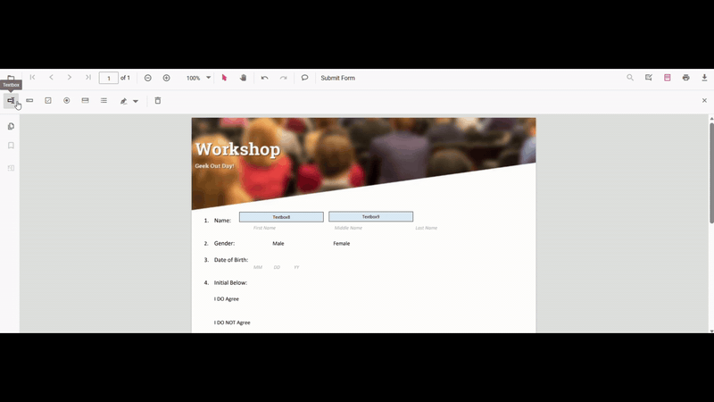
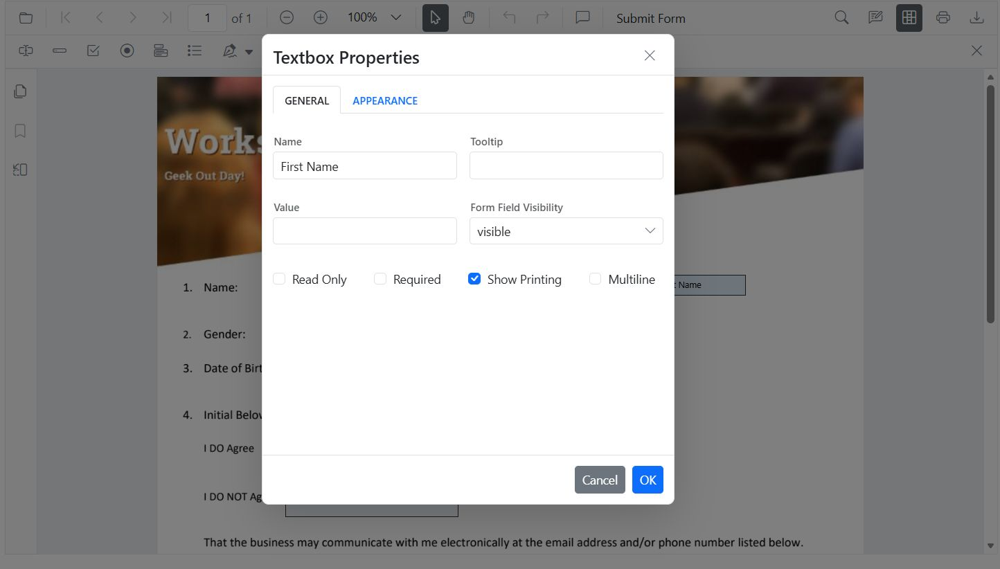
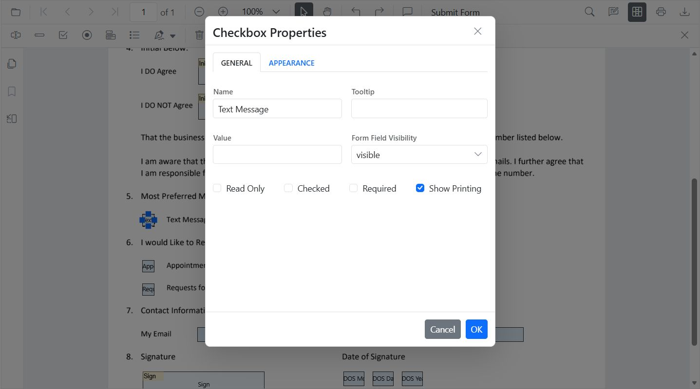
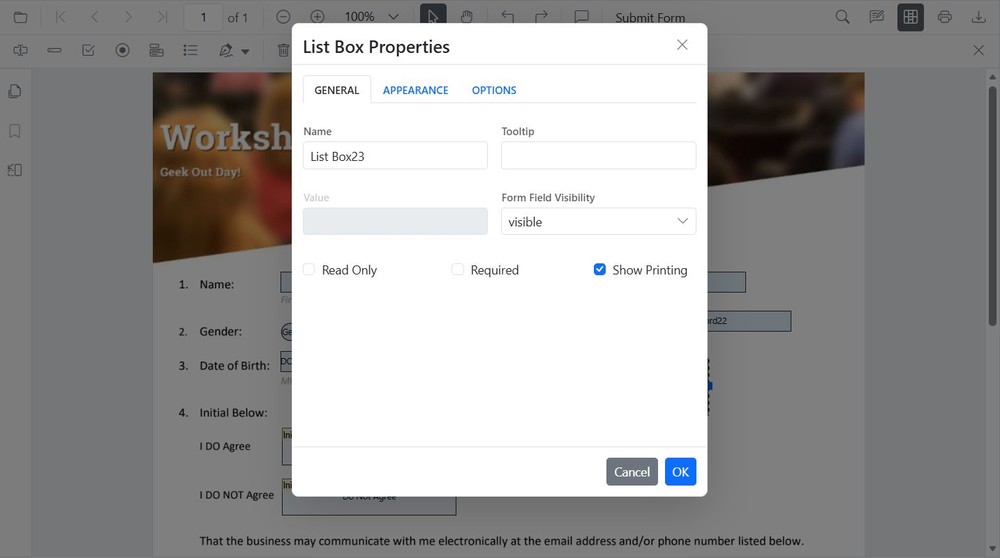
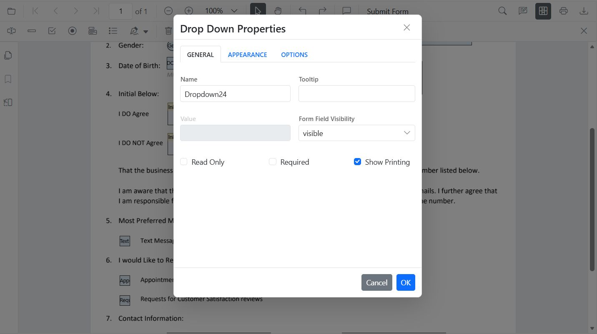
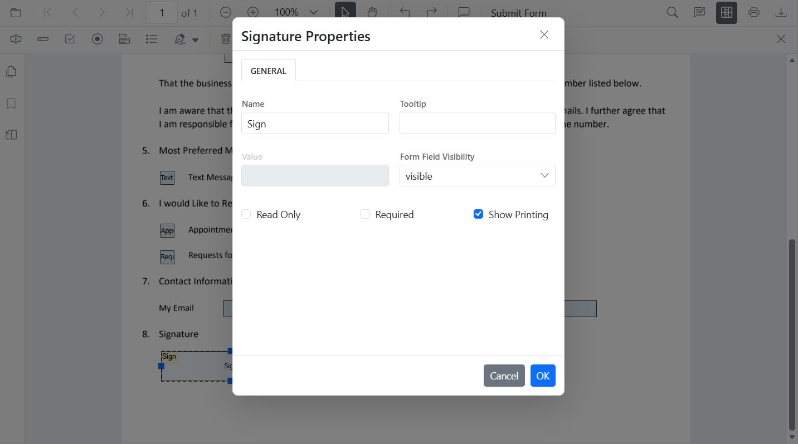
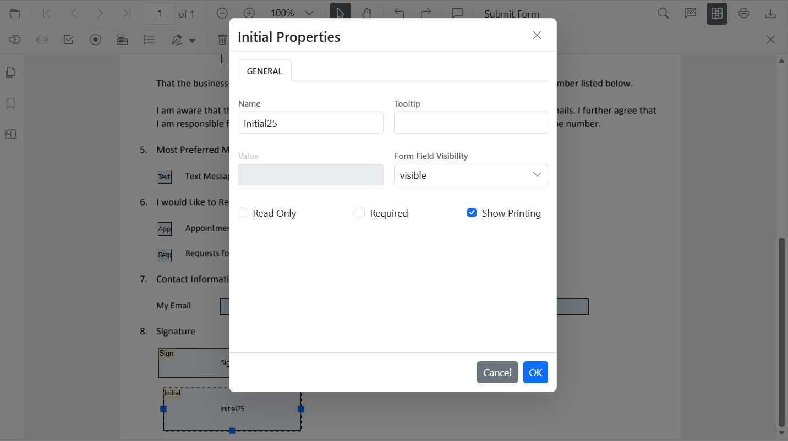

# Create PDF Form Fields in React

Create or add new form fields visually with the Form Designer UI or programmatically using the React PDF Viewer API. This guide explains both methods and shows field‑specific examples and a complete runnable example.

**Outcome:**

The guide explains the following:
- How to add fields with the Form Designer UI.
- How to add and edit fields programmatically (API).
- How to add common field types: Textbox, Password, CheckBox, RadioButton, ListBox, DropDown, Signature, Initial.

## Steps

### 1. Create form fields using Form Designer UI.

- Enable the Form Designer mode in the PDF Viewer. See [Form Designer overview](../overview).
- Select a field type from the toolbar and click the PDF page to place it.
- Move/resize the field and configure properties in the **Properties** panel.

### 2. Create Form fields programmatically

Use [`addFormField`](https://ej2.syncfusion.com/react/documentation/api/pdfviewer/formdesigner#addformfield) method of the [formDesigner](https://ej2.syncfusion.com/react/documentation/api/pdfviewer/formdesigner) module inside the viewer's [`documentLoad`](https://ej2.syncfusion.com/react/documentation/api/pdfviewer#documentload) handler or in response to user actions.

Use this approach to generate form fields dynamically based on data or application logic.



import * as ReactDOM from 'react-dom/client';
import React, { useRef } from 'react';
import './index.css';
import { PdfViewerComponent, Toolbar, Magnification, Navigation, LinkAnnotation, BookmarkView, ThumbnailView, Print, TextSelection, Annotation, TextSearch, FormFields, FormDesigner, Inject } from '@syncfusion/ej2-react-pdfviewer';

export function App() {
  const viewerRef = useRef(null);

  const onDocumentLoad = () => {
    viewerRef.current?.formDesignerModule.addFormField('Textbox', {
      name: 'First Name',
      bounds: { X: 146, Y: 229, Width: 150, Height: 24 }
    });
  };

  return (
    

      <PdfViewerComponent
        ref={viewerRef}
        id="container"
        documentPath="https://cdn.syncfusion.com/content/pdf/form-filling-document.pdf"
        resourceUrl="https://cdn.syncfusion.com/ej2/31.2.2/dist/ej2-pdfviewer-lib"
        style={{ height: '680px' }}
        documentLoad={onDocumentLoad}
      >
        <Inject services={[Toolbar, Magnification, Navigation, Annotation, LinkAnnotation, BookmarkView, ThumbnailView, Print, TextSelection, TextSearch, FormFields, FormDesigner]} />
      </PdfViewerComponent>
    

  );
}

const root = ReactDOM.createRoot(document.getElementById('sample'));
root.render(<App />);



**Use programmatic creation when:**

- Building dynamic forms
- Pre-filling forms from databases
- Automating form creation workflows

## Field‑specific instructions

Below are concise UI steps and the programmatic examples for each common field type. The code samples below are complete per‑field examples you can reuse unchanged.

### Textbox

**Add via UI**: Open Form Designer toolbar → select Textbox → click page → configure properties

**Add Programmatically (API)**:



import * as ReactDOM from 'react-dom/client';
import React, { useRef } from 'react';
import './index.css';
import { PdfViewerComponent, Toolbar, Magnification, Navigation, LinkAnnotation, BookmarkView, ThumbnailView, Print, TextSelection, Annotation, TextSearch, FormFields, FormDesigner, Inject } from '@syncfusion/ej2-react-pdfviewer';

export function App() {
  const viewerRef = useRef(null);

  const onDocumentLoad = () => {
    viewerRef.current?.formDesignerModule.addFormField('Textbox', {
      name: 'FirstName',
      pageNumber: 1,
      bounds: { X: 100, Y: 150, Width: 200, Height: 24 },
      isRequired: true,
      tooltip: 'Enter your first name',
      maxLength: 40
    });
  };

  return (
    

      <PdfViewerComponent
        ref={viewerRef}
        id="container"
        documentPath="https://cdn.syncfusion.com/content/pdf/form-filling-document.pdf"
        resourceUrl="https://cdn.syncfusion.com/ej2/31.2.2/dist/ej2-pdfviewer-lib"
        style={{ height: '680px' }}
        documentLoad={onDocumentLoad}
      >
        <Inject services={[Toolbar, Magnification, Navigation, Annotation, LinkAnnotation, BookmarkView, ThumbnailView, Print, TextSelection, TextSearch, FormFields, FormDesigner]} />
      </PdfViewerComponent>
    

  );
}

const root = ReactDOM.createRoot(document.getElementById('sample'));
root.render(<App />);



### Password

**Add via UI**: Open form designer toolbar → Select Password → place → configure properties

**Add Programmatically (API)**:



import * as ReactDOM from 'react-dom/client';
import React, { useRef } from 'react';
import './index.css';
import { PdfViewerComponent, Toolbar, Magnification, Navigation, LinkAnnotation, BookmarkView, ThumbnailView, Print, TextSelection, Annotation, TextSearch, FormFields, FormDesigner, Inject } from '@syncfusion/ej2-react-pdfviewer';

export function App() {
  const viewerRef = useRef(null);

  const onDocumentLoad = () => {
    viewerRef.current?.formDesignerModule.addFormField('Password', {
      name: 'AccountPassword',
      pageNumber: 1,
      bounds: { X: 100, Y: 190, Width: 200, Height: 24 },
      isRequired: true,
      maxLength: 32,
      tooltip: 'Enter a secure password',
    });
  };

  return (
    

      <PdfViewerComponent
        ref={viewerRef}
        id="container"
        documentPath="https://cdn.syncfusion.com/content/pdf/form-filling-document.pdf"
        resourceUrl="https://cdn.syncfusion.com/ej2/31.2.2/dist/ej2-pdfviewer-lib"
        style={{ height: '680px' }}
        documentLoad={onDocumentLoad}
      >
        <Inject services={[Toolbar, Magnification, Navigation, Annotation, LinkAnnotation, BookmarkView, ThumbnailView, Print, TextSelection, TextSearch, FormFields, FormDesigner]} />
      </PdfViewerComponent>
    

  );
}

const root = ReactDOM.createRoot(document.getElementById('sample'));
root.render(<App />);



### CheckBox

**Add via UI**: Open form designer toolbar → Select CheckBox → click to place → duplicate for options.

**Add Programmatically (API)**:



import * as ReactDOM from 'react-dom/client';
import React, { useRef } from 'react';
import './index.css';
import { PdfViewerComponent, Toolbar, Magnification, Navigation, LinkAnnotation, BookmarkView, ThumbnailView, Print, TextSelection, Annotation, TextSearch, FormFields, FormDesigner, Inject } from '@syncfusion/ej2-react-pdfviewer';

export function App() {
  const viewerRef = useRef(null);

  const onDocumentLoad = () => {
    viewerRef.current?.formDesignerModule.addFormField('CheckBox', {
      name: 'AgreeTerms',
      pageNumber: 1,
      bounds: { X: 100, Y: 230, Width: 18, Height: 18 },
      isChecked: false,
      tooltip: 'I agree to the terms',
    });
  };

  return (
    

      <PdfViewerComponent
        ref={viewerRef}
        id="container"
        documentPath="https://cdn.syncfusion.com/content/pdf/form-filling-document.pdf"
        resourceUrl="https://cdn.syncfusion.com/ej2/31.2.2/dist/ej2-pdfviewer-lib"
        style={{ height: '680px' }}
        documentLoad={onDocumentLoad}
      >
        <Inject services={[Toolbar, Magnification, Navigation, Annotation, LinkAnnotation, BookmarkView, ThumbnailView, Print, TextSelection, TextSearch, FormFields, FormDesigner]} />
      </PdfViewerComponent>
    

  );
}

const root = ReactDOM.createRoot(document.getElementById('sample'));
root.render(<App />);



### RadioButton

**Add via UI**: Open form designer toolbar → Select RadioButton → place buttons using the same `name` to group them.

**Add Programmatically (API)**:



import * as ReactDOM from 'react-dom/client';
import React, { useRef } from 'react';
import './index.css';
import { PdfViewerComponent, Toolbar, Magnification, Navigation, LinkAnnotation, BookmarkView, ThumbnailView, Print, TextSelection, Annotation, TextSearch, FormFields, FormDesigner, Inject } from '@syncfusion/ej2-react-pdfviewer';

export function App() {
  const viewerRef = useRef(null);

  const onDocumentLoad = () => {
    // Group by name: 'Gender'
    viewerRef.current?.formDesignerModule.addFormField('RadioButton', {
      name: 'Gender',
      value: 'Male',
      pageNumber: 0,
      bounds: { X: 100, Y: 270, Width: 16, Height: 16 }
    });

    viewerRef.current?.formDesignerModule.addFormField('RadioButton', {
      name: 'Gender',
      value: 'Female',
      pageNumber: 0,
      bounds: { X: 160, Y: 270, Width: 16, Height: 16 }
    });
  };

  return (
    

      <PdfViewerComponent
        ref={viewerRef}
        id="container"
        documentPath="https://cdn.syncfusion.com/content/pdf/form-filling-document.pdf"
        resourceUrl="https://cdn.syncfusion.com/ej2/31.2.2/dist/ej2-pdfviewer-lib"
        style={{ height: '680px' }}
        documentLoad={onDocumentLoad}
      >
        <Inject services={[Toolbar, Magnification, Navigation, Annotation, LinkAnnotation, BookmarkView, ThumbnailView, Print, TextSelection, TextSearch, FormFields, FormDesigner]} />
      </PdfViewerComponent>
    

  );
}

const root = ReactDOM.createRoot(document.getElementById('sample'));
root.render(<App />);



### ListBox

**Add via UI**: Open form designer toolbar → Select ListBox → place → add items in Properties.

**Add Programmatically (API)**:



import * as ReactDOM from 'react-dom/client';
import React, { useRef } from 'react';
import './index.css';
import { PdfViewerComponent, Toolbar, Magnification, Navigation, LinkAnnotation, BookmarkView, ThumbnailView, Print, TextSelection, Annotation, TextSearch, FormFields, FormDesigner, Inject } from '@syncfusion/ej2-react-pdfviewer';

export function App() {
  const viewerRef = useRef(null);

  const onDocumentLoad = () => {
    const option = [
      { itemName: 'Item 1', itemValue: 'item1' },
      { itemName: 'Item 2', itemValue: 'item2' },
      { itemName: 'Item 3', itemValue: 'item3' }
    ];

    viewerRef.current?.formDesignerModule.addFormField('ListBox', {
      name: 'States',
      pageNumber: 1,
      bounds: { X: 100, Y: 310, Width: 220, Height: 70 },
      options: option,
    });
  };

  return (
    

      <PdfViewerComponent
        ref={viewerRef}
        id="container"
        documentPath="https://cdn.syncfusion.com/content/pdf/form-filling-document.pdf"
        resourceUrl="https://cdn.syncfusion.com/ej2/31.2.2/dist/ej2-pdfviewer-lib"
        style={{ height: '680px' }}
        documentLoad={onDocumentLoad}
      >
        <Inject services={[Toolbar, Magnification, Navigation, Annotation, LinkAnnotation, BookmarkView, ThumbnailView, Print, TextSelection, TextSearch, FormFields, FormDesigner]} />
      </PdfViewerComponent>
    

  );
}

const root = ReactDOM.createRoot(document.getElementById('sample'));
root.render(<App />);



### DropDown

**Add via UI**: Open form designer toolbar → Select DropDown → place → add items → set default value.

**Add Programmatically (API)**:



import * as ReactDOM from 'react-dom/client';
import React, { useRef } from 'react';
import './index.css';
import { PdfViewerComponent, Toolbar, Magnification, Navigation, LinkAnnotation, BookmarkView, ThumbnailView, Print, TextSelection, Annotation, TextSearch, FormFields, FormDesigner, Inject } from '@syncfusion/ej2-react-pdfviewer';

export function App() {
  const viewerRef = useRef(null);

  const onDocumentLoad = () => {
    const options = [
      { itemName: 'Item 1', itemValue: 'item1' },
      { itemName: 'Item 2', itemValue: 'item2' },
      { itemName: 'Item 3', itemValue: 'item3' },
    ];

    viewerRef.current?.formDesignerModule.addFormField('DropDown', {
      name: 'Country',
      options,
      bounds: { X: 560, Y: 320, Width: 150, Height: 24 },
    });
  };

  return (
    

      <PdfViewerComponent
        ref={viewerRef}
        id="container"
        documentPath="https://cdn.syncfusion.com/content/pdf/form-filling-document.pdf"
        resourceUrl="https://cdn.syncfusion.com/ej2/31.2.2/dist/ej2-pdfviewer-lib"
        style={{ height: '680px' }}
        documentLoad={onDocumentLoad}
      >
        <Inject services={[Toolbar, Magnification, Navigation, Annotation, LinkAnnotation, BookmarkView, ThumbnailView, Print, TextSelection, TextSearch, FormFields, FormDesigner]} />
      </PdfViewerComponent>
    

  );
}

const root = ReactDOM.createRoot(document.getElementById('sample'));
root.render(<App />);



### Signature Field

**Add via UI**: Open form designer toolbar → select Signature Field → place where signing is required → configure indicator text/thickness/tooltip/isRequired.

**Add Programmatically (API)**:



import * as ReactDOM from 'react-dom/client';
import React, { useRef } from 'react';
import './index.css';
import { PdfViewerComponent, Toolbar, Magnification, Navigation, LinkAnnotation, BookmarkView, ThumbnailView, Print, TextSelection, Annotation, TextSearch, FormFields, FormDesigner, Inject } from '@syncfusion/ej2-react-pdfviewer';

export function App() {
  const viewerRef = useRef(null);

  const onDocumentLoad = () => {
    viewerRef.current?.formDesignerModule.addFormField('SignatureField', {
      name: 'Sign',
      bounds: { X: 57, Y: 923, Width: 200, Height: 43 },
      tooltip: 'sign Here',
      isRequired: true,
    });
  };

  return (
    

      <PdfViewerComponent
        ref={viewerRef}
        id="container"
        documentPath="https://cdn.syncfusion.com/content/pdf/form-filling-document.pdf"
        resourceUrl="https://cdn.syncfusion.com/ej2/31.2.2/dist/ej2-pdfviewer-lib"
        style={{ height: '680px' }}
        documentLoad={onDocumentLoad}
      >
        <Inject services={[Toolbar, Magnification, Navigation, Annotation, LinkAnnotation, BookmarkView, ThumbnailView, Print, TextSelection, TextSearch, FormFields, FormDesigner]} />
      </PdfViewerComponent>
    

  );
}

const root = ReactDOM.createRoot(document.getElementById('sample'));
root.render(<App />);



### Initial Field

**Add via UI**: Open form designer toolbar → select Initial Field → place where initials are needed → configure text/isRequired.

**Add Programmatically (API)**:



import * as ReactDOM from 'react-dom/client';
import React, { useRef } from 'react';
import './index.css';
import { PdfViewerComponent, Toolbar, Magnification, Navigation, LinkAnnotation, BookmarkView, ThumbnailView, Print, TextSelection, Annotation, TextSearch, FormFields, FormDesigner, Inject } from '@syncfusion/ej2-react-pdfviewer';

export function App() {
  const viewerRef = useRef(null);

  const onDocumentLoad = () => {
    viewerRef.current?.formDesignerModule.addFormField('InitialField', {
      name: 'Sign',
      bounds: { X: 57, Y: 923, Width: 200, Height: 43 },
      tooltip: 'sign Here',
      isRequired: true,
    });
  };

  return (
    

      <PdfViewerComponent
        ref={viewerRef}
        id="container"
        documentPath="https://cdn.syncfusion.com/content/pdf/form-filling-document.pdf"
        resourceUrl="https://cdn.syncfusion.com/ej2/31.2.2/dist/ej2-pdfviewer-lib"
        style={{ height: '680px' }}
        documentLoad={onDocumentLoad}
      >
        <Inject services={[Toolbar, Magnification, Navigation, Annotation, LinkAnnotation, BookmarkView, ThumbnailView, Print, TextSelection, TextSearch, FormFields, FormDesigner]} />
      </PdfViewerComponent>
    

  );
}

const root = ReactDOM.createRoot(document.getElementById('sample'));
root.render(<App />);



## Add fields dynamically with setFormFieldMode

Use `setFormFieldMode()` to switch the designer into a specific field mode and let users add fields on the fly.

### Edit Form Fields in React PDF Viewer
You can edit form fields using the UI or API.

#### Edit Using the UI
- Right click a field → **Properties** to update settings. (Image here)
- Drag to move; use handles to resize.
- Use the toolbar to toggle field mode or add new fields.

#### Edit Programmatically



import * as ReactDOM from 'react-dom/client';
import React, { useRef } from 'react';
import './index.css';
import { PdfViewerComponent, Toolbar, Magnification, Navigation, LinkAnnotation, BookmarkView, ThumbnailView, Print, TextSelection, Annotation, TextSearch, FormFields, FormDesigner, Inject } from '@syncfusion/ej2-react-pdfviewer';

export function App() {
  const viewerRef = useRef(null);

  const onDocumentLoad = () => {
    viewerRef.current?.formDesignerModule.addFormField('InitialField', {
      name: 'Sign',
      bounds: { X: 57, Y: 923, Width: 200, Height: 43 },
      tooltip: 'sign Here',
      isRequired: true,
    });
  };

  const editTextbox = () => {
    const fields = viewerRef.current?.retrieveFormFields() || [];
    const field = fields.find((f) => f.name === 'FirstName') || fields[0];
    if (field) {
      viewerRef.current?.formDesignerModule.updateFormField(field, {
        value: 'John',
        fontFamily: 'Courier',
        fontSize: 12,
        color: 'black',
        backgroundColor: 'white',
        borderColor: 'black',
        thickness: 2,
        alignment: 'Left',
        maxLength: 50
      });
    }
  };

  const addPasswordField = () => {
    viewerRef.current?.formDesignerModule.setFormFieldMode('Password');
  };

  return (
    

      <button onClick={editTextbox}>EditTextBox</button>
      <button onClick={addPasswordField}>Add Form Field</button>
      <PdfViewerComponent
        ref={viewerRef}
        id="container"
        documentPath="https://cdn.syncfusion.com/content/pdf/form-filling-document.pdf"
        resourceUrl="https://cdn.syncfusion.com/ej2/31.2.2/dist/ej2-pdfviewer-lib"
        style={{ height: '680px' }}
        documentLoad={onDocumentLoad}
      >
        <Inject services={[Toolbar, Magnification, Navigation, Annotation, LinkAnnotation, BookmarkView, ThumbnailView, Print, TextSelection, TextSearch, FormFields, FormDesigner]} />
      </PdfViewerComponent>
    

  );
}

const root = ReactDOM.createRoot(document.getElementById('sample'));
root.render(<App />);



[View Sample on GitHub](https://github.com/SyncfusionExamples/react-pdf-viewer-examples)

## Troubleshooting

- If fields do not appear, verify [`resourceUrl`](https://ej2.syncfusion.com/react/documentation/api/pdfviewer#resourceurl) matches the EJ2 PDF Viewer library version and that the document loads correctly.
- If using WASM or additional services, confirm those resources are reachable from the environment.

## Related topics

- [Form Designer overview](../overview)
- [Form Designer Toolbar](../../toolbar-customization/form-designer-toolbar)
- [Modify form fields](./modify-form-fields)
- [Style form fields](./customize-form-fields)
- [Remove form fields](./remove-form-fields)
- [Group form fields](../group-form-fields)
- [Form validation](../form-validation)
- [Form Fields API](../form-fields-api)