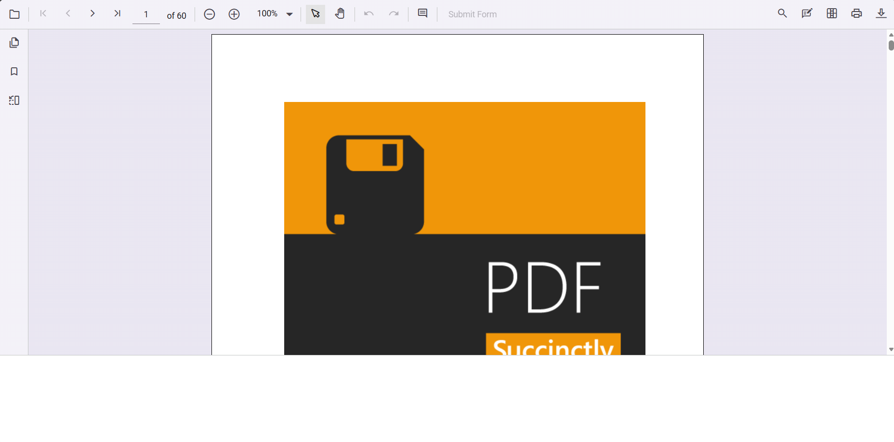
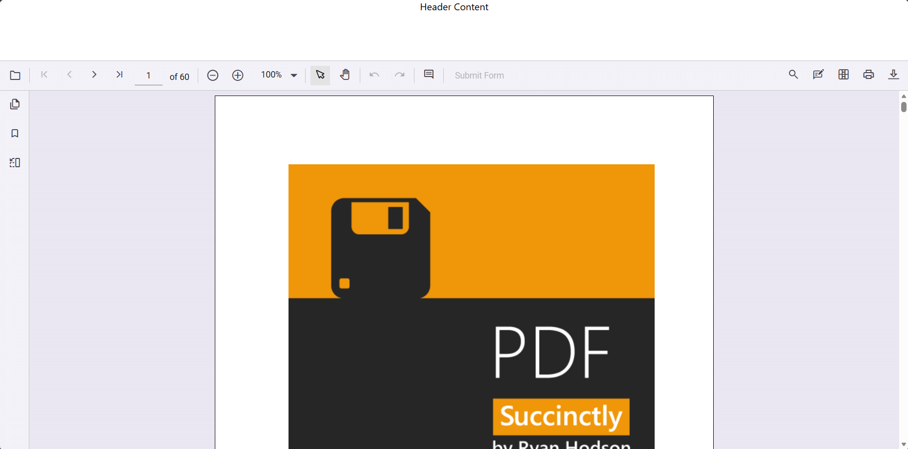
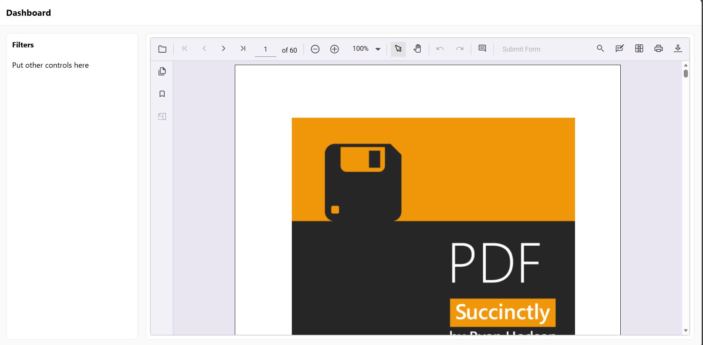
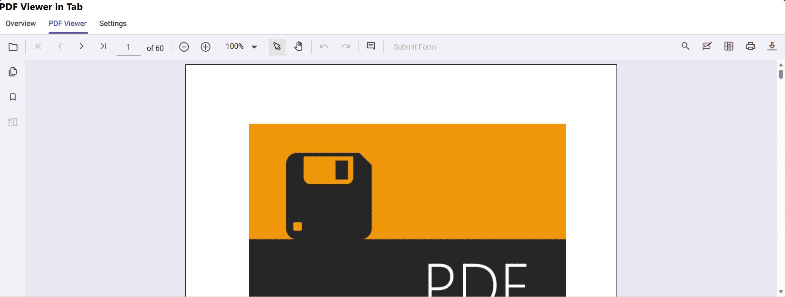
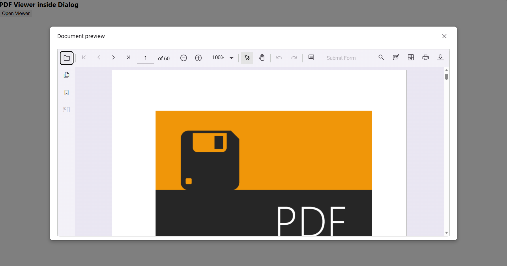
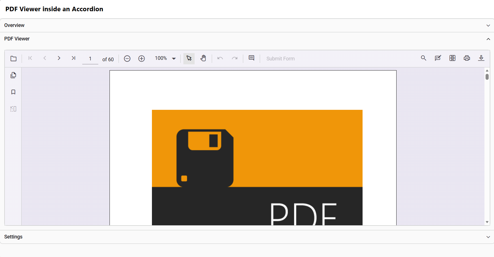

# Integrating PDF Viewer into Existing React Layouts

## Overview

The React PDF Viewer can be embedded into dashboards, admin panels, split‑screen views, tabs, dialogs, collapsible/accordion sections, sidebars, and multi‑column layouts. This guide provides concise patterns and minimal code examples so the viewer renders, sizes, and refreshes correctly inside common layout hosts.

## How‑To

- **Place the viewer inside layout components:**
    - Insert the PDF Viewer inside standard divs, CSS Grid cells, Flex box containers, and multi‑column panels. The viewer will expand to fill its parent container when the container has a defined height.

	Basic div:

	```ts
	// App.tsx
	import React from 'react';
	import { PdfViewerComponent, Toolbar, Magnification, Navigation, LinkAnnotation, BookmarkView, ThumbnailView, Print, TextSelection, Annotation, TextSearch, FormFields, FormDesigner, PageOrganizer, Inject } from '@syncfusion/ej2-react-pdfviewer';

	export function App() {
        return (
            <div style={{ height: '80vh' }}>
                <PdfViewerComponent
                    id="pdfViewer"
                    documentPath="https://cdn.syncfusion.com/content/pdf/pdf-succinctly.pdf"
                    resourceUrl="https://cdn.syncfusion.com/ej2/32.2.5/dist/ej2-pdfviewer-lib"
                    style={{ height: '100%', width: '100%' }}
                >
                    <Inject services={[Toolbar, Magnification, Navigation, LinkAnnotation, BookmarkView, ThumbnailView, Print, TextSelection, TextSearch, Annotation, FormFields, FormDesigner, PageOrganizer]} />
                </PdfViewerComponent>
            </div>
        );
	}
	```
    

	Flex container: keep `minHeight: 0` on flex children so the viewer can shrink/grow correctly:

	```ts
	// App.tsx
	import React from 'react';
	import { PdfViewerComponent, Toolbar, Magnification, Navigation, LinkAnnotation, BookmarkView, ThumbnailView, Print, TextSelection, Annotation, TextSearch, FormFields, FormDesigner, PageOrganizer, Inject } from '@syncfusion/ej2-react-pdfviewer';

	export function App() {
        return (
            <div style={{ display: 'flex', flexDirection: 'column', height: '100vh' }}>
                <header style={{ height: '100px', textAlign: 'center' }}>Header Content</header>
                <main style={{ flex: 1, minHeight: 0 }}>
                    <div style={{ height: '100%' }}>
                        <PdfViewerComponent
                            id="pdfViewer"
                            documentPath="https://cdn.syncfusion.com/content/pdf/pdf-succinctly.pdf"
                            resourceUrl="https://cdn.syncfusion.com/ej2/32.2.5/dist/ej2-pdfviewer-lib"
                            style={{ height: '100%', width: '100%' }}
                        >
                            <Inject services={[Toolbar, Magnification, Navigation, LinkAnnotation, BookmarkView, ThumbnailView, Print, TextSelection, TextSearch, Annotation, FormFields, FormDesigner, PageOrganizer]} />
                        </PdfViewerComponent>
                    </div>
                </main>
            </div>
        );
	}
	```
    

	CSS Grid - reserve rows/columns using `grid-template-rows` or `grid-template-columns`:

	```ts
	// App.tsx
	import React from 'react';
    import { PdfViewerComponent, Toolbar, Magnification, Navigation, LinkAnnotation, BookmarkView, ThumbnailView, Print, TextSelection, TextSearch, Annotation, FormDesigner, FormFields, Inject } from '@syncfusion/ej2-react-pdfviewer';

    export const App: React.FC = () => {
        return (
            <div style={styles.page}>
                <header style={styles.header}>
                    <h3 style={{ margin: 0 }}>Dashboard</h3>
                </header>

                <main style={styles.grid}>
                    <aside style={styles.sidebar}>
                        <div style={{ padding: 12 }}>
                            <h4 style={{ marginTop: 0 }}>Filters</h4>
                            <p>Put other controls here</p>
                        </div>
                    </aside>

                    <section style={styles.viewerArea}>
                        <PdfViewerComponent
                            id="pdfViewer"
                            documentPath="https://cdn.syncfusion.com/content/pdf/pdf-succinctly.pdf"
                            height="100%"
                            width="100%"
                            style={{ border: '1px solid #e0e0e0', borderRadius: 8 }}
                        >
                            <Inject
                                services={[
                                    Toolbar, Magnification, Navigation, LinkAnnotation, BookmarkView, ThumbnailView, Print, TextSelection, TextSearch, Annotation, FormDesigner, FormFields
                                ]}
                            />
                        </PdfViewerComponent>
                    </section>
                </main>
            </div>
        );
    };

    const styles: Record<string, React.CSSProperties> = {
        page: {
            height: '100vh',
            display: 'grid',
            gridTemplateRows: '56px 1fr',
            background: '#fafafa'
        },
        header: {
            display: 'flex',
            alignItems: 'center',
            padding: '0 16px',
            background: '#fff',
            borderBottom: '1px solid #e5e5e5'
        },
        grid: {
            display: 'grid',
            gridTemplateColumns: '280px 1fr',
            gap: 16,
            padding: 16,
            minHeight: 0 // lets children use available height
        },
        sidebar: {
            background: '#fff',
            border: '1px solid #e5e5e5',
            borderRadius: 8,
            overflow: 'auto'
        },
        viewerArea: {
            background: '#fff',
            border: '1px solid #e5e5e5',
            borderRadius: 8,
            padding: 8,
            display: 'grid',
            gridTemplateRows: '1fr',
            minHeight: 0 // critical so the viewer can grow/shrink
        }
    };
	```
    

- **Use viewer inside Tab components**
	- The react PDF Viewer are also supported inside Syncfusion tab components. 

	```ts
	// App.tsx
	import React, { useRef } from 'react';
    import { TabComponent, TabItemsDirective, TabItemDirective } from '@syncfusion/ej2-react-navigations';
    import { PdfViewerComponent, Toolbar, Magnification, Navigation, LinkAnnotation, BookmarkView, ThumbnailView, Print, TextSelection, TextSearch, Annotation, FormDesigner, FormFields, Inject } from '@syncfusion/ej2-react-pdfviewer';

    const ViewerTabContent: React.FC = () => {
        const viewerRef = useRef<PdfViewerComponent | null>(null);
        return (
            <div className="viewer-pane">
                <PdfViewerComponent
                    ref={(instance) => (viewerRef.current = instance)}
                    id="pdfViewerInTab"
                    documentPath="https://cdn.syncfusion.com/content/pdf/pdf-succinctly.pdf"
                    enableToolbar={true}
                    height="100%"
                    width="100%"
                    style={{ border: '1px solid #e0e0e0', borderRadius: 8 }}
                >
                    <Inject
                        services={[ Toolbar,
                            Magnification, Navigation, LinkAnnotation, BookmarkView, ThumbnailView, Print, TextSelection, TextSearch, Annotation, FormDesigner, FormFields
                        ]}
                    />
                </PdfViewerComponent>
            </div>
        );
    };

    export const App: React.FC = () => {
        return (
            <div className="page">
                <header className="header">
                    <h3 style={{ margin: 0 }}>PDF Viewer in tab</h3>
                </header>

                <div className="tab-host">
                    <TabComponent height="100%">
                        <TabItemsDirective>
                            <TabItemDirective
                                header={{ text: 'Overview' }}
                                content={() => (
                                    <div className="panel">
                                        <h4>Overview</h4>
                                        <p>Put general dashboard content here.</p>
                                    </div>
                                )}
                            />
                            <TabItemDirective
                                header={{ text: 'PDF Viewer' }}
                                content={ViewerTabContent}
                            />
                            <TabItemDirective
                                header={{ text: 'Settings' }}
                                content={() => (
                                    <div className="panel">
                                        <h4>Settings</h4>
                                        <p>Any settings or forms can go here.</p>
                                    </div>
                                )}
                            />
                        </TabItemsDirective>
                    </TabComponent>
                </div>
            </div>
        );
    };
	```
    

- **Use viewer inside Dialog**
	- If the viewer sits inside a dialog, for example Syncfusion Dialog, render or initialize the viewer after the dialog open events. The DOM must be visible for the viewer to measure layout.

	```ts
	// App.tsx
	import React, { useRef, useCallback } from 'react';
    import { DialogComponent } from '@syncfusion/ej2-react-popups';
    import {
        PdfViewerComponent, Toolbar, Magnification, Navigation, LinkAnnotation, BookmarkView, ThumbnailView, Print, TextSelection, TextSearch, Annotation, FormDesigner, FormFields, Inject
    } from '@syncfusion/ej2-react-pdfviewer';

    export const App: React.FC = () => {
        const viewerRef = useRef<PdfViewerComponent | null>(null);
        const dialogRef = useRef<DialogComponent | null>(null);
        const openDialog = () => {
            dialogRef.current.show();
        };
        const closeDialog = () => {
            dialogRef.current.hide();
        };
        const onDialogOpen = useCallback(() => {
            setTimeout(() => {
                window.dispatchEvent(new Event('resize'));
            }, 0);
        }, []);

        return (
            <div className="page">
                <header className="header">
                    <h3 style={{ margin: 0 }}>PDF Viewer inside Dialog</h3>
                    <div style={{ marginLeft: 'auto' }}>
                        <button onClick={openDialog}>Open Viewer</button>
                    </div>
                </header>
                <DialogComponent
                    ref={(dlg: any) => (dialogRef.current = dlg)}
                    isModal={true}
                    visible={false}
                    header="Document preview"
                    showCloseIcon={true}
                    minHeight="80vh"
                    width="80vw"
                    height="80vh"
                    allowDragging={true}
                    closeOnEscape={true}
                    target={document.body as any}
                    overlayClick={closeDialog}
                    open={onDialogOpen}
                >
                    <PdfViewerComponent
                        ref={(instance: any) => (viewerRef.current = instance)}
                        id="pdfViewerInDialog"
                        documentPath="https://cdn.syncfusion.com/content/pdf/pdf-succinctly.pdf"
                        enableToolbar={true}
                        height="100%"
                        width="100%"
                        style={{ border: '1px solid #e0e0e0', borderRadius: 8 }}
                    >
                        <Inject
                            services={[
                                Toolbar, Magnification, Navigation, LinkAnnotation, BookmarkView, ThumbnailView, Print, TextSelection, TextSearch, Annotation, FormDesigner, FormFields
                            ]}
                        />
                    </PdfViewerComponent>
                </DialogComponent>
            </div>
        );
    };
	```
    

- **Use viewer inside Collapsible sections**
	- For accordions or collapsible containers, either render the viewer lazily when the section expands or dispatch the resize event after expansion so the viewer can recompute layout.

	```ts
	// App.tsx
	import React, { useCallback, useRef } from 'react';
    import {
        AccordionComponent, AccordionItemsDirective, AccordionItemDirective, ExpandEventArgs
    } from '@syncfusion/ej2-react-navigations';

    import {
        PdfViewerComponent, Toolbar, Magnification, Navigation, LinkAnnotation, BookmarkView, ThumbnailView, Print, TextSelection, TextSearch, Annotation, FormDesigner, FormFields, Inject
    } from '@syncfusion/ej2-react-pdfviewer';

    export const App: React.FC = () => {
        const viewerRef = useRef<PdfViewerComponent | null>(null);
        const onExpanded = useCallback((args: ExpandEventArgs) => {
            setTimeout(() => {
                window.dispatchEvent(new Event('resize'));
            }, 0);
        }, []);

        // PDF viewer panel content
        const pdfContent = () => (
            <div className="pdf-pane">
                <PdfViewerComponent
                    ref={(inst) => (viewerRef.current = inst)}
                    id="pdfViewerInAccordion"
                    documentPath="https://cdn.syncfusion.com/content/pdf/pdf-succinctly.pdf"
                    enableToolbar={true}
                    height="100%"
                    width="100%"
                    style={{ border: '1px solid #e0e0e0', borderRadius: 8 }}
                >
                    <Inject
                        services={[
                            Toolbar, Magnification, Navigation, LinkAnnotation, BookmarkView, ThumbnailView, Print, TextSelection, TextSearch, Annotation, FormDesigner, FormFields
                        ]}
                    />
                </PdfViewerComponent>
            </div>
        );

        return (
            <div className="page">
                <header className="header">
                    <h3 style={{ margin: 0 }}>PDF Viewer inside an Accordion</h3>
                </header>
                <main className="content">
                    <AccordionComponent
                        expandMode="Single"
                        expanding={onExpanded}
                        expanded={onExpanded}
                    >
                        <AccordionItemsDirective>
                            <AccordionItemDirective
                                header="Overview"
                                expanded={true}
                                content={() => (
                                    <div className="panel">
                                        <h4>Overview</h4>
                                        <p>Place any introductory content here.</p>
                                    </div>
                                )}
                            />
                            <AccordionItemDirective
                                header="PDF Viewer"
                                content={pdfContent}
                            />
                            <AccordionItemDirective
                                header="Settings"
                                content={() => (
                                    <div className="panel">
                                        <h4>Settings</h4>
                                        <p>Your forms and other controls here.</p>
                                    </div>
                                )}
                            />
                        </AccordionItemsDirective>
                    </AccordionComponent>
                </main>
            </div>
        );
    };
	```
    ```css
    /* App.css */
    .page {
        height: 100vh;
        display: grid;
        grid-template-rows: 56px 1fr;
        background: #fafafa;
    }
    .header {
        display: flex;
        align-items: center;
        padding: 0 16px;
        background: #fff;
        border-bottom: 1px solid #e5e5e5;
    }
    ```
    

## Why visibility and height matter

- The PDF viewer measures its container to lay out pages. If the host element has no height (collapsed, display:none, or not yet mounted) measurements will be zero and rendering will fail or be clipped.

- Initialize or refresh the viewer when the host becomes visible (tab active, modal opened, accordion expanded) so internal layout code can compute sizes.

## Resize & visibility tips

- Short patterns:
  - Dispatch a global resize right after the container becomes visible:

```ts
setTimeout(() => window.dispatchEvent(new Event('resize')), 0);
```
- Use a `ResizeObserver` when the host size may change frequently:

```ts
const observer = new ResizeObserver(() => {
  window.dispatchEvent(new Event('resize'));
});
observer.observe(document.querySelector('#pdfViewer')!);
```

- Lazy-render inside tabs/dialogs/accordions: only mount the PDF Viewer when the pane is visible.

## When to use these patterns

- Use Dialogs for temporary previews or when you want an isolated view.
- Use Tabs/Accordion patterns when documents are part of multi-pane UIs — ensure refresh on show.
- Avoid placing the viewer in invisible containers without a resize/refresh strategy. 

## See also

- [Overview of Syncfusion React Tab component](https://ej2.syncfusion.com/react/documentation/tab/getting-started)
- [Overview of Syncfusion React Dialog component](https://ej2.syncfusion.com/react/documentation/dialog/getting-started)
- [Overview of Syncfusion React Accordion component](https://ej2.syncfusion.com/react/documentation/accordion/getting-started)