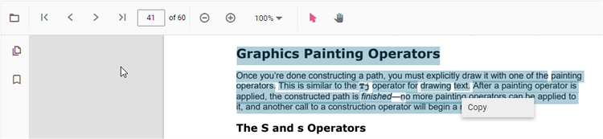
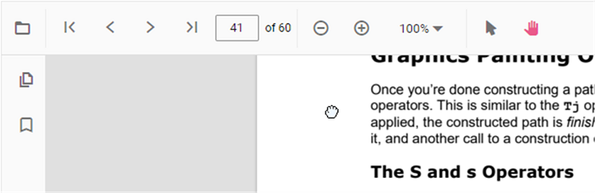

# Interaction mode in React PDF Viewer component

The PDF Viewer provides interaction modes for interacting with the loaded PDF document. Selection mode and panning mode are the two interaction modes.

## Selection mode

In this mode, users can select and copy text from the loaded PDF document. Panning and touch scrolling are disabled while text selection is enabled. Use the following snippet to enable or disable text selection.





import * as ReactDOM from 'react-dom';
import * as React from 'react';
import './index.css';
import { PdfViewerComponent, Toolbar, Magnification, Navigation, LinkAnnotation, BookmarkView,
         ThumbnailView, Print, TextSelection, TextSearch, Annotation, Inject } from '@syncfusion/ej2-react-pdfviewer';

function App() {

  return (

    

    {/* Render the PDF Viewer */}
      <PdfViewerComponent
        id="container"
        documentPath="https://cdn.syncfusion.com/content/pdf/pdf-succinctly.pdf"
        resourceUrl="https://cdn.syncfusion.com/ej2/31.2.2/dist/ej2-pdfviewer-lib"
        enableTextSelection={true}
        style={{ 'height': '640px' }}>

              <Inject services={[ Toolbar, Annotation, Magnification, Navigation, LinkAnnotation,
                                  BookmarkView, ThumbnailView, Print, TextSelection, TextSearch ]} />
      </PdfViewerComponent>
    

  
);

}
const root = ReactDOM.createRoot(document.getElementById('sample'));
root.render(<App />);






import * as ReactDOM from 'react-dom';
import * as React from 'react';
import './index.css';
import { PdfViewerComponent, Toolbar, Magnification, Navigation, LinkAnnotation, BookmarkView,
         ThumbnailView, Print, TextSelection, TextSearch, Annotation, Inject } from '@syncfusion/ej2-react-pdfviewer';

function App() {

  return (

    

    {/* Render the PDF Viewer */}
      <PdfViewerComponent
        id="container"
        documentPath="https://cdn.syncfusion.com/content/pdf/pdf-succinctly.pdf"
        enableTextSelection={true}
        serviceUrl="https://document.syncfusion.com/web-services/pdf-viewer/api/pdfviewer"
        style={{ 'height': '640px' }}>

              <Inject services={[ Toolbar, Annotation, Magnification, Navigation, LinkAnnotation,
                                  BookmarkView, ThumbnailView, Print, TextSelection, TextSearch ]} />
      </PdfViewerComponent>
    

  
);

}
const root = ReactDOM.createRoot(document.getElementById('sample'));
root.render(<App />);





## Panning Mode

In this mode, panning and touch scrolling are enabled for the loaded PDF document; text selection is not available.

You can switch the PDF Viewer interaction mode using the following snippet.





import * as ReactDOM from 'react-dom';
import * as React from 'react';
import './index.css';
import { PdfViewerComponent, Toolbar, Magnification, Navigation, LinkAnnotation, BookmarkView,
         ThumbnailView, Print, TextSelection, TextSearch, Annotation, Inject } from '@syncfusion/ej2-react-pdfviewer';

function App() {

  return (

    

    {/* Render the PDF Viewer */}
      <PdfViewerComponent
        id="container"
        documentPath="https://cdn.syncfusion.com/content/pdf/pdf-succinctly.pdf"
        resourceUrl="https://cdn.syncfusion.com/ej2/31.2.2/dist/ej2-pdfviewer-lib"
        enableTextSelection={false}
        interactionMode="interactionMode"
        style={{ 'height': '640px' }}>

              <Inject services={[ Toolbar, Annotation, Magnification, Navigation, LinkAnnotation,
                                  BookmarkView, ThumbnailView, Print, TextSelection, TextSearch ]} />
      </PdfViewerComponent>
    

  
);

}
const root = ReactDOM.createRoot(document.getElementById('sample'));
root.render(<App />);






import * as ReactDOM from 'react-dom';
import * as React from 'react';
import './index.css';
import { PdfViewerComponent, Toolbar, Magnification, Navigation, LinkAnnotation, BookmarkView,
         ThumbnailView, Print, TextSelection, TextSearch, Annotation, Inject } from '@syncfusion/ej2-react-pdfviewer';

function App() {

  return (

    

    {/* Render the PDF Viewer */}
      <PdfViewerComponent
        id="container"
        documentPath="https://cdn.syncfusion.com/content/pdf/pdf-succinctly.pdf"
        enableTextSelection={false}
        interactionMode="interactionMode"
        serviceUrl="https://document.syncfusion.com/web-services/pdf-viewer/api/pdfviewer"
        style={{ 'height': '640px' }}>

              <Inject services={[ Toolbar, Annotation, Magnification, Navigation, LinkAnnotation,
                                  BookmarkView, ThumbnailView, Print, TextSelection, TextSearch ]} />
      </PdfViewerComponent>
    

  
);

}
const root = ReactDOM.createRoot(document.getElementById('sample'));
root.render(<App />);





## See also

* [Toolbar items](./toolbar)
* [Feature Modules](./feature-module)