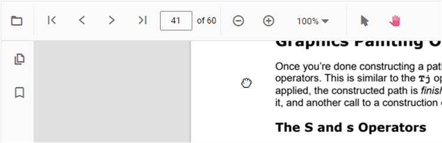
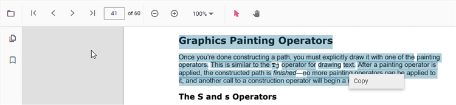

# Interaction Mode in React PDF Viewer

The PDF Viewer provides two interaction modes to control how users interact with the document: **Pan** mode for document navigation and **Text Selection** mode for text selection and copying.

The [InteractionMode](https://ej2.syncfusion.com/react/documentation/api/pdfviewer/interactionmode) enum defines the available interaction modes for the PDF Viewer.

| Value | Description |
|-------|-------------|
| `TextSelection` | Enables text selection and copying. Panning is disabled. |
| `Pan` | Enables panning and document navigation. Text selection is disabled. |

## Enable pan as default interaction

Set [InteractionMode](https://ej2.syncfusion.com/react/documentation/api/pdfviewer/interactionmode) to `Pan` to enable pan mode by default. In pan mode, users can drag to navigate the document, but text selection is disabled.





import * as ReactDOM from 'react-dom';
import * as React from 'react';
import './index.css';
import { PdfViewerComponent, Toolbar, Magnification, Navigation, LinkAnnotation, BookmarkView,
         ThumbnailView, Print, TextSelection, TextSearch, Annotation, Inject } from '@syncfusion/ej2-react-pdfviewer';

function App() {
  return (

    

      <PdfViewerComponent
        id="container"
        documentPath="https://cdn.syncfusion.com/content/pdf/pdf-succinctly.pdf"
        resourceUrl="https://cdn.syncfusion.com/ej2/31.2.2/dist/ej2-pdfviewer-lib"
        interactionMode="Pan"
        style={{ 'height': '640px' }}>

            <Inject services={[ Toolbar, Magnification, Navigation, LinkAnnotation, BookmarkView,
                                ThumbnailView, Print, TextSelection, TextSearch ]} />
      </PdfViewerComponent>
    

  
);
}
const root = ReactDOM.createRoot(document.getElementById('sample'));
root.render(<App />);






import * as ReactDOM from 'react-dom';
import * as React from 'react';
import './index.css';
import { PdfViewerComponent, Toolbar, Magnification, Navigation, LinkAnnotation, BookmarkView,
         ThumbnailView, Print, TextSelection, TextSearch, Annotation, Inject } from '@syncfusion/ej2-react-pdfviewer';

function App() {
  return (

    

      <PdfViewerComponent
        id="container"
        documentPath="https://cdn.syncfusion.com/content/pdf/pdf-succinctly.pdf"
        interactionMode="Pan"
        serviceUrl="https://document.syncfusion.com/web-services/pdf-viewer/api/pdfviewer"
        style={{ 'height': '640px' }}>

            <Inject services={[ Toolbar, Magnification, Navigation, LinkAnnotation, BookmarkView,
                                ThumbnailView, Print, TextSelection, TextSearch ]} />
      </PdfViewerComponent>
    

  
);
}
const root = ReactDOM.createRoot(document.getElementById('sample'));
root.render(<App />);





## Switch between Pan and Text Selection

Switch between Pan and Text Selection modes using the toolbar buttons in the UI or programmatically. When in Pan mode, text selection is disabled, and when in Text Selection mode, panning is disabled.

### Using Toolbar

The toolbar provides built-in buttons to switch between Pan and Text Selection modes without any code. Users can click the mode toggle button to switch.

**Pan Mode:** When Pan mode is active, the cursor changes to a hand icon, allowing users to drag and scroll through the document. Text selection is disabled in this mode.

**Selection Mode:** When Text Selection mode is active, the cursor changes to a text selection cursor, allowing users to highlight and copy text from the PDF. Panning is disabled in this mode.

### Programmatically
Use the `interactionMode` property to switch modes programmatically:





import * as ReactDOM from 'react-dom';
import * as React from 'react';
import './index.css';
import { PdfViewerComponent, Toolbar, Magnification, Navigation, LinkAnnotation, BookmarkView,
         ThumbnailView, Print, TextSelection, TextSearch, Annotation, Inject } from '@syncfusion/ej2-react-pdfviewer';

function App() {
  const pdfViewerRef = React.useRef(null);

  const switchToPan = () => {
    pdfViewerRef.current.interactionMode = 'Pan';
  };

  const switchToTextSelection = () => {
    pdfViewerRef.current.interactionMode = 'TextSelection';
  };

  return (

    

      <button onClick={switchToPan}>Pan Mode</button>
      <button onClick={switchToTextSelection}>Text Selection Mode</button>
    

    

      <PdfViewerComponent
        ref={pdfViewerRef}
        id="container"
        documentPath="https://cdn.syncfusion.com/content/pdf/pdf-succinctly.pdf"
        resourceUrl="https://cdn.syncfusion.com/ej2/31.2.2/dist/ej2-pdfviewer-lib"
        interactionMode="Pan"
        style={{ 'height': '640px' }}>

            <Inject services={[ Toolbar, Magnification, Navigation, LinkAnnotation, BookmarkView,
                                ThumbnailView, Print, TextSelection, TextSearch ]} />
      </PdfViewerComponent>
    

  
);
}
const root = ReactDOM.createRoot(document.getElementById('sample'));
root.render(<App />);






import * as ReactDOM from 'react-dom';
import * as React from 'react';
import './index.css';
import { PdfViewerComponent, Toolbar, Magnification, Navigation, LinkAnnotation, BookmarkView,
         ThumbnailView, Print, TextSelection, TextSearch, Annotation, Inject } from '@syncfusion/ej2-react-pdfviewer';

function App() {
  const pdfViewerRef = React.useRef(null);

  const switchToPan = () => {
    pdfViewerRef.current.interactionMode = 'Pan';
  };

  const switchToTextSelection = () => {
    pdfViewerRef.current.interactionMode = 'TextSelection';
  };

  return (

    

      <button onClick={switchToPan}>Pan Mode</button>
      <button onClick={switchToTextSelection}>Text Selection Mode</button>
    

    

      <PdfViewerComponent
        ref={pdfViewerRef}
        id="container"
        documentPath="https://cdn.syncfusion.com/content/pdf/pdf-succinctly.pdf"
        interactionMode="Pan"
        serviceUrl="https://document.syncfusion.com/web-services/pdf-viewer/api/pdfviewer"
        style={{ 'height': '640px' }}>

            <Inject services={[ Toolbar, Magnification, Navigation, LinkAnnotation, BookmarkView,
                                ThumbnailView, Print, TextSelection, TextSearch ]} />
      </PdfViewerComponent>
    

  
);
}
const root = ReactDOM.createRoot(document.getElementById('sample'));
root.render(<App />);





## Disable text selection (enable pan mode)

Disable text selection by setting `enableTextSelection={false}` to enable pan mode for document navigation. When text selection is disabled, users can only pan through the document and cannot select or copy text.





import * as ReactDOM from 'react-dom';
import * as React from 'react';
import './index.css';
import { PdfViewerComponent, Toolbar, Magnification, Navigation, LinkAnnotation, BookmarkView,
         ThumbnailView, Print, TextSelection, TextSearch, Annotation, Inject } from '@syncfusion/ej2-react-pdfviewer';

function App() {
  return (

    

      <PdfViewerComponent
        id="container"
        documentPath="https://cdn.syncfusion.com/content/pdf/pdf-succinctly.pdf"
        resourceUrl="https://cdn.syncfusion.com/ej2/31.2.2/dist/ej2-pdfviewer-lib"
        enableTextSelection={false}
        style={{ 'height': '640px' }}>

            <Inject services={[ Toolbar, Magnification, Navigation, LinkAnnotation, BookmarkView,
                                ThumbnailView, Print, TextSelection, TextSearch, Annotation ]} />
      </PdfViewerComponent>
    

  
);
}
const root = ReactDOM.createRoot(document.getElementById('sample'));
root.render(<App />);






import * as ReactDOM from 'react-dom';
import * as React from 'react';
import './index.css';
import { PdfViewerComponent, Toolbar, Magnification, Navigation, LinkAnnotation, BookmarkView,
         ThumbnailView, Print, TextSelection, TextSearch, Annotation, Inject } from '@syncfusion/ej2-react-pdfviewer';

function App() {
  return (

    

      <PdfViewerComponent
        id="container"
        documentPath="https://cdn.syncfusion.com/content/pdf/pdf-succinctly.pdf"
        enableTextSelection={false}
        serviceUrl="https://document.syncfusion.com/web-services/pdf-viewer/api/pdfviewer"
        style={{ 'height': '640px' }}>

            <Inject services={[ Toolbar, Magnification, Navigation, LinkAnnotation, BookmarkView,
                                ThumbnailView, Print, TextSelection, TextSearch, Annotation ]} />
      </PdfViewerComponent>
    

  
);
}
const root = ReactDOM.createRoot(document.getElementById('sample'));
root.render(<App />);





## Programmatically toggle interaction mode during runtime

Toggle interaction modes at runtime in response to events or user actions, such as when opening annotation tools.





import * as ReactDOM from 'react-dom';
import * as React from 'react';
import './index.css';
import { PdfViewerComponent, Toolbar, Magnification, Navigation, LinkAnnotation, BookmarkView,
         ThumbnailView, Print, TextSelection, TextSearch, Annotation, Inject } from '@syncfusion/ej2-react-pdfviewer';

function App() {
  const pdfViewerRef = React.useRef(null);
  const [isAnnotating, setIsAnnotating] = React.useState(false);

  const handleOpenAnnotationTool = () => {
    // Switch to TextSelection mode when opening annotation tool
    pdfViewerRef.current.interactionMode = 'TextSelection';
    setIsAnnotating(true);
  };

  const handleCloseAnnotationTool = () => {
    // Switch back to Pan mode
    pdfViewerRef.current.interactionMode = 'Pan';
    setIsAnnotating(false);
  };

  return (

    

      <button onClick={handleOpenAnnotationTool} disabled={isAnnotating}>
        Open Annotation Tool
      </button>
      <button onClick={handleCloseAnnotationTool} disabled={!isAnnotating}>
        Close Annotation Tool
      </button>
    

    

      <PdfViewerComponent
        ref={pdfViewerRef}
        id="container"
        documentPath="https://cdn.syncfusion.com/content/pdf/pdf-succinctly.pdf"
        resourceUrl="https://cdn.syncfusion.com/ej2/31.2.2/dist/ej2-pdfviewer-lib"
        interactionMode="Pan"
        style={{ 'height': '640px' }}>

            <Inject services={[ Toolbar, Magnification, Navigation, LinkAnnotation, BookmarkView,
                                ThumbnailView, Print, TextSelection, TextSearch, Annotation ]} />
      </PdfViewerComponent>
    

  
);
}
const root = ReactDOM.createRoot(document.getElementById('sample'));
root.render(<App />);






import * as ReactDOM from 'react-dom';
import * as React from 'react';
import './index.css';
import { PdfViewerComponent, Toolbar, Magnification, Navigation, LinkAnnotation, BookmarkView,
         ThumbnailView, Print, TextSelection, TextSearch, Annotation, Inject } from '@syncfusion/ej2-react-pdfviewer';

function App() {
  const pdfViewerRef = React.useRef(null);
  const [isAnnotating, setIsAnnotating] = React.useState(false);

  const handleOpenAnnotationTool = () => {
    // Switch to TextSelection mode when opening annotation tool
    pdfViewerRef.current.interactionMode = 'TextSelection';
    setIsAnnotating(true);
  };

  const handleCloseAnnotationTool = () => {
    // Switch back to Pan mode
    pdfViewerRef.current.interactionMode = 'Pan';
    setIsAnnotating(false);
  };

  return (

    

      <button onClick={handleOpenAnnotationTool} disabled={isAnnotating}>
        Open Annotation Tool
      </button>
      <button onClick={handleCloseAnnotationTool} disabled={!isAnnotating}>
        Close Annotation Tool
      </button>
    

    

      <PdfViewerComponent
        ref={pdfViewerRef}
        id="container"
        documentPath="https://cdn.syncfusion.com/content/pdf/pdf-succinctly.pdf"
        interactionMode="Pan"
        serviceUrl="https://document.syncfusion.com/web-services/pdf-viewer/api/pdfviewer"
        style={{ 'height': '640px' }}>

            <Inject services={[ Toolbar, Magnification, Navigation, LinkAnnotation, BookmarkView,
                                ThumbnailView, Print, TextSelection, TextSearch, Annotation ]} />
      </PdfViewerComponent>
    

  
);
}
const root = ReactDOM.createRoot(document.getElementById('sample'));
root.render(<App />);





## See also

* [Magnification](./magnification) — Control zoom and fit modes
* [Toolbar items](./toolbar) — Customize toolbar controls
* [Feature Modules](./feature-module) — Enable/disable features