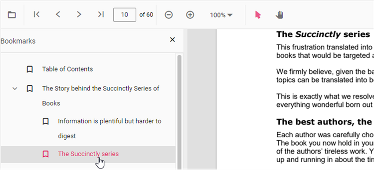

# Bookmark navigation in React PDF Viewer control

The Bookmarks saved in PDF files are loaded and made ready for easy navigation.
You can enable/disable bookmark navigation by using the following code snippet.,




import * as React from 'react';
import * as ReactDOM from 'react-dom/client';
import {
  PdfViewerComponent,
  Toolbar,
  Magnification,
  Navigation,
  LinkAnnotation,
  Annotation,
  ThumbnailView,
  BookmarkView,
  TextSelection,
  Inject
} from '@syncfusion/ej2-react-pdfviewer';

function App() {
  let pdfviewer;
  return (
    <PdfViewerComponent
      id="PdfViewer"
      ref={(scope) => { pdfviewer = scope; }}
      enableBookmark={true}
      documentPath="https://cdn.syncfusion.com/content/pdf/pdf-succinctly.pdf"
      resourceUrl="https://cdn.syncfusion.com/ej2/23.1.43/dist/ej2-pdfviewer-lib"
      style={{ height: '500px', width: '100%' }}
    >
      <Inject services={[
        Toolbar,
        Magnification,
        Navigation,
        Annotation,
        LinkAnnotation,
        ThumbnailView,
        BookmarkView,
        TextSelection
      ]} />
    </PdfViewerComponent>
  );
}

const root = ReactDOM.createRoot(document.getElementById('PdfViewer'));
root.render(<App />);




import * as React from 'react';
import * as ReactDOM from 'react-dom/client';
import {
  PdfViewerComponent,
  Toolbar,
  Magnification,
  Navigation,
  LinkAnnotation,
  Annotation,
  ThumbnailView,
  BookmarkView,
  TextSelection,
  Inject
} from '@syncfusion/ej2-react-pdfviewer';

function App() {
  let pdfviewer;
  return (
    <PdfViewerComponent
      id="PdfViewer"
      ref={(scope) => { pdfviewer = scope; }}
      enableBookmark={true}
      documentPath="https://cdn.syncfusion.com/content/pdf/pdf-succinctly.pdf"
      serviceUrl="https://document.syncfusion.com/web-services/pdf-viewer/api/pdfviewer/"
      style={{ height: '500px', width: '100%' }}
    >
      <Inject services={[
        Toolbar,
        Magnification,
        Navigation,
        Annotation,
        LinkAnnotation,
        ThumbnailView,
        BookmarkView,
        TextSelection
      ]} />
    </PdfViewerComponent>
  );
}

const root = ReactDOM.createRoot(document.getElementById('PdfViewer'));
root.render(<App />);






To perform bookmark navigation, you can use the **goToBookmark** method. It's important to note that the **goToBookmark** method will throw an error if the specified bookmark does not exist in the PDF document.

Here is an example of how to use the **goToBookmark** method:

```
  <button id="gotobookmark">Specfic Page</button>
```

```ts
import * as React from 'react';
import * as ReactDOM from 'react-dom/client';
import { PdfViewerComponent, BookmarkView, Inject } from '@syncfusion/ej2-react-pdfviewer';

let pdfviewer;

function App() {
  const onGoToBookmark = () => {
    // x - pageIndex, y - Y coordinate
    pdfviewer && pdfviewer.bookmark.goToBookmark(x, y);
  };

  return (
    <div>
      <button id="gotobookmark" onClick={onGoToBookmark}>Specfic Page</button>
      <PdfViewerComponent ref={(scope) => { pdfviewer = scope; }} style={{ height: '500px', width: '100%' }}>
        <Inject services={[BookmarkView]} />
      </PdfViewerComponent>
    </div>
  );
}

const root = ReactDOM.createRoot(document.getElementById('PdfViewer'));
root.render(<App />);
```

x - Specifies the pageIndex for Navigate.

y - Specifies the Y coordinates value of the Page.

Also, you can use the **getBookmarks** method to retrieve a list of all the bookmarks in a PDF document. This method returns a List of Bookmark objects, which contain information about each bookmark.

Here is an example of how to use the getBookmarks method:

```
  <button id="getBookmarks">retrieve bookmark</button>
```

```ts
import * as React from 'react';
import * as ReactDOM from 'react-dom/client';
import { PdfViewerComponent, BookmarkView, Inject } from '@syncfusion/ej2-react-pdfviewer';

let pdfviewer;

function App() {
  const onGetBookmarks = () => {
    var getBookmarks = pdfviewer && pdfviewer.bookmark.getBookmarks();
    console.log(getBookmarks);
  };

  return (
    <div>
      <button id="getBookmarks" onClick={onGetBookmarks}>retrieve bookmark</button>
      <PdfViewerComponent ref={(scope) => { pdfviewer = scope; }} style={{ height: '500px', width: '100%' }}>
        <Inject services={[BookmarkView]} />
      </PdfViewerComponent>
    </div>
  );
}

const root = ReactDOM.createRoot(document.getElementById('PdfViewer'));
root.render(<App />);
```

## See also

* [Toolbar items](https://help.syncfusion.com/document-processing/pdf/pdf-viewer/react/toolbar/)
* [Feature Modules](https://help.syncfusion.com/document-processing/pdf/pdf-viewer/react/feature-module/)