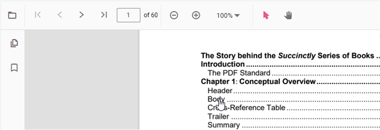
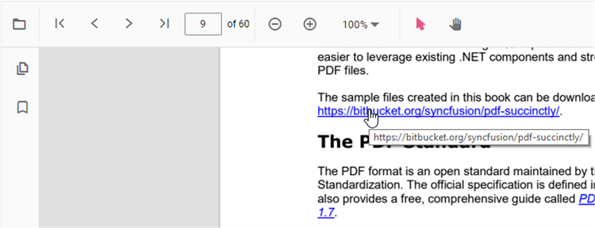

# Hyperlink navigation in React PDF Viewer

## Overview

This guide shows how to configure hyperlink behavior in the React PDF Viewer: table of contents navigation, enable/disable links, control how links open, and handle hyperlink events.

N> The table of contents pane and hyperlink interactions rely on the same navigation infrastructure. When these capabilities are enabled, the PDF Viewer automatically surfaces TOC entries and clickable links defined in the PDF.

## Required modules

Inject the following modules to enable navigation: `Toolbar`, `Magnification`, `Navigation`, `LinkAnnotation`, `BookmarkView`, `TextSelection`, `ThumbnailView`, and optionally `Annotation`.

## Table of contents navigation

Navigate through PDF sections using the table of contents pane. The viewer displays bookmarks and outline entries defined in the PDF. Select an entry to jump to that destination. Empty pane indicates the PDF has no table of contents structure.

## Hyperlink navigation

Configure how the PDF Viewer handles embedded links pointing to external websites or in-document destinations. Control link activation, behavior, and events.

## How to configure hyperlinks

### Enable or disable hyperlinks

By default hyperlinks are enabled. Set the [`enableHyperlink`](https://ej2.syncfusion.com/react/documentation/api/pdfviewer#enablehyperlink) property to `false` to make links non-interactive.




import {
    PdfViewerComponent, Toolbar, Magnification, Navigation, LinkAnnotation, BookmarkView,
    ThumbnailView, Print, TextSelection, Annotation, TextSearch, FormFields, FormDesigner,
    PageOrganizer, Inject
} from '@syncfusion/ej2-react-pdfviewer';
import { useRef, RefObject } from 'react';

export default function App() {
    const viewerRef: RefObject<PdfViewerComponent | null> = useRef<PdfViewerComponent>(null);
    return (
        

            <PdfViewerComponent
                id="PdfViewer"
                ref={viewerRef}
                documentPath="https://cdn.syncfusion.com/content/pdf/pdf-succinctly.pdf"
                resourceUrl="https://cdn.syncfusion.com/ej2/32.2.3/dist/ej2-pdfviewer-lib"
                style={{ height: '100%' }}
                enableHyperlink={false}
            >
                <Inject
                    services={[
                        Toolbar, Magnification, Navigation, Annotation, LinkAnnotation, BookmarkView,
                        ThumbnailView, Print, TextSelection, TextSearch, FormFields, FormDesigner, PageOrganizer
                    ]}
                />
            </PdfViewerComponent>
        

    );
}




### Control how links open

Use the [`hyperlinkOpenState`](https://ej2.syncfusion.com/react/documentation/api/pdfviewer#hyperlinkopenstate) property to choose whether external links open in the current tab or a new tab:




import {
    PdfViewerComponent, Toolbar, Magnification, Navigation, LinkAnnotation, BookmarkView,
    ThumbnailView, Print, TextSelection, Annotation, TextSearch, FormFields, FormDesigner,
    PageOrganizer, Inject
} from '@syncfusion/ej2-react-pdfviewer';
import { useRef, RefObject } from 'react';

export default function App() {
    const viewerRef: RefObject<PdfViewerComponent | null> = useRef<PdfViewerComponent>(null);
    return (
        

            <PdfViewerComponent
                id="PdfViewer"
                ref={viewerRef}
                documentPath="https://cdn.syncfusion.com/content/pdf/pdf-succinctly.pdf"
                resourceUrl="https://cdn.syncfusion.com/ej2/32.2.3/dist/ej2-pdfviewer-lib"
                style={{ height: '100%' }}
                hyperlinkOpenState='NewTab'
            >
                <Inject
                    services={[
                        Toolbar, Magnification, Navigation, Annotation, LinkAnnotation, BookmarkView,
                        ThumbnailView, Print, TextSelection, TextSearch, FormFields, FormDesigner, PageOrganizer
                    ]}
                />
            </PdfViewerComponent>
        

    );
}




### Handle hyperlink events

Use the [`hyperlinkClick`](https://ej2.syncfusion.com/react/documentation/api/pdfviewer#hyperlinkclick) and [`hyperlinkMouseOver`](https://ej2.syncfusion.com/react/documentation/api/pdfviewer#hyperlinkmouseover) events to intercept clicks or show custom tooltips:




import {
    PdfViewerComponent, Toolbar, Magnification, Navigation, LinkAnnotation, BookmarkView,
    ThumbnailView, Print, TextSelection, Annotation, TextSearch, FormFields, FormDesigner,
    PageOrganizer, Inject, HyperlinkMouseOverArgs, HyperlinkClickEventArgs
} from '@syncfusion/ej2-react-pdfviewer';
import { useRef, RefObject } from 'react';

export default function App() {
    const viewerRef: RefObject<PdfViewerComponent | null> = useRef<PdfViewerComponent>(null);
    const hyperlinkClick = (args: HyperlinkClickEventArgs) => {
        console.log('Hyperlink Clicked:', args.hyperlink);
        // To prevent the default navigation behavior, set args.cancel = true;
        // args.cancel = true;
    };
    const hyperlinkMouseOver = (args: HyperlinkMouseOverArgs) => {
        console.log('Mouse is over hyperlink:', args.hyperlinkElement.href);
    };
    return (
        

            <PdfViewerComponent
                id="PdfViewer"
                ref={viewerRef}
                documentPath="https://cdn.syncfusion.com/content/pdf/pdf-succinctly.pdf"
                resourceUrl="https://cdn.syncfusion.com/ej2/32.2.3/dist/ej2-pdfviewer-lib"
                style={{ height: '100%' }}
                hyperlinkClick={hyperlinkClick}
                hyperlinkMouseOver={hyperlinkMouseOver}
            >
                <Inject
                    services={[
                        Toolbar, Magnification, Navigation, Annotation, LinkAnnotation, BookmarkView,
                        ThumbnailView, Print, TextSelection, TextSearch, FormFields, FormDesigner, PageOrganizer
                    ]}
                />
            </PdfViewerComponent>
        

    );
}




## Troubleshooting

- If links still open when [`enableHyperlink={false}`](https://ej2.syncfusion.com/react/documentation/api/pdfviewer#enablehyperlink), ensure the page uses the correct [`resourceUrl`](https://ej2.syncfusion.com/react/documentation/api/pdfviewer#resourceurl) and that `LinkAnnotation` is not being re-enabled elsewhere. Disabling hyperlinks only affects the viewer's behavior and does not alter the original PDF document.
- If events do not fire, verify that `Inject` includes `LinkAnnotation` and any other services shown in the examples.
- For TOC navigation, ensure the PDF document contains bookmarks or an outline structure. If the pane appears empty, the document may not have a table of contents defined.

## See also

- [Bookmark navigation](./bookmark)
- [Page navigation](./page)
- [Page thumbnail navigation](./page-thumbnail)