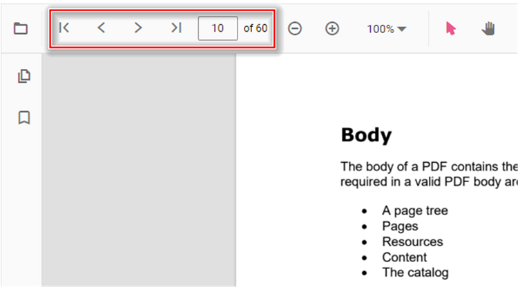

# Navigation in React PDF Viewer control

The ASP.NET Core PDF Viewer supports different internal and external navigations.

## Toolbar page navigation option

The default toolbar of PDF Viewer contains the following navigation options

* [**Go to page**](https://ej2.syncfusion.com/react/documentation/api/pdfviewer/navigation/#gotopage):- Navigates to the specific page of a PDF document.
* [**Show next page**](https://ej2.syncfusion.com/react/documentation/api/pdfviewer/navigation/#gotonextpage):- Navigates to the next page of PDF a document.
* [**Show previous page**](https://ej2.syncfusion.com/react/documentation/api/pdfviewer/navigation/#gotopreviouspage):- Navigates to the previous page of a PDF document.
* [**Show first page**](https://ej2.syncfusion.com/react/documentation/api/pdfviewer/navigation/#gotofirstpage):-  Navigates to the first page of a PDF document.
* [**Show last page**](https://ej2.syncfusion.com/react/documentation/api/pdfviewer/navigation/#gotolastpage):- Navigates to the last page of a PDF document.

```html
<!DOCTYPE html>
<html lang="en">

<head>
    <title>Essential JS 2</title>
    <meta charset="utf-8" />
    <meta name="viewport" content="width=device-width, initial-scale=1.0, user-scalable=no" />
    <meta name="description" content="Essential JS 2" />
    <meta name="author" content="Syncfusion" />
    <link rel="shortcut icon" href="resources/favicon.ico" />
    <link href="https://maxcdn.bootstrapcdn.com/bootstrap/3.3.7/css/bootstrap.min.css" rel="stylesheet" />

    <!--style reference from app-->
    <link href="/styles/styles.css" rel="stylesheet" />

    <!--system js reference and configuration-->
    <script src="node_modules/systemjs/dist/system.src.js" type="text/javascript"></script>
    <script src="system.config.js" type="text/javascript"></script>
</head>

<body>
    <!--Element which will render as PdfViewer -->
    <div id="PdfViewer"></div>
</body>

</html>
```

You can enable/disable page navigation option in PDF Viewer using the following code snippet.,




import * as React from 'react';
import * as ReactDOM from 'react-dom/client';
import {
  PdfViewerComponent,
  Toolbar,
  Magnification,
  Navigation,
  LinkAnnotation,
  ThumbnailView,
  BookmarkView,
  TextSelection,
  Inject
} from '@syncfusion/ej2-react-pdfviewer';

function App() {
  let pdfviewer;
  return (
    <PdfViewerComponent
      id="PdfViewer"
      ref={(scope) => { pdfviewer = scope; }}
      enableNavigation={true}
      documentPath="https://cdn.syncfusion.com/content/pdf/pdf-succinctly.pdf"
      resourceUrl="https://cdn.syncfusion.com/ej2/23.1.43/dist/ej2-pdfviewer-lib"
      style={{ height: '500px', width: '100%' }}
    >
      <Inject services={[
        Toolbar,
        Magnification,
        Navigation,
        LinkAnnotation,
        ThumbnailView,
        BookmarkView,
        TextSelection
      ]} />
    </PdfViewerComponent>
  );
}

const root = ReactDOM.createRoot(document.getElementById('PdfViewer'));
root.render(<App />);




import * as React from 'react';
import * as ReactDOM from 'react-dom/client';
import {
  PdfViewerComponent,
  Toolbar,
  Magnification,
  Navigation,
  LinkAnnotation,
  ThumbnailView,
  BookmarkView,
  TextSelection,
  Inject
} from '@syncfusion/ej2-react-pdfviewer';

function App() {
  let pdfviewer;
  return (
    <PdfViewerComponent
      id="PdfViewer"
      ref={(scope) => { pdfviewer = scope; }}
      enableNavigation={true}
      documentPath="https://cdn.syncfusion.com/content/pdf/pdf-succinctly.pdf"
      serviceUrl="https://document.syncfusion.com/web-services/pdf-viewer/api/pdfviewer/"
      style={{ height: '500px', width: '100%' }}
    >
      <Inject services={[
        Toolbar,
        Magnification,
        Navigation,
        LinkAnnotation,
        ThumbnailView,
        BookmarkView,
        TextSelection
      ]} />
    </PdfViewerComponent>
  );
}

const root = ReactDOM.createRoot(document.getElementById('PdfViewer'));
root.render(<App />);






Also, you can programmatically perform page navigation options as follows.

```html
<!DOCTYPE html>
<html lang="en">

<head>
    <title>Essential JS 2</title>
    <meta charset="utf-8" />
    <meta name="viewport" content="width=device-width, initial-scale=1.0, user-scalable=no" />
    <meta name="description" content="Essential JS 2" />
    <meta name="author" content="Syncfusion" />
    <link rel="shortcut icon" href="resources/favicon.ico" />
    <link href="https://maxcdn.bootstrapcdn.com/bootstrap/3.3.7/css/bootstrap.min.css" rel="stylesheet" />

    <!--style reference from app-->
    <link href="/styles/styles.css" rel="stylesheet" />

    <!--system js reference and configuration-->
    <script src="node_modules/systemjs/dist/system.src.js" type="text/javascript"></script>
    <script src="system.config.js" type="text/javascript"></script>
</head>

<body>
    <!--Element which will render as PdfViewer -->
    <button id="goToFirstPage">Go To First Page</button>
    <button id="goToLastPage">Go To last Page</button>
    <button id="goToNextPage">Go To Next Page</button>
    <button id="goToPage">Go To Page</button>
    <button id="goToPreviousPage">Go To Previous Page</button>
    <div id="PdfViewer"></div>
</body>

</html>
```




import * as React from 'react';
import * as ReactDOM from 'react-dom/client';
import {
  PdfViewerComponent,
  Toolbar,
  Magnification,
  Navigation,
  LinkAnnotation,
  BookmarkView,
  ThumbnailView,
  Print,
  TextSelection,
  TextSearch,
  Annotation,
  FormFields,
  Inject
} from '@syncfusion/ej2-react-pdfviewer';

let pdfviewer;

function App() {
  const onGoToFirstPage = () => pdfviewer && pdfviewer.navigation.goToFirstPage();
  const onGoToLastPage = () => pdfviewer && pdfviewer.navigation.goToLastPage();
  const onGoToNextPage = () => pdfviewer && pdfviewer.navigation.goToNextPage();
  const onGoToPage = () => pdfviewer && pdfviewer.navigation.goToPage(4);
  const onGoToPreviousPage = () => pdfviewer && pdfviewer.navigation.goToPreviousPage();

  React.useEffect(() => {
    // Load document after mount if needed
    // pdfviewer && pdfviewer.load('https://cdn.syncfusion.com/content/pdf/pdf-succinctly.pdf', null);
  }, []);

  return (
    <div>
      <button id="goToFirstPage" onClick={onGoToFirstPage}>Go To First Page</button>
      <button id="goToLastPage" onClick={onGoToLastPage}>Go To last Page</button>
      <button id="goToNextPage" onClick={onGoToNextPage}>Go To Next Page</button>
      <button id="goToPage" onClick={onGoToPage}>Go To Page</button>
      <button id="goToPreviousPage" onClick={onGoToPreviousPage}>Go To Previous Page</button>
      <PdfViewerComponent
        id="pdfViewer"
        ref={(scope) => { pdfviewer = scope; }}
        documentPath="https://cdn.syncfusion.com/content/pdf/pdf-succinctly.pdf"
        resourceUrl="https://cdn.syncfusion.com/ej2/23.1.43/dist/ej2-pdfviewer-lib"
        style={{ height: '500px', width: '100%' }}
      >
        <Inject services={[
          Toolbar,
          Magnification,
          Navigation,
          LinkAnnotation,
          ThumbnailView,
          BookmarkView,
          Print,
          TextSelection,
          TextSearch,
          Annotation,
          FormFields
        ]} />
      </PdfViewerComponent>
    </div>
  );
}

const root = ReactDOM.createRoot(document.getElementById('PdfViewer'));
root.render(<App />);




import * as React from 'react';
import * as ReactDOM from 'react-dom/client';
import {
  PdfViewerComponent,
  Toolbar,
  Magnification,
  Navigation,
  LinkAnnotation,
  BookmarkView,
  ThumbnailView,
  Print,
  TextSelection,
  TextSearch,
  Annotation,
  FormFields,
  Inject
} from '@syncfusion/ej2-react-pdfviewer';

let pdfviewer;

function App() {
  const onGoToFirstPage = () => pdfviewer && pdfviewer.navigation.goToFirstPage();
  const onGoToLastPage = () => pdfviewer && pdfviewer.navigation.goToLastPage();
  const onGoToNextPage = () => pdfviewer && pdfviewer.navigation.goToNextPage();
  const onGoToPage = () => pdfviewer && pdfviewer.navigation.goToPage(4);
  const onGoToPreviousPage = () => pdfviewer && pdfviewer.navigation.goToPreviousPage();

  return (
    <div>
      <button id="goToFirstPage" onClick={onGoToFirstPage}>Go To First Page</button>
      <button id="goToLastPage" onClick={onGoToLastPage}>Go To last Page</button>
      <button id="goToNextPage" onClick={onGoToNextPage}>Go To Next Page</button>
      <button id="goToPage" onClick={onGoToPage}>Go To Page</button>
      <button id="goToPreviousPage" onClick={onGoToPreviousPage}>Go To Previous Page</button>
      <PdfViewerComponent
        id="pdfViewer"
        ref={(scope) => { pdfviewer = scope; }}
        serviceUrl="https://document.syncfusion.com/web-services/pdf-viewer/api/pdfviewer/"
        documentPath="https://cdn.syncfusion.com/content/pdf/pdf-succinctly.pdf"
        style={{ height: '500px', width: '100%' }}
      >
        <Inject services={[
          Toolbar,
          Magnification,
          Navigation,
          LinkAnnotation,
          ThumbnailView,
          BookmarkView,
          Print,
          TextSelection,
          TextSearch,
          Annotation,
          FormFields
        ]} />
      </PdfViewerComponent>
    </div>
  );
}

const root = ReactDOM.createRoot(document.getElementById('PdfViewer'));
root.render(<App />);




Find the [here](https://stackblitz.com/edit/5dqbkd?file=index.ts) to perform the page navigation options programmatically.

## See also

* [Toolbar items](https://help.syncfusion.com/document-processing/pdf/pdf-viewer/react/toolbar/)
* [Feature Modules](https://help.syncfusion.com/document-processing/pdf/pdf-viewer/react/feature-module/)