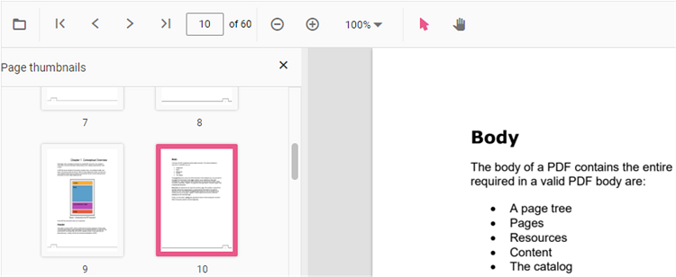

# Page Thumbnail navigation in React PDF Viewer control

Thumbnails is the miniature representation of actual pages in PDF files. This feature displays thumbnails of the pages and allows navigation.
You can enable/disable thumbnail navigation by using the following code snippet.,




import * as React from 'react';
import * as ReactDOM from 'react-dom/client';
import {
  PdfViewerComponent,
  Toolbar,
  Magnification,
  Navigation,
  Annotation,
  LinkAnnotation,
  ThumbnailView,
  BookmarkView,
  TextSelection,
  Inject
} from '@syncfusion/ej2-react-pdfviewer';

function App() {
  const pdfviewer = React.useRef(null);
  return (
    <PdfViewerComponent
      id="PdfViewer"
      ref={pdfviewer}
      enableThumbnail={true}
      documentPath="https://cdn.syncfusion.com/content/pdf/pdf-succinctly.pdf"
      style={{ height: '500px', width: '100%' }}
    >
      <Inject services={[
        Toolbar,
        Magnification,
        Navigation,
        Annotation,
        LinkAnnotation,
        ThumbnailView,
        BookmarkView,
        TextSelection
      ]} />
    </PdfViewerComponent>
  );
}

const root = ReactDOM.createRoot(document.getElementById('PdfViewer'));
root.render(<App />);




import * as React from 'react';
import * as ReactDOM from 'react-dom/client';
import {
  PdfViewerComponent,
  Toolbar,
  Magnification,
  Navigation,
  Annotation,
  LinkAnnotation,
  ThumbnailView,
  BookmarkView,
  TextSelection,
  Inject
} from '@syncfusion/ej2-react-pdfviewer';

function App() {
  const pdfviewer = React.useRef(null);
  return (
    <PdfViewerComponent
      id="PdfViewer"
      ref={pdfviewer}
      enableThumbnail={true}
      documentPath="https://cdn.syncfusion.com/content/pdf/pdf-succinctly.pdf"
      serviceUrl="https://document.syncfusion.com/web-services/pdf-viewer/api/pdfviewer/"
      style={{ height: '500px', width: '100%' }}
    >
      <Inject services={[
        Toolbar,
        Magnification,
        Navigation,
        Annotation,
        LinkAnnotation,
        ThumbnailView,
        BookmarkView,
        TextSelection
      ]} />
    </PdfViewerComponent>
  );
}

const root = ReactDOM.createRoot(document.getElementById('PdfViewer'));
root.render(<App />);




## See also

* [Toolbar items](https://help.syncfusion.com/document-processing/pdf/pdf-viewer/react/toolbar/)
* [Feature Modules](https://help.syncfusion.com/document-processing/pdf/pdf-viewer/react/feature-module/)