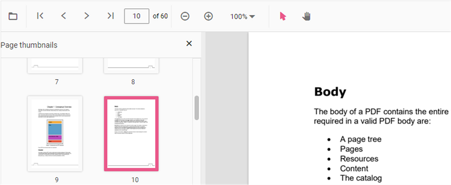

# Page Thumbnail Navigation in React PDF Viewer

## Overview

Page thumbnails are miniature previews of PDF pages displayed in a side panel. They allow users to quickly navigate to specific pages without scrolling through the entire document.

This guide explains how to enable the thumbnail navigation feature and to toggle the thumbnail view programmatically in the React PDF Viewer component. When enabled, a thumbnails panel appears in the viewer, displaying small previews of each page. You can also open or close the panel on demand using the [`openThumbnailPane`](https://ej2.syncfusion.com/react/documentation/api/pdfviewer/thumbnailview#openthumbnailpane) and [`closeThumbnailPane`](https://ej2.syncfusion.com/react/documentation/api/pdfviewer/thumbnailview#closethumbnailpane) methods.

## Steps

### 1. Enable thumbnail view

Enable or disable the thumbnail view by using the [`enableThumbnail`](https://ej2.syncfusion.com/react/documentation/api/pdfviewer#enablethumbnail) property. The default value of `enableThumbnail` is `true`, so thumbnails are available out of the box once the `ThumbnailView` module is injected.




import {
    PdfViewerComponent, Toolbar, Magnification, Navigation, LinkAnnotation, BookmarkView,
    ThumbnailView, Print, TextSelection, Annotation, TextSearch, FormFields, FormDesigner,
    PageOrganizer, Inject
} from '@syncfusion/ej2-react-pdfviewer';
import { useRef, RefObject } from 'react';

export default function App() {
    const viewerRef: RefObject<PdfViewerComponent | null> = useRef<PdfViewerComponent>(null);
    return (
        

            <PdfViewerComponent
                id="PdfViewer"
                ref={viewerRef}
                documentPath="https://cdn.syncfusion.com/content/pdf/pdf-succinctly.pdf"
                resourceUrl="https://cdn.syncfusion.com/ej2/32.2.3/dist/ej2-pdfviewer-lib"
                style={{ height: '100%' }}
                enableThumbnail={true}
            >
                <Inject
                    services={[
                        Toolbar, Magnification, Navigation, Annotation, LinkAnnotation, BookmarkView,
                        ThumbnailView, Print, TextSelection, TextSearch, FormFields, FormDesigner, PageOrganizer
                    ]}
                />
            </PdfViewerComponent>
        

    );
}




#### Expected output

When [`enableThumbnail`](https://ej2.syncfusion.com/react/documentation/api/pdfviewer#enablethumbnail) is set to `true`, a thumbnail panel can be opened through the navigation toolbar on the left side of the PDF Viewer, which displays miniature previews of each page. Clicking on any thumbnail navigates directly to that page. To disable thumbnail navigation, set `enableThumbnail={false}` or simply remove the property.

### 2. Open or close thumbnail view programmatically

The thumbnail view in the React PDF Viewer can be opened by using the [`openThumbnailPane`](https://ej2.syncfusion.com/react/documentation/api/pdfviewer/thumbnailview#openthumbnailpane) method and closed by using the [`closeThumbnailPane`](https://ej2.syncfusion.com/react/documentation/api/pdfviewer/thumbnailview#closethumbnailpane) method. Both methods return `void` and can be called on the `thumbnailView` instance of the viewer reference.

> The `thumbnailView` property is only available on the viewer instance when the `ThumbnailView` module is included in the `Inject` services array. If the module is not injected, `viewerRef.current?.thumbnailView` will be `undefined`.




import {
    PdfViewerComponent, Toolbar, Magnification, Navigation, LinkAnnotation, BookmarkView,
    ThumbnailView, Print, TextSelection, Annotation, TextSearch, FormFields, FormDesigner,
    PageOrganizer, Inject
} from '@syncfusion/ej2-react-pdfviewer';
import { useRef, RefObject } from 'react';

export default function App() {
    const viewerRef: RefObject<PdfViewerComponent | null> = useRef<PdfViewerComponent>(null);
    const openThumbnail = () => viewerRef.current?.thumbnailView.openThumbnailPane();
    const closeThumbnail = () => viewerRef.current?.thumbnailView.closeThumbnailPane();
    return (
        

            <button onClick={openThumbnail}>Open Thumbnail</button>
            <button onClick={closeThumbnail}>Close Thumbnail</button>
            <PdfViewerComponent
                id="PdfViewer"
                ref={viewerRef}
                documentPath="https://cdn.syncfusion.com/content/pdf/pdf-succinctly.pdf"
                resourceUrl="https://cdn.syncfusion.com/ej2/32.2.3/dist/ej2-pdfviewer-lib"
                style={{ height: '100%' }}
            >
                <Inject
                    services={[
                        Toolbar, Magnification, Navigation, Annotation, LinkAnnotation, BookmarkView,
                        ThumbnailView, Print, TextSelection, TextSearch, FormFields, FormDesigner, PageOrganizer
                    ]}
                />
            </PdfViewerComponent>
        

    );
}




#### Expected output

Clicking **Open Thumbnail** invokes `openThumbnailPane()`, which expands the thumbnail panel on the left side of the PDF Viewer. Clicking **Close Thumbnail** invokes `closeThumbnailPane()`, which collapses the panel. The buttons are standard HTML elements placed above the viewer inside the same `div` container.

## Troubleshooting

- **Thumbnail panel not appearing**: Ensure [`ThumbnailView`](https://ej2.syncfusion.com/react/documentation/api/pdfviewer/thumbnailview) is included in the `Inject` services array.
- **WASM or service endpoint errors**: Verify that [`resourceUrl`](https://ej2.syncfusion.com/react/documentation/api/pdfviewer#resourceurl) (for standalone) or [`serviceUrl`](https://ej2.syncfusion.com/react/documentation/api/pdfviewer#serviceurl) (for server-backed) is correctly configured and accessible.

## See Also

- [Bookmark Navigation](./bookmark)
- [Hyperlink Navigation](./hyperlink)
- [Navigation in React PDF Viewer](./overview)
- [Feature Modules](../feature-module)