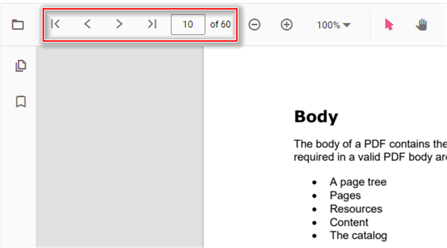

# Page Navigation in React PDF Viewer

This guide explains how to implement page navigation in the Syncfusion React PDF Viewer. You will learn how to enable toolbar navigation and programmatically navigate to specific pages using the PDF Viewer's navigation methods.

## Enable Page Navigation

To enable or disable page navigation in the PDF Viewer, set the [`enableNavigation`](https://ej2.syncfusion.com/react/documentation/api/pdfviewer#enablenavigation) property on the [`PdfViewerComponent`](https://ej2.syncfusion.com/react/documentation/api/pdfviewer).




import {
    PdfViewerComponent, Toolbar, Magnification, Navigation, LinkAnnotation, BookmarkView,
    ThumbnailView, Print, TextSelection, Annotation, TextSearch, FormFields, FormDesigner,
    PageOrganizer, Inject
} from '@syncfusion/ej2-react-pdfviewer';
import { useRef, RefObject } from 'react';

export default function App() {
    const viewerRef: RefObject<PdfViewerComponent | null> = useRef<PdfViewerComponent>(null);
    return (
        

            <PdfViewerComponent
                id="PdfViewer"
                ref={viewerRef}
                documentPath="https://cdn.syncfusion.com/content/pdf/pdf-succinctly.pdf"
                resourceUrl="https://cdn.syncfusion.com/ej2/32.2.3/dist/ej2-pdfviewer-lib"
                style={{ height: '100%' }}
                enableNavigation={true}
            >
                <Inject
                    services={[
                        Toolbar, Magnification, Navigation, Annotation, LinkAnnotation, BookmarkView,
                        ThumbnailView, Print, TextSelection, TextSearch, FormFields, FormDesigner, PageOrganizer
                    ]}
                />
            </PdfViewerComponent>
        

    );
}




## Toolbar Navigation Options

The default toolbar of the PDF Viewer provides the following navigation options:

- **Go to page**: Navigates to a specific page of a PDF document.
- **Show next page**: Navigates to the next page of a PDF document.
- **Show previous page**: Navigates to the previous page of a PDF document.
- **Show first page**: Navigates to the first page of a PDF document.
- **Show last page**: Navigates to the last page of a PDF document.

## Programmatic Navigation

You can programmatically perform page navigation using the navigation methods available on the navigation module of PDF Viewer instance.




import {
    PdfViewerComponent, Toolbar, Magnification, Navigation, LinkAnnotation, BookmarkView,
    ThumbnailView, Print, TextSelection, Annotation, TextSearch, FormFields, FormDesigner,
    PageOrganizer, Inject
} from '@syncfusion/ej2-react-pdfviewer';
import { useRef, RefObject } from 'react';

export default function App() {
    const viewerRef: RefObject<PdfViewerComponent | null> = useRef<PdfViewerComponent>(null);
    const onGoToFirstPage = () => viewerRef.current && viewerRef.current.navigation.goToFirstPage();
    const onGoToLastPage = () => viewerRef.current && viewerRef.current.navigation.goToLastPage();
    const onGoToNextPage = () => viewerRef.current && viewerRef.current.navigation.goToNextPage();
    const onGoToPage = () => viewerRef.current && viewerRef.current.navigation.goToPage(4);
    const onGoToPreviousPage = () => viewerRef.current && viewerRef.current.navigation.goToPreviousPage();
    return (
        

            <button onClick={onGoToFirstPage}>Go To First Page</button>
            <button onClick={onGoToLastPage}>Go To Last Page</button>
            <button onClick={onGoToNextPage}>Go To Next Page</button>
            <button onClick={onGoToPage}>Go To Page 4</button>
            <button onClick={onGoToPreviousPage}>Go To Previous Page</button>
            <PdfViewerComponent
                id="PdfViewer"
                ref={viewerRef}
                documentPath="https://cdn.syncfusion.com/content/pdf/pdf-succinctly.pdf"
                resourceUrl="https://cdn.syncfusion.com/ej2/32.2.3/dist/ej2-pdfviewer-lib"
                style={{ height: '100%' }}
            >
                <Inject
                    services={[
                        Toolbar, Magnification, Navigation, Annotation, LinkAnnotation, BookmarkView,
                        ThumbnailView, Print, TextSelection, TextSearch, FormFields, FormDesigner, PageOrganizer
                    ]}
                />
            </PdfViewerComponent>
        

    );
}




See the [StackBlitz sample](https://stackblitz.com/edit/5dqbkd?file=index.ts) for an interactive demonstration.

## Troubleshooting

**Navigation buttons not working**

Ensure that the [`Navigation`](https://ej2.syncfusion.com/react/documentation/api/pdfviewer/navigation) service is included in the `Inject` services array. Without this service, navigation functionality will not be available.

**Page number out of range**

When using [`goToPage()`](https://ej2.syncfusion.com/react/documentation/api/pdfviewer/navigation#gotopage), ensure the page number is within the valid range (1 to total pages). Passing an invalid page number will result in no navigation.

## See also

- [Toolbar items](../toolbar-customization/toolbar)
- [Feature Modules](../feature-module)