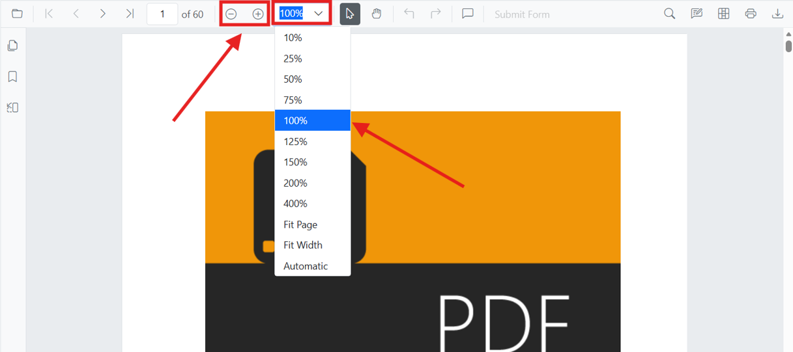

# Zoom in React PDF Viewer

This how-to guide demonstrates how to work with zoom functionality in the React PDF Viewer component. Learn how to enable magnification, control zoom programmatically, set default zoom levels, and respond to zoom changes.

## Enable zooming

To enable zoom functionality in the PDF Viewer, set the [enableMagnification](https://ej2.syncfusion.com/react/documentation/api/pdfviewer/index-default#enablemagnification) property to `true` and inject the [Magnification](https://ej2.syncfusion.com/react/documentation/api/pdfviewer/index-default#magnification) service.





import * as ReactDOM from 'react-dom';
import * as React from 'react';
import './index.css';
import { PdfViewerComponent, Toolbar, Magnification, Navigation, LinkAnnotation, BookmarkView,
         ThumbnailView, Print, TextSelection, TextSearch, Annotation, Inject } from '@syncfusion/ej2-react-pdfviewer';

function App() {
  return (

    

      {/* Render the PDF Viewer with magnification enabled */}
        <PdfViewerComponent
          id="container"
          documentPath="https://cdn.syncfusion.com/content/pdf/pdf-succinctly.pdf"
          resourceUrl="https://cdn.syncfusion.com/ej2/31.2.2/dist/ej2-pdfviewer-lib"
          enableMagnification={true}
          style={{ 'height': '640px' }}>

              <Inject services={[ Toolbar, Magnification, Navigation, LinkAnnotation, BookmarkView,
                                  ThumbnailView, Print, TextSelection, TextSearch]} />
        </PdfViewerComponent>
    

  
);
}
const root = ReactDOM.createRoot(document.getElementById('sample'));
root.render(<App />);






import * as ReactDOM from 'react-dom';
import * as React from 'react';
import './index.css';
import { PdfViewerComponent, Toolbar, Magnification, Navigation, LinkAnnotation, BookmarkView,
         ThumbnailView, Print, TextSelection, TextSearch, Annotation, Inject } from '@syncfusion/ej2-react-pdfviewer';

function App() {
  return (

    

      {/* Render the PDF Viewer with magnification enabled */}
        <PdfViewerComponent
          id="container"
          documentPath="https://cdn.syncfusion.com/content/pdf/pdf-succinctly.pdf"
          enableMagnification={true}
          serviceUrl="https://document.syncfusion.com/web-services/pdf-viewer/api/pdfviewer"
          style={{ 'height': '640px' }}>

              <Inject services={[ Toolbar, Magnification, Navigation, LinkAnnotation, BookmarkView,
                                  ThumbnailView, Print, TextSelection, TextSearch]} />
        </PdfViewerComponent>
    

  
);
}
const root = ReactDOM.createRoot(document.getElementById('sample'));
root.render(<App />);





## Zoom in and out using toolbar and programmatically

The zoom controls are automatically available in the toolbar when magnification is enabled. Users can click the **Zoom In** and **Zoom Out** buttons to adjust the zoom level.

To zoom in or out programmatically, use the [zoomIn()](https://ej2.syncfusion.com/react/documentation/api/pdfviewer/magnification#zoomin) and [zoomOut()](https://ej2.syncfusion.com/react/documentation/api/pdfviewer/magnification#zoomout) methods on the magnification instance.





import * as ReactDOM from 'react-dom';
import * as React from 'react';
import './index.css';
import { PdfViewerComponent, Toolbar, Magnification, Navigation, LinkAnnotation, BookmarkView,
         ThumbnailView, Print, TextSelection, TextSearch, Annotation, Inject } from '@syncfusion/ej2-react-pdfviewer';

function App() {
  const pdfViewerRef = React.useRef(null);

  const handleZoomIn = () => {
    pdfViewerRef.current.magnification.zoomIn();
  };

  const handleZoomOut = () => {
    pdfViewerRef.current.magnification.zoomOut();
  };

  return (

    

      <button onClick={handleZoomIn}>Zoom In</button>
      <button onClick={handleZoomOut}>Zoom Out</button>
    

    

      <PdfViewerComponent
        ref={pdfViewerRef}
        id="container"
        documentPath="https://cdn.syncfusion.com/content/pdf/pdf-succinctly.pdf"
        resourceUrl="https://cdn.syncfusion.com/ej2/31.2.2/dist/ej2-pdfviewer-lib"
        enableMagnification={true}
        style={{ 'height': '640px' }}>

            <Inject services={[ Toolbar, Magnification, Navigation, LinkAnnotation, BookmarkView,
                                ThumbnailView, Print, TextSelection, TextSearch]} />
      </PdfViewerComponent>
    

  
);
}
const root = ReactDOM.createRoot(document.getElementById('sample'));
root.render(<App />);






import * as ReactDOM from 'react-dom';
import * as React from 'react';
import './index.css';
import { PdfViewerComponent, Toolbar, Magnification, Navigation, LinkAnnotation, BookmarkView,
         ThumbnailView, Print, TextSelection, TextSearch, Annotation, Inject } from '@syncfusion/ej2-react-pdfviewer';

function App() {
  const pdfViewerRef = React.useRef(null);

  const handleZoomIn = () => {
    pdfViewerRef.current.magnification.zoomIn();
  };

  const handleZoomOut = () => {
    pdfViewerRef.current.magnification.zoomOut();
  };

  return (

    

      <button onClick={handleZoomIn}>Zoom In</button>
      <button onClick={handleZoomOut}>Zoom Out</button>
    

    

      <PdfViewerComponent
        ref={pdfViewerRef}
        id="container"
        documentPath="https://cdn.syncfusion.com/content/pdf/pdf-succinctly.pdf"
        enableMagnification={true}
        serviceUrl="https://document.syncfusion.com/web-services/pdf-viewer/api/pdfviewer"
        style={{ 'height': '640px' }}>

            <Inject services={[ Toolbar, Magnification, Navigation, LinkAnnotation, BookmarkView,
                                ThumbnailView, Print, TextSelection, TextSearch]} />
      </PdfViewerComponent>
    

  
);
}
const root = ReactDOM.createRoot(document.getElementById('sample'));
root.render(<App />);





## Set a specific zoom value

Use the [zoomTo()](https://ej2.syncfusion.com/react/documentation/api/pdfviewer/magnification#zoomto) method on the magnification instance to set the PDF to a specific zoom level. You can specify the zoom level as a percentage value.





import * as ReactDOM from 'react-dom';
import * as React from 'react';
import './index.css';
import { PdfViewerComponent, Toolbar, Magnification, Navigation, LinkAnnotation, BookmarkView,
         ThumbnailView, Print, TextSelection, TextSearch, Annotation, Inject } from '@syncfusion/ej2-react-pdfviewer';

function App() {
  const pdfViewerRef = React.useRef(null);

  const handleZoom150 = () => {
    pdfViewerRef.current.magnification.zoomTo(150);
  };

  const handleZoom200 = () => {
    pdfViewerRef.current.magnification.zoomTo(200);
  };

  const handleZoom75 = () => {
    pdfViewerRef.current.magnification.zoomTo(75);
  };

  return (

    

      <button onClick={handleZoom75}>75%</button>
      <button onClick={handleZoom150}>150%</button>
      <button onClick={handleZoom200}>200%</button>
    

    

      <PdfViewerComponent
        ref={pdfViewerRef}
        id="container"
        documentPath="https://cdn.syncfusion.com/content/pdf/pdf-succinctly.pdf"
        resourceUrl="https://cdn.syncfusion.com/ej2/31.2.2/dist/ej2-pdfviewer-lib"
        enableMagnification={true}
        style={{ 'height': '640px' }}>

            <Inject services={[ Toolbar, Magnification, Navigation, LinkAnnotation, BookmarkView,
                                ThumbnailView, Print, TextSelection, TextSearch]} />
      </PdfViewerComponent>
    

  
);
}
const root = ReactDOM.createRoot(document.getElementById('sample'));
root.render(<App />);






import * as ReactDOM from 'react-dom';
import * as React from 'react';
import './index.css';
import { PdfViewerComponent, Toolbar, Magnification, Navigation, LinkAnnotation, BookmarkView,
         ThumbnailView, Print, TextSelection, TextSearch, Annotation, Inject } from '@syncfusion/ej2-react-pdfviewer';

function App() {
  const pdfViewerRef = React.useRef(null);

  const handleZoom150 = () => {
    pdfViewerRef.current.magnification.zoomTo(150);
  };

  const handleZoom200 = () => {
    pdfViewerRef.current.magnification.zoomTo(200);
  };

  const handleZoom75 = () => {
    pdfViewerRef.current.magnification.zoomTo(75);
  };

  return (

    

      <button onClick={handleZoom75}>75%</button>
      <button onClick={handleZoom150}>150%</button>
      <button onClick={handleZoom200}>200%</button>
    

    

      <PdfViewerComponent
        ref={pdfViewerRef}
        id="container"
        documentPath="https://cdn.syncfusion.com/content/pdf/pdf-succinctly.pdf"
        enableMagnification={true}
        serviceUrl="https://document.syncfusion.com/web-services/pdf-viewer/api/pdfviewer"
        style={{ 'height': '640px' }}>

            <Inject services={[ Toolbar, Magnification, Navigation, LinkAnnotation, BookmarkView,
                                ThumbnailView, Print, TextSelection, TextSearch]} />
      </PdfViewerComponent>
    

  
);
}
const root = ReactDOM.createRoot(document.getElementById('sample'));
root.render(<App />);





## Initialize the viewer with a default zoom (on load)

Set an initial zoom level when the document is first loaded by using the document-loaded event. Call [zoomTo()](https://ej2.syncfusion.com/react/documentation/api/pdfviewer/magnification#zoomto) in the [documentLoad](https://ej2.syncfusion.com/react/documentation/api/pdfviewer/index-default#documentload) event handler.





import * as ReactDOM from 'react-dom';
import * as React from 'react';
import './index.css';
import { PdfViewerComponent, Toolbar, Magnification, Navigation, LinkAnnotation, BookmarkView,
         ThumbnailView, Print, TextSelection, TextSearch, Annotation, Inject } from '@syncfusion/ej2-react-pdfviewer';

function App() {
  const pdfViewerRef = React.useRef(null);

  const onDocumentLoaded = () => {
    // Set default zoom to 150% when document is loaded
    pdfViewerRef.current.magnification.zoomTo(150);
  };

  return (

    

      <PdfViewerComponent
        ref={pdfViewerRef}
        id="container"
        documentPath="https://cdn.syncfusion.com/content/pdf/pdf-succinctly.pdf"
        resourceUrl="https://cdn.syncfusion.com/ej2/31.2.2/dist/ej2-pdfviewer-lib"
        enableMagnification={true}
        documentLoad={onDocumentLoaded}
        style={{ 'height': '640px' }}>

            <Inject services={[ Toolbar, Magnification, Navigation, LinkAnnotation, BookmarkView,
                                ThumbnailView, Print, TextSelection, TextSearch]} />
      </PdfViewerComponent>
    

  
);
}
const root = ReactDOM.createRoot(document.getElementById('sample'));
root.render(<App />);






import * as ReactDOM from 'react-dom';
import * as React from 'react';
import './index.css';
import { PdfViewerComponent, Toolbar, Magnification, Navigation, LinkAnnotation, BookmarkView,
         ThumbnailView, Print, TextSelection, TextSearch, Annotation, Inject } from '@syncfusion/ej2-react-pdfviewer';

function App() {
  const pdfViewerRef = React.useRef(null);

  const onDocumentLoaded = () => {
    // Set default zoom to 150% when document is loaded
    pdfViewerRef.current.magnification.zoomTo(150);
  };

  return (

    

      <PdfViewerComponent
        ref={pdfViewerRef}
        id="container"
        documentPath="https://cdn.syncfusion.com/content/pdf/pdf-succinctly.pdf"
        enableMagnification={true}
        serviceUrl="https://document.syncfusion.com/web-services/pdf-viewer/api/pdfviewer"
        documentLoad={onDocumentLoaded}
        style={{ 'height': '640px' }}>

            <Inject services={[ Toolbar, Magnification, Navigation, LinkAnnotation, BookmarkView,
                                ThumbnailView, Print, TextSelection, TextSearch]} />
      </PdfViewerComponent>
    

  
);
}
const root = ReactDOM.createRoot(document.getElementById('sample'));
root.render(<App />);





## Disable user zoom while allowing programmatic zoom

To restrict users from zooming via the UI while still allowing your application to control zoom programmatically, use [toolbarSettings](https://ej2.syncfusion.com/react/documentation/api/pdfviewer/index-default#toolbarsettings) with custom toolbar items that exclude zoom controls. Combine this with custom application buttons to provide controlled zoom access.





import * as ReactDOM from 'react-dom';
import * as React from 'react';
import './index.css';
import {
  PdfViewerComponent,
  Toolbar,
  Magnification,
  Navigation,
  LinkAnnotation,
  BookmarkView,
  ThumbnailView,
  Print,
  TextSelection,
  TextSearch,
  Inject,
} from '@syncfusion/ej2-react-pdfviewer';

function App() {
  const pdfViewerRef = React.useRef(null);

  const handleZoom150 = () => {
    pdfViewerRef.current.magnification.zoomTo(150);
  };

  const handleZoom200 = () => {
    pdfViewerRef.current.magnification.zoomTo(200);
  };

  return (
    

      {/* Custom Application Toolbar */}
      

        <button onClick={handleZoom150}>Zoom 150%</button>
        <button onClick={handleZoom200}>Zoom 200%</button>
        

          Zoom level is controlled by the application.
        

      

      {/* PDF Viewer */}
      <PdfViewerComponent
        ref={pdfViewerRef}
        id="container"
        documentPath="https://cdn.syncfusion.com/content/pdf/pdf-succinctly.pdf"
        resourceUrl="https://cdn.syncfusion.com/ej2/31.2.2/dist/ej2-pdfviewer-lib"
        enableMagnification={true}
        toolbarSettings={{
          toolbarItems: [
            'OpenOption',
            'PageNavigationTool',
            'AnnotationEditTool',
            'FormDesignerEditTool',
            'PrintOption',
          ],
        }}
        style={{ height: '640px' }}
      >
        <Inject
          services={[
            Toolbar,
            Magnification,
            Navigation,
            LinkAnnotation,
            BookmarkView,
            ThumbnailView,
            Print,
            TextSelection,
            TextSearch,
          ]}
        />
      </PdfViewerComponent>
    

  );
}

const root = ReactDOM.createRoot(document.getElementById('sample'));
root.render(<App />);






import * as ReactDOM from 'react-dom';
import * as React from 'react';
import './index.css';
import {
  PdfViewerComponent,
  Toolbar,
  Magnification,
  Navigation,
  LinkAnnotation,
  BookmarkView,
  ThumbnailView,
  Print,
  TextSelection,
  TextSearch,
  Inject,
} from '@syncfusion/ej2-react-pdfviewer';

function App() {
  const pdfViewerRef = React.useRef(null);

  const handleZoom150 = () => {
    pdfViewerRef.current.magnification.zoomTo(150);
  };

  const handleZoom200 = () => {
    pdfViewerRef.current.magnification.zoomTo(200);
  };

  return (
    

      {/* Custom Application Toolbar */}
      

        <button onClick={handleZoom150}>Zoom 150%</button>
        <button onClick={handleZoom200}>Zoom 200%</button>
        

          Zoom level is controlled by the application.
        

      

      {/* PDF Viewer */}
      <PdfViewerComponent
        ref={pdfViewerRef}
        id="container"
        documentPath="https://cdn.syncfusion.com/content/pdf/pdf-succinctly.pdf"
        enableMagnification={true}
        serviceUrl="https://document.syncfusion.com/web-services/pdf-viewer/api/pdfviewer"
        toolbarSettings={{
          toolbarItems: [
            'OpenOption',
            'PageNavigationTool',
            'AnnotationEditTool',
            'FormDesignerEditTool',
            'PrintOption',
          ],
        }}
        style={{ height: '640px' }}
      >
        <Inject
          services={[
            Toolbar,
            Magnification,
            Navigation,
            LinkAnnotation,
            BookmarkView,
            ThumbnailView,
            Print,
            TextSelection,
            TextSearch,
          ]}
        />
      </PdfViewerComponent>
    

  );
}

const root = ReactDOM.createRoot(document.getElementById('sample'));
root.render(<App />);





## Handle zoom changes

Listen for zoom change events on the magnification instance and update custom UI elements (such as a zoom indicator or zoom dropdown) accordingly. Use the [zoomChange](https://ej2.syncfusion.com/react/documentation/api/pdfviewer/index-default#zoomchange) event to respond to zoom level changes.





import * as ReactDOM from 'react-dom';
import * as React from 'react';
import './index.css';
import { PdfViewerComponent, Toolbar, Magnification, Navigation, LinkAnnotation, BookmarkView,
         ThumbnailView, Print, TextSelection, TextSearch, Annotation, Inject } from '@syncfusion/ej2-react-pdfviewer';

function App() {
  const pdfViewerRef = React.useRef(null);
  const [zoomLevel, setZoomLevel] = React.useState(100);

  const onZoomChange = (args) => {
    // Update custom UI with new zoom level from magnification event
    setZoomLevel(Math.round(args.zoomValue));
  };

  return (

    

      Current Zoom: {zoomLevel}%
    

    

      <PdfViewerComponent
        ref={pdfViewerRef}
        id="container"
        documentPath="https://cdn.syncfusion.com/content/pdf/pdf-succinctly.pdf"
        resourceUrl="https://cdn.syncfusion.com/ej2/31.2.2/dist/ej2-pdfviewer-lib"
        enableMagnification={true}
        zoomChange={onZoomChange}
        style={{ 'height': '640px' }}>

            <Inject services={[ Toolbar, Magnification, Navigation, LinkAnnotation, BookmarkView,
                                ThumbnailView, Print, TextSelection, TextSearch]} />
      </PdfViewerComponent>
    

  
);
}
const root = ReactDOM.createRoot(document.getElementById('sample'));
root.render(<App />);






import * as ReactDOM from 'react-dom';
import * as React from 'react';
import './index.css';
import { PdfViewerComponent, Toolbar, Magnification, Navigation, LinkAnnotation, BookmarkView,
         ThumbnailView, Print, TextSelection, TextSearch, Annotation, Inject } from '@syncfusion/ej2-react-pdfviewer';

function App() {
  const pdfViewerRef = React.useRef(null);
  const [zoomLevel, setZoomLevel] = React.useState(100);

  const onZoomChange = (args) => {
    // Update custom UI with new zoom level from magnification event
    setZoomLevel(Math.round(args.zoomValue));
  };

  return (

    

      Current Zoom: {zoomLevel}%
    

    

      <PdfViewerComponent
        ref={pdfViewerRef}
        id="container"
        documentPath="https://cdn.syncfusion.com/content/pdf/pdf-succinctly.pdf"
        enableMagnification={true}
        serviceUrl="https://document.syncfusion.com/web-services/pdf-viewer/api/pdfviewer"
        onZoomChange={onZoomChange}
        style={{ 'height': '640px' }}>

            <Inject services={[ Toolbar, Magnification, Navigation, LinkAnnotation, BookmarkView,
                                ThumbnailView, Print, TextSelection, TextSearch]} />
      </PdfViewerComponent>
    

  
);
}
const root = ReactDOM.createRoot(document.getElementById('sample'));
root.render(<App />);





## Zoom range and limits

The PDF Viewer supports zoom values from 10% to 400%. The [zoomTo()](https://ej2.syncfusion.com/react/documentation/api/pdfviewer/magnification#zoomto) method automatically clamps values outside this range to the nearest valid limit.

N> Zoom values are automatically clamped between 10% and 400%. Attempting to zoom beyond these limits will set the zoom to the nearest boundary value.

## See also

- [Magnification overview](./magnification)
- [Fit modes](./fitmode)
- [Toolbar items](../toolbar-customization/overview)
- [Feature Modules](../feature-module)
