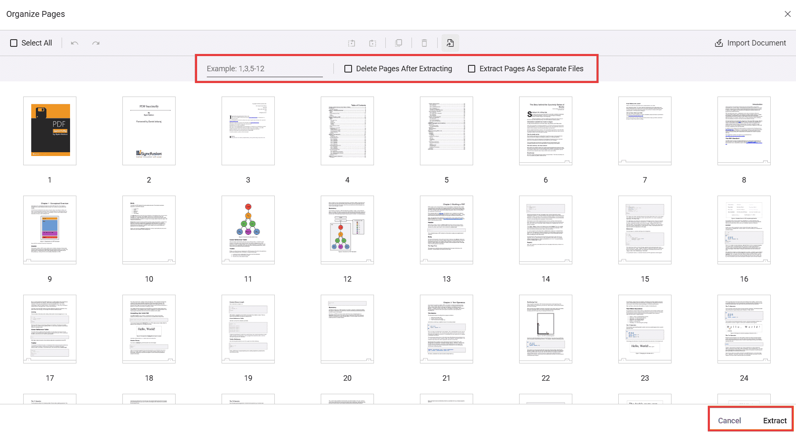

# Extract pages in React PDF Viewer

The PDF Viewer component provides an Extract Pages tool in the Organize Pages UI to export selected pages as a new PDF file. The Extract Pages tool is enabled by default.

## Extract Pages in Organize Pages

- Open the Organize Pages panel in the PDF Viewer toolbar.
- Locate and click the Extract Pages option.

When selected, a secondary toolbar dedicated to extraction is displayed.

## Extract pages using the UI

Extract pages by typing page numbers/ranges or by selecting thumbnails.

1. Click Extract Pages in the Organize Pages panel.
2. In the input box, enter pages to extract. Supported formats:
  - Single pages: 1,3,5
  - Ranges: 2-6
  - Combinations: 1,4,7-9
3. Alternatively, select the page thumbnails to extract instead of typing values.
4. Click Extract to download the selected pages as a new PDF; click Cancel to close the tool.

Note: Page numbers are 1-based (the first page is 1). Invalid or out-of-range entries are ignored; only valid pages are processed. Consider validating input before extraction to ensure expected results.

## Extraction options (checkboxes)

The secondary toolbar provides two options:

- **Delete Pages After Extracting** — When enabled, the selected pages are removed from the currently loaded document after extraction; the extracted pages are still downloaded as a separate PDF.

- **Extract Pages As Separate Files** — When enabled, each selected page is exported as an individual PDF (for example, selecting pages 3, 5, and 6 downloads 3.pdf, 5.pdf, and 6.pdf).

## Programmatic options and APIs

You can control the Extract Pages experience via settings and invoke extraction through code.

### Enable/disable Extract Pages

Use the `canExtractPages` API to enable or disable the Extract Pages option. When set to `false`, the Extract Pages tool is disabled in the toolbar. The default value is `true`.

Use the following code snippet to enable or disable the Extract Pages option:



import * as ReactDOM from 'react-dom/client';
import * as React from 'react';
import './index.css';
import { PdfViewerComponent, Toolbar, Magnification, Navigation, LinkAnnotation, BookmarkView, ThumbnailView, Print, TextSelection, Annotation, TextSearch, FormFields, FormDesigner, Inject, PageOrganizer} from '@syncfusion/ej2-react-pdfviewer';
export function App() {
  // Enable Extract Pages Tool
  const pageOrganizerSettings = { canExtractPages: true};
  return (

    

      <PdfViewerComponent 
        id="container" 
        documentPath="https://cdn.syncfusion.com/content/pdf/pdf-succinctly.pdf"
        resourceUrl="https://cdn.syncfusion.com/ej2/31.1.23/dist/ej2-pdfviewer-lib" 
        style={{ 'height': '680px' }} 
        pageOrganizerSettings={pageOrganizerSettings}
      >
        <Inject services={[Toolbar, Magnification, Navigation, Annotation, LinkAnnotation, BookmarkView, ThumbnailView,
          Print, TextSelection, TextSearch, FormFields, FormDesigner,PageOrganizer]} />
      </PdfViewerComponent>
    

  
);
}
const root = ReactDOM.createRoot(document.getElementById('sample'));
root.render(<App />);



Use the `showExtractPagesOption` API to show or hide the Extract Pages option. When set to `false`, the Extract Pages tool is removed from the toolbar. The default value is `true`.

Use the following code snippet to remove the Extract Pages option:



import * as ReactDOM from 'react-dom/client';
import * as React from 'react';
import './index.css';
import { PdfViewerComponent, Toolbar, Magnification, Navigation, LinkAnnotation, BookmarkView, ThumbnailView, Print, TextSelection, Annotation, TextSearch, FormFields, FormDesigner, Inject, PageOrganizer} from '@syncfusion/ej2-react-pdfviewer';
export function App() {
  // Enable Extract Pages Tool
  const pageOrganizerSettings = { showExtractPagesOption: false};
  return (

    

      <PdfViewerComponent 
        id="container" 
        documentPath="https://cdn.syncfusion.com/content/pdf/pdf-succinctly.pdf"
        resourceUrl="https://cdn.syncfusion.com/ej2/31.1.23/dist/ej2-pdfviewer-lib" 
        style={{ 'height': '680px' }} 
        pageOrganizerSettings={pageOrganizerSettings}
      >
        <Inject services={[Toolbar, Magnification, Navigation, Annotation, LinkAnnotation, BookmarkView, ThumbnailView,
          Print, TextSelection, TextSearch, FormFields, FormDesigner,PageOrganizer]} />
      </PdfViewerComponent>
    

  
);
}
const root = ReactDOM.createRoot(document.getElementById('sample'));
root.render(<App />);



### Extract pages and load the result programmatically

You can extract pages programmatically using the `extractPages` method.
The following example extracts pages 1 and 2, then immediately loads the extracted pages back into the viewer. The returned value is a byte array (e.g., Uint8Array) representing the PDF file contents.



import * as ReactDOM from 'react-dom/client';
import * as React from 'react';
import './index.css';
import { PdfViewerComponent, Toolbar, Magnification, Navigation, LinkAnnotation, BookmarkView, ThumbnailView, Print, TextSelection, Annotation, TextSearch, FormFields, FormDesigner, Inject, PageOrganizer} from '@syncfusion/ej2-react-pdfviewer';
export function App() {
  // Enable Extract Pages Tool
  const pageOrganizerSettings = { canExtractPages: true};
  return (

    

      <button onClick={extractPage}>Extract Page</button>
      <PdfViewerComponent 
        id="container" 
        documentPath="https://cdn.syncfusion.com/content/pdf/pdf-succinctly.pdf"
        resourceUrl="https://cdn.syncfusion.com/ej2/31.1.23/dist/ej2-pdfviewer-lib" 
        style={{ 'height': '680px' }} 
        pageOrganizerSettings={pageOrganizerSettings}
      >
        <Inject services={[Toolbar, Magnification, Navigation, Annotation, LinkAnnotation, BookmarkView, ThumbnailView,
          Print, TextSelection, TextSearch, FormFields, FormDesigner,PageOrganizer]} />
      </PdfViewerComponent>
    

  
);
}
function extractPage(){
    // Get the PDF viewer instance
    var viewer = document.getElementById('container').ej2_instances[0];
    //Extract Pages 1,2
    const array = viewer.extractPages('1,2');
    //Load in viewer
    viewer.load(array,'');

    //print base64 to ensure
    console.log(array);
}
const root = ReactDOM.createRoot(document.getElementById('sample'));
root.render(<App />);



[View sample in GitHub](https://github.com/SyncfusionExamples/react-pdf-viewer-examples/tree/master/How%20to)

## See also

- [Overview](../overview)
- [UI interactions](../ui-interactions)
- [Programmatic support](../programmatic-support)
- [Toolbar](../toolbar)
- [Events](../events)
- [Mobile view](../mobile-view)
