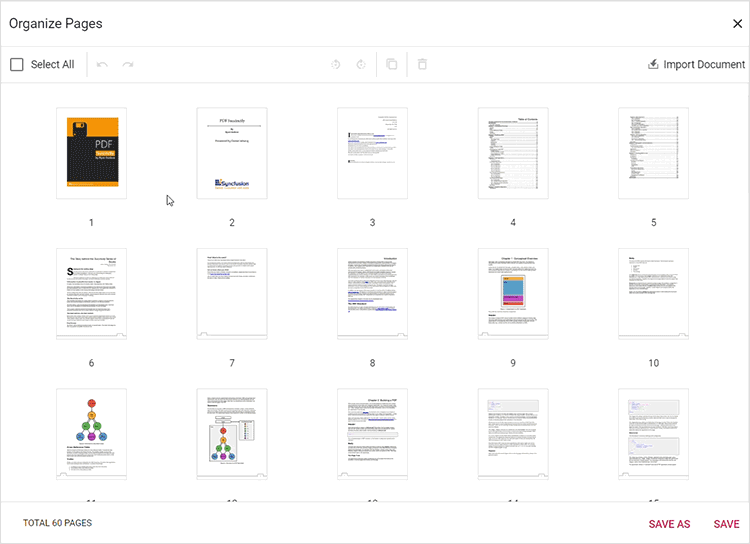

# Rotate pages using the Organize Pages view

## Overview

This guide explains how to rotate individual or multiple pages using the **Organize Pages** UI in the EJ2 React PDF Viewer. Supported rotations: 90°, 180°, 270° clockwise and counter-clockwise.

**Outcome**: Pages are rotated in the viewer and persisted when saved or exported.

## Prerequisites

- EJ2 React PDF Viewer installed
- PDF Viewer configured with [`resourceUrl`](https://ej2.syncfusion.com/react/documentation/api/pdfviewer#resourceurl) (standalone) or [`serviceUrl`](https://ej2.syncfusion.com/react/documentation/api/pdfviewer#serviceurl) (server-backed)

## Steps

1. Open the Organize Pages view

   - Click the **Organize Pages** button in the viewer toolbar to open the Organize Pages dialog.

2. Select pages to rotate

   - Click a single thumbnail or use Shift+click/Ctrl+click to select multiple pages.

3. Rotate pages using toolbar buttons

   - Use **Rotate Right** to rotate 90° clockwise.
   - Use **Rotate Left** to rotate 90° counter-clockwise.
   - Repeat the action to achieve 180° or 270° rotations.

   

4. Rotate multiple pages at once

   - When multiple thumbnails are selected, the Rotate action applies to every selected page.

5. Undo or reset rotation

   - Use **Undo** (Ctrl+Z) to revert the last rotation.
   - Use the reverse rotation button (Rotate Left/Rotate Right) until the page returns to 0°.

   

6. Persist rotations

   - Click **Save** or **Save As** to persist rotations in the saved/downloaded PDF. Exporting pages also preserves the new orientation.

## Expected result

- Pages rotate in-place in the Organize Pages dialog when using the rotate controls.
- Saving or exporting the document preserves the new orientation.

## Enable or disable Rotate Pages button

To enable or disable the **Rotate Pages** button in the Organize Pages toolbar, update the [`pageOrganizerSettings`](https://ej2.syncfusion.com/react/documentation/api/pdfviewer/pageorganizersettings). See [Organize pages toolbar customization](./toolbar#enable-or-disable-the-rotate-option) for the guidelines

## Troubleshooting

- **Rotate controls disabled**: Ensure [`pageOrganizerSettings.canRotate`](https://ej2.syncfusion.com/react/documentation/api/pdfviewer/pageorganizersettingsmodel#canrotate) is not set to `false`.
- **Rotation not persisted**: Click **Save** after rotating. For server-backed setups ensure [`serviceUrl`](https://ej2.syncfusion.com/react/documentation/api/pdfviewer#serviceurl) is set so server-side save can persist changes.

## Related topics

- [Organize page toolbar customization](./toolbar.md)
- [Organize pages event reference](./events)
