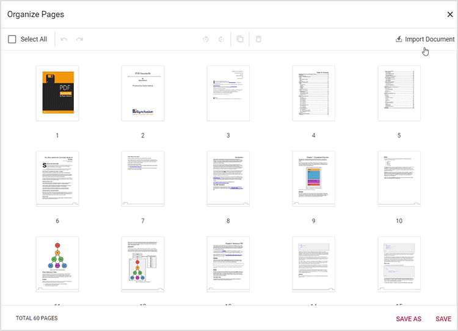

# UI interactions for organizing pages in React PDF Viewer

The PDF Viewer provides an intuitive interface for organizing pages. This section documents the UI interactions available in the `Organize Pages` dialog.

## Rotate PDF pages

Adjust page orientation using the rotate controls in the Organize Pages dialog.

- **Rotate clockwise**: Rotate selected pages 90 degrees clockwise.
- **Rotate counter-clockwise**: Rotate selected pages 90 degrees counter-clockwise.

## Rearrange PDF pages

Change page sequence using drag-and-drop.

- **Drag and drop**: Drag a page thumbnail to the desired position and release to reorder pages.

## Insert new pages

Add blank pages to the document at the required position.

- **Insert blank page left**: Insert a blank page to the left of the selected page.
- **Insert blank page right**: Insert a blank page to the right of the selected page.

## Delete PDF pages

Remove unwanted pages from the document:

1. **Select pages to delete**: Click or tap thumbnails to select pages; multiple selection is supported.
2. **Delete selected pages**: Use the delete option in the Organize Pages pane to remove the selected pages.

## Copy PDF pages

Duplicate pages within the document:

- **Select pages to copy**: Click or tap thumbnails to select pages to duplicate.
- **Copy selected pages**: Use the copy option; copied pages are inserted to the right of the selection.

## Import a PDF document

Import another PDF into the current document:

- **Import PDF document**: Click **Import Document** to select and import a PDF. The imported pages appear as thumbnails. If a page is selected, thumbnails are inserted to its right; otherwise they are added at the start. Imported pages are merged with the current document when saved.

## Select all pages

Select all pages to perform bulk operations (for example, rotate or delete all pages).

## Zoom page thumbnails

Adjust thumbnail size for better visibility and precision:

- Use the zoom slider to increase or decrease thumbnail size.
- Zoom in to see more detail on each page.
- Zoom out to view more pages at once.

## Real-time updates and saving

Changes are reflected instantly in the Organize Pages dialog. Click **Save** to apply changes to the loaded document or **Save As** to download a new copy with the updated page order.

## Keyboard shortcuts

Common keyboard shortcuts in the Organize Pages dialog:

- **Ctrl+Z**: Undo the last action.
- **Ctrl+Y**: Redo the last undone action.
- **Ctrl+Scroll**: Zoom thumbnails in/out.

