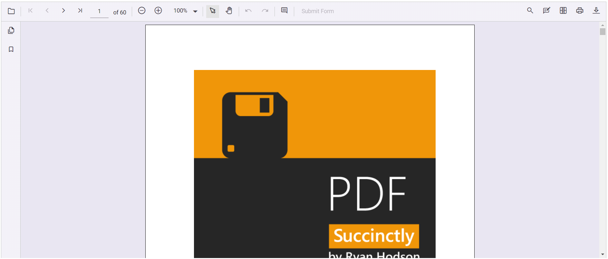

# Getting started with the React PDF Viewer component in Preact

This article shows how to set up a [Preact](https://preactjs.com/) project and integrate the Syncfusion<sup style="font-size:70%">&reg;</sup> React PDF Viewer component.

Preact is a fast, lightweight JavaScript library for building user interfaces and is commonly used when a small bundle size and fast load times are important.

## Prerequisites

[System requirements for Syncfusion<sup style="font-size:70%">&reg;</sup> React UI components](../system-requirement)

## Set up the Preact project

To create a new Preact project using the official initializer, run:

```bash
npm init preact
```

or

```bash
yarn init preact
```

Using one of the above commands will lead you to set up additional configurations for the project, as below:

1\. Define the project name: We can specify the name of the project directly. Let's specify the name of the project as `my-project` for this article.

```bash
T  Preact - Fast 3kB alternative to React with the same modern API
|
*  Project directory:
|  my-project
—
```

2\. Choose `JavaScript` as the framework variant to build this Preact project using JavaScript and React.

```bash
T  Preact - Fast 3kB alternative to React with the same modern API
|
*  Project language:
|  > JavaScript
|    TypeScript
—
```

3\. Then configure the project as below for this article.

```bash
T  Preact - Fast 3kB alternative to React with the same modern API
|
*  Use router?
|    Yes / > No
—
|
*  Prerender app (SSG)?
|    Yes / > No
—
|
*  Use ESLint?
|    Yes / > No
—
```

5\. Upon completing the aforementioned steps to create `my-project`, run the following command to jump into the project directory:

```bash
cd my-project
```

Now add Syncfusion React packages to the project.

## Add the Syncfusion<sup style="font-size:70%">&reg;</sup> React packages

Syncfusion<sup style="font-size:70%">&reg;</sup> React component packages are available at [npmjs.com](https://www.npmjs.com/search?q=ej2-react). To use Syncfusion<sup style="font-size:70%">&reg;</sup> React components in the project, install the corresponding npm package.

This article uses the [React PDF Viewer component](https://www.syncfusion.com/pdf-viewer-sdk) as an example. To use the React PDF Viewer component in the project, the `@syncfusion/ej2-react-pdfviewer` package needs to be installed using the following command:

```bash
npm install @syncfusion/ej2-react-pdfviewer --save
```

or

```bash
yarn add @syncfusion/ej2-react-pdfviewer
```

## Import Syncfusion<sup style="font-size:70%">&reg;</sup> CSS styles

Themes for Syncfusion React components can be imported from npm packages, a CDN, or created with Theme Studio. See the [themes](https://ej2.syncfusion.com/react/documentation/appearance/theme/) documentation for details.

This article uses the `Material 3` theme. Import the required CSS files into `src/style.css` as shown below.




@import '../node_modules/@syncfusion/ej2-base/styles/material3.css';
@import '../node_modules/@syncfusion/ej2-buttons/styles/material3.css';
@import '../node_modules/@syncfusion/ej2-dropdowns/styles/material3.css';
@import '../node_modules/@syncfusion/ej2-inputs/styles/material3.css';
@import '../node_modules/@syncfusion/ej2-navigations/styles/material3.css';
@import '../node_modules/@syncfusion/ej2-popups/styles/material3.css';
@import '../node_modules/@syncfusion/ej2-splitbuttons/styles/material3.css';
@import "../node_modules/@syncfusion/ej2-react-pdfviewer/styles/material3.css";




> The order of importing CSS styles should be in line with its dependency graph.

## Add the Syncfusion<sup style="font-size:70%">&reg;</sup> React component

Follow these steps to add the React PDF Viewer component to the Preact project:

1. Before adding the viewer to markup, import the PDF Viewer component in `src/index.jsx`.




import { PdfViewerComponent, Toolbar, Magnification, Navigation, LinkAnnotation, BookmarkView,
         ThumbnailView, Print, TextSelection, Annotation, TextSearch, FormFields, FormDesigner, Inject} from '@syncfusion/ej2-react-pdfviewer';




2. Define the PDF Viewer component in `src/index.jsx`, as shown below:





import { render } from 'preact';
import { PdfViewerComponent, Toolbar, Magnification, Navigation, LinkAnnotation, BookmarkView,
         ThumbnailView, Print, TextSelection, Annotation, TextSearch, FormFields, FormDesigner, Inject} from '@syncfusion/ej2-react-pdfviewer';
import './style.css';

export function App() {

  return (
    <div>
        <div className='control-section'>
            {/* Render the PDF Viewer */}
            <PdfViewerComponent
                id="container"
                documentPath="https://cdn.syncfusion.com/content/pdf/pdf-succinctly.pdf"
                serviceUrl="https://document.syncfusion.com/web-services/pdf-viewer/api/pdfviewer"
                style={{ 'height': '640px' }}>

                <Inject services={[ Toolbar, Magnification, Navigation, Annotation, LinkAnnotation, BookmarkView,
                                    ThumbnailView, Print, TextSelection, TextSearch, FormFields, FormDesigner ]}/>
            </PdfViewerComponent>
        </div>
  </div>
  );
}

render(<App />, document.getElementById('app'));





## Run the project

Run the project with:

```bash
npm run dev
```

or

```bash
yarn run dev
```

The app should open in the browser and display the PDF Viewer.



## See also

[Getting Started with the Syncfusion<sup style="font-size:70%">&reg;</sup> React UI Component](../getting-started/quick-start)
