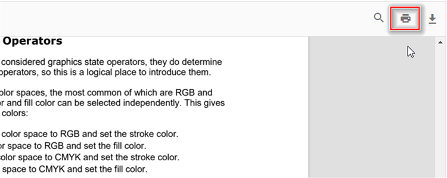

# Print in React PDF Viewer component

The PDF Viewer supports printing the loaded PDF document. Enable or disable printing with the `enablePrint` API as shown in the examples below.





import * as ReactDOM from 'react-dom';
import * as React from 'react';
import './index.css';
import { PdfViewerComponent, Toolbar, Magnification, Navigation, LinkAnnotation, BookmarkView,
         ThumbnailView, Print, TextSelection, TextSearch, Annotation, Inject } from '@syncfusion/ej2-react-pdfviewer';

function App() {
  return (

    

      {/* Render the PDF Viewer */}
      <PdfViewerComponent
        id="container"
        documentPath="https://cdn.syncfusion.com/content/pdf/pdf-succinctly.pdf"
        resourceUrl="https://cdn.syncfusion.com/ej2/31.2.2/dist/ej2-pdfviewer-lib"
        enablePrint={true}
        style={{ 'height': '640px' }}>

              <Inject services={[ Toolbar, Annotation, Magnification, Navigation, LinkAnnotation, BookmarkView,
                                  ThumbnailView, Print, TextSelection, TextSearch]} />
      </PdfViewerComponent>
    

  
);
}
const root = ReactDOM.createRoot(document.getElementById('sample'));
root.render(<App />);






import * as ReactDOM from 'react-dom';
import * as React from 'react';
import './index.css';
import { PdfViewerComponent, Toolbar, Magnification, Navigation, LinkAnnotation, BookmarkView,
         ThumbnailView, Print, TextSelection, TextSearch, Annotation, Inject } from '@syncfusion/ej2-react-pdfviewer';

function App() {
  return (

    

      {/* Render the PDF Viewer */}
      <PdfViewerComponent
        id="container"
        documentPath="https://cdn.syncfusion.com/content/pdf/pdf-succinctly.pdf"
        enablePrint={true}
        serviceUrl="https://document.syncfusion.com/web-services/pdf-viewer/api/pdfviewer"
        style={{ 'height': '640px' }}>

              <Inject services={[ Toolbar, Annotation, Magnification, Navigation, LinkAnnotation, BookmarkView,
                                  ThumbnailView, Print, TextSelection, TextSearch]} />
      </PdfViewerComponent>
    

  
);
}
const root = ReactDOM.createRoot(document.getElementById('sample'));
root.render(<App />);





Invoke the print action programmatically using the example below.





import * as ReactDOM from 'react-dom';
import * as React from 'react';
import './index.css';
import { PdfViewerComponent, Toolbar, Magnification, Navigation, LinkAnnotation, BookmarkView,
         ThumbnailView, Print, TextSelection, TextSearch, Inject } from '@syncfusion/ej2-react-pdfviewer';

function App() {
  function printClicked() {
    var viewer = document.getElementById('container').ej2_instances[0];
    viewer.print.print()
  }
  return (

    

    {/* Render the PDF Viewer */}
    <button onClick={printClicked}>Print</button>
      <PdfViewerComponent
        id="container"
        documentPath="https://cdn.syncfusion.com/content/pdf/pdf-succinctly.pdf"
        resourceUrl="https://cdn.syncfusion.com/ej2/31.2.2/dist/ej2-pdfviewer-lib"
        style={{ 'height': '640px' }}>

            <Inject services={[ Toolbar, Magnification, Navigation, LinkAnnotation, BookmarkView,
                                ThumbnailView, Print, TextSelection, TextSearch ]} />
      </PdfViewerComponent>
    

  
);
}
const root = ReactDOM.createRoot(document.getElementById('sample'));
root.render(<App />);






import * as ReactDOM from 'react-dom';
import * as React from 'react';
import './index.css';
import { PdfViewerComponent, Toolbar, Magnification, Navigation, LinkAnnotation, BookmarkView,
         ThumbnailView, Print, TextSelection, TextSearch, Inject } from '@syncfusion/ej2-react-pdfviewer';

function App() {
  function printClicked() {
    var viewer = document.getElementById('container').ej2_instances[0];
    viewer.print.print()
  }
  return (

    

    {/* Render the PDF Viewer */}
    <button onClick={printClicked}>Print</button>
      <PdfViewerComponent
        id="container"
        documentPath="https://cdn.syncfusion.com/content/pdf/pdf-succinctly.pdf"
        serviceUrl="https://document.syncfusion.com/web-services/pdf-viewer/api/pdfviewer"
        style={{ 'height': '640px' }}>

            <Inject services={[ Toolbar, Magnification, Navigation, LinkAnnotation, BookmarkView,
                                ThumbnailView, Print, TextSelection, TextSearch ]} />
      </PdfViewerComponent>
    

  
);
}
const root = ReactDOM.createRoot(document.getElementById('sample'));
root.render(<App />);





## Customize print quality with printScaleFactor

Adjust print quality using the `printScaleFactor` API. Valid values are between 0.5 and 5. Increasing the value improves print quality but may increase print time. Values below 0.5 or above 5 produce standard quality; the default value is `1`.

The example below demonstrates how to set `printScaleFactor`.




import * as ReactDOM from 'react-dom';
import * as React from 'react';
import './index.css';
import { PdfViewerComponent, Toolbar, Magnification, Navigation, LinkAnnotation, BookmarkView,
         ThumbnailView, Print, TextSelection, TextSearch, Annotation, Inject } from '@syncfusion/ej2-react-pdfviewer';

function App() {
  return (

    

      {/* Render the PDF Viewer */}
      <PdfViewerComponent
        id="container"
        documentPath="https://cdn.syncfusion.com/content/pdf/pdf-succinctly.pdf"
        resourceUrl="https://cdn.syncfusion.com/ej2/31.2.2/dist/ej2-pdfviewer-lib"
        enablePrint={true}
        {/* pdf with low quality. By changing values you can change the quality of the pdf. */}
        printScaleFactor = {0.5};
        style={{ 'height': '640px' }}>

              <Inject services={[ Toolbar, Annotation, Magnification, Navigation, LinkAnnotation, BookmarkView,
                                  ThumbnailView, Print, TextSelection, TextSearch]} />
      </PdfViewerComponent>
    

  
);
}
const root = ReactDOM.createRoot(document.getElementById('sample'));
root.render(<App />);






import * as ReactDOM from 'react-dom';
import * as React from 'react';
import './index.css';
import { PdfViewerComponent, Toolbar, Magnification, Navigation, LinkAnnotation, BookmarkView,
         ThumbnailView, Print, TextSelection, TextSearch, Annotation, Inject } from '@syncfusion/ej2-react-pdfviewer';

function App() {
  return (

    

      {/* Render the PDF Viewer */}
      <PdfViewerComponent
        id="container"
        documentPath="https://cdn.syncfusion.com/content/pdf/pdf-succinctly.pdf"
        enablePrint={true}
        {/* pdf with low quality. By changing values you can change the quality of the pdf. */}
        printScaleFactor= {0.5};
        serviceUrl="https://document.syncfusion.com/web-services/pdf-viewer/api/pdfviewer"
        style={{ 'height': '640px' }}>

              <Inject services={[ Toolbar, Annotation, Magnification, Navigation, LinkAnnotation, BookmarkView,
                                  ThumbnailView, Print, TextSelection, TextSearch]} />
      </PdfViewerComponent>
    

  
);
}
const root = ReactDOM.createRoot(document.getElementById('sample'));
root.render(<App />);





## EnablePrintRotation in the PDF Viewer

The `enablePrintRotation` option controls whether landscape pages are automatically rotated to best fit when printing. The default value is `true`. Set it to `false` to preserve the original page orientation during printing.




import * as ReactDOM from 'react-dom';
import * as React from 'react';
import './index.css';
import { PdfViewerComponent, Toolbar, Magnification, Navigation, Annotation, LinkAnnotation, ThumbnailView, BookmarkView, TextSelection, Inject } from '@syncfusion/ej2-react-pdfviewer';

function App() {
  return (

    

      {/* Render the PDF Viewer */}
      <PdfViewerComponent
        id="container"
        documentPath="https://cdn.syncfusion.com/content/pdf/pdf-succinctly.pdf"
        resourceUrl="https://cdn.syncfusion.com/ej2/31.2.2/dist/ej2-pdfviewer-lib"
        enablePrintRotation={true}
        style={{ height: '640px' }}>

        <Inject services={[Toolbar, Magnification, Navigation, Annotation, LinkAnnotation, ThumbnailView, BookmarkView, TextSelection]} />
      </PdfViewerComponent>
    

  
);
}
const root = ReactDOM.createRoot(document.getElementById('sample'));
root.render(<App />);




import * as ReactDOM from 'react-dom';
import * as React from 'react';
import './index.css';
import { PdfViewerComponent, Toolbar, Magnification, Navigation, Annotation, LinkAnnotation, ThumbnailView, BookmarkView, TextSelection, Inject } from '@syncfusion/ej2-react-pdfviewer';

function App() {
  return (

    

      {/* Render the PDF Viewer */}
      <PdfViewerComponent
        id="container"
        documentPath="https://cdn.syncfusion.com/content/pdf/pdf-succinctly.pdf"
        serviceUrl="https://document.syncfusion.com/web-services/pdf-viewer/api/pdfviewer/"
        enablePrintRotation={true}
        style={{ height: '640px' }}>

        <Inject services={[Toolbar, Magnification, Navigation, Annotation, LinkAnnotation, ThumbnailView, BookmarkView, TextSelection]} />
      </PdfViewerComponent>
    

  
);
}
const root = ReactDOM.createRoot(document.getElementById('sample'));
root.render(<App />);




## Print modes

Use the `printMode` property to control how the document is printed.

Supported values:
- `Default`: Print from the same window.
- `NewWindow`: Print from a new window or tab (useful to avoid popup restrictions in some browsers).




import * as ReactDOM from 'react-dom';
import * as React from 'react';
import './index.css';
import { PdfViewerComponent, Toolbar, Magnification, Navigation, Annotation, LinkAnnotation, ThumbnailView, BookmarkView, TextSelection, PrintMode, Inject } from '@syncfusion/ej2-react-pdfviewer';

function App() {
  return (

    

      {/* Render the PDF Viewer */}
      <PdfViewerComponent
        id="container"
        documentPath="https://cdn.syncfusion.com/content/pdf/pdf-succinctly.pdf"
        resourceUrl="https://cdn.syncfusion.com/ej2/31.2.2/dist/ej2-pdfviewer-lib"
        printMode={PrintMode.NewWindow}
        style={{ height: '640px' }}>

        <Inject services={[Toolbar, Magnification, Navigation, Annotation, LinkAnnotation, ThumbnailView, BookmarkView, TextSelection]} />
      </PdfViewerComponent>
    

  
);
}
const root = ReactDOM.createRoot(document.getElementById('sample'));
root.render(<App />);




import * as ReactDOM from 'react-dom';
import * as React from 'react';
import './index.css';
import { PdfViewerComponent, Toolbar, Magnification, Navigation, Annotation, LinkAnnotation, ThumbnailView, BookmarkView, TextSelection, PrintMode, Inject } from '@syncfusion/ej2-react-pdfviewer';

function App() {
  return (

    

      {/* Render the PDF Viewer */}
      <PdfViewerComponent
        id="container"
        documentPath="https://cdn.syncfusion.com/content/pdf/pdf-succinctly.pdf"
        serviceUrl="https://document.syncfusion.com/web-services/pdf-viewer/api/pdfviewer/"
        printMode={PrintMode.NewWindow}
        style={{ height: '640px' }}>

        <Inject services={[Toolbar, Magnification, Navigation, Annotation, LinkAnnotation, ThumbnailView, BookmarkView, TextSelection]} />
      </PdfViewerComponent>
    

  
);
}
const root = ReactDOM.createRoot(document.getElementById('sample'));
root.render(<App />);




[View sample in GitHub](https://github.com/SyncfusionExamples/react-pdf-viewer-examples/tree/master/How%20to/Customization%20of%20print%20Quality)

## Print events

The PDF Viewer exposes print-related events:

| Name | Description |
|------|-------------|
| `printStart` | Fired when a print action starts. |
| `printEnd` | Fired when a print action completes. |

### printStart Event

The `printStart` event fires when printing begins. See `PrintStartEventArgs` for event details such as `fileName` and the `cancel` option.

The example below shows handling `printStart`.




import * as ReactDOM from 'react-dom';
import * as React from 'react';
import './index.css';
import { PdfViewerComponent, Toolbar, Magnification, Navigation, Annotation, LinkAnnotation, ThumbnailView, BookmarkView, TextSelection, Inject } from '@syncfusion/ej2-react-pdfviewer';

function App() {
  return (

    

      {/* Render the PDF Viewer */}
      <PdfViewerComponent
        id="container"
        documentPath="https://cdn.syncfusion.com/content/pdf/pdf-succinctly.pdf"
        resourceUrl="https://cdn.syncfusion.com/ej2/31.2.2/dist/ej2-pdfviewer-lib"
        printStart={(args) => {
          console.log('Print action has started for file: ' + args.fileName);
          // To cancel the print action
          // args.cancel = true;
        }}
        style={{ height: '640px' }}>

        <Inject services={[Toolbar, Magnification, Navigation, Annotation, LinkAnnotation, ThumbnailView, BookmarkView, TextSelection]} />
      </PdfViewerComponent>
    

  
);
}
const root = ReactDOM.createRoot(document.getElementById('sample'));
root.render(<App />);




import * as ReactDOM from 'react-dom';
import * as React from 'react';
import './index.css';
import { PdfViewerComponent, Toolbar, Magnification, Navigation, Annotation, LinkAnnotation, ThumbnailView, BookmarkView, TextSelection, Inject } from '@syncfusion/ej2-react-pdfviewer';

function App() {
  return (

    

      {/* Render the PDF Viewer */}
      <PdfViewerComponent
        id="container"
        documentPath="https://cdn.syncfusion.com/content/pdf/pdf-succinctly.pdf"
        serviceUrl="https://document.syncfusion.com/web-services/pdf-viewer/api/pdfviewer/"
        printStart={(args) => {
          console.log('Print action has started for file: ' + args.fileName);
          // To cancel the print action
          // args.cancel = true;
        }}
        style={{ height: '640px' }}>

        <Inject services={[Toolbar, Magnification, Navigation, Annotation, LinkAnnotation, ThumbnailView, BookmarkView, TextSelection]} />
      </PdfViewerComponent>
    

  
);
}
const root = ReactDOM.createRoot(document.getElementById('sample'));
root.render(<App />);




### printEnd Event
The [`printEnd`](https://ej2.syncfusion.com/documentation/api/pdfviewer/#printend) event triggers when a print action is completed.

#### Event Arguments
See [`PrintEndEventArgs`](https://ej2.syncfusion.com/documentation/api/pdfviewer/printEndEventArgs/) for details such as `fileName`.

The following example illustrates how to handle the `printEnd` event.




import * as ReactDOM from 'react-dom';
import * as React from 'react';
import './index.css';
import { PdfViewerComponent, Toolbar, Magnification, Navigation, Annotation, LinkAnnotation, ThumbnailView, BookmarkView, TextSelection, Inject } from '@syncfusion/ej2-react-pdfviewer';

function App() {
  return (

    

      {/* Render the PDF Viewer */}
      <PdfViewerComponent
        id="container"
        documentPath="https://cdn.syncfusion.com/content/pdf/pdf-succinctly.pdf"
        resourceUrl="https://cdn.syncfusion.com/ej2/31.2.2/dist/ej2-pdfviewer-lib"
        printEnd={(args) => {
          console.log('Printed File Name: ' + args.fileName);
        }}
        style={{ height: '640px' }}>

        <Inject services={[Toolbar, Magnification, Navigation, Annotation, LinkAnnotation, ThumbnailView, BookmarkView, TextSelection]} />
      </PdfViewerComponent>
    

  
);
}
const root = ReactDOM.createRoot(document.getElementById('sample'));
root.render(<App />);




import * as ReactDOM from 'react-dom';
import * as React from 'react';
import './index.css';
import { PdfViewerComponent, Toolbar, Magnification, Navigation, Annotation, LinkAnnotation, ThumbnailView, BookmarkView, TextSelection, Inject } from '@syncfusion/ej2-react-pdfviewer';

function App() {
  return (

    

      {/* Render the PDF Viewer */}
      <PdfViewerComponent
        id="container"
        documentPath="https://cdn.syncfusion.com/content/pdf/pdf-succinctly.pdf"
        serviceUrl="https://document.syncfusion.com/web-services/pdf-viewer/api/pdfviewer/"
        printEnd={(args) => {
          console.log('Printed File Name: ' + args.fileName);
        }}
        style={{ height: '640px' }}>

        <Inject services={[Toolbar, Magnification, Navigation, Annotation, LinkAnnotation, ThumbnailView, BookmarkView, TextSelection]} />
      </PdfViewerComponent>
    

  
);
}
const root = ReactDOM.createRoot(document.getElementById('sample'));
root.render(<App />);




## See also

* [Toolbar items](./toolbar)
* [Feature Modules](./feature-module)