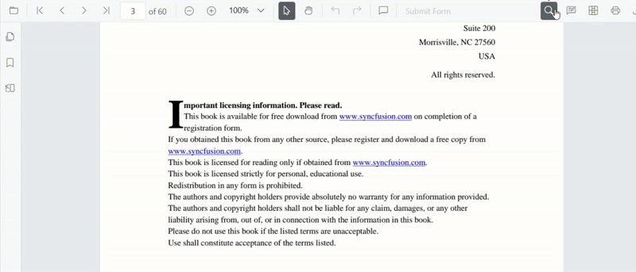
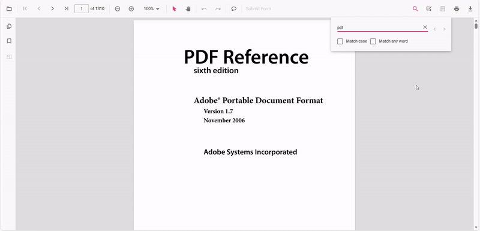
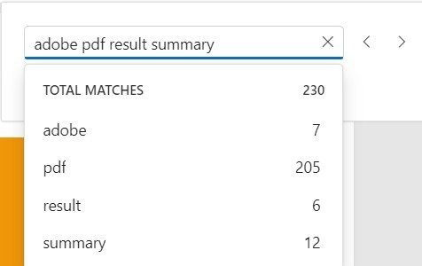

# Text search Features in React PDF Viewer control

The text search feature in the PDF Viewer locates and highlights matching content within a document. Enable or disable this capability with the following configuration.

N> The text search functionality requires importing TextSearch and adding it to PdfViewer.`<Inject services={[..., TextSearch]} />`. Otherwise, the search UI and APIs will not be accessible.

## Text search features in UI

### Real-time search suggestions while typing

Typing in the search box immediately surfaces suggestions that match the entered text. The list refreshes on every keystroke so users can quickly jump to likely results without completing the entire term.

### Select search suggestions from the popup

After typing in the search box, the popup lists relevant matches. Selecting an item jumps directly to the corresponding occurrence in the PDF.

### Dynamic Text Search for Large PDF Documents

Dynamic text search is enabled during the initial loading of the document when the document text collection has not yet been fully loaded in the background.

### Search text with the Match Case option

Enable the Match Case checkbox to limit results to case-sensitive matches. Navigation commands then step through each exact match in sequence.

### Search text without Match Case

Leave the Match Case option cleared to highlight every occurrence of the query, regardless of capitalization, and navigate through each result.

### Search a list of words with Match Any Word

Enable Match Any Word to split the query into separate words. The popup proposes matches for each word and highlights them throughout the document.

## See also

- [Find Text](./find-text)
- [Text Search Events](./text-search-events)
- [Programmatic text search](./text-search-api)
- [Extract Text](../how-to/extract-text-ts)
- [Extract Text Options](../how-to/extract-text-option-ts)
- [Extract Text Completed](../how-to/extract-text-completed-ts)