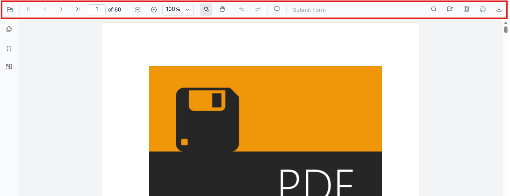
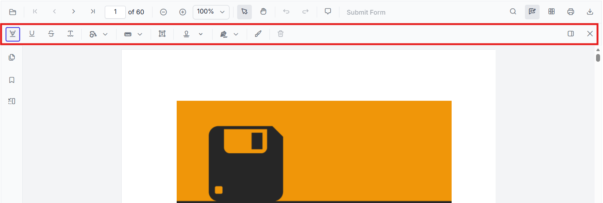
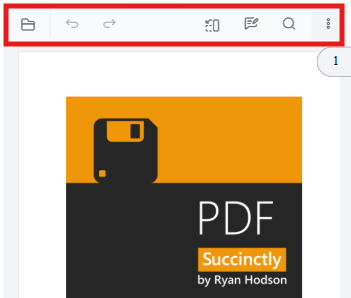

# Toolbar overview in React PDF Viewer

## Overview

This page provides a concise reference describing the toolbars available in the EJ2 React PDF Viewer component. It also explains what each toolbar is for and when it appears.

**Scope**: covers available toolbars and their functions.

## List of Available Toolbars

- Primary toolbar
- Annotation toolbar
- Form Designer toolbar
- Mobile toolbar
- Custom toolbar

## Functional overview of each toolbar

- **Primary toolbar**: Presents core viewer actions such as open/load, page navigation, zoom controls, and print. It appears in standard desktop layouts and at the top of the viewer when `Toolbar` service is injected. Typical actions: page forward/back, zoom in/out, fit-to-page, print.

    

- **Annotation toolbar**: Surfaces annotation-related tools for adding, editing, and deleting annotations (text markup, shapes, stamps). It appears when annotation services are enabled and when a user opens annotation mode. Typical actions: highlight, underline, draw shape, add sticky note, delete annotation.

    

- **Form Designer toolbar**: Provides form-field authoring controls used when designing or editing form fields inside a PDF. It appears when `FormDesigner` is enabled (design mode) and contains actions for adding form field controls.

    

- **Mobile toolbar**:

    - A compact toolbar layout optimized for small screens and touch interactions. It appears automatically on mobile-sized view ports (or when a mobile layout is explicitly chosen) and contains the most frequently used actions in a space-efficient arrangement.

        

    - Annotation toolbar in mobile mode appears at the bottom of the PDF Viewer component.

        

## Further Reading

- [Customize annotation toolbar](./annotation-toolbar)
- [Customize form designer toolbar](./form-designer-toolbar)
- [Customize mobile toolbar](./mobile-toolbar)
- [Customize primary toolbar](./primary-toolbar)
- [Create a custom toolbar](./custom-toolbar)