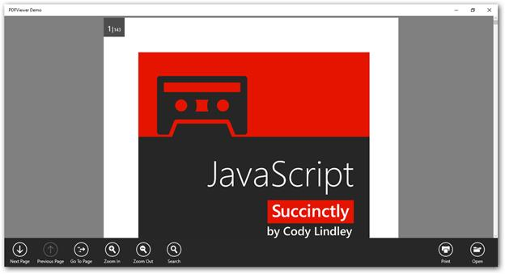

# Supported input interactions in UWP PDF Viewer (SfPdfViewer)

The SfPdfViewerControl supports the following input interactions in the PDF document:

* Mouse or touch pad
* Touch
* Stylus or pen

The following list shows the possible operations that can be performed with the supported input interactions in the SfPdfViewerControl.

<table>
<tr>
<th>Operations</th>
<th>Mouse or touch pad</th>
<th>Touch</th>
<th>Stylus or pen</th>
</tr>
<tr>
<td>Scrolling</td>
<td>Supported</td>
<td>Supported</td>
<td>Supported</td>
</tr>
<tr>
<td>Zooming</td>
<td>Supported</td>
<td>Supported</td>
<td>Not supported</td>
</tr>
<tr>
<td>Adding annotations</td>
<td>Supported</td>
<td>Supported</td>
<td>Supported</td>
</tr>
<tr>
<td>Moving and resizing annotations</td>
<td>Supported</td>
<td>Supported</td>
<td>Supported</td>
</tr>
<tr>
<td>Editing annotations</td>
<td>Supported</td>
<td>Supported</td>
<td>Supported</td>
</tr>
</table>

The following image shows the SfPdfViewer with these features.

## See Also
- [Viewing PDF](https://help.syncfusion.com/document-processing/pdf/pdf-viewer/uwp/concepts-and-features/viewing-pdf)
- [Magnification](https://help.syncfusion.com/document-processing/pdf/pdf-viewer/uwp/concepts-and-features/working-with-magnification)
- [Annotations](https://help.syncfusion.com/document-processing/pdf/pdf-viewer/uwp/concepts-and-features/working-with-annotations)
