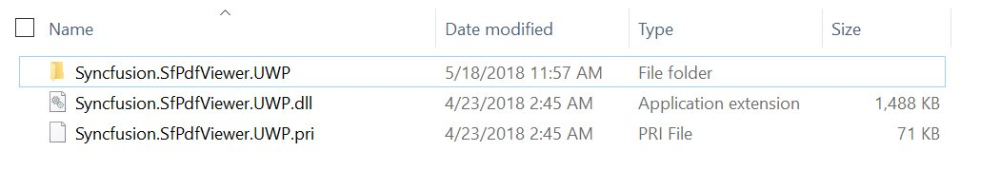
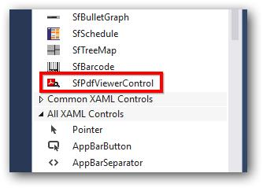
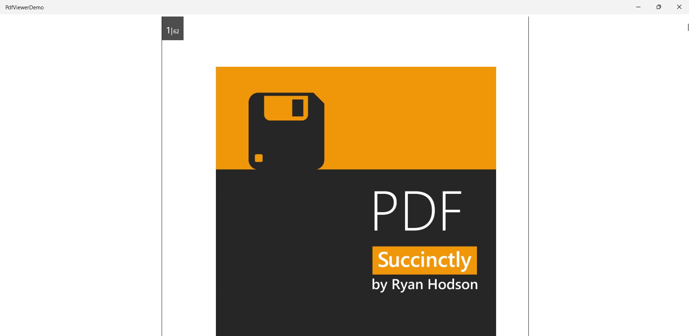

# Getting Started with UWP PDF Viewer (SfPdfViewer)
This section briefly explains how to include the [Syncfusion® UWP PDF Viewer](https://help.syncfusion.com/cr/uwp/Syncfusion.Windows.PdfViewer.SfPdfViewerControl.html) component in UWP App using Visual Studio.

## Prerequisites
* [System requirements for UWP components](https://help.syncfusion.com/uwp/system-requirements)

## Create a new UWP App in Visual Studio

You can create a **UWP Application** using Visual Studio via [Microsoft Templates](https://learn.microsoft.com/en-us/visualstudio/get-started/csharp/tutorial-uwp?view=visualstudio&tabs=vs-2022-17-10) or the [Syncfusion&reg; UWP](https://help.syncfusion.com/uwp/visual-studio-integration/create-project).

## Assemblies Deployment

You can add a UWP PDF Viewer component to your application by installing it via NuGet packages (recommended) or by manually adding the required assemblies to the project.




### Install Syncfusion&reg; UWP PDF Viewer NuGet Package

To add the **UWP PDF Viewer** component in the application, open the NuGet package manager in Visual Studio (*Tools → NuGet Package Manager → Manage NuGet Packages for Solution*), search and install:

•	[Syncfusion.SfPdfViewer.UWP](https://www.nuget.org/packages/Syncfusion.SfPdfViewer.UWP)





### Add Syncfusion® UWP PDF Viewer Assemblies

The following table lists the assemblies required when the UWP PDF Viewer control is used in your application.

<table>
<tr>
<th>Assembly</th>
<th>Description</th>
</tr>
<tr>
<td>Syncfusion.SfPdfViewer.UWP</td>
<td>This component contains the rendering area and other related UI elements.</td>
</tr>
<tr>
<td>Syncfusion.Pdf.UWP</td>
<td>This library contains the PDF reader and creator that supports the PDF Viewer.</td>
</tr>
<tr>
<td>Syncfusion.SfColorPickers.UWP</td>
<td>This component contains UI controls for Color Picker that are used in the PDF Viewer.</td>
</tr>
<tr>
<td>Syncfusion.SfInput.UWP</td>
<td>This component contains input controls like combobox, range slider and text boxes used in the PDF Viewer</td>
</tr>
<tr>
<td>Syncfusion.SfRadialMenu.UWP</td>
<td>This component contains UI controls for context menu that are used in the PDF Viewer.</td>
</tr>
<tr>
<td>Syncfusion.SfShared.UWP</td>
<td>This component contains various UI controls (Numeric UpDown) that are used in the PDF Viewer.</td>
</tr>
</table>

Each assembly must be placed together with its corresponding resource files; that is, the resource files for an assembly should reside in the same folder as that assembly.

The assemblies do not all have to be in a single folder. Each assembly may live in its own folder, as long as its resource files are kept alongside it. The screenshot shows only the SfPdfViewer assembly for brevity.

This co-location matters only if you move assemblies out of their installed location. If you relocate an assembly, be sure to move its resource files with it and place them in the same folder as that assembly.

N> Starting with v16.2.0.x, if you reference Syncfusion® assemblies from the trial setup or from the NuGet feed, you also have to include a license key in your projects. Please refer to [this link](https://help.syncfusion.com/common/essential-studio/licensing/overview) to register the Syncfusion® license key in your UWP application to use our components.





## Add UWP PDF Viewer component

UWP PDF Viewer control can be added to an application either through the designer (XAML) or programmatically using code. Use the **Via Designer** tab if you prefer a drag-and-drop workflow; use the **Via Coding** tab if you want to add the control directly in XAML or C#.





1. Click and open the MainPage.xaml file.

2. Open the Visual Studio **Tool** **box**. Navigate to "Syncfusion® Controls for UWP" tab and find the  SfPdfViewerControl toolbox items.

3. Drag the [`SfPdfViewerControl`](https://help.syncfusion.com/cr/uwp/Syncfusion.Windows.PdfViewer.SfPdfViewerControl.html) and drop it into the Designer area from the Toolbox.

When you drag the SfPdfViewerControl toolbox item to the window, it automatically adds the required assembly references to the current application.





The SfPdfViewerControl is available in the [`Syncfusion.Windows.PdfViewer`](https://help.syncfusion.com/cr/UWP/Syncfusion.Windows.PdfViewer.html) namespace and can be created using XAML or programmatically using C#.

1. Add the Syncfusion PDF Viewer namespace.


xmlns:syncfusion="using:Syncfusion.Windows.PdfViewer"



2. Add SfPdfViewerControl


<syncfusion:SfPdfViewerControl Name="pdfViewer"> </syncfusion:SfPdfViewerControl>







## Load a PDF document

After adding the `SfPdfViewerControl`, you can load a PDF document using data binding.

1. Add a PDF file to the project and set its **Build Action** to **Embedded Resource**.

2. Create a simple class (`PdfReport.cs`) that provides the PDF stream.

N> Replace `PdfViewerExample` in the manifest resource path below with your project's default namespace.


    
using System.Reflection;
using System.IO;

internal class PdfReport : INotifyPropertyChanged
{
    private Stream docStream;

    public event PropertyChangedEventHandler PropertyChanged;

    /// 

    /// Stream object to be bound to the ItemsSource of the PDF Viewer
    /// 

    public Stream DocumentStream
    {
        get
        {
            return docStream;
        }
        set
        {
            docStream = value;
            OnPropertyChanged(new PropertyChangedEventArgs("DocumentStream"));
        }
    }

    public PdfReport()
    {
        // Loads the stream from the embedded resource.
        Assembly assembly = typeof(MainPage).GetTypeInfo().Assembly;

        // Replace 'PdfViewerExample' with your project's namespace in resource path
        docStream = assembly.GetManifestResourceStream("PdfViewerExample.Assets.PDF_Succinctly.pdf");
    }

    public void OnPropertyChanged(PropertyChangedEventArgs e)
    {
        if (PropertyChanged != null)
            PropertyChanged(this, e);
    }        
}

     
    

Class PdfReport
    Implements INotifyPropertyChanged

    Private docStream As Stream
    Private Event PropertyChanged As PropertyChangedEventHandler Implements INotifyPropertyChanged.PropertyChanged

    ''' 

    ''' Stream object to be bound to the ItemsSource of the PDF Viewer
    ''' 

    Public Property DocumentStream As Stream
        Get
            Return docStream
        End Get
        Set
            docStream = Value
            OnPropertyChanged(New PropertyChangedEventArgs("DocumentStream"))
        End Set
    End Property

    Public Sub New()
        'Loads the stream from the embedded resource.
        Dim assembly As Assembly = GetType(MainPage).GetTypeInfo().Assembly
        docStream = assembly.GetManifestResourceStream("PdfViewerExample.Assets.PDF_Succinctly.pdf")
    End Sub

    Public Sub OnPropertyChanged(e As PropertyChangedEventArgs)
        RaiseEvent PropertyChanged(Me, e)
    End Sub

End Class



3.  Open the `MainPage.xaml` file again and add the namespace `PdfViewerExample` as local.


    xmlns:local="using:PdfViewerExample"
 


4.  Set an instance of the `PdfReport` class as the `DataContext`. Bind the PDF viewer's [ItemSource] to the `DocumentStream` property of the `PdfReport` class.


<Page.DataContext>
    <local:PdfReport/>
</Page.DataContext>
<Grid>
   <syncfusion:SfPdfViewerControl Name="pdfViewer" ItemsSource="{Binding DocumentStream}"></syncfusion:SfPdfViewerControl>
</Grid>
 


You can load and display PDF documents using various approaches such as loading from a stream, StorageFile, PdfLoadedDocument, data binding, or FileOpenPicker.

For detailed information and code examples, refer to [Viewing Pdf](https://help.syncfusion.com/document-processing/pdf/pdf-viewer/uwp/concepts-and-features/viewing-pdf).

## Run the application

Press <kbd>Ctrl</kbd>+<kbd>F5</kbd> (Windows) or <kbd>⌘</kbd>+<kbd>F5</kbd> (macOS) to launch the application. The output will appear as follows:

## See Also
- [Viewing PDF](https://help.syncfusion.com/document-processing/pdf/pdf-viewer/uwp/concepts-and-features/viewing-pdf)
- [UWP PDF Viewer Overview](https://help.syncfusion.com/document-processing/pdf/pdf-viewer/uwp/overview)
- [Magnification](https://help.syncfusion.com/document-processing/pdf/pdf-viewer/uwp/concepts-and-features/working-with-magnification)
- [Page Navigation](https://help.syncfusion.com/document-processing/pdf/pdf-viewer/uwp/concepts-and-features/working-with-page-navigation)
- [Text Search](https://help.syncfusion.com/document-processing/pdf/pdf-viewer/uwp/concepts-and-features/working-with-text-search)

