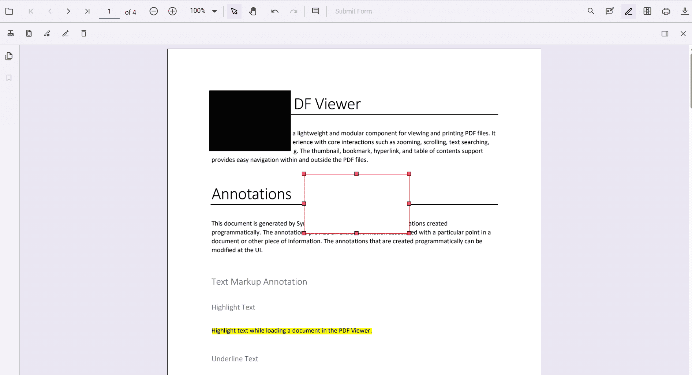
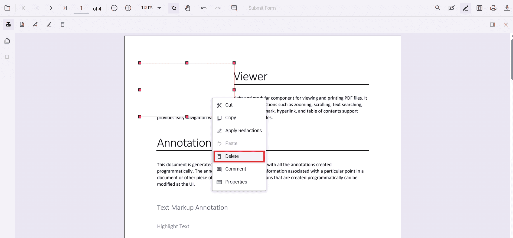

# Redaction UI interactions in Vue PdfViewer

## Add redaction annotations from the toolbar

Use the redaction tool in the toolbar to draw over content that should be hidden. After marking, an annotation can display overlay text (for example, “Confidential”) and can be styled using fill color and other properties.

#### Redaction annotations are interactive

* **Movable** – Drag and reposition the annotation within the same page.  

* **Resizable** – Resize the annotation to cover the required area.  

N> The redaction tool is hidden by default. Customize the toolbar to include it. For instructions, see the [Toolbar customization](../toolbar).

## Add redaction annotations using the context menu

In addition to the toolbar, you can add redaction annotations directly from the context menu. Select the text or region, right‑click (or long‑press on mobile), and choose the **Redact Annotation** option. This creates a redaction mark over the selected content.

## Update redaction properties

After adding a redaction annotation, you can update its properties through the property panel or programmatically.

### Update using the property panel

When a redaction annotation is selected, you can change overlay text, font style, fill color, and other properties. Updates are applied immediately in the viewer.

The property panel can be opened in two ways:

* By clicking the **redaction property panel** icon in the toolbar.  

* By right‑clicking (or long‑pressing) the annotation and choosing **Properties** from the context menu.  

## Delete redaction annotations

Delete redaction annotations using any of the following:

* **Right-click and select Delete** from the context menu.

* **Click the Delete button** on the toolbar.  

* **Press the Delete key** after selecting the annotation.

## Redact pages using the UI

Entire pages can be marked for redaction using the **Redact Pages** option in the toolbar. Clicking the icon opens a dialog with options:

* **Current Page** – Redacts the page currently in view.  
* **Odd Pages Only** – Redacts all odd‑numbered pages.  
* **Even Pages Only** – Redacts all even‑numbered pages.  
* **Specific Pages** – Enter page numbers or ranges (e.g., 1, 3–5, 7) to redact.

After choosing the range, click **Save** to apply redaction marks to the selected pages.

## Apply redaction from the toolbar

The **Apply Redaction** button permanently removes all marked content from the document.

* The button is disabled when no redaction annotations exist.  
* It automatically enables once at least one annotation is present.

A confirmation dialog appears before applying redaction to ensure you acknowledge the irreversible nature of the process.

N> Redaction is permanent. Once applied, the original content cannot be restored.

## See also

* [Overview of Redaction](./overview)
* [Programmatic Support in Redaction](./programmatic-support)
* [Redaction in Mobile View](./mobile-view)
* [Redaction Toolbar](./toolbar)
* [Search Text and Redact](./search-redact)
