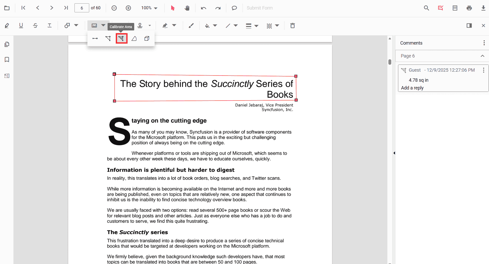
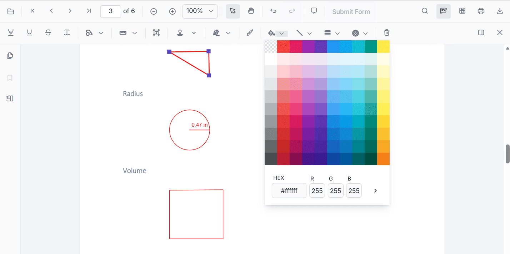
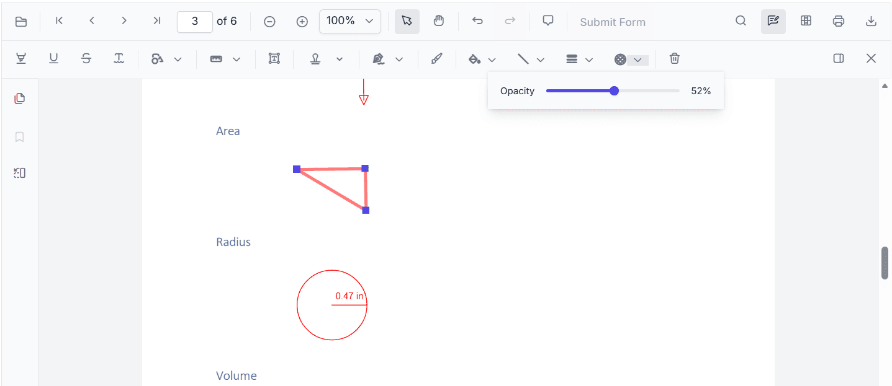
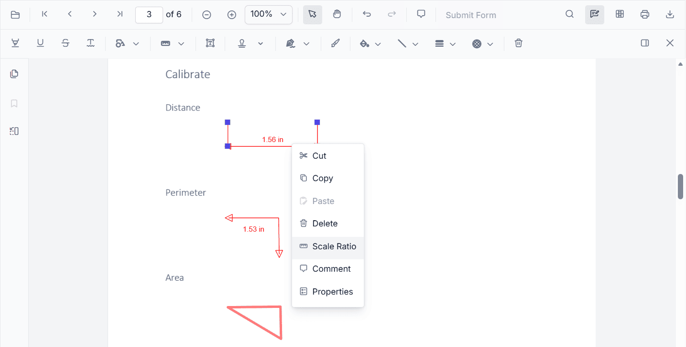

# Add Area Measurement Annotations in Vue PDF Viewer
Area is a measurement annotation used to calculate the surface of a closed region on a PDF page—ideal for engineering, construction, or design reviews.

## Enable Area Measurement

To enable Area annotations, inject the following modules into the Vue PDF Viewer:

- [**Annotation**](https://ej2.syncfusion.com/vue/documentation/api/pdfviewer#annotation)
- [**Toolbar**](https://ej2.syncfusion.com/vue/documentation/api/pdfviewer#toolbar)



<template>
  <ejs-pdfviewer
    id="container"
    :documentPath="documentPath"
    :resourceUrl="resourceUrl"
    style="height: 650px"
  >
  </ejs-pdfviewer>
</template>




## Add Area Annotation

### Add Area Using the Toolbar

1. Open the **Annotation Toolbar**.
2. Select **Measurement** → **Area**.
3. Click points to define the polygon; double‑click to close and finalize the area.

> **Tip:** If Pan mode is active, choosing a measurement tool switches the viewer into the appropriate interaction mode for a smoother workflow.

### Enable Area Mode
Programmatically switch the viewer into Area mode.



<template>
  <button @click="enableAreaMode">Enable Area Mode</button>
  <ejs-pdfviewer ref="pdfviewer" id="container" :documentPath="documentPath" :resourceUrl="resourceUrl" style="height: 650px"></ejs-pdfviewer>
</template>




#### Exit Area Mode


<template>
  <button @click="exitAreaMode">Exit Area Mode</button>
  <ejs-pdfviewer ref="pdfviewer" id="container" :documentPath="documentPath" :resourceUrl="resourceUrl" style="height: 650px"></ejs-pdfviewer>
</template>




### Add Area Programmatically
Use the [`addAnnotation`](https://ej2.syncfusion.com/vue/documentation/api/pdfviewer#addannotation) API to draw an area by providing **vertexPoints** for a closed region.



<template>
  <button @click="addArea">Add Area</button>
  <ejs-pdfviewer ref="pdfviewer" id="container" :documentPath="documentPath" :resourceUrl="resourceUrl" style="height: 650px"></ejs-pdfviewer>
</template>




## Customize Area Appearance
Configure default properties using the [`areaSettings`](https://ej2.syncfusion.com/vue/documentation/api/pdfviewer#areasettings) property (for example, default **fill color**, **stroke color**, **opacity**).



<template>
  <ejs-pdfviewer
    id="container"
    :documentPath="documentPath"
    :resourceUrl="resourceUrl"
    :areaSettings="{ fillColor: 'yellow', strokeColor: 'orange', opacity: 0.6 }"
    style="height: 650px"
  >
  </ejs-pdfviewer>
</template>




## Manage Area (Move, Reshape, Edit, Delete)
- **Move**: Drag inside the polygon to reposition it.
- **Reshape**: Drag any vertex handle to adjust points and shape.

### Edit Area

#### Edit Area (UI)

- Edit the **fill color** using the Edit Color tool.  
  
- Edit the **stroke color** using the Edit Stroke Color tool.  
  
- Edit the **border thickness** using the Edit Thickness tool.  
  
- Edit the **opacity** using the Edit Opacity tool.  
  
- Open **Right Click → Properties** for additional line‑based options.
  

#### Edit Area Programmatically
Update properties and call `editAnnotation()`.



<template>
  <button @click="editAreaProgrammatically">Edit Area</button>
  <ejs-pdfviewer ref="pdfviewer" id="container" :documentPath="documentPath" :resourceUrl="resourceUrl" style="height: 650px"></ejs-pdfviewer>
</template>




### Delete Area Annotation
Delete Area Annotation via UI (toolbar/context menu) or programmatically. For supported workflows and APIs, see [**Delete Annotation**](../remove-annotations).

## Set Default Properties During Initialization
Apply defaults for Area using the [`areaSettings`](https://ej2.syncfusion.com/vue/documentation/api/pdfviewer#areasettings) property.



<template>
  <ejs-pdfviewer
    id="container"
    :documentPath="documentPath"
    :resourceUrl="resourceUrl"
    :areaSettings="{ fillColor: 'yellow', strokeColor: 'orange', opacity: 0.6 }"
    style="height: 650px"
  >
  </ejs-pdfviewer>
</template>




## Set Properties While Adding Individual Annotation
Pass per‑annotation values directly when calling [`addAnnotation`](https://ej2.syncfusion.com/vue/documentation/api/pdfviewer#addannotation).



<template>
  <button @click="addStyledArea">Add Styled Area</button>
  <ejs-pdfviewer ref="pdfviewer" id="container" :documentPath="documentPath" :resourceUrl="resourceUrl" style="height: 650px"></ejs-pdfviewer>
</template>




## Scale Ratio and Units
- Use **Scale Ratio** from the context menu to set the actual‑to‑page scale.  
  
- Supported units include **Inch, Millimeter, Centimeter, Point, Pica, Feet**.  
  

### Set Default Scale Ratio During Initialization
Configure scale defaults using [`measurementSettings`](https://ej2.syncfusion.com/vue/documentation/api/pdfviewer#measurementsettings).



<template>
  <ejs-pdfviewer
    id="container"
    :documentPath="documentPath"
    :resourceUrl="resourceUrl"
    :measurementSettings="{ scaleRatio: 2, conversionUnit: 'cm', displayUnit: 'cm' }"
    style="height: 650px"
  >
  </ejs-pdfviewer>
</template>




## Handle Area Events

Listen to annotation life-cycle events (add/modify/select/remove). For the full list and parameters, see [**Annotation Events**](../annotation-event).

## Export and Import
Area measurements can be exported or imported with other annotations. For workflows and supported formats, see [**Export and Import annotations**](../export-import-annotations).

## See Also
- [Annotation Toolbar](../../toolbar-customization/annotation-toolbar)
- [Customize Context Menu](../../context-menu/custom-context-menu)
- [Comments Panel](../comments)
- [Annotation Events](../annotation-event)
- [Export and Import annotations](../export-import-annotations)
- [Delete Annotations](../remove-annotations)
