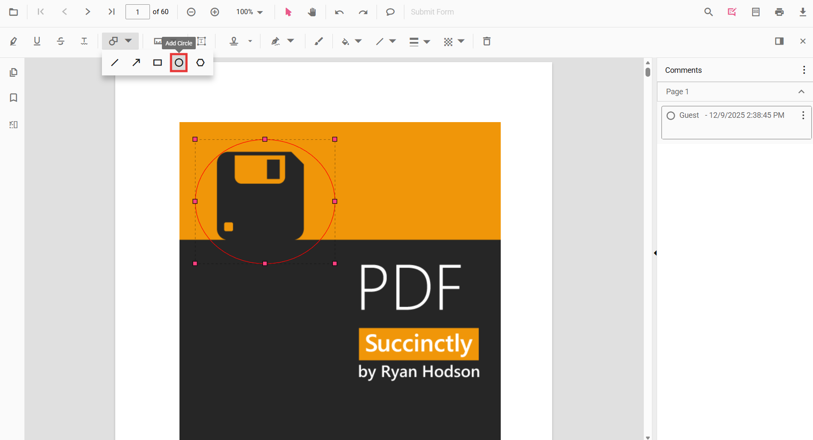
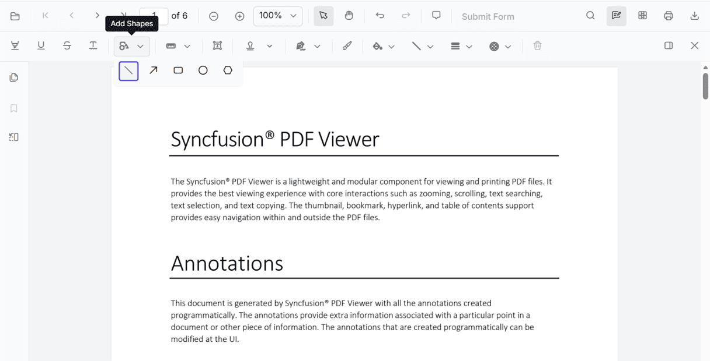
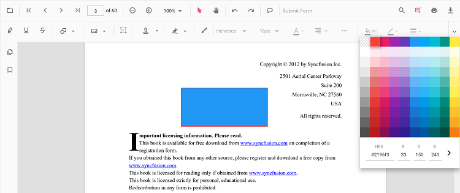
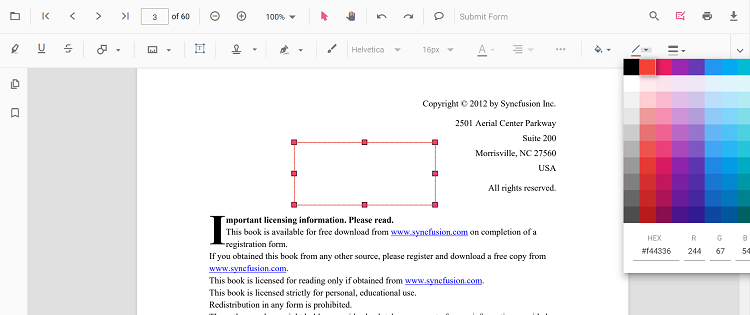
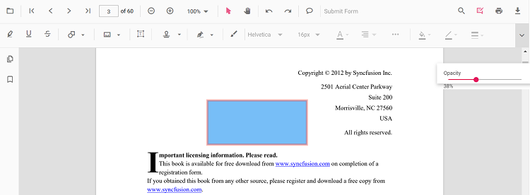
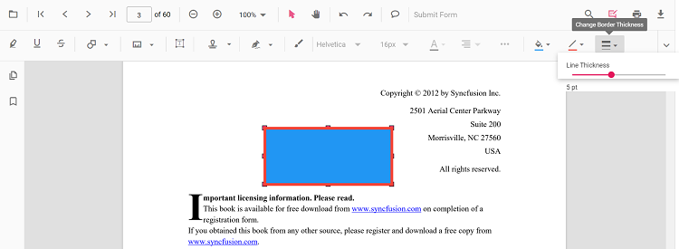

# Circle Annotation (Shape) in Vue PDF Viewer
Circle annotations let users highlight circular regions or draw emphasis bubbles on PDFs for reviews and markups. You can add circles from the toolbar, switch to circle mode programmatically, customize appearance, edit/delete them in the UI, and export them with the document.

## Enable Circle Annotation in the Viewer

To enable Circle annotations, inject the following modules into the Vue PDF Viewer:

- [**Annotation**](https://ej2.syncfusion.com/vue/documentation/api/pdfviewer#annotation)
- [**Toolbar**](https://ej2.syncfusion.com/vue/documentation/api/pdfviewer#toolbar)



<template>
  <ejs-pdfviewer
    id="container"
    :documentPath="documentPath"
    :resourceUrl="resourceUrl"
    style="height: 650px"
  >
  </ejs-pdfviewer>
</template>




## Add Circle Annotation

### Apply Circle Annotation Using the Toolbar
1. Open the **Annotation Toolbar**.
2. Select **Shapes** → **Circle**.
3. Click and drag on the PDF page to draw the circle (ellipse).

N> When in Pan mode, selecting a shape tool automatically switches the viewer to selection mode for smooth interaction.

### Enable Circle Mode

Switch the viewer into circle mode using `setAnnotationMode('Circle')`.



<template>
  <button @click="enableCircleMode">Enable Circle Mode</button>
  <ejs-pdfviewer ref="pdfviewer" id="container" :documentPath="documentPath" :resourceUrl="resourceUrl" style="height: 650px"></ejs-pdfviewer>
</template>




#### Exit Circle Mode

Switch back to normal mode using:



<template>
  <button @click="exitCircleMode">Exit Circle Mode</button>
  <ejs-pdfviewer ref="pdfviewer" id="container" :documentPath="documentPath" :resourceUrl="resourceUrl" style="height: 650px"></ejs-pdfviewer>
</template>




### Add Circle Programmatically
Use the [`addAnnotation`](https://ej2.syncfusion.com/vue/documentation/api/pdfviewer#addannotation) API to draw a circle (ellipse) at a specific location.



<template>
  <button @click="addCircle">Add Circle</button>
  <ejs-pdfviewer ref="pdfviewer" id="container" :documentPath="documentPath" :resourceUrl="resourceUrl" style="height: 650px"></ejs-pdfviewer>
</template>




## Customize Circle Appearance
Configure default circle appearance (fill color, stroke color, thickness, opacity) using the [`circleSettings`](https://ej2.syncfusion.com/vue/documentation/api/pdfviewer#circlesettings) property.



<template>
  <ejs-pdfviewer
    id="container"
    :documentPath="documentPath"
    :resourceUrl="resourceUrl"
    :circleSettings="{ fillColor: '#ffa500', strokeColor: '#ff6a00', thickness: 2, opacity: 0.9 }"
    style="height: 650px"
  >
  </ejs-pdfviewer>
</template>




## Manage Circle (Edit, Move, Resize, Delete)

### Edit Circle

#### Edit Circle (UI)

- Select a Circle to view resize handles.
- Drag any side/corner to resize; drag inside the shape to move it.
- Edit **fill**, **stroke**, **thickness**, and **opacity** using the annotation toolbar.

Use the annotation toolbar:
- **Edit fill Color** tool  

- **Edit stroke Color** tool

- **Edit Opacity** slider

- **Edit Thickness** slider

#### Edit Circle Programmatically

Modify an existing Circle programmatically using `editAnnotation()`.



<template>
  <button @click="editCircleProgrammatically">Edit Circle</button>
  <ejs-pdfviewer ref="pdfviewer" id="container" :documentPath="documentPath" :resourceUrl="resourceUrl" style="height: 650px"></ejs-pdfviewer>
</template>




### Delete Circle
The PDF Viewer supports deleting existing annotations through the UI and API.
See [**Delete Annotation**](../remove-annotations) for full behavior and workflows.

### Comments
Use the [**Comments panel**](../comments) to add, view, and reply to threaded discussions linked to circle annotations. It provides a dedicated interface for collaboration and review within the PDF Viewer.

## Set properties while adding Individual Annotation
Set properties for individual circle annotations by passing values directly during [`addAnnotation`](https://ej2.syncfusion.com/vue/documentation/api/pdfviewer#addannotation).



<template>
  <button @click="addMultipleCircles">Add Multiple Circles</button>
  <ejs-pdfviewer ref="pdfviewer" id="container" :documentPath="documentPath" :resourceUrl="resourceUrl" style="height: 650px"></ejs-pdfviewer>
</template>




## Disable Circle Annotation
Disable shape annotations (Line, Arrow, Rectangle, Circle, Polygon) using the [`enableShapeAnnotation`](https://ej2.syncfusion.com/vue/documentation/api/pdfviewer#enableshapeannotation) property.



<template>
  <ejs-pdfviewer
    id="container"
    :enableShapeAnnotation="false"
    :documentPath="documentPath"
    :resourceUrl="resourceUrl"
    style="height: 650px"
  >
  </ejs-pdfviewer>
</template>




## Handle Circle Events

The PDF viewer provides annotation life-cycle events that notify when Circle annotations are added, modified, selected, or removed.
For the full list of available events and their descriptions, see [**Annotation Events**](../annotation-event)

## Export and Import

The PDF Viewer supports exporting and importing annotations. For details on supported formats and workflows, see [**Export and Import annotations**](../export-import-annotations).

## See Also
- [Annotation Toolbar](../../toolbar-customization/annotation-toolbar)
- [Customize Context Menu](../../context-menu/custom-context-menu)
- [Comments Panel](../comments)
- [Annotation Events](../annotation-event)
- [Export and Import annotations](../export-import-annotations)
- [Delete Annotations](../remove-annotations)
