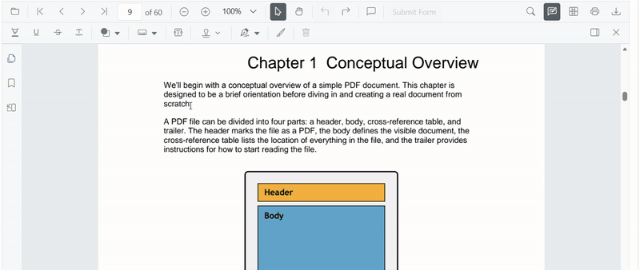
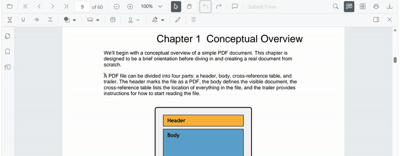

# Highlight Annotation (Text Markup) in Vue PDF Viewer

This guide explains how to **enable**, **apply**, **customize**, and **manage** *Highlight* text markup annotations in the Syncfusion **Vue PDF Viewer**.
You can highlight text using the toolbar or context menu, programmatically invoke highlight mode, customize default settings, handle events, and export the PDF with annotations.

## Enable Highlight in the Viewer

To enable Highlight annotations, inject the following modules into the Vue PDF Viewer:

- [**Annotation**](https://ej2.syncfusion.com/vue/documentation/api/pdfviewer/index-default#annotation)
- [**TextSelection**](https://ej2.syncfusion.com/vue/documentation/api/pdfviewer/index-default#textselection)
- [**Toolbar**](https://ej2.syncfusion.com/vue/documentation/api/pdfviewer/index-default#toolbar)

This minimal setup enables UI interactions like selection and highlighting.



<template>
  <ejs-pdfviewer id="container" :documentPath="documentPath" :resourceUrl="resourceUrl" style="height: 650px"></ejs-pdfviewer>
</template>




## Add Highlight Annotation

### Add Highlight Using the Toolbar

1. Select the text you want to highlight.
2. Click the **Highlight** icon in the annotation toolbar.
   - If **Pan Mode** is active, the viewer automatically switches to **Text Selection** mode.

### Apply highlight using Context Menu

Right-click a selected text region → select **Highlight**.

To customize menu items, refer to [**Customize Context Menu**](../../context-menu/custom-context-menu) documentation.

### Enable Highlight Mode

Switch the viewer into highlight mode using `setAnnotationMode('Highlight')`.



<template>
  

    <button @click="enableHighlight">Enable Highlight</button>
    <ejs-pdfviewer id="container" ref="container" :documentPath="documentPath" :resourceUrl="resourceUrl" style="height: 650px"></ejs-pdfviewer>
  

</template>




#### Exit Highlight Mode

Switch back to normal mode using:



<template>
  

    <button @click="disableHighlightMode">Disable Highlight</button>
    <ejs-pdfviewer id="container" ref="container" :documentPath="documentPath" :resourceUrl="resourceUrl" style="height: 650px"></ejs-pdfviewer>
  

</template>




### Add Highlight Programmatically

Use [`addAnnotation()`](https://ej2.syncfusion.com/vue/documentation/api/pdfviewer/index-default#addannotation) to insert highlight at a specific location.



<template>
  

    <button @click="addHighlight">Add Highlight</button>
    <ejs-pdfviewer id="container" ref="container" :documentPath="documentPath" :resourceUrl="resourceUrl" style="height: 650px"></ejs-pdfviewer>
  

</template>




## Customize Highlight Appearance

Configure default highlight settings such as **color**, **opacity**, and **author** using [`highlightSettings`](https://ej2.syncfusion.com/vue/documentation/api/pdfviewer/index-default#highlightsettings).



<template>
  <ejs-pdfviewer id="container" :documentPath="documentPath" :resourceUrl="resourceUrl" :highlightSettings="highlightSettings" style="height: 650px"></ejs-pdfviewer>
</template>




## Manage Highlight (Edit, Delete, Comment)

### Edit Highlight

#### Edit Highlight Appearance (UI)

Use the annotation toolbar:
- **Edit Color** tool  

- **Edit Opacity** slider

#### Edit Highlight Programmatically

Modify an existing highlight programmatically using `editAnnotation()`.



<template>
  

    <button @click="editHighlightProgrammatically">Edit Highlight</button>
    <ejs-pdfviewer id="container" ref="container" :documentPath="documentPath" :resourceUrl="resourceUrl" style="height: 650px"></ejs-pdfviewer>
  

</template>




### Delete Highlight

The PDF Viewer supports deleting existing annotations through both the UI and API.
For detailed behavior, supported deletion workflows, and API reference, see [Delete Annotation](../remove-annotations)

### Comments

Use the [Comments panel](../comments) to add, view, and reply to threaded discussions linked to highlight annotations.
It provides a dedicated UI for reviewing feedback, tracking conversations, and collaborating on annotation‑related notes within the PDF Viewer.

## Set properties while adding Individual Annotation

Set properties for individual annotation before creating the control using [highlightSettings](https://ej2.syncfusion.com/vue/documentation/api/pdfviewer/index-default#highlightsettings)



<template>
  

    <button @click="addMultipleHighlights">Add Multiple Highlights</button>
    <ejs-pdfviewer id="container" ref="container" :documentPath="documentPath" :resourceUrl="resourceUrl" style="height: 650px"></ejs-pdfviewer>
  

</template>




## Disable TextMarkup Annotation

Disable text markup annotations (including highlight) using the [`enableTextMarkupAnnotation`](https://ej2.syncfusion.com/vue/documentation/api/pdfviewer/index-default#enabletextmarkupannotation) property.



<template>
  <ejs-pdfviewer id="container" :documentPath="documentPath" :resourceUrl="resourceUrl" :enableTextMarkupAnnotation="false" style="height: 650px"></ejs-pdfviewer>
</template>




## Handle Highlight Events

The PDF viewer provides annotation life-cycle events that notify when highlight annotations are added, modified, selected, or removed.
For the full list of available events and their descriptions, see [**Annotation Events**](../annotation-event)

## Export and Import

The PDF Viewer supports exporting and importing annotations, allowing you to save annotations as a separate file or load existing annotations back into the viewer.
For full details on supported formats and steps to export or import annotations, see [Export and Import Annotation](../export-import-annotations)

## See Also

- [Annotation Toolbar](../../toolbar-customization/annotation-toolbar)
- [Customize Context Menu](../../context-menu/custom-context-menu)
- [Comments Panel](../comments)
- [Annotation Events](../annotation-event)
- [Export and Import annotations](../export-import-annotations)
- [Delete Annotations](../remove-annotations)
