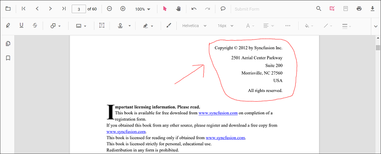
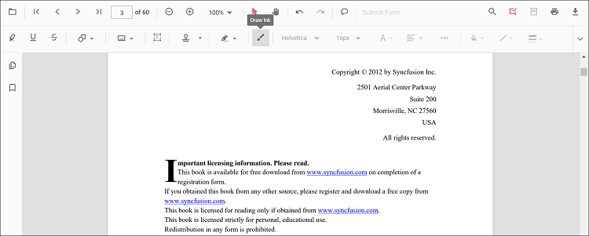
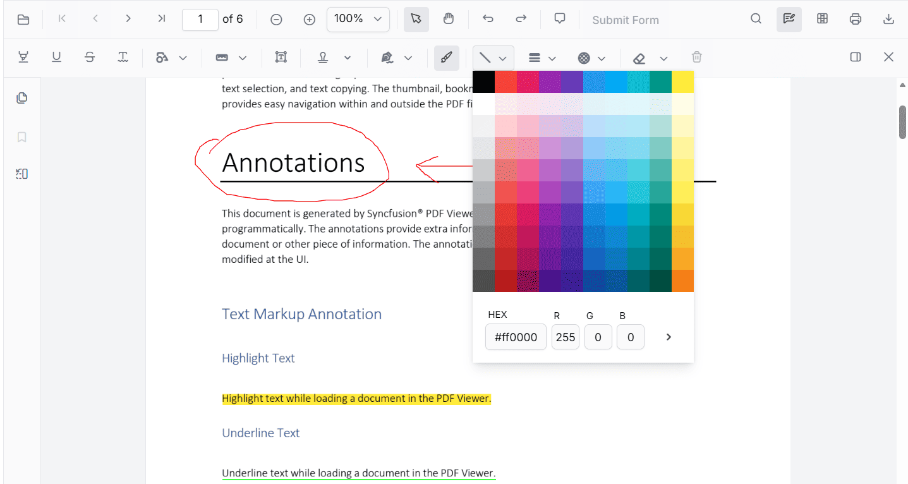
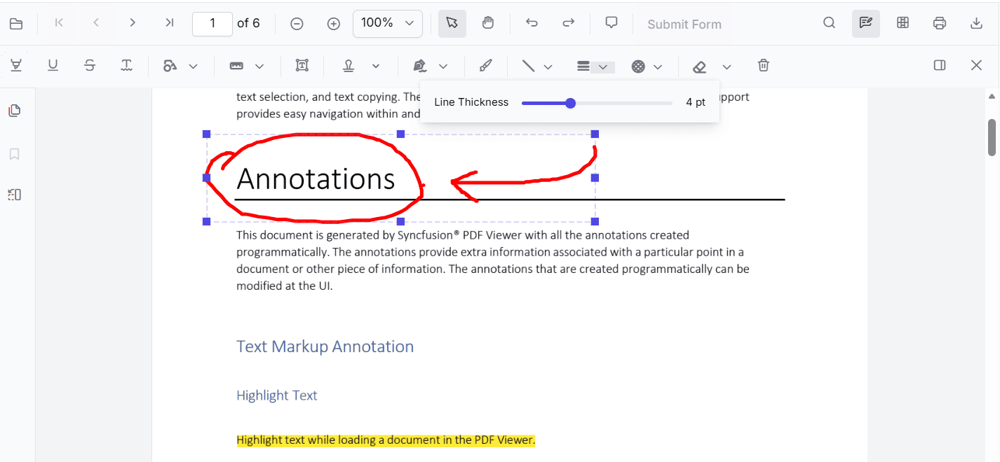

# Add Freehand Drawing (Ink) Annotations in Vue PDF Viewer
Ink annotations allow users to draw freehand strokes using mouse, pen, or touch input to mark content naturally.

## Enable Freehand Drawing (Ink)

To enable ink annotations, inject the following modules into the Vue PDF Viewer:

- [**Annotation**](https://ej2.syncfusion.com/vue/documentation/api/pdfviewer/index-default#annotation)
- [**Toolbar**](https://ej2.syncfusion.com/vue/documentation/api/pdfviewer/index-default#toolbar)



<template>
  <ejs-pdfviewer id="container" :documentPath="documentPath" :resourceUrl="resourceUrl" style="height: 650px"></ejs-pdfviewer>
</template>




## Add Ink annotation

### Draw Freehand Using the Toolbar
1. Open the **Annotation Toolbar**.
2. Click **Draw Ink**.
3. Draw freehand on the page.

### Enable Ink Mode
Switch the viewer into a ink annotation mode programmatically.



<template>
  

    <button @click="enableInkMode">Enable Ink Mode</button>
    <ejs-pdfviewer id="container" ref="container" :documentPath="documentPath" :resourceUrl="resourceUrl" style="height: 650px"></ejs-pdfviewer>
  

</template>




#### Exit Ink Mode


<template>
  

    <button @click="exitInkMode">Exit Ink Mode</button>
    <ejs-pdfviewer id="container" ref="container" :documentPath="documentPath" :resourceUrl="resourceUrl" style="height: 650px"></ejs-pdfviewer>
  

</template>




### Add Ink Programmatically
Use the [`addAnnotation`](https://ej2.syncfusion.com/vue/documentation/api/pdfviewer/index-default#addannotation) API to create an ink stroke by providing a path (an array of move/line commands), bounds, and target page.



<template>
  

    <button @click="addInkProgrammatically">Add Ink</button>
    <ejs-pdfviewer id="container" ref="container" :documentPath="documentPath" :resourceUrl="resourceUrl" style="height: 650px"></ejs-pdfviewer>
  

</template>




## Customize Ink Appearance
You can customize **stroke color**, **thickness**, and **opacity** using the [`inkAnnotationSettings`](https://ej2.syncfusion.com/vue/documentation/api/pdfviewer/index-default#inkannotationsettings) property.



<template>
  <ejs-pdfviewer id="container" :documentPath="documentPath" :resourceUrl="resourceUrl" :inkAnnotationSettings="inkAnnotationSettings" style="height: 650px"></ejs-pdfviewer>
</template>




## Erase, Modify, or Delete Ink Strokes
- **Move**: Drag the annotation.
- **Resize**: Use selector handles.
- **Change appearance**: Use Edit Stroke Color, Thickness, and Opacity tools.
- **Delete**: Via toolbar or context menu.
- **Customize context menu**: See [Customize Context Menu](../../context-menu/custom-context-menu).

### Edit ink annotation in UI

Stroke color, thickness, and opacity can be edited using the Edit Stroke Color, Edit Thickness, and Edit Opacity tools in the annotation toolbar.

- Edit the **stroke color** using the color palette in the Edit Stroke Color tool.

- Edit **thickness** using the range slider in the Edit Thickness tool.

- Edit **opacity** using the range slider in the Edit Opacity tool.

### Edit Ink Programmatically

Modify an existing ink programmatically using `editAnnotation()`.



<template>
  

    <button @click="editInkProgrammatically">Edit Ink</button>
    <ejs-pdfviewer id="container" ref="container" :documentPath="documentPath" :resourceUrl="resourceUrl" style="height: 650px"></ejs-pdfviewer>
  

</template>




### Delete Ink

Delete Ink via UI (toolbar/context menu) or programmatically. For supported workflows and APIs, see [**Delete Annotation**](../remove-annotations).

## Ink Annotation Events

The PDF viewer provides annotation life‑cycle events that notify when Ink annotations are added, modified, selected, or removed.
For the full list of available events and their descriptions, see [**Annotation Events**](../annotation-event)

## Export and Import

Ink annotations can be exported or imported along with other annotations.
See [Export and Import annotations](../export-import-annotations).

## See Also

- [Annotation Toolbar](../../toolbar-customization/annotation-toolbar)
- [Customize Context Menu](../../context-menu/custom-context-menu)
- [Annotation Events](../annotation-event)
- [Export and Import annotations](../export-import-annotations)
- [Delete Annotation](../remove-annotations)
