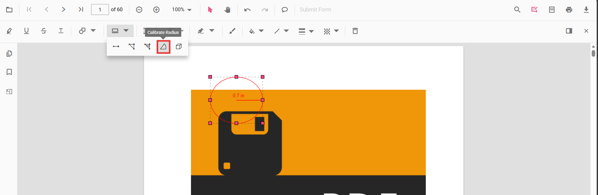

# Add Radius Measurement Annotations in Vue PDF Viewer
Radius measurement annotations allow users to draw circular regions and calculate the radius visually.

## Enable Radius Measurement

To enable Radius annotations, inject the following modules into the Vue PDF Viewer:

- [**Annotation**](https://ej2.syncfusion.com/vue/documentation/api/pdfviewer/index-default#annotation)
- [**Toolbar**](https://ej2.syncfusion.com/vue/documentation/api/pdfviewer/index-default#toolbar)



<template>
  <ejs-pdfviewer id="container" :documentPath="documentPath" :resourceUrl="resourceUrl" style="height: 650px"></ejs-pdfviewer>
</template>




## Add Radius Annotation

### Add Radius Using the Toolbar
1. Open the **Annotation Toolbar**.
2. Select **Measurement → Radius**.
3. Click and drag on the page to draw the radius.

N> If Pan mode is active, selecting the Radius tool automatically switches interaction mode.

### Enable Radius Mode
Programmatically switch the viewer into Radius mode.



<template>
  

    <button @click="enableRadiusMode">Enable Radius Mode</button>
    <ejs-pdfviewer id="container" ref="container" :documentPath="documentPath" :resourceUrl="resourceUrl" style="height: 650px"></ejs-pdfviewer>
  

</template>




#### Exit Radius Mode


<template>
  

    <button @click="exitRadiusMode">Exit Radius Mode</button>
    <ejs-pdfviewer id="container" ref="container" :documentPath="documentPath" :resourceUrl="resourceUrl" style="height: 650px"></ejs-pdfviewer>
  

</template>




### Add Radius Programmatically
Use the [`addAnnotation`](https://ej2.syncfusion.com/vue/documentation/api/pdfviewer/index-default#addannotation) API to insert a Radius measurement at a specific location by providing **width** and **height**.



<template>
  

    <button @click="addRadius">Add Radius</button>
    <ejs-pdfviewer id="container" ref="container" :documentPath="documentPath" :resourceUrl="resourceUrl" style="height: 650px"></ejs-pdfviewer>
  

</template>




## Customize Radius Appearance
Configure default properties using the [`Radius Settings`](https://ej2.syncfusion.com/vue/documentation/api/pdfviewer/index-default#radiussettings) property (for example, default **fill color**, **stroke color**, **opacity**).



<template>
  <ejs-pdfviewer id="container" :documentPath="documentPath" :resourceUrl="resourceUrl" :radiusSettings="radiusSettings" style="height: 650px"></ejs-pdfviewer>
</template>




## Manage Radius (Move, Reshape, Edit, Delete)
- **Move**: Drag inside the polygon to reposition it.
- **Reshape**: Drag any vertex handle to adjust points and shape.

### Edit Radius Annotation

#### Edit Radius (UI)

- Edit the **fill color** using the Edit Color tool.  
  
- Edit the **stroke color** using the Edit Stroke Color tool.  
  
- Edit the **border thickness** using the Edit Thickness tool.  
  
- Edit the **opacity** using the Edit Opacity tool.  
  
- Open **Right Click → Properties** for additional line‑based options.
  

#### Edit Radius Programmatically

Update properties and call `editAnnotation()`.



<template>
  

    <button @click="editRadiusProgrammatically">Edit Radius</button>
    <ejs-pdfviewer id="container" ref="container" :documentPath="documentPath" :resourceUrl="resourceUrl" style="height: 650px"></ejs-pdfviewer>
  

</template>




### Delete Radius Annotation

Delete Radius Annotation via UI (toolbar/context menu) or programmatically. For supported workflows and APIs, see [**Delete Annotation**](../remove-annotations).

## Set Default Properties During Initialization
Apply defaults for Radius using the [`radiusSettings`](https://ej2.syncfusion.com/vue/documentation/api/pdfviewer/index-default#radiussettings) property.



<template>
  <ejs-pdfviewer id="container" :documentPath="documentPath" :resourceUrl="resourceUrl" :radiusSettings="radiusSettings" style="height: 650px"></ejs-pdfviewer>
</template>




## Set Properties While Adding Individual Annotation
Pass per-annotation values directly when calling [`addAnnotation`](https://ej2.syncfusion.com/vue/documentation/api/pdfviewer/index-default#addannotation).



<template>
  

    <button @click="addStyledRadius">Add Styled Radius</button>
    <ejs-pdfviewer id="container" ref="container" :documentPath="documentPath" :resourceUrl="resourceUrl" style="height: 650px"></ejs-pdfviewer>
  

</template>




## Scale Ratio & Units
- Use **Scale Ratio** from the context menu.  
  
- Supported units: Inch, Millimeter, Centimeter, Point, Pica, Feet.  
  

### Set Default Scale Ratio During Initialization
Configure scale defaults using [`measurementSettings`](https://ej2.syncfusion.com/vue/documentation/api/pdfviewer/index-default#measurementsettings).



<template>
  <ejs-pdfviewer id="container" :documentPath="documentPath" :resourceUrl="resourceUrl" :measurementSettings="measurementSettings" style="height: 650px"></ejs-pdfviewer>
</template>




## Handle Radius Events
Listen to annotation life-cycle events (add/modify/select/remove). For the full list and parameters, see [**Annotation Events**](../annotation-event).

## Export and Import
Radius measurements can be exported or imported with other annotations. For workflows and supported formats, see [**Export and Import annotations**](../export-import-annotations).

## See Also
- [Annotation Toolbar](../../toolbar-customization/annotation-toolbar)
- [Customize Context Menu](../../context-menu/custom-context-menu)
- [Comments Panel](../comments)
- [Annotation Events](../annotation-event)
- [Export and Import annotations](../export-import-annotations)
- [Delete Annotations](../remove-annotations)
